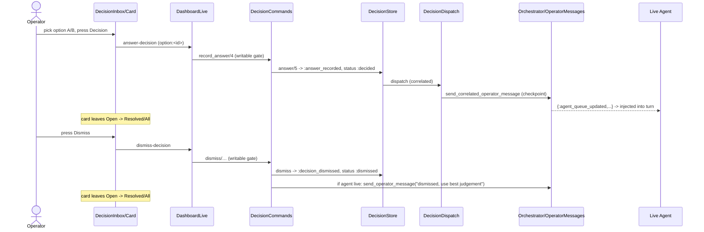

# feat: Commands/Decisions page redesign + wired answer/dismiss

## Summary

Redesign the Commands (Decisions) page to the Claude mock and make its actions **real, in production**: operators pick an option and press **Decision** to answer (already wired end-to-end to the live agent via the checkpoint queue), or press **Dismiss** to close a command. Answering or dismissing moves the command out of the active list into the historic (Resolved/All) view; from history the operator can still change their mind and re-dispatch to a live agent. Agents are taught (via the `aiur-agent` skill) to emit the rich `decision.requested` payload that saturates the page. The dashboard runs in production mode: the Units demo agent stubs are removed (the CropTracker build-order demo pack stays), and decision writes are enabled.

## Problem Frame

The decision backend is fully built — `DecisionStore.answer` → `DecisionDispatch` → `OperatorMessages.send_correlated_operator_message` delivers an operator's choice onto the agent's checkpoint queue, and revisions re-dispatch. But: (a) the UI is a dense read-styled list that doesn't match the product design and buries option-selection inside a detail form; (b) there is **no dismiss** concept; (c) writes are gated off by `:dashboard_writable`; (d) agents emit only `question` + `blocking`, so the rich page renders blank; and (e) the Units page still serves demo agent stubs. We are going all-production.

## Requirements

- R1. Command panes match the mock: rounded filter pills (Open/Blocking/Resolved/All), card with `AIUR-<n>` + ticket title, status badge (e.g. "Recorded · open"), question, short summary, meta pills (blocking, elapsed, agent, model), selectable A/B option rows **on the card face**, a **Decision** submit and a **Dismiss** button, and a Details expander.
- R2. **Decision** records the selected option as the answer and dispatches it to the live agent (reuse the existing `answer-decision` → `DecisionStore.answer` path).
- R3. **Dismiss** is net-new: closes the command with a distinct `:dismissed` status; if the target agent is live, sends it a checkpoint operator message telling it the operator dismissed and to use its best judgement; if not live, closes locally.
- R4. Answering or dismissing removes the command from **Open**/active and surfaces it under **Resolved/All** (historic).
- R5. From a historic card, the operator can revise their choice (reuse `revise-decision`), re-dispatching to the live agent and no-op'ing if it's gone.
- R6. Agents emit the full `decision.requested` payload (summary, long context, options, recommendation); skill documents it + how to react to a dismissal.
- R7. Production mode: remove `AIUR_UNITS_DEMO` fleet/units demo stubs (keep the CropTracker build-order demo pack); enable `:dashboard_writable`.

## Key Technical Decisions

- **KTD1 — Distinct `:dismissed` status.** Add `:dismissed` to the `decision_status` enum rather than reusing `:resolved`, so history/filters and the agent-facing lifecycle can distinguish "operator answered" from "operator waved off". Touches `Aiur.Decision` type + `DecisionStore` lifecycle slugs + the presenter's status mapping + the inbox filter predicates.
- **KTD2 — Reuse the correlated-dispatch bus for answers; a plain checkpoint message for dismissals.** Answers keep flowing through `DecisionDispatch.dispatch/2` (correlated, has an `action_id`). A dismissal has no answer, so `DecisionDispatch` returns `{:error, :answer_missing}`; instead publish a plain operator message via `Aiur.Orchestrator.send_operator_message/2` (checkpoint policy) addressed to `decision.ticket.identifier`, guarded by an agent-liveness check (`Orchestrator.State.find_running_by_identifier`). No new bus.
- **KTD3 — No new schema fields.** `context.short_summary`, `context.long_context_markdown`, `options[]`, `recommendation.option_id`, `blocking`, provenance, `created_at` already exist. The gap is behavioral (agents under-populate) and is fixed in the skill (U7), not the schema.
- **KTD4 — Card-face selection reuses the `option:<id>` convention.** The redesigned A/B rows post the same `answer[choice]="option:<id>"` shape the detail form uses today, so `DecisionCommands.record_answer` needs no change for the happy path.
- **KTD5 — Production toggles are config, not code deletion of the demo machinery.** Remove the Units demo *wiring* (the `AIUR_UNITS_DEMO`-gated fleet/membership/activity funs) and set `:dashboard_writable`; leave the `AIUR_BUILD_ORDER_DEMO` CropTracker pack intact.

## High-Level Technical Design

## Implementation Units

### U1. Restyle Commands page to the mock (CSS + markup)

**Goal:** Filter pills, card, and detail visually match the design.
**Requirements:** R1.
**Files:** `src/lib/aiur_web/components/operator_control_center/decision_inbox.ex`, `src/lib/aiur_web/components/operator_control_center/decision_card.ex`, `src/lib/aiur_web/components/operator_control_center/decision_detail.ex`, `src/priv/static/dashboard.css`, `src/test/aiur_web/operator_control_center_components_test.exs`.
**Approach:** Restyle `.filter-chip` as rounded pills with counts (mirror the units-filter pill pattern already added). Rework `.decision-card` head: `AIUR-<n>` + ticket title row, question `<h3>`, `context.short` summary, meta chip row (blocking/age/agent/model), status badge top-right ("Recorded · open" from `decision_status`+`delivery_status`), "Details ▾" affordance. Keep `data-severity` rail.
**Patterns to follow:** the units filter pills (`.units-filter` rounded-pill block) and the existing chip modifiers.
**Test scenarios:** renders filter pills with counts; card shows AIUR id, question, summary, status badge; blocking card carries `.blocking`. `Covers R1.`
**Verification:** screenshots at desktop + mobile match the mock; component test asserts the new structure.

### U2. Selectable A/B options + Decision submit on the card face

**Goal:** Operators pick an option and submit the answer without opening the detail form.
**Requirements:** R1, R2, R4.
**Dependencies:** U1.
**Files:** `src/lib/aiur_web/components/operator_control_center/decision_card.ex`, `src/lib/aiur_web/components/operator_control_center/decision_action.ex` (extract/share the choice-list), `src/priv/static/dashboard.css`, `src/test/aiur_web/components/operator_control_center/…` (card/action tests).
**Approach:** Surface a compact selectable option list (`answer[choice]="option:<id>"`) + a **Decision** submit (`phx-submit="answer-decision"` with hidden `decision_id`) on open cards, reusing `DecisionCommands.record_answer`. Recommended option pre-highlighted from `recommendation.option_id`. On success the row transitions out of Open (status → `:decided`).
**Patterns to follow:** existing `.decision-choice-list` radio group and `default_choice/1`.
**Test scenarios:** selecting B + submit calls `answer-decision` with `option:<b-id>`; recommended option is pre-selected; answered card no longer matches the Open filter. `Covers R2, R4.`
**Verification:** answering a demo command dispatches (see U8 writable) and the card moves to Resolved.

### U3. Dismiss backend — status, event, store writer

**Goal:** A dismiss write path parallel to answer.
**Requirements:** R3, R4.
**Files:** `src/lib/aiur/decision.ex` (add `:dismissed` to `decision_status`), `src/lib/aiur/decision_store.ex` (new `dismiss/…` public API + `handle_call({:dismiss,…})` with the `writable?: false` guard pair + `:decision_dismissed` event type + lifecycle slug), `src/lib/aiur_web/operator_control_center/decision_commands.ex` (`dismiss/…`), `src/lib/aiur_web/operator_control_center/decision_events.ex` (register `"dismiss-decision"`), `src/test/aiur/decision_store_test.exs`.
**Approach:** Mirror `answer/5`/`persist_answer/3`: persist a `:decision_dismissed` event, transition `decision_status` to `:dismissed` (terminal/historic), no answer recorded. Idempotent on replay.
**Test scenarios:** dismiss transitions status to `:dismissed`; write rejected when store not writable; second dismiss is idempotent. `Covers R3, R4.`
**Verification:** `DecisionStore` unit tests green; dismissed decisions leave the open projection.

### U4. Dismiss delivery to the live agent

**Goal:** Tell a live agent it was dismissed; no-op if it's gone.
**Requirements:** R3.
**Dependencies:** U3.
**Files:** `src/lib/aiur_web/operator_control_center/decision_commands.ex`, `src/test/aiur_web/operator_control_center/decision_commands_test.exs` (or nearest existing).
**Approach:** In `DecisionCommands.dismiss`, after the store write, check agent liveness for `decision.ticket.identifier` (`Orchestrator.State.find_running_by_identifier`) and, if live, `Orchestrator.send_operator_message(identifier, %{kind: :text, body: dismissal_text(), delivery_policy: :checkpoint})`. If not live, skip delivery. `dismissal_text/0` = a short "operator dismissed this decision — proceed with your best judgement per the aiur-agent skill".
**Test scenarios:** live agent → operator message enqueued with dismissal body; no live agent → no message, local close only. `Covers R3.`
**Verification:** with a stubbed orchestrator, dismiss enqueues exactly one checkpoint message when live.

### U5. Dismiss button + active→historic wiring in the UI

**Goal:** The Dismiss control and the active/historic transition are visible.
**Requirements:** R1, R3, R4.
**Dependencies:** U2, U3.
**Files:** `src/lib/aiur_web/components/operator_control_center/decision_card.ex`, `.../decision_action.ex`, `src/priv/static/dashboard.css`, `src/test/aiur_web/live/dashboard_live_test.exs`.
**Approach:** Add a **Dismiss** button (`phx-click="dismiss-decision"` `phx-value-decision-id`) next to Decision, routed through `handle_writable_event`. Ensure the Open filter excludes `:decided`/`:dismissed`; Resolved/All include them.
**Test scenarios:** clicking Dismiss fires `dismiss-decision`; dismissed/answered cards appear under Resolved not Open. `Covers R3, R4.`

### U6. Change-your-mind from historic

**Goal:** Revise a prior answer from a historic card.
**Requirements:** R5.
**Dependencies:** U2.
**Files:** `src/lib/aiur_web/components/operator_control_center/decision_card.ex`, `.../decision_detail.ex`, tests.
**Approach:** Surface the existing `revise-decision` affordance on answered/dismissed cards (a "Change choice" control that opens the revision form). Backend already re-dispatches via `DecisionRevisionDispatch`; no-op when the agent is gone.
**Test scenarios:** a historic answered card exposes the revise control; revising posts `revise-decision`. `Covers R5.`

### U7. Agent skill: document the decision payload + dismissal reaction

**Goal:** Agents saturate the page and know what a dismissal means.
**Requirements:** R6.
**Files:** `.claude/skills/aiur-agent/emit-and-subscribe.md`, `.codex/skills/aiur-agent/emit-and-subscribe.md`, `.claude/skills/aiur-agent/event-taxonomy.md` (+ `.codex` mirror) as needed.
**Approach:** Document the full `decision.requested` payload — `question`, `blocking`, `context.short_summary`, `context.long_context_markdown`, `options[{id,label,description,benefits,drawbacks,risk}]`, `recommendation{option_id,reason}`, plus `authority/urgency/reversibility/kind/consequence_of_delay` — and instruct agents to populate summary/context/options/recommendation. Add guidance: on receiving an operator "dismissed — use best judgement" message, proceed autonomously and record `decision.resolved`.
**Test expectation:** none — documentation. `Covers R6.`

### U8. Production mode — drop Units demo, enable writes

**Goal:** Ship it as prod.
**Requirements:** R7.
**Files:** `src/config/config.exs` (and any `AIUR_UNITS_DEMO` wiring), `src/lib/aiur_web/endpoint.ex` or wherever `:units_membership_fun`/`:units_activity_fun`/`:units_fleet_fun` + `:dashboard_writable` are set, relevant tests.
**Approach:** Remove the `AIUR_UNITS_DEMO`-gated fleet/membership/activity demo funs so Units reads real orchestrator data; keep the `AIUR_BUILD_ORDER_DEMO` CropTracker pack. Set `:dashboard_writable` true (config), so decision answer/dismiss/revise actually record + dispatch. Verify the dev-loop (`aiurdev`) still serves.
**Test expectation:** none for the config removal; confirm existing units/decision tests still pass with writable on. `Covers R7.`

## Scope Boundaries

**In scope:** the 8 units above.

### Deferred to Follow-Up Work
- Any further visual polish flagged during review lands in the fixes PR the user plans after testing on develop.
- Broader "operator message" composer changes beyond the dismissal notice.

## Risks & Dependencies

- **Writable + public funnel.** Enabling `:dashboard_writable` on a link-shared dashboard means anyone with the URL can answer/dismiss and dispatch to live agents. User has accepted this (prod, all-day). If no agents are live, dispatch is a no-op.
- **Status enum change (KTD1)** ripples to the presenter, filters, and any exhaustive `decision_status` matches — audit for non-exhaustive/`case` warnings.
- **Dismiss idempotency + lifecycle fences** must mirror the answer path's replay handling to avoid double-close races.

## Test Strategy

Unit: `decision_store_test` (dismiss status/idempotency/writable gate), `decision_commands` (dismiss delivery live vs not), component tests (card structure, option submit, dismiss button, revise affordance), `dashboard_live_test` (active vs historic filtering, event routing). Full `mix test` for the touched trees before PR. Screenshot verification of the redesign at desktop + mobile via the aiurdev funnel.
