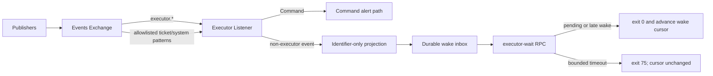
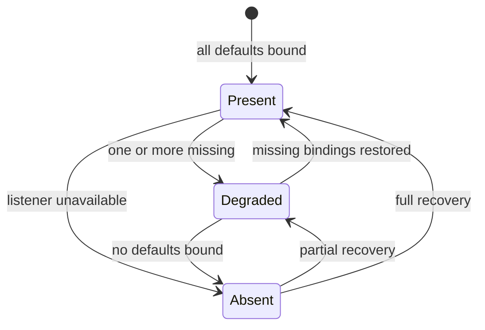

# feat: Add Executor event wakes

## Goal Capsule

- **Objective:** Replace polling-based Executor handoff discovery with reviewed event bindings and a durable bounded wait while preserving the trusted `executor.*` publish boundary.
- **Authority:** Issue #2030 defines product behavior; repository event/persistence patterns and `AGENTS.md` define implementation and verification constraints.
- **Stop conditions:** Stop for any design that permits GitHub-sourced publication under `executor.*`, leaks free text into non-Executor wake records, advances the wrong replay cursor, or cannot preserve wakes across daemon restart.
- **Execution profile:** Deep, security- and persistence-sensitive code change with CLI, daemon, event, skill, and documentation surfaces.
- **Tail ownership:** Implementation owns focused tests, daemon-level CLI proof where the agent-workspace guard permits it, draft PR self-review, and CI handoff.

---

## Product Contract

### Summary

An Executor run automatically binds to the finite set of dispatch, PR, CI, attention, and Command topics needed for timely action.
Non-`executor.*` events become identifier-only durable wake records, and `aiur executor-wait` returns immediately for pending work or blocks until a wake or timeout.

### Problem Frame

The Executor currently wakes only for Commands and discovers other handoffs by repeated GitHub and status polling.
Publish and binding authority share one validator, so allowing broader reads would also allow broader writes unless those responsibilities are split.
The existing alert feed remains pull-based and cannot by itself provide a zero-downtime discovery path.

### Requirements

- **R1:** Publishing remains limited to syntactically valid `executor.*` topics, including the existing fail-closed GitHub-source checks.
- **R2:** Executor subscriptions accept only `executor.*` and exact reviewed patterns; broader wildcards return a distinct allowlist error.
- **R3:** Launch reconciliation installs every default binding with an `:auto` reason, prunes stale auto entries, preserves manual entries, and records a creation event-ID floor.
- **R4:** Non-`executor.*` events project by construction into typed identifier-only records; payload ticket fields and all unknown/free-text values are discarded.
- **R5:** The supervised listener binds every default without duplicate delivery, restores missing bindings after Exchange restart, and keeps the Command alert path unchanged.
- **R6:** Wake records persist independently from the Executor event journal, coalesce by topic class and ticket within the debounce window, survive restart, and use an independent monotonic cursor.
- **R7:** `aiur executor-wait [--timeout <s>] [--json]` returns pending wakes immediately, blocks for late arrivals, exits `0` when woken, `75` on timeout, and `64` for invalid usage.
- **R8:** `aiur status` reports present, degraded, or absent binding health; degradation alerts once per transition and resolves on recovery without making status fragile.
- **R9:** GitHub `ready_for_review` PR activity publishes `ticket.<id>.pr.ready_for_review` without changing opened, merged, or converted-to-draft behavior.
- **R10:** Operator documentation names the default bindings, the wait-based discovery loop, the quiet audit fallback, and the non-replay behavior for pre-binding events.

### Acceptance Examples

- **AE1:** A trusted agent PR open, branch push, merge, CI terminal result, or dispatch-gate transition creates a pending wake without requiring a GitHub read to discover it.
- **AE2:** A PR title containing instruction-like text never appears in the wake journal or CLI output; the Executor receives only validated identifiers and typed flags.
- **AE3:** Removing one default Exchange binding changes status to degraded and emits `executor.bindings.incomplete`; restoring it reports present and emits the resolved transition once.
- **AE4:** Restarting the listener or daemon during a debounce window does not lose the pending wake and never advances the Executor Command journal watermark for non-Executor traffic.

### Scope Boundaries

#### In Scope

- Executor binding authority and reconciliation.
- Identifier-only projection, wake persistence, coalescing, waiters, and CLI plumbing.
- Listener routing and binding health.
- `ready_for_review` firehose translation.
- `aiur-run` skill and CLI reference documentation.

#### Out of Scope

- Mirroring existing ticket/system facts into new `executor.*` topics.
- Replaying events published before a binding existed.
- Replacing slow queue-depth polling or monitoring host processes.
- Changing GitHub-source rejection or the Publisher's trusted namespace guard.

---

## Planning Contract

### Key Technical Decisions

- **KTD1 — Separate publish and bind validators:** Syntax validation is shared, but publish authority remains `executor.*`-only while bind authority matches candidates against reviewed patterns with `Aiur.Events.Topic.matches?/2`.
- **KTD2 — Persist binding metadata, not bare strings:** Executor subscription state uses entries carrying topic, reason, and creation event-ID floor so reconciliation can prune only stale automatic bindings.
- **KTD3 — Project by construction:** `Aiur.ExecutorWakeProjection` builds a fresh map from an explicit field list and strict scalar validators; it never filters or transforms the source map.
- **KTD4 — Keep event and wake replay domains separate:** Command replay continues through `<repo>.executor.events.ndjson` and its watermark; non-Executor wakes use `<repo>.executor.wakes.ndjson` and a separate cursor.
- **KTD5 — Make the inbox the synchronization owner:** `Aiur.ExecutorWakeInbox` owns debounce state, durable append, cursor advancement, and monitored waiters so CLI waits and listener delivery cannot race across separate state owners.
- **KTD6 — Health is derived from live bindings:** Listener status compares the live Exchange binding set with defaults; status reporting only observes and the listener owns transition alerts.
- **KTD7 — Extend the existing firehose translator:** `ready_for_review` uses the existing action-based dedup key and readable-ticket-branch classification rather than adding a parallel event source.

### High-Level Technical Design

### Sequencing

1. Establish validators, default bindings, and projection guarantees before widening the listener.
2. Build the durable inbox and its failure/restart tests before connecting live delivery.
3. Convert the listener to set-aware routing, then add CLI waiting and status rendering.
4. Add the independent firehose emission and documentation after the wake path is stable.

### Assumptions

- Existing `IdGenerator` IDs remain suitable for binding floors and wake/event correlation, but separate cursors prevent cross-domain ordering from becoming a replay contract.
- Existing `DecisionLog` and `JsonStore` durability semantics are sufficient when the inbox flushes pending coalesced records before normal shutdown.
- Default debounce remains application-environment configurable for tests and internal tuning; it is not a new operator config key.

---

## Implementation Units

### U1. Split binding and publish authority

**Goal:** Preserve trusted publication while permitting only reviewed Executor bindings.

**Requirements:** R1, R2.

**Dependencies:** None.

**Files:**

- `src/lib/aiur/executor_events.ex`
- `src/lib/aiur/executor_bindings.ex`
- `src/test/aiur/executor_events_test.exs`
- `src/test/aiur/executor_bindings_test.exs`

**Approach:** Extract shared syntax validation, keep `publish/3` on the namespace validator, route subscribe/unsubscribe through allowlist matching, and expose defaults as reviewed `{topic, reason}` entries.

**Test scenarios:** GitHub-sourced Executor publication remains rejected; ticket publication remains rejected; every default binds; `ticket.*.pr.opened` is accepted; `ticket.*.#`, `#`, and malformed patterns are rejected with the correct reason.

**Verification:** Validator tests prove read authority widened without changing write authority.

### U2. Reconcile durable default subscriptions

**Goal:** Install and maintain the default binding set on every Executor launch.

**Requirements:** R3.

**Dependencies:** U1.

**Files:**

- `src/lib/aiur/executor_bindings.ex`
- `src/lib/aiur/executor_events.ex`
- `src/test/aiur/executor_bindings_test.exs`

**Approach:** Mirror universal-subscription reconciliation with auto reasons and creation floors while remaining backward-compatible with legacy bare-string subscription state.

**Test scenarios:** Reconcile is idempotent; stale auto entries are removed; manual entries are retained; defaults carry creation floors; legacy subscription state upgrades without losing the cursor.

**Verification:** Repeated launch reconciliation converges to the same durable state.

### U3. Project identifier-only wake records

**Goal:** Make untrusted text structurally unable to cross the Executor wake boundary.

**Requirements:** R4, AE2.

**Dependencies:** U1.

**Files:**

- `src/lib/aiur/executor_wake_projection.ex`
- `src/test/aiur/executor_wake_projection_test.exs`

**Execution note:** Write the arbitrary-extra-keys property test before the projection implementation.

**Approach:** Parse ticket only from topic; validate SHA and enums; strictly cast booleans and integers; default missing author trust to false; omit unknown and nested values.

**Test scenarios:** Arbitrary extra values never survive JSON serialization; hostile PR titles disappear; invalid booleans become nil; payload ticket cannot override topic ticket; missing trust is false; supported PR/CI/attention fields project correctly.

**Verification:** The property test fails against any transform-based implementation that accidentally preserves source keys.

### U4. Add the durable coalescing inbox

**Goal:** Persist, coalesce, trim, and deliver wakes without restart loss.

**Requirements:** R6, AE4.

**Dependencies:** U3.

**Files:**

- `src/lib/aiur/executor_wake_inbox.ex`
- `src/test/aiur/executor_wake_inbox_test.exs`

**Approach:** A GenServer owns pending records keyed by topic class and ticket, flush timers, NDJSON append, the independent cursor, monitored waiter registrations, and oldest-first trimming that cannot cross the cursor.

**Test scenarios:** Forty events over sixteen tickets produce sixteen records with counts; immediate and delayed waiter delivery work; concurrent waiters are both served; dead waiters are reaped; timeout does not advance the cursor; terminate flushes; restart replays; trimming preserves unread records.

**Verification:** Persistence tests cover process restart and shutdown inside a debounce window.

### U5. Convert the listener to multi-pattern routing

**Goal:** Bind all defaults and route Commands and projected wakes through their separate durable paths.

**Requirements:** R5, R6, AE1, AE4.

**Dependencies:** U2, U3, U4.

**Files:**

- `src/lib/aiur/executor_listener.ex`
- `src/test/aiur/executor_listener_test.exs`

**Approach:** Replace the single topic state with a pattern set, bind only missing patterns, replay only the Executor journal for `executor.*`, route other live events through projection/inbox, and never advance the Command watermark for non-Executor traffic.

**Test scenarios:** All defaults bind exactly once; unbound topics do nothing; Exchange binding loss restores only missing patterns; Command alerts remain unchanged; non-Executor events create wakes without changing the Command watermark.

**Verification:** Listener tests prove no duplicate-bag amplification and separate replay/cursor behavior.

### U6. Add bounded `executor-wait`

**Goal:** Give Executor loops one blocking discovery call with stable exit semantics.

**Requirements:** R7, AE1.

**Dependencies:** U4, U5.

**Files:**

- `src/lib/aiur/agent_control_cli.ex`
- `packaging/npm/aiur-cli/libexec/aiur-engine.sh`
- `src/test/aiur/agent_control_cli_test.exs`
- `src/test/aiur_engine_test.exs`
- `src/test/aiur/regression/engine_control_test.exs`

**Approach:** Parse timeout/JSON flags in the shared launcher, call a bounded daemon RPC, print a human or JSON batch only on wake, and preserve exit markers `0`, `75`, and `64` across the launcher boundary.

**Test scenarios:** Pending wakes return immediately; late wakes return after about 200ms; timeout returns after the bound with cursor unchanged; two CLI waiters both wake; malformed and negative timeouts return usage failure.

**Verification:** Exercise the installed-style launcher against a running daemon when the workspace guard allows it; otherwise record the precise guard and rely on focused RPC/engine tests for this agent turn.

### U7. Surface binding health and transitions

**Goal:** Make partial or total loss of the wake path visible and actionable.

**Requirements:** R8, AE3.

**Dependencies:** U2, U5.

**Files:**

- `src/lib/aiur/executor_listener.ex`
- `src/lib/aiur/agent_control_cli.ex`
- `src/test/aiur/executor_listener_test.exs`
- `src/test/aiur/agent_control_cli_test.exs`

**Approach:** Expose live bindings and missing defaults, render present/degraded/absent status, and persist or retain the last health state in the listener so alert emission occurs on transitions rather than status reads.

**Test scenarios:** Status renders all three states; removing one binding emits one incomplete alert; repeated status calls do not emit; recovery emits one resolved alert; alert failure cannot crash listener or status.

**Verification:** Health output names missing patterns and transition tests prove alert deduplication.

### U8. Emit PR ready-for-review events

**Goal:** Wake the Executor when a draft PR becomes reviewable.

**Requirements:** R9.

**Dependencies:** None.

**Files:**

- `src/lib/aiur/events/github_firehose.ex`
- `src/test/aiur/events/github_firehose_test.exs`

**Approach:** Add the action translation ahead of the catch-all and retain the existing PR dedup key and ticket branch lookup.

**Test scenarios:** `ready_for_review` publishes once per action/head SHA; duplicate events dedup; `converted_to_draft` remains ignored; opened and merged behavior stays unchanged.

**Verification:** Firehose translation tests cover legacy and readable ticket branches.

### U9. Document wait-based discovery

**Goal:** Make the new discovery loop and its failure semantics the canonical Executor operating model.

**Requirements:** R10.

**Dependencies:** U6, U7, U8.

**Files:**

- `.claude/skills/aiur-run/SKILL.md`
- `website/docs-app/reference/cli.md`

**Approach:** Document the reviewed binding catalogue, `executor-wait` exit behavior, adaptive timeout/backoff interaction, quiet audit floor, separate wake replay, binding creation floor, and degraded status.

**Test scenarios:** Test expectation: none -- these are documentation and skill contract updates validated by review and repository formatting checks.

**Verification:** No remaining skill text claims Executor bindings are restricted to `executor.*` or describes sleep/poll as the primary discovery path.

---

## Verification Contract

- Compile `src/` with warnings as errors.
- Run repository formatting over changed Elixir sources and tests.
- Use `mix aiur.affected_tests`, then run every reported test file with `mix test --max-cases 4`.
- Include the projection property test, persistence/restart tests, listener duplicate-binding tests, CLI exit-code tests, engine dispatch tests, and firehose regression tests in the scoped gate.
- Manually exercise `aiur executor-wait` against the real daemon process and launcher if permitted from the current workspace; never bypass the documented agent-workspace `--test` guard.
- Review the final diff for required CLI and skill documentation and for any accidental widening of `executor.*` publication.

---

## Definition of Done

- R1–R10 and AE1–AE4 are enforced by code, tests, or documentation as specified.
- Default bindings reconcile on Executor launch and live status names every binding or exact missing subset.
- A pending or late wake makes `executor-wait` exit `0`; a quiet timeout exits `75` without consuming future work.
- Non-Executor wake JSON contains no free text or unknown input values.
- Command journal and wake inbox retain independent durable cursors across restart.
- GitHub-source publication under `executor.*` remains rejected.
- `ready_for_review` publishes without regressing other PR lifecycle translations.
- Required docs and `aiur-run` skill changes ship in the same PR.
- The scoped local gate passes, the draft PR matches its claims, and abandoned experimental code is absent from the diff.
