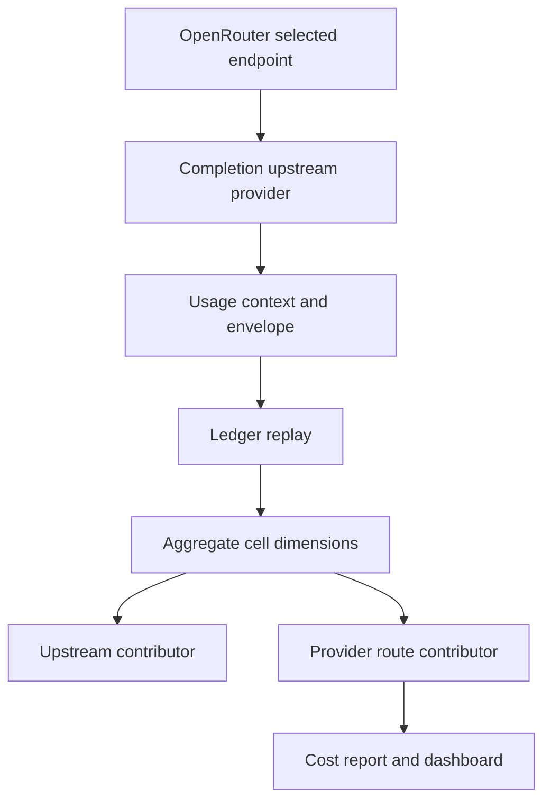

# Upstream Provider Attribution - Plan

## Goal Capsule

- **Objective:** Preserve an OpenRouter request's selected upstream provider through durable usage accounting and show the billing route on operator cost surfaces.
- **Authority:** Issue #1998 and the merged routing/billing contract from PR #1997; `main` is the integration branch.
- **Stop conditions:** Do not change price lookup identity, reinterpret historical `query_source`, or guess an upstream when OpenRouter metadata is absent or ambiguous.
- **Tail ownership:** This change owns envelope/ledger compatibility, aggregate grouping, CLI and dashboard presentation, focused tests, docs, and PR/CI handoff.

## Product Contract

### Summary

Add a dedicated optional upstream-provider fact, retain it independently from billing provider/model identity, and render delegated spend as a provider route such as `OpenRouter -> Anthropic`.

### Problem Frame

OpenRouter's selected endpoint provider is currently parsed, placed into the backend-specific `query_source` field, and discarded when aggregate cells are keyed. Billing remains correct, but operator-facing cost views cannot distinguish a direct provider call from the same provider reached through OpenRouter.

### Requirements

- R1. OpenRouter usage records the uniquely selected endpoint provider in a dedicated optional field without changing billing provider or resolved-model identity.
- R2. `query_source` keeps its existing source semantics and is no longer populated from OpenAI-compatible response provider metadata.
- R3. The upstream provider survives envelope serialization, ledger replay, aggregate cells, checkpoints, and compaction blocks.
- R4. Raw upstream-provider and derived billing-route contributor dimensions reconcile to the same token and monetary totals as existing dimensions.
- R5. Human cost output and the authenticated dashboard visibly distinguish routed calls from direct calls; structured output preserves provider and upstream as separate values.
- R6. Missing, malformed, or ambiguous OpenRouter metadata never drops usage or invents an upstream provider.

### Scope Boundaries

- Existing historical checkpoints and compacted blocks decode missing upstream data as unknown; there is no lossy backfill from legacy `query_source`.
- Price lookup continues to use the billing provider/model fields established by PR #1997.
- The analytics CLI's intentionally unavailable financial auxiliary remains unchanged because it has no authenticated aggregate-loading contract.
- The change does not restore the dashboard's currently-unused generic drill-down UI.

## Planning Contract

### Key Technical Decisions

- KTD1. Add `upstream_provider` as an optional envelope and aggregate-cell dimension. Optionality preserves all non-OpenRouter traffic and legacy durable data.
- KTD2. Source the field only from exactly one selected OpenRouter endpoint. The response-level provider fallback is billing/transport metadata and must not produce `OpenRouter -> OpenRouter`.
- KTD3. Admit the selected provider exactly as received only when it is a 1-256 byte ledger-safe opaque identifier. Never case-fold, replace, or truncate it: any transform could merge distinct upstreams. Invalid values become unknown while the usage event continues.
- KTD4. Add both `by_upstream_provider` and a derived `by_provider_route` contributor. Independent provider/upstream totals remain inspectable, while the structured route key prevents false joins when direct and routed calls share an upstream.

### Assumptions

- Missing upstream attribution is coverage-significant only for OpenRouter cells; `nil` is expected and complete for direct providers.
- An OpenRouter route with unknown upstream is shown explicitly as `OpenRouter -> upstream unknown`; direct calls render only their billing provider.
- Forward-only attribution is required because aggregate history has already discarded the fact and legacy `query_source` mixes selected-provider values with response fallbacks across OpenAI-compatible backends. Promoting any historical subset would reinterpret an overloaded field and create a rule that cannot be proven from persisted aggregate cells.

### High-Level Technical Design

## Implementation Units

### U1. Capture and persist upstream provider

- **Goal:** Carry selected OpenRouter provider metadata into a dedicated durable envelope field without affecting direct backends or billing identity.
- **Requirements:** R1, R2, R3, R6; KTD1, KTD2, KTD3.
- **Dependencies:** None.
- **Files:** `src/lib/aiur/open_ai_compat/transport.ex`, `src/lib/aiur/open_ai_compat/coding_agent.ex`, `src/lib/aiur/usage/headless/context.ex`, `src/lib/aiur/usage/headless/adapter.ex`, `src/lib/aiur/usage/headless/open_ai_compat/request_usage.ex`, `src/lib/aiur/usage_envelope.ex`, and their focused tests under `src/test/aiur/open_ai_compat/`, `src/test/aiur/usage/headless/`, and `src/test/aiur/usage_envelope/`.
- **Approach:** Extract only one unambiguous selected endpoint, admit its provider only when the exact value is a bounded ledger-safe identifier, pass it under its own event/context key, and serialize it as an optional envelope fact. Unsafe, empty, or over-limit values become unknown without dropping usage. Preserve any independently supplied `query_source`.
- **Test scenarios:** A selected DeepSeek endpoint produces `upstream_provider`, does not derive `query_source` from OpenRouter metadata, and preserves any independently supplied `query_source`; missing/multiple/malformed selections produce `nil` while retaining usage; case-distinct safe values remain distinct; direct DeepSeek/Kimi traffic has no upstream; codec round trips the field and decodes legacy records that omit it.
- **Verification:** Focused transport, adapter, envelope, codec, and ledger tests prove the full capture-to-replay boundary.

### U2. Retain and group provider routes

- **Goal:** Prevent routed and direct usage from collapsing into the same aggregate identity and expose reconciling upstream/route contributor groups.
- **Requirements:** R3, R4; KTD1, KTD4.
- **Dependencies:** U1.
- **Files:** `src/lib/aiur/usage_aggregate/key.ex`, `src/lib/aiur/usage_aggregate/query.ex`, `src/lib/aiur/usage/grouped_scopes.ex`, test support under `src/test/support/`, and focused aggregate/checkpoint/compaction/grouped-scope tests under `src/test/aiur/`.
- **Approach:** Add the optional dimension to the canonical cell codec, include it in raw grouping, and derive a structured `{provider, upstream_provider}` route contributor for presentation. Legacy cells decode the absent field as `nil`.
- **Test scenarios:** Same provider/model with different upstreams creates distinct cells; new checkpoints and blocks retain the field; legacy checkpoints and blocks load with `nil`; upstream and route contributors reconcile tokens and both monetary bases; only missing OpenRouter upstream affects attribution coverage.
- **Verification:** Projection, query, checkpoint, compaction, and grouped-scope tests prove identity separation, backward compatibility, and reconciliation.

### U3. Render route attribution and document it

- **Goal:** Make the provider route visible in human and structured operator cost surfaces.
- **Requirements:** R5, R6; KTD4.
- **Dependencies:** U2.
- **Files:** `src/lib/mix/tasks/aiur.cost_report.ex`, `src/lib/aiur_web/operator_control_center/usage_summary_presenter.ex`, `src/lib/aiur_web/components/operator_control_center/usage_summary.ex`, related tests under `src/test/mix/tasks/` and `src/test/aiur_web/`, and `website/docs-app/guide/executor-control-center.md`.
- **Approach:** Render text routes with ASCII `->`, preserve structured route fields in JSON/view data, and add an authenticated **Cost by provider route** section immediately after **Tokens by model**. Each row shows the route plus separately named provider-reported and API-equivalent estimates, rendering unavailable amounts as `Unknown`. Direct providers omit the arrow; OpenRouter with missing metadata names the unknown upstream. Give routed rows an accessible phrase such as `OpenRouter routed through DeepSeek`, hide the visual separator from assistive technology, and include route attribution in the summary announcement.
- **Test scenarios:** Routed OpenRouter usage displays `OpenRouter -> DeepSeek` and announces the routing relationship; direct DeepSeek displays and announces only `DeepSeek`; missing OpenRouter metadata displays and announces `upstream provider unknown`; rows label provider-reported and API-equivalent estimates and show `Unknown` when absent; JSON exposes provider/upstream separately; locked dashboard state leaks no financial facts.
- **Verification:** Cost-report end-to-end tests, presenter/component tests, and the dashboard guide agree on the visible behavior.

## Verification Contract

- Compile with warnings as errors and format the Elixir tree.
- Compute the repository's affected-test set and run every returned test file with `--max-cases 4`.
- Confirm tests execute the transport-to-envelope, checkpoint/compaction compatibility, grouped reconciliation, CLI output, and rendered dashboard paths.
- Review the final diff for required docs, exact `main` ancestry, and absence of unrelated analytics/auth changes.

## Definition of Done

- Selected OpenRouter upstreams survive every durable accounting boundary without changing billing identity.
- Direct traffic and missing metadata remain truthful and do not lose token/cost measurements.
- Aggregate and grouped contributor totals reconcile, including after legacy checkpoint/block recovery.
- At least one human cost surface visibly reads `OpenRouter -> <upstream>`, and structured data keeps both identities separate.
- Required focused verification passes, abandoned approaches are absent from the diff, and the draft PR is ready for CI against `main`.
