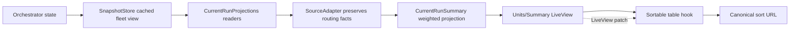

# Units Dashboard Progress and Sorting - Plan

## Goal Capsule

- **Objective:** Restore truthful Units summary data and labels, remove misleading degraded/unknown presentation, and make every dashboard HTML data table stably sortable with shareable URL state.
- **Authority:** Issue #1999 plus the operator's follow-up to remove dashed and hatched dashboard styling; `main` is the integration branch.
- **Stop conditions:** Do not add a second agent-tag implementation, recompute aggregate progress in LiveView, hide a still-degraded refresh path, sort action/icon columns, or weaken accessibility to gain client-side sorting.
- **Tail ownership:** This change owns the cached refresh boundary, projection sanitization, dashboard components and CSS, the shared sort hook and asset routing, focused Elixir/browser tests, docs, and PR/CI handoff.

## Product Contract

### Summary

The Units page again shows the agent/model facts already produced by the runtime, presents daemon-computed aggregate progress without fabricating zero, uses quiet flat-grey unknown states, and consistently calls its catalog Units. All dashboard HTML data tables gain keyboard-accessible, stable heading sorts whose active table, column, and direction survive LiveView updates and refresh through the URL.

### Requirements

**Data and progress integrity**

- R1. Restore agent and model tags by preserving existing routing facts across the current-run projection boundary; do not create new tag derivation or rendering logic.
- R3. Display the daemon-owned, complexity-weighted current-run aggregate for exact, partial, and lower-bound progress; unknown progress must remain unknown rather than appear as measured zero.
- R4. Eliminate the recurring degraded refresh at its source by moving current-run status reads off the direct retained-progress snapshot path and onto the existing cached dashboard read model; hiding the diagnostic alone is insufficient.

**Units presentation**

- R2. Render the Summary empty activity line without a leading bullet, label the meter `Progress`, omit internal freshness/member diagnostics, and add separation before the following section.
- R5. Rename the Units catalog heading, count, empty state, IDs, tests, and docs from Agents to Units while retaining “agent” where it names the worker/provider concept.
- R6. Remove dashed and hatched progress/unknown decoration across dashboard and Stream Deck dashboard CSS; unknown progress is a flat-grey track with no fill and remains semantically described in text/ARIA.

**Table sorting**

- R7. Every dashboard HTML data table sorts on meaningful column headings. The first activation is descending, the second reverses; action/icon columns remain inert.
- R8. Sorting is stable for equal values, keeps missing values last in both directions, preserves related detail rows, is keyboard operable, visibly indicates the active direction, and reapplies after LiveView DOM updates without moving focus.
- R9. The active table, column, and direction are represented by one canonical `sort` query parameter, survive Units filter patches and refresh, and can be linked. Only one dashboard table sort is active at a time.

**Documentation and verification**

- R10. User-facing Units and dashboard sorting behavior is documented in the same change and verified through the real Phoenix LiveView browser fixture in addition to focused unit/component tests.

### Acceptance Examples

- AE1. A current Unit with `agent_family: codex`, a requested model, and a resolved model renders the existing agent/model chips after a current-run projection refresh.
- AE2. With two current Units weighted 1 and 3 at 100% and 40%, the Summary displays the projection's weighted aggregate; when no Unit has a usable reading, the track is grey and contains no zero-width fill masquerading as 0%.
- AE3. A slow or large retained-progress join cannot make the current-run status source miss its five-second collection deadline because projections read the cached fleet snapshot instead of invoking the direct snapshot API.
- AE4. Clicking `Latest` orders newest/most-progress first, clicking again reverses it, and an incoming LiveView patch preserves the selected heading, direction, and surviving focus while reordering changed/new rows as needed and retaining relative order among equal values.
- AE5. Refreshing or sharing `?sort=units:latest:desc` restores that sort, and changing a Units filter preserves it.
- AE6. Unknown aggregate progress renders visible `Progress —`, exposes `Progress unavailable` through the meter's accessible label, shows a flat-grey track with no fill, and exposes no member-count or refresh-health diagnostic.

### Scope Boundaries

- Sorting applies to rendered HTML `<table>` rows. Pagination and batched “show more” controls keep their existing server boundaries; each newly rendered batch/page is integrated into the active stable order, rather than converting every provider query to server-side global sorting.
- ARIA grids and chart-like visualizations are not tables and do not gain column sorting.
- The otherwise-unused fleet table component is still instrumented because it is an HTML dashboard table and remains directly supported by tests.
- PR #1982 remains the authority for retained progress across restarts; this plan fixes the separate direct-reader/deadline mismatch exposed after that retention work.

## Planning Contract

### Key Technical Decisions

- KTD1. Preserve `backend`, `selected_backend`, `agent_family`, `requested_model`, and `resolved_model` in `CurrentRunProjections.SourceAdapter`. The Units row projection and component remain the single owners of tag precedence and rendering.
- KTD2. Keep aggregate math in `Aiur.CurrentRunSummary`; the component renders the presenter's exact/partial/lower-bound value and renders no fill for unknown.
- KTD3. Replace default direct `StatusReport.snapshot_api/0` and `status_api/0` projection readers with cached-only readers backed directly by `SnapshotStore.read(..., fleet_rows?: true)`. Accept only a current cached snapshot; route stale, unpublished, or unavailable cache results through the existing projection fallback. Never invoke `StatusReport.fleet_view/3`, whose cold-start fallback can call the Orchestrator and rebuild retained progress.
- KTD4. Use one shared client hook for all HTML tables. Durable row IDs establish persistent first-seen tie ranks, raw numeric/ISO-8601/normalized-text cell values drive comparisons, missing values are always last, and history detail rows move with their parent.
- KTD5. Encode a single active sort as `sort=<table>:<column>:<asc|desc>`. Validate table/column pairs against an explicit allowlist; the hook updates browser history and informs LiveView, while every compatible same-route patch preserves the valid value and incompatible navigation clears it.
- KTD6. Use deterministic heading IDs, keyboard handling and `aria-sort`, plus a visible CSS arrow. Restore focus only to an exact surviving ID; non-sortable headers carry no activation affordance.
- KTD7. Treat dashed/hatched decoration as a presentation regression across dashboard CSS, including Stream Deck surfaces. Flat color and semantic labels carry state instead.

### Assumptions and Risks

- The cached fleet snapshot can be read more than once per collection cycle without recreating the expensive retained-progress join; focused tests must pin that the default readers neither call the direct APIs nor enter `fleet_view/3`'s cold-start fallback.
- Client sorting is intentionally page/render scoped. If future product requirements demand globally sorted paginated provider results, that is a server-query contract change rather than an extension of this hook.
- Existing rescue commits `4135ae87` and `c8083d2e` are implementation evidence only. Their focused changes must be reconciled against current `main`, especially the newer Command History markup, rather than importing their stale base.
- LiveView DOM replacement is the highest interaction risk; browser coverage must exercise sorting before and after a real server patch and switching the active sort between tables.

### High-Level Technical Design

## Implementation Units

### U1. Repair current-run source boundaries

- **Goal:** Make current-run refresh bounded and preserve the routing facts that existing Units tag rendering consumes.
- **Requirements:** R1, R4; KTD1, KTD3.
- **Dependencies:** None.
- **Files:** `src/lib/aiur/current_run_projections/state.ex`, `src/lib/aiur/current_run_projections/source_adapter.ex`, and focused tests under `src/test/aiur/current_run_projections*` / `src/test/aiur/orchestrator/` as appropriate.
- **Approach:** Add cached-only fleet/status reader helpers that unwrap `SnapshotStore.read` into the current `status` map and `status_facts` list contracts only when freshness is current. Treat stale, unpublished, and unavailable results as unavailable so last-known-good/source-health behavior remains explicit. Keep injected reader options unchanged for tests. Extend sanitization allowlists for routing facts and prove both direct map and list forms retain them.
- **Test scenarios:** A current cache succeeds without direct API work; stale, unpublished, and unavailable cache states enter the existing fallback health path; cold start never invokes the Orchestrator; routing fields survive sanitization; a deliberately slow retained-progress join is irrelevant to default refresh behavior.
- **Verification:** Focused projection/adapter tests execute the default reader boundary and assert source health plus preserved facts.

### U2. Correct Units summary language and progress presentation

- **Goal:** Restore truthful, quiet Summary and Units presentation across HTML and dashboard styling.
- **Requirements:** R2, R3, R5, R6; KTD2, KTD7.
- **Dependencies:** U1.
- **Files:** `run_summary_strip.ex`, `units_table.ex`, `dashboard_live.ex`, `dashboard.css`, analytics/Stream Deck dashboard styles that use dashed or hatched state, and their component/LiveView/CSS tests.
- **Approach:** Render only projection-provided aggregate values; omit fill for unknown; remove freshness diagnostics from display; remove the empty-state bullet; rename collection copy to Units; replace dashed/hatch state styles with flat colors while preserving labels and ARIA.
- **Test scenarios:** Exact/partial/lower/unknown summary states, no diagnostic text, no empty bullet, agent/model chips restored, Units wording, no dashed/hatch selectors or repeating gradients, and grey unknown tracks with no fill.
- **Verification:** Component, LiveView, analytics, and CSS contract tests prove text, markup, and style semantics.

### U3. Add stable URL-backed table sorting

- **Goal:** Give every dashboard HTML table one consistent, accessible sort interaction that survives LiveView patches.
- **Requirements:** R7, R8, R9; KTD4, KTD5, KTD6.
- **Dependencies:** None; integrate with U2 markup before browser verification.
- **Files:** shared static sort hook and asset routing/allowlists; `layouts.ex`; dashboard table components (`units_table`, `tickets_panel`, `history`, `ticket_context`, `usage_summary`, `build_order_catalog`, and `fleet_table`); `dashboard_live.ex`; Units URL helpers; related component/LiveView/static-asset tests.
- **Approach:** Add table/column/row metadata and raw typed sort values, keep non-meaningful columns plain, store durable first-seen tie ranks by row ID, group detail rows, reapply in the hook's LiveView `updated` callback, and synchronize one allowlisted sort value through browser history and every compatible LiveView URL patch.
- **Test scenarios:** First descending/second ascending; raw numeric/text/time/progress/cost ordering; stable ties; missing-last both ways; detail adjacency; keyboard Enter/Space; visible and ARIA direction; focus retention; filter/detail/reveal/refresh persistence; invalid or unsortable URL state canonicalization; switching tables clears the prior indicator.
- **Verification:** Focused component and LiveView tests plus the real LiveView Playwright fixture exercise the full event/DOM/URL loop.

### U4. Document and visually verify the operator contract

- **Goal:** Ensure the visible dashboard and its documentation match the shipped behavior.
- **Requirements:** R10 and all acceptance examples.
- **Dependencies:** U1, U2, U3.
- **Files:** `website/docs-app/concepts/units.md`, `website/docs-app/guide/executor-control-center.md`, and `src/browser/tests/units.browser.spec.mjs` plus fixture support only where required.
- **Approach:** Document tag provenance, weighted aggregate/unknown meaning, Units vocabulary, and sitewide table sorting. Drive the real Phoenix dashboard fixture in a browser and capture assertions for styling, URL state, keyboard use, and a LiveView update.
- **Test scenarios:** AE1-AE5, including a cross-table active-sort transition.
- **Verification:** Playwright explicitly names and runs the Units browser spec; docs make no claim unsupported by the final diff.

## Verification Contract

- From `src/`, run `mise exec -- mix compile --warnings-as-errors` and `mise exec -- mix format --check-formatted` after formatting changed files.
- Run `cd src && mise exec -- mix aiur.affected_tests`, then execute every reported test command with `mix test --max-cases 4`.
- Run the focused Units browser spec through the repository browser-test runner and confirm the runner names `units.browser.spec.mjs` in its output.
- Inspect the browser-rendered LiveView for flat-grey unknown progress, restored chips, Summary spacing/copy, Units wording, sort indicators, keyboard behavior, and persistence through a real server update.
- Do not retry the blocked `scripts/aiurdev --test` harness from an agent workspace. If its guard prevents the ticket's additional manual-dashboard request, record that exact limitation while retaining the real LiveView browser-fixture evidence.
- Before handoff, verify `main` is an ancestor of the PR head, run `aiur guard-pr-deletions main`, and compare the final diff against R1-R10 and the PR body's claims.

## Definition of Done

- Current-run projection refresh uses the cached dashboard read boundary and no longer degrades because a direct retained-progress snapshot exceeded the collector deadline.
- Existing agent/model facts reach Units tags without duplicate derivation.
- Summary aggregate, unknown state, labels, spacing, and empty activity presentation are truthful and quiet; dashboard CSS contains no dashed/hatched state decoration covered by the requirement.
- Every dashboard HTML table has stable, accessible, URL-backed sorting for meaningful columns, with LiveView-update and missing-value behavior proven in browser coverage.
- Units and dashboard guide docs match the final visible behavior.
- Required scoped verification passes, abandoned rescue/stale-base artifacts are absent from the diff, and a self-reviewed draft PR is ready for CI against `main`.
