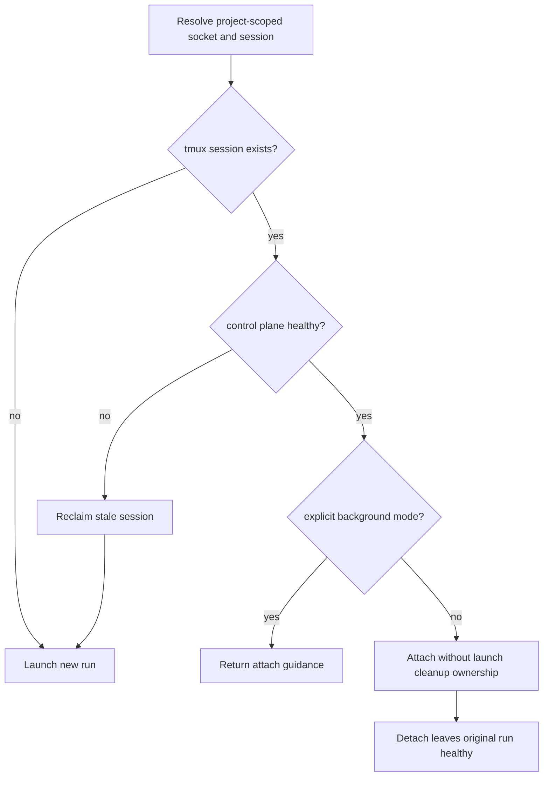

# fix: Attach to directory sessions

## Goal Capsule

Make a bare `aiur` or `aiurdev` invocation attach to the healthy session owned by the current project directory, while preserving fresh startup, explicit detached background behavior, stale-session recovery, and per-directory isolation.

---

## Problem Frame

The launcher already derives tmux socket and session names from the project root, checks for existing sessions, and eventually invokes `tmux attach`. The existing-session decision happens after launch-only state and foreground cleanup ownership are established, however. Re-entering a live run can therefore behave like a new foreground launch: it creates transient launch state, arms cleanup machinery owned by the attaching shell, and risks stopping the original run when the operator detaches. The background message also advertises `aiur` as the attach command without the help/reference explaining that behavior.

---

## Requirements

- **R1.** Bare `aiur` in a project with a healthy tmux session and control plane attaches to that exact session without creating a second session or run-log directory.
- **R2.** Detaching an attach-only invocation leaves the original daemon, tmux session, watchdog, and agent dispatch healthy.
- **R3.** Bare `aiur` with no session starts and attaches a new interactive run as before.
- **R4.** A stale directory-scoped tmux session is reclaimed before a fresh launch.
- **R5.** Explicit `aiur --bg` remains detached; against a healthy session it exits successfully and names bare `aiur` as the exact attach command.
- **R6.** Different project roots resolve and attach through distinct socket/session pairs.
- **R7.** CLI help and user documentation explain bare attach behavior and the headless-versus-interactive background distinction.

---

## Key Technical Decisions

- Reuse the existing project-root-derived identity. Attachment must not add a second lookup or global session registry.
- Classify an existing tmux session with both the existing control-plane probe and the distribution-node liveness probe. A control-ready session is tmux-attachable; a missing node is stale launch state to reclaim; a registered or indeterminate node with an unavailable control plane must be left intact and reported as still starting or temporarily unreachable.
- Put the healthy-session branch before run-log, pidfile, watchdog, and foreground-trap setup. An attaching shell observes an existing run and must never become its cleanup owner.
- Keep `--bg` semantically detached. Its already-running response names `aiur` as the attach command instead of unexpectedly taking over the terminal.
- Keep the existing background UI contract: `--bg` is headless unless `--interactive` was used. Bare attachment reconnects to the directory session but cannot retrofit a TUI tree into a run launched headlessly.

---

## High-Level Technical Design

---

## Implementation Units

### U1. Add an attach-only existing-session preflight

**Goal:** Route a healthy directory-scoped session to attachment before launch-only state or cleanup ownership is created.

**Requirements:** R1–R6

**Dependencies:** None

**Files:**
- Modify: `packaging/npm/aiur-cli/libexec/aiur-engine.sh`
- Test: `src/test/aiur_engine_test.exs`
- Test: `src/test/aiur/regression/instance_identity_test.exs` if existing identity assertions do not cover the attachment boundary sufficiently

**Approach:**
- After resolving the current project’s socket/session and tmux configuration, check for that session and probe the control plane.
- For a healthy foreground target, preserve or backfill its instance record, remove only this invocation’s transient argv file, and run the existing filtered tmux attachment behavior without foreground traps or a second watchdog.
- For a healthy background target, preserve the live record, clean transient invocation state, and return exact bare-attach guidance.
- For a control-unready target, use the existing node-liveness classification before mutation. Reap only when the keyed node is confirmed absent; leave `up` or `unknown` nodes and their tmux sessions intact with retry guidance.
- Extract the tmux attachment call into one helper so fresh foreground and attach-only paths keep identical stderr filtering and exit-code propagation.

**Patterns to follow:** Existing `probe_control_liveness`, instance-record preservation, stale background recovery, and filtered foreground attachment paths in `packaging/npm/aiur-cli/libexec/aiur-engine.sh`.

**Test scenarios:**
- Healthy existing session + bare invocation: calls `attach`, never calls `new-session`, never starts a watchdog, and creates no configured log root.
- Attach returns: no cleanup trap kills the tmux server or release node, and the attach exit code propagates.
- No session + bare invocation: creates one new session and reaches attachment.
- Existing session + failed control probe + absent node: reclaims the keyed stale state and creates one replacement session.
- Existing session + failed control probe + live or indeterminate node: exits with retry guidance and performs no cleanup.
- Healthy existing session + `--bg`: does not attach or launch, and prints `Attach with: aiur`.
- Two distinct project roots: attachment calls use different directory-derived sockets/sessions and neither invocation creates a session.

**Verification:** Focused engine tests observe the fake-tmux command stream and filesystem side effects, including negative assertions for launch and cleanup operations.

### U2. Document attachment as part of the launch contract

**Goal:** Make the single-command start-or-attach behavior discoverable and accurately describe background limitations.

**Requirements:** R7

**Dependencies:** U1

**Files:**
- Modify: `packaging/npm/aiur-cli/libexec/aiur-engine.sh`
- Modify: `website/docs-app/reference/cli.md`
- Modify: `website/docs-app/guide/tui.md`
- Modify: `src/README.md`
- Modify: `packaging/npm/aiur-cli/README.md`

**Approach:** Update launcher help and existing command tables to say that bare `aiur` starts when absent and attaches when the directory session is healthy. Clarify that a default headless `--bg` session remains headless, while `--bg --interactive` creates an attachable TUI stack.

**Patterns to follow:** Existing launch and foreground/background tables in the listed docs.

**Test scenarios:**
- Help output includes the start-or-attach contract and identifies bare `aiur` as the attach command.
- Test expectation for prose files: none beyond docs-reference checks; the engine help assertion is executable coverage.

**Verification:** CLI help tests and docs reference checks pass; prose does not imply that attaching retrofits a TUI into a headless run.

---

## Risks & Dependencies

| Risk | Mitigation |
| --- | --- |
| Attaching shell tears down the original run on exit | Branch before foreground trap/watchdog setup and assert no cleanup commands after fake detach. |
| A transient control failure destroys a live daemon | Confirm the keyed distribution node is absent before stale cleanup; preserve `up` and `unknown` states. |
| One project attaches to another | Reuse the tested canonical project-root identity and cover two roots in the attachment command stream. |
| Docs promise a TUI for headless background mode | Explicitly distinguish reconnecting to the tmux session from launching with `--interactive`. |

---

## Verification Contract

- Shell engine compiles and focused launcher/identity tests pass with bounded test concurrency.
- `mix compile --warnings-as-errors`, `mix format`, and the deterministic affected-test set pass.
- The real CLI manual scenario is performed from an Executor repository root because agent workspaces are explicitly forbidden from running `scripts/aiurdev --test`: start an interactive background session, run bare `aiur` from the same project, observe the TUI, detach, confirm `status` and dispatch stay healthy, and repeat with a second project identity.

## Definition of Done

- All requirements R1–R7 are implemented and covered at the appropriate automated or manual layer.
- User-facing CLI documentation ships in the same PR.
- Draft PR is self-reviewed, current with `main`, and handed to CI with the manual-test restriction called out accurately.
