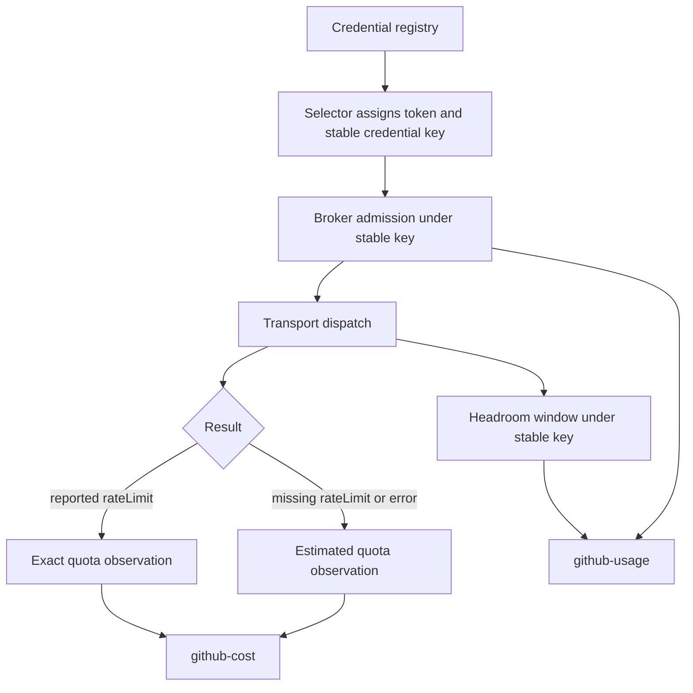

# Fix GitHub Budget Accounting

## Goal Capsule

- **Objective:** Ensure every completed GitHub request leaves an honest accounting record and one credential retains a continuous ledger across token rotation.
- **Authority:** Issue #2236 acceptance criteria and measured reproductions override implementation convenience; current repository contracts determine integration shape.
- **Stop conditions:** Do not present unknown GraphQL cost as measured, do not merge distinct configured credentials, and do not weaken request admission or credential-selection safety.
- **Execution profile:** Test-first repair across quota attribution, stable credential identity, headroom, and reporting.
- **Tail ownership:** Scoped compile, formatting, affected tests, adversarial review, and CI remain part of delivery.

---

## Product Contract

### Summary

GitHub quota accounting must remain useful during failures and credential rotation, precisely when operators rely on it to explain spend.

### Problem Frame

Quota attribution currently ignores error tuples even though a timed-out or exited transport task may already have been billed. GraphQL responses without `data.rateLimit` fall back to one point, but the exact failure forms need mutation-sensitive coverage proving that the output is visibly estimated. Broker admissions and credential headroom are keyed by a hash of the current token, so rotating an App installation token fragments one credential into unrelated histories.

### Requirements

- R1. Every request result observed after network dispatch, including transport errors and timeouts, contributes an attribution record.
- R2. Any cost that is neither reported in the response nor fixed by the API's pricing contract is marked estimated through quota snapshots and `github-cost` output.
- R3. A 502 and a 200 GraphQL errors body without `data.rateLimit` remain visible as estimated spend.
- R4. Broker admissions, usage reports, and credential headroom use a stable credential identity that does not change with token rotation.
- R5. Distinct configured credentials remain isolated even if their tokens or display identities overlap.
- R6. The `QuotaUsage` module documentation accurately states that `github-cost` reads the live daemon through the control RPC.
- R7. Reverting any of the three fixes causes a focused regression test to fail.

### Scope Boundaries

The one-point unknown-cost value remains an explicitly estimated lower-bound because the existing GraphQL shape estimate is documented as 50–500 times higher than real billing and is unsuitable as a receipt. This work does not reconstruct unknown historical spend, redesign GitHub pricing, or change quota ceilings.

---

## Planning Contract

### Key Technical Decisions

- KTD1. Attribute every result passed to `Quota.observe/3`; successful responses use reported pricing where available, GraphQL error tuples use the one-point fallback with an assumed cost source, and Core errors retain the API's fixed one-request charge.
- KTD2. Derive an opaque broker/headroom key from stable credential identity rather than token contents. App installations use App id plus installation id; machine-user and human credentials prefer normalized GitHub identity and fall back to a namespaced configured id.
- KTD3. Attach the stable identity at the credential-selection chokepoint for both single-credential and pooled request paths, and export the agent publication credential's stable identity to the `gh` wrapper, so every known caller presents the same identity to accounting.
- KTD4. Preserve active broker state through a compatibility identity map: on first use, bind the stable credential key to the credential's existing token-hash ledger, then resolve later rotated token hashes through that binding. Existing admissions, policies, holds, leases, and cache claims remain in place rather than being reset or double-counted.
- KTD5. Prove observable behavior at the snapshot and CLI projection boundaries, not by directly mutating accounting state in tests.

### High-Level Technical Design

### Assumptions

- The broker database can retain its existing `token_key` column names as compatibility storage while a new identity binding makes the stable credential key authoritative; a destructive schema rename is not required.
- Ad-hoc host wrappers with no trusted configured identity may retain token-fingerprint fallback. Daemon requests and agent workspaces launched by Aiur always receive the stable identity for the credential they use.

---

## Implementation Units

### U1. Record estimated failure spend

- **Goal:** Make quota attribution total over every post-dispatch result and visibly estimated when GitHub did not report cost.
- **Requirements:** R1, R2, R3, R7.
- **Dependencies:** None.
- **Files:** `src/lib/aiur/github/quota.ex`, `src/test/aiur/github/quota_test.exs`, `src/test/aiur/github/quota_caller_attribution_test.exs`, `src/test/aiur/github_cost_cli_test.exs` as needed.
- **Approach:** Generalize request attribution beyond successful status maps, preserve zero-cost 304 handling, price GraphQL error tuples as assumed, and retain Core's fixed one-request charge. Add focused tests for timeout/task-exit errors, 502 responses, and 200 errors bodies, asserting both retained points and estimated flags through public snapshots or CLI build output.
- **Execution note:** Begin with failing tests for each result shape and verify each assertion fails when its corresponding attribution branch or estimated marker is removed.
- **Patterns to follow:** Existing reported-versus-assumed cost source and `Quota.snapshot/1` projection tests.
- **Test scenarios:** A fetch-deadline error produces one estimated GraphQL point; a task-exit error produces one estimated GraphQL point; a Core error produces one exact request; a 502 without `rateLimit` produces one estimated point; a 200 GraphQL errors body without `data.rateLimit` produces one estimated point; an exact reported response remains non-estimated; a 304 remains zero-cost.
- **Verification:** Public attribution rows and CLI data distinguish assumed from reported cost for every scenario.

### U2. Preserve credential history across rotation

- **Goal:** Use one stable ledger and headroom identity for successive tokens belonging to the same credential.
- **Requirements:** R4, R5, R7.
- **Dependencies:** None.
- **Files:** `src/lib/aiur/github/budget.ex`, `src/lib/aiur/github/credential.ex`, `src/lib/aiur/github/credential_selector.ex`, `src/lib/aiur/github/credential_headroom.ex`, `src/lib/aiur/github/credential_usage.ex`, `src/lib/aiur/agent_environment.ex`, `src/lib/aiur/env/schema.ex`, `src/priv/github_budget.py`, `src/priv/github_quota_guard.sh`, `src/test/aiur/github/budget_test.exs`, `src/test/aiur/github/credential_selector_test.exs`, `src/test/aiur/github/credential_headroom_test.exs`, `src/test/aiur/github/credential_usage_test.exs`, `src/test/aiur/agent_environment_test.exs`, `src/test/aiur/agent_github_guard_test.exs`.
- **Approach:** Centralize domain-separated stable credential-key derivation, attach it to all registry-selected requests, export the agent publication credential key to guarded `gh` calls, and consume it consistently in broker acquisition/observation, headroom storage, selector scoring, and usage joins. Add a broker identity-binding table whose first observation adopts the already-active token-hash ledger as its canonical storage key; later token rotations resolve to that same ledger without rewriting or losing active rows. Retain token-derived fallback only for truly unconfigured callers.
- **Execution note:** Add a rotation characterization test before changing key derivation: two different tokens for one credential must aggregate into one admission history and one current headroom row.
- **Patterns to follow:** `Credential.id` as configured identity, `AppCredentials.installation_id/0` for App identity, and existing opaque SHA-256 fingerprints for persisted keys.
- **Test scenarios:** One configured credential with token A then token B retains combined admissions; adopting a stable key preserves admissions created under the pre-upgrade token-hash ledger; an App installation key is stable across token refresh; distinct GitHub identities/installations remain separate; headroom observed under token A is addressable after token B becomes current; `CredentialUsage.rows/1` joins actors to the stable credential row; daemon and agent wrapper calls using the same credential share one ledger; App-daemon and machine-user-agent credentials remain separate.
- **Verification:** Rotation tests fail under token-string hashing and pass only when all producer and consumer paths share the stable key.

### U3. Correct operator-facing documentation

- **Goal:** Remove the false claim that `github-cost` reads an empty throwaway meter.
- **Requirements:** R6.
- **Dependencies:** U1.
- **Files:** `src/lib/aiur/github/quota_usage.ex`.
- **Approach:** State that the CLI routes through the live daemon control RPC and that `QuotaUsage` is the pure projection shared by operator surfaces.
- **Patterns to follow:** Current launcher routing documented in `src/lib/aiur/github/quota_usage.ex` and covered by engine tests.
- **Test scenarios:** Test expectation: none -- this is a correction to internal module documentation and existing launcher tests already guard the runtime route.
- **Verification:** The moduledoc no longer contradicts the live `github-cost` execution path.

---

## Verification Contract

- Compile the Elixir project with warnings treated as errors.
- Format all changed Elixir files with the repository formatter.
- Compute the affected-test set and run every reported test with at most four concurrent cases.
- Confirm the new quota tests are collected by name and fail when error attribution or estimated classification is reverted.
- Confirm the rotation tests are collected by name and fail when stable identity is replaced with token hashing at any producer/join boundary.
- Run adversarial diff review against the acceptance criteria before PR handoff.

---

## Definition of Done

- Every post-dispatch error result creates an accounting observation; unknown costs are estimated, while Core's fixed one-request charge remains exact.
- Missing GraphQL pricing is visibly estimated for both HTTP and GraphQL error bodies.
- Credential token rotation does not split broker admissions, headroom, or usage reporting.
- Distinct credentials remain isolated.
- The stale moduledoc is accurate.
- Scoped local verification passes, the draft PR targets `main`, self-review finds no unresolved defects, and CI is handed off through `agent:ci-wait`.
