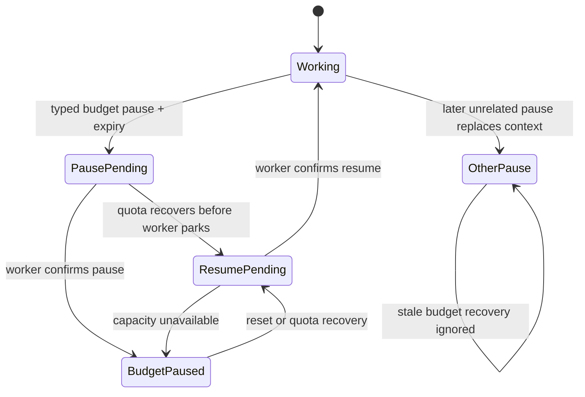

# GitHub Budget Pause Recovery - Plan

## Goal Capsule

- **Objective:** Make a known GitHub budget hold a typed, self-clearing agent pause instead of a credential emergency that requires manual resume.
- **Authority:** Issue #2227 and repository operating instructions define behavior; existing control-lifecycle and quota recovery invariants constrain implementation.
- **Stop conditions:** Do not auto-resume credential, operator, decision, dependency, CI, provider-limit, or generic cooperative pauses.
- **Tail ownership:** The scoped compile, format, affected tests, draft PR review, and CI handoff remain part of this ticket.

---

## Product Contract

### Summary

The GitHub budget broker will surface an explicit retryable hold with its resource and expiry. Agents will preserve that cause in `pause.request`, and the orchestrator will resume only the matching budget-paused generation when the hold clears.

### Problem Frame

The quota meter already wakes fleet dispatch after a window resets, but agent-authored pause events collapse every non-dependency cause into `:agent_pause_request`. That erases whether a pause is machine-clearable, renders it as human-required, and leaves completed work parked after a transient outage. The guard and current skill guidance also let agents confuse broker admission with credential rejection.

### Requirements

- R1. A shared GitHub quota hold must produce a stable retryable guard diagnostic carrying the affected resource and known expiry without invoking real `gh`.
- R2. Agent guidance must classify that diagnostic as a budget hold, emit no credential attention, and request a typed pause carrying the diagnostic metadata.
- R3. The orchestrator must preserve budget-pause provenance and generation through worker pause confirmation.
- R4. Quota recovery or the recorded expiry must automatically resume the matching paused generation, including recovery-before-pause-confirmation and capacity-deferred cases.
- R5. An unrelated or replacement pause must never be resumed by stale budget readiness.
- R6. Budget pauses must render as transient and self-clearing rather than waiting for human input.

### Scope Boundaries

- Do not add a general stale-pause sweeper.
- Do not auto-resume true credential loss, broker corruption/unavailability, or any human-gated pause.
- Do not classify ordinary broker pacing, cache coalescing, staggering, or concurrency waits as quota exhaustion.

### Acceptance Examples

- AE1. Given a broker resource hold with a future reset, when an agent command is refused, the guard names a retryable budget hold and the real GitHub command is never executed.
- AE2. Given a typed budget pause confirmed by the worker, when the quota meter reports recovery, the orchestrator requests resume and the agent returns to working.
- AE3. Given recovery arrives before pause confirmation or while capacity is full, readiness remains durable and drains after the pause/cap clears.
- AE4. Given a later operator or dependency pause replaces the budget pause, when the old reset arrives, the later pause remains intact.

---

## Planning Contract

### Key Technical Decisions

- KTD1. Extend the broker protocol with a distinct shared-budget hold response rather than treating every `wait` as exhaustion; short coordination and pacing waits retain their existing behavior.
- KTD2. Use a dedicated `:github_budget_hold` pause reason plus resource, expiry, and generation context. Generic `:agent_pause_request` is intentionally not eligible for automatic recovery.
- KTD3. Generalize the existing durable `pending_auto_resume` pattern for quota readiness so one-shot recovery cannot be lost before pause acknowledgement or while admission is full.
- KTD4. Treat the pause expiry as an agent-local recovery signal and the quota meter's `:github_quota_recovered` message as an immediate fleet-wide reconciliation signal. An expiry message must match the stored pause generation; the bare fleet signal may wake only the current `:github_budget_hold` generation whose advertised `reset_at_ms` has elapsed, so it cannot release a newer hold.

### High-Level Technical Design

### Assumptions

- The stable guard marker is the source of truth for agent interpretation; free-form GitHub or broker stderr remains insufficient to prove credential failure.
- The existing orchestrator reconciliation tick is frequent enough to drain capacity-deferred readiness after a slot opens.

---

## Implementation Units

### U1. Type broker holds and agent reporting

- **Goal:** Distinguish known shared-budget exhaustion from coordination waits, broker failure, and authentication failure.
- **Requirements:** R1, R2; AE1.
- **Dependencies:** None.
- **Files:** `src/priv/github_budget.py`, `src/priv/github_quota_guard.sh`, `src/lib/aiur/github/budget.ex`, `.claude/skills/aiur-agent/dev-loop.md`, `.claude/skills/aiur-agent/event-taxonomy.md`, `src/test/aiur/agent_github_guard_test.exs`, `src/test/aiur/github/budget_test.exs`, `src/test/aiur/aiur_agent_skill_test.exs`.
- **Approach:** Add the exact broker response `hold shared <resource> <reset_at_ms>` for shared cooldown/resource holds. Validate the resource against the broker's fixed resource set and require a finite absolute reset timestamp; malformed typed responses stay broker-unavailable. The shell guard refuses the real command with exit 75 and stderr `aiur: github budget hold resource=<resource> reset_at_ms=<reset_at_ms>`, while ordinary waits keep sleeping/retrying. Agent guidance maps only that marker to `{reason: "github_budget_hold", resource: <resource>, reset_at_ms: <integer>}`.
- **Patterns to follow:** Existing `wait actor` protocol typing and the guard's fail-closed no-real-command tests.
- **Test scenarios:** A shared resource hold returns the stable marker and never calls fake `gh`; ordinary pacing waits still retry to a grant; missing credentials and broken broker retain distinct diagnostics; Elixir budget admission maps the new protocol response to `:shared_budget`.
- **Verification:** Tests demonstrate all three failure classes and prove the guidance names only the hold as self-clearing.

### U2. Preserve and recover budget pause generations

- **Goal:** Automatically resume only the agent generation paused for the recovered budget condition.
- **Requirements:** R3, R4, R5; AE2, AE3, AE4.
- **Dependencies:** U1.
- **Files:** `src/lib/aiur/orchestrator.ex`, `src/lib/aiur/orchestrator/push_routing.ex`, `src/lib/aiur/orchestrator/pause_resume.ex`, `src/test/aiur/orchestrator/lifecycle_test.exs`, `src/test/aiur/orchestrator/push_routing_test.exs`, `src/test/aiur/orchestrator_deactivate_test.exs`.
- **Approach:** Revalidate the model-authored resource and absolute reset timestamp before storing generation-scoped budget context on the running entry. Reject malformed or timestamps outside the bounded 24-hour window as a generic, non-auto-resumable pause; schedule valid expiries directly, including slightly elapsed resets that should recover immediately. Expiry messages carry the generation, while bare fleet recovery reconciles only current budget contexts whose advertised reset has elapsed. Stamp durable auto-resume readiness on eligible recovery, reuse automatic `PauseResume.resume_paused_issue/3` admission, and clear the context on replacement pauses and after observed resume.
- **Patterns to follow:** Blocker dependency generations, `pending_auto_resume`, and worker-confirmed control lifecycle transitions.
- **Test scenarios:** Normal pause-confirm-recover-resume; recovery before pause confirmation; cap-full recovery drains later; stale generation ignored; operator/dependency replacement remains paused; repeated recovery is idempotent; malformed resource and out-of-range expiry metadata cannot crash or create an unbounded timer; slightly elapsed resets recover immediately.
- **Verification:** State-level tests drive the real pause and resume control requests rather than hand-editing final state.

### U3. Project budget pauses as transient

- **Goal:** Keep operator status honest and document the shipped skill behavior.
- **Requirements:** R6.
- **Dependencies:** U2.
- **Files:** `src/lib/aiur/orchestrator/status_reason.ex`, `src/lib/aiur/orchestrator/waiting_reason.ex`, `src/lib/aiur/orchestrator/operator_messages.ex`, related tests under `src/test/aiur/orchestrator/`, `website/docs-app/skills.md`.
- **Approach:** Render budget pauses with their automatic clearance posture, suppress human-required classification, and retain normal informational resolution when the worker resumes.
- **Patterns to follow:** Existing provider-limit and CI-wait status projection, without their human-attention semantics.
- **Test scenarios:** Budget pause is transient and not human-required; unrelated pauses retain current projections; auto-resume resolves any pause alert without asking for credentials.
- **Verification:** Focused presenter/status tests and concise skills documentation agree with runtime behavior.

---

## Verification Contract

- `mise exec -- mix compile --warnings-as-errors` passes from `src/`.
- `mise exec -- mix format` leaves the touched Elixir files formatted.
- `mise exec -- mix aiur.affected_tests` identifies the scoped test set, and every reported `mix test` invocation passes with `--max-cases 4`.
- Guard tests prove the real installed shell/Python protocol path and no-network behavior.
- Control-lifecycle tests prove pause and resume messages, final working state, stale-generation safety, and deferred recovery.

---

## Definition of Done

- Every requirement and acceptance example has an executing regression test.
- The guard, agent skill, and orchestrator agree on one typed budget-hold contract.
- No human-gated pause becomes auto-resumable.
- Documentation reflects the agent skill behavior.
- Experimental or superseded recovery paths are absent from the final diff.
