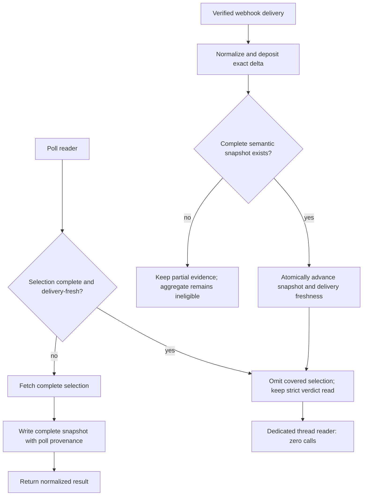

# Fix ResourceStore Pipe Convergence

## Goal Capsule

- **Objective:** Make `comment_poll_batch`, `ci_poll_batch`, and `review_threads_unaddressed` consult delivery-fresh ResourceStore state before spending GraphQL points, omit only the exact selections a delivery-backed snapshot can answer, and write complete paid selection results back so later webhook deltas advance the same resource.
- **Authority:** GitHub issue #2265 and the existing default-deny verdict-cache contract.
- **Stop condition:** Every read path fails open unless it holds a complete, delivery-fresh selection snapshot; mutation tests prove a qualifying hit cannot re-request that selection. Strict verdict selections remain live, so only the dedicated review-thread reader becomes a zero-call hit.
- **Tail ownership:** This change owns scoped tests, affected GitHub API documentation, a draft PR against `main`, and CI handoff. After production deployment, the Executor owns hook activation/read-back and clean-window fleet cost measurement as explicit rollout evidence.

---

## Product Contract

### Summary

Webhook delivery and polling must converge on the same restart-durable resource instead of maintaining parallel views. A free delivery may suppress an immediate paid selection only when it advances a complete snapshot for that selection family; it must never make unrelated `reviewDecision`, mergeability, merge-queue, or other strict verdict fields servable from held state.

### Problem Frame

The three largest attributed GraphQL callers bypass ResourceStore even though verified deliveries arrive first and Deposit already persists related bodies. Poll widening lowers cadence but still re-reads facts GitHub just delivered. At the same time, `ReadCache.Policy` correctly refuses stale `reviewThreads`, `reviewDecision`, `mergeable`, and CI rollups, so ordinary TTL caching is not a safe fix.

### Requirements

- R1. ResourceStore records the body writer (`:webhook` versus `:poll`) independently from processed-mark provenance so callers can identify a complete selection snapshot whose latest meaningful advance came from a recent webhook.
- R2. A resource is eligible to suppress only its matching GraphQL selection when it is complete for that selection family, delivery-fresh for at most 30 seconds, JSON-storable, and keyed by semantic resource identity.
- R3. Missing, partial, stale, poll-only, malformed, refused, or unavailable store state fails open to the existing GraphQL path.
- R4. Each successful complete GraphQL selection writes its normalized snapshot back with poll provenance when ResourceStore is available; a refused or failed write remains fail-open and does not discard the fetched answer. Failed or partial pagination never marks a snapshot complete.
- R5. Webhook deltas update an existing complete snapshot for the same selection family atomically without manufacturing missing siblings, negative answers, or unrelated aggregate verdicts.
- R6. `pull_request_review_thread` resolved deliveries normalize and deposit before the production hook subscribes to the event; they reconcile state without inventing a comment wake. The hook is enabled only after support is deployed in production.
- R7. `ReadCache.Policy` keeps refusing stale verdict selections. Delivery freshness is a narrow ResourceStore path, not a transport-cache exception.
- R8. Tests fail if any qualifying store hit re-requests its covered selection, and controls prove partial, stale, poll-only, head-mismatched, and store-unavailable entries still request it. The dedicated thread reader additionally proves zero upstream calls on a hit.
- R9. Existing GitHub API documentation describes the convergence and the clean-window measurement constraint accurately.

### Scope Boundaries

- No general caching of GraphQL verdict documents.
- No claim that one check run represents all checks, one review thread represents the full connection, or a REST pull request contains GraphQL-only verdict fields.
- No weakening of strict merge, CI, or review-decision reads. `comment_poll_batch` always asks GitHub for current PR identity/review context; `ci_poll_batch` always asks for current PR/merge verdicts. Only their expensive thread/context selections may be omitted.
- Hook subscription is operationally sequenced after code support is deployed; repository code must not assume the event is already enabled.
- Before/after points-per-hour evidence is gathered only in clean GitHub accounting windows after deployment, not fabricated from restart-contaminated local tests.

---

## Planning Contract

### Key Technical Decisions

- KTD1. Store two closed, JSON-only selection snapshots: `:pr_review_threads` keyed by pull-request number with `%{"complete" => true, "threads" => [...]}`, and `:ci_contexts` keyed by ticket target with `%{"complete" => true, "head_sha" => sha, "check_runs" => [...], "commit_status" => ...}`. Never persist target-set-dependent batch result maps with atom keys.
- KTD2. A webhook delta may promote only an already-complete snapshot for its own selection family to delivery-fresh. On a cold store, the raw delivered object remains useful evidence but cannot answer a collection, so the reader fetches and establishes completeness.
- KTD3. Delivery freshness is a concrete 30-second internal lease aligned with the immediate reconciliation wake, distinct from ResourceStore's 72-hour retry/dedup retention. Retention must never become verdict freshness.
- KTD4. Paid selection write-back records poll provenance but does not erase the audit fact that delivery and polling are different pipes. Eligibility requires the held selection's body writer to be `:webhook`; strict verdict fields are never stored in either selection snapshot and remain live-read.
- KTD5. Snapshot updates use ResourceStore's atomic update path. Thread deltas compare the delivered thread's `updated_at` before replacing that thread. CI deltas require the held `head_sha` to match the delivery, replace only the matching run identity, and derive the stored version from the merged body so an older run event cannot overwrite newer state.
- KTD6. Thread collection snapshots are written only after all GraphQL pages succeed. Local CODEOWNERS classification stays read-time behavior because it depends on caller options and repository state.
- KTD7. `pull_request_review_thread` support follows GitHub's repository webhook contract: the resolved action carries the pull request and thread, and requires Pull requests read permission. See [GitHub webhook events and payloads](https://docs.github.com/en/webhooks/webhook-events-and-payloads#pull_request_review_thread).

### High-Level Technical Design

### Risks and Mitigations

- **Aggregate completeness:** An incomplete delivery could create false empty/pass states. Persist an explicit completeness contract and require it at every pre-read.
- **Cross-pipe race:** A slower poll could overwrite a newer delivery. Compare versions/generations inside ResourceStore's atomic update, failing open on ambiguity.
- **Shape drift:** REST webhook and GraphQL response shapes differ. Centralize semantic normalization and assert delivery/poll convergence in tests.
- **Overbroad freshness:** A 72-hour entry would be unsafe. Expose and test the short delivery lease independently from retention.
- **Hook rollout:** Enabling the event before support would create accepted-but-ignored deliveries. After the code is deployed, the Executor updates hook 664044094, re-reads its event list, and records one received resolved-thread delivery before cost measurement.

---

## Implementation Units

### U1. Provenance and complete-snapshot contract

- **Goal:** Extend ResourceStore with the two explicit selection-snapshot identities, body-writer provenance, completeness metadata, and an explicit 30-second delivery-fresh read predicate.
- **Requirements:** R1, R2, R3, R7; KTD1-KTD5.
- **Dependencies:** None.
- **Files:** `src/lib/aiur/github/resource_store.ex`, `src/test/aiur/github/resource_store_test.exs`.
- **Approach:** Add `:pr_review_threads` and `:ci_contexts`; keep their exact schemas from KTD1 in one shared snapshot helper. Reuse ResourceStore's persisted `data_source`/`source` split, preserve fail-open behavior, and make selection freshness caller-visible without changing ordinary `fetch/1` retention semantics.
- **Patterns to follow:** Existing `fetch/1`, `update_resource/3`, JSON round-trip validation, checkpoint encode/decode, and source separation.
- **Test scenarios:** A complete webhook-advanced snapshot is eligible within the lease; poll-only, incomplete, expired, bodyless, malformed, and store-down cases miss; provenance survives checkpoint restore; a later poll and webhook remain distinguishable; unknown types still fail open.
- **Verification:** The store contract is independently testable and no existing cache/processed-mark behavior changes.

### U2. Webhook writers and review-thread delivery path

- **Goal:** Normalize and deposit the exact deltas that can advance complete snapshots, including `pull_request_review_thread` and CI deliveries.
- **Requirements:** R5, R6, R7; KTD2, KTD5, KTD7.
- **Dependencies:** U1.
- **Files:** `src/lib/aiur/events/github_webhook/normalizer.ex`, `src/lib/aiur/events/github_webhook/deposit.ex`, `src/lib/aiur/webhooks/event_key.ex`, `src/test/aiur/events/github_webhook_test.exs`, `src/test/aiur/events/github_webhook/deposit_test.exs`, `src/test/aiur/events/github_webhook_equivalence_test.exs`.
- **Approach:** Treat resolved thread deliveries as reconciliation plus an exact thread-state delta, not a comment event. Patch only fields the delivery proves, retain complete siblings, and decline collection promotion when no complete snapshot exists. CI deltas require the held head SHA and replace only the matching run identity; late semantic versions decline the write.
- **Execution note:** Start with real `GithubWebhook.handle_delivery` tests so the deposit-before-reconcile wiring, not a hand-written store fixture, proves the behavior.
- **Patterns to follow:** Deposit's regression guard, update-inside-CAS pattern, tracked-repository filter, and stateful reconcile hints.
- **Test scenarios:** Resolved thread delivery deposits the canonical thread and advances an existing complete collection; malformed/untracked/uninteresting deliveries do not poison state; completed check events update matching complete CI snapshots; partial cold deliveries remain ineligible; poll and webhook shapes converge.
- **Verification:** The new webhook type is understood before subscription and creates no synthetic comment wake.

### U3. Read-before-spend and poll write-through

- **Goal:** Route all three GraphQL callers through delivery-fresh selection snapshots and write complete fetched selections back.
- **Requirements:** R2-R5, R7, R8; KTD1-KTD6.
- **Dependencies:** U1, U2.
- **Files:** `src/lib/aiur/github/comment_poll_batch.ex`, `src/lib/aiur/github/ci_poll_batch.ex`, `src/lib/aiur/github/review_threads.ex`, `src/test/aiur/github/comment_poll_batch_test.exs`, `src/test/aiur/github/ci_poll_batch_test.exs`, `src/test/aiur/github/review_threads_test.exs`, `src/test/aiur/events/webhook_poll_reconciliation_test.exs`.
- **Approach:** Build per-target query selections: comment hits omit only `reviewThreads`; CI hits omit only `statusCheckRollup.contexts`; all strict PR/review/merge fields remain in the query. Merge held selection data only when the returned PR/head identity matches, otherwise omit the batch target for its existing exact fallback. For review threads, accumulate all pages before one write and classify the held raw collection at read time.
- **Execution note:** Assert request documents do not contain a covered selection, and use a request function that fails immediately for the dedicated review-thread hit. Removing the pre-read must break the tests.
- **Patterns to follow:** Existing batch chunking/fallback semantics, review-thread pagination, and `ResourceFetch`'s explicit freshness/fail-open direction.
- **Test scenarios:** Real delivery plus an existing complete snapshot omits its exact selection while strict fields still query; mixed batches request covered selections only for misses; stale, poll-only, partial, head-mismatched, overflowed, and store-down entries request them; successful selections write through; later-page errors do not cache partial threads; a delayed poll cannot overwrite a newer webhook delta; the dedicated review-thread hit makes zero calls.
- **Verification:** Call-count tests are non-vacuous and existing unsafe query/fallback behavior remains intact.

### U4. Documentation, hook rollout evidence, and cost handoff

- **Goal:** Document the delivered-vs-polled freshness boundary and leave operational rollout/measurement evidence precise.
- **Requirements:** R6, R9.
- **Dependencies:** U2, U3.
- **Files:** `website/docs-app/apis/github.md`, `docs/measurements/2026-08-17-comment-poll-webhook-reconciliation.md` if the established measurement record needs correction.
- **Approach:** Correct the current check-run deposit contradiction, explain that only complete webhook-advanced selection snapshots suppress matching selections, and preserve the clean-window warning for `aiur github-cost --budget graphql`. After production deployment, the Executor verifies the deployed normalizer, updates hook 664044094, re-reads the active event list, and records a resolved-thread delivery before measuring.
- **Patterns to follow:** Existing GitHub API guide and measured-cost documentation.
- **Test scenarios:** Test expectation: none -- this unit documents behavior and operational sequencing already covered by U2/U3 tests.
- **Verification:** Every changed user-facing behavior is described without claiming unavailable local fleet measurements.

---

## Verification Contract

- Compile the Elixir project with warnings treated as errors.
- Format all touched Elixir files and the plan/doc changes according to repository tooling.
- Use `mix aiur.affected_tests` to compute the scoped suite, then run every reported test invocation with `--max-cases 4`.
- Confirm the named mutation tests execute and fail against a trivial implementation that always queries.
- Keep `ReadCache.Policy` unsafe-selection tests green.
- Run adversarial code review against the exact pushed diff and reconcile every P1/P2 finding before CI handoff.
- Do not run the guarded manual `aiurdev --test` path from this issue workspace; this change has no new interactive TUI surface.

---

## Definition of Done

- All three GraphQL callers consult ResourceStore and do not re-request a qualifying complete delivery-fresh selection; comment/CI strict verdict selections remain live, while the dedicated review-thread reader invokes no upstream request function.
- All three callers request their covered selection on cold, partial, stale, poll-only, ambiguous, head-mismatched, or unavailable state and write successful complete results back when the store is available.
- Webhook deltas advance complete snapshots without overwriting newer data or inventing aggregate completeness.
- `pull_request_review_thread` resolved deliveries normalize and deposit safely; after production deployment the Executor owns enabling and verifying the hook event before cost measurement.
- Strict verdict cache refusals remain unchanged.
- Scoped compile, format, and affected tests pass; the draft PR is self-reviewed and based on current `main`.
- The workpad and PR state which verification is local and which clean-window cost evidence must be gathered after deployment.
