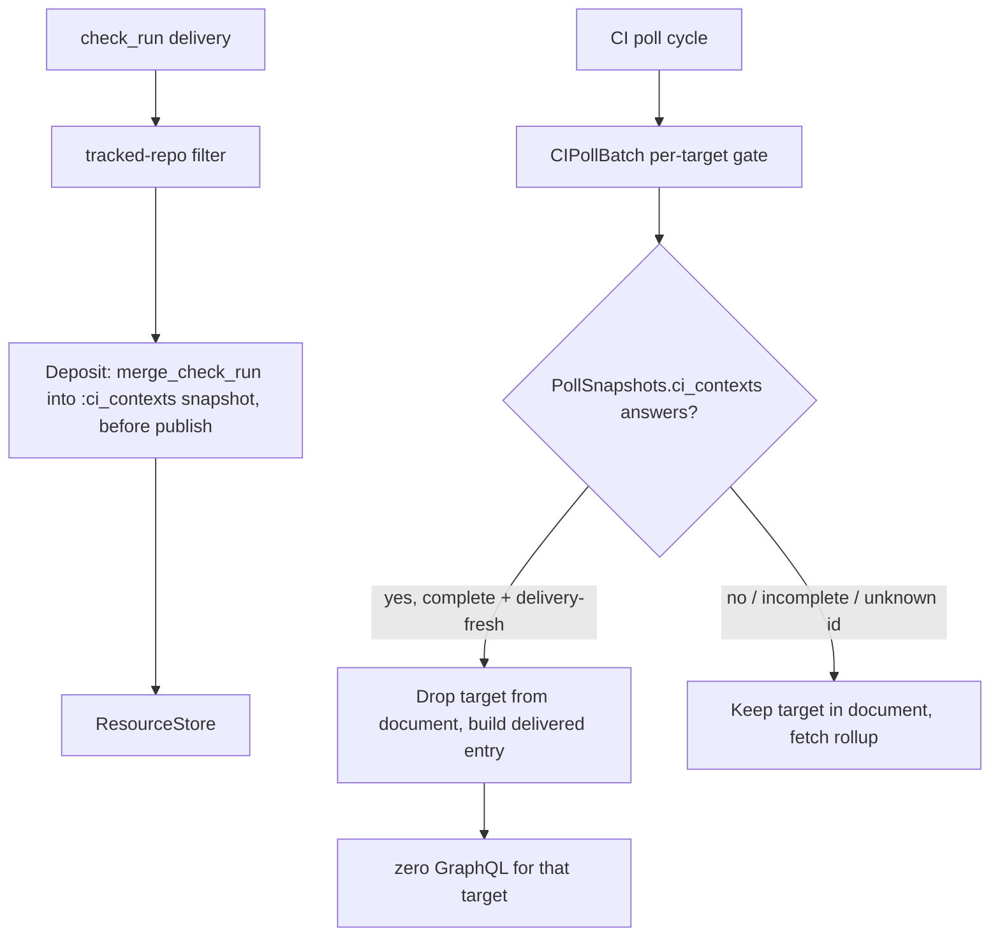

# Deliveries displace: deposit check_run state, skip polled targets a webhook already answered

## Goal Capsule

- **Objective:** A `check_run` webhook delivery advances a complete `:ci_contexts` snapshot in `Aiur.GitHub.ResourceStore` before publish (ordering guard and unknown-id invalidation at the snapshot level, `PollSnapshots.merge_check_run`), and the CI poll pipe consults that snapshot per target before building its GraphQL document, dropping a target the delivery already answered — so a cycle whose targets were all deposited issues zero GraphQL calls, per target (never per cycle), failing toward polling on an unmatched or unknown check-run id.
- **Authority:** GitHub issue #2310; the convergence epic #2265; the R10 boundary that a CI/merge verdict must never be served from a cache at any age.
- **Stop condition:** A poll never omits a target's query unless `PollSnapshots.ci_contexts` answers it — a complete, delivery-fresh, webhook-source snapshot the poll established and a delivery advanced; every other state fetches. The served (displaced) result is inert: it can never yield a verdict.
- **Tail ownership:** Scoped tests, a draft PR against `main`, and CI handoff. The one-hour ledger before/after measurement (`ci_poll_batch` points) is operator-run after deployment in a clean window (acceptance 5), not fabricated from local tests.

---

## Product Contract

### Summary

A webhook delivery currently buys only a widened poll interval. Its `check_run` body lands in `ResourceStore` via `Deposit` — but the deposit lands and, before #2310, nobody displaced the redundant read on its strength. The CI poller (`ci_poll_batch`) re-asks GitHub for the full rollup on the next tick even though the delivery just carried the freshest check-run state. This change makes the delivery a per-target displacement signal: the poll drops a target whose CI question a delivery already answered, and only that target — a target with no delivery keeps its full cadence.

### Problem Frame

`ResourceStore.@resource_types` is a closed set (`resource_store.ex`, enforced at `key/4`). The convergence half — the deposit + fail-toward-polling primitives — was merged as PR #2276 (`PollSnapshots`/`:ci_contexts`): a `check_run` delivery merges into a complete `:ci_contexts` snapshot for the same head before publish, with ordering guard (`check_run_marker`) and `incomplete` marking on an unknown/unmatched id, so `PollSnapshots.ci_contexts` answers only a complete + delivery-fresh + webhook-source snapshot. `CIPollBatch` consults it per target before building its document. What #2310 adds is the **displacement**: when that consult answers a target, drop the target from the document entirely (zero GraphQL when all targets are dropped), rather than merely narrowing the selection while still paying for a call.

PR #2276's original attempt was rejected for serving a webhook-fresh snapshot and answering `:unchanged` on an unmatched check-run id. The merged #2276 handles that at the snapshot level (`merge_check_run` marks `incomplete`, so `ci_contexts` returns `:miss` ⇒ fetch); #2310's displacement gate reuses exactly that — an unknown or unmatched id keeps the target polled.

### Requirements

- R1. `ResourceStore` carries a CI resource type (`:ci_contexts`, merged with #2276), keyed per target so the poll pipe, which holds the ticket before any lookup, can address it.
- R2. A `check_run` delivery advances the delivered run in that snapshot before publish, per ticket derived from the delivery's `pull_requests[].head.ref` via `TicketBranch`, with the ordering guard (`check_run_marker`) and unknown-id invalidation (`incomplete`) at the snapshot level (`PollSnapshots.merge_check_run`).
- R3. The CI poll consults `PollSnapshots.ci_contexts` per target before building its GraphQL document and drops a target only when it answers — a complete snapshot the poll established, advanced by a delivery on the same head, delivery-fresh.
- R4. An unmatched or unknown check-run id — a run the snapshot never saw (`merge_check_run` marks `incomplete`) — causes a fetch, not a serve: `ci_contexts` returns `:miss` and the target stays in the document. This is the #2276 failure, explicitly tested.
- R5. A CI poll cycle whose targets were all deposited since the last read issues zero GraphQL calls, proven by a test that counts transport calls.
- R6. A target with no delivery keeps its normal cadence in the same cycle: displacement is per target, not per cycle.
- R7. The served (displaced) result is inert: it carries no verdict and drives no transition. A delivery only skips the redundant read; the real verdict comes from the next non-displaced read. This is the strict reading of "a CI verdict must never be served from a cache at any age".
- R8. `ReadCache.Policy` keeps refusing verdict selections. This is a narrow ResourceStore displacement path, not a transport-cache exception. No poll result is ever answered from `read_cache`.

### Scope Boundaries

- No general caching or serving of GraphQL verdict documents.
- No claim that one delivered check run represents the full rollup — which is exactly why the served result is inert and can never be `:passed`.
- No new resource type, no deposit clause, and no lifecycle threading in this change: the `:ci_contexts` snapshot + `merge_check_run` deposit + ordering/unknown-id handling were merged with #2276; #2310 only turns the store consult into a displacement and makes the served entry inert through poller/lifecycle.
- Before/after `ci_poll_batch` points are measured in clean one-hour windows after deployment, not fabricated from restart-contaminated local runs.

---

## Planning Contract

### Key Technical Decisions

- KTD1. The read signal is `PollSnapshots.ci_contexts(repo_identity, target, opts)`: it answers `{:ok, %{"head_sha" => hs, "check_runs" => crs}}` only for a complete, delivery-fresh (`@delivery_fresh_ms`), webhook-source snapshot — exactly "deposited since the last read, head-consistent". No parallel `:check_run` type or bespoke reader is introduced (that was the pre-#2276 design; the merged snapshot supersedes it).
- KTD2. "Deposited since the last read" is the snapshot's own delivery-fresh window (`PollSnapshots` freshness bound), not a separate processed-mark: the deposit advances the snapshot, `ci_contexts` answers within the freshness window, and once the window ages out the poll fetches again and re-establishes the full rollup — the safety net a dropped delivery relies on.
- KTD3. Displacement = drop the target from the document entirely. A target `ci_contexts` answers is never in the query; a target it does not answer keeps its normal place. Zero GraphQL when every target is dropped.
- KTD4. The served entry is `%{delivered: true, head_sha:, check_runs:, pr_number:}` (`pr_number` from `DeliveredPullRequest`); `GithubCIPoller` passes it through inert and `CiLifecycle` treats it as a no-op — no state transition, no alert, no cache projection. The real verdict always comes from a real poll, the strict R10 boundary.
- KTD5. `CIPollBatch` still writes the polled baseline back (`PollSnapshots.put_ci_contexts`) so the next delivery has a complete snapshot to advance — the convergence half stays intact.

### High-Level Technical Design

### Implementation Units

1. `src/lib/aiur/github/ci_poll_batch.ex` — per-target displacement in `fetch/2`: split targets into displaced (`PollSnapshots.ci_contexts` answers) vs fetched; build the document from fetched targets only; merge inert `%{delivered: true}` entries into the result; zero GraphQL when all displaced.
2. `src/lib/aiur/events/github_ci_poller.ex` — `poll_batched_target` clause for `%{delivered: true}`: pass the served entry through inert (no decision, no failures), carrying `pr_number`, `head_sha`, `check_runs`.
3. `src/lib/aiur/orchestrator/ci_lifecycle.ex` — treat `delivered: true` results as a no-op: no transition, no alert, no cache projection.

(DEPOSIT + ordering + unknown-id invalidation + the `:ci_contexts` type are already on `main` via merged #2276; no changes needed there.)

### Test Scenarios

- `src/test/aiur/github/ci_poll_batch_test.exs`:
  - all targets answered (`put_ci_contexts` + `merge_check_run`, main's API) ⇒ `request_fun` never invoked (zero transport calls) and each displaced target's delivered entry is present.
  - one answered + one not ⇒ the answered target's alias is absent from the document, the other is present (per-target).
  - unknown check-run id (`merge_check_run` marks `incomplete`) ⇒ the target's alias is present (fetch, not serve) — the #2276 failure.
  - a poll-written snapshot ⇒ `ci_contexts` `:miss` ⇒ alias present (fetch).
  - an expired delivery snapshot ⇒ alias present (fetch).
- `src/test/aiur/events/github_ci_poller_test.exs`:
  - a delivered (displaced) entry yields an inert result: no decision, no failures.
- `src/test/aiur/orchestrator_ci_lifecycle_test.exs`:
  - a delivered (displaced) result is a no-op: no transition, no cache projection.

### Dependencies and Sequencing

- The displacement builds directly on `PollSnapshots.ci_contexts` (merged with #2276); no new resource type, deposit clause, or lifecycle threading.
- No external dependencies; no config, CLI, or env surface changes. `website/docs-app/apis/github.md` gets one paragraph on the CI displacement (dense-paragraph guard: ≤ 360 chars).
- Measurement (acceptance 5) is post-deploy and operator-run; documented in the PR, not gated on locally.

### Risks

- A delivered check run is one run, not the rollup. Mitigated by KTD4: the served result is inert, so it cannot misclassify — a pass, a failure, or any transition is never derived from a held body.
- The freshness window bounds displacement; after it ages out the poll re-reads and re-establishes the full rollup, so a missed delivery self-corrects on the normal cadence.
- `ci_contexts` answering requires a complete snapshot the poll wrote and a delivery advanced; a cold store, a poll-only snapshot, an expired snapshot, or an unknown id all keep the target polled — fail toward polling.
