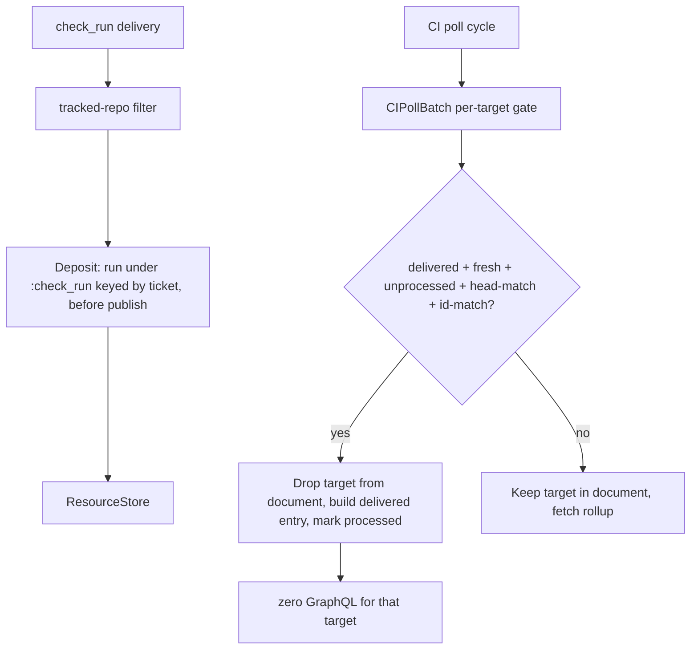

# Deliveries displace: deposit check_run state, skip polled targets a webhook already answered

## Goal Capsule

- **Objective:** A `check_run` webhook delivery deposits into `Aiur.GitHub.ResourceStore` under a new CI resource type before publish (same ordering guard as existing deposits), and the CI poll pipe consults that deposit per target before building its GraphQL document, dropping a target the delivery already answered — so a cycle whose targets were all deposited issues zero GraphQL calls, per target (never per cycle), failing toward polling on an unmatched or unknown check-run id.
- **Authority:** GitHub issue #2310; the convergence epic #2265; the R10 boundary that a CI/merge verdict must never be served from a cache at any age.
- **Stop condition:** A poll never omits a target's query unless the store holds a delivery-fresh, unprocessed, head-matched, id-matched `check_run` deposit; every other state fetches. The served (displaced) result is conservative: it can never yield `:passed`.
- **Tail ownership:** Scoped tests, a draft PR against `main`, and CI handoff. The one-hour ledger before/after measurement (`ci_poll_batch` points) is operator-run after deployment in a clean window (acceptance 5), not fabricated from local tests.

---

## Product Contract

### Summary

A webhook delivery currently buys only a widened poll interval. Its `check_run` body lands in `ResourceStore` via `Deposit` — but `Deposit.bodies/2` has no `check_run` clause, so nothing is deposited and nobody reads it. The CI poller (`ci_poll_batch`) re-asks GitHub for the full rollup on the next tick even though the delivery just carried the freshest check-run state. This change makes the delivery a per-target displacement signal: the poll drops a target whose CI question a delivery already answered, and only that target — a target with no delivery keeps its full cadence.

### Problem Frame

`ResourceStore.@resource_types` is a closed set with no CI type (`resource_store.ex`), enforced at `key/4`, so a `check_run` deposit needs a new type, not just a new `bodies` clause. `Deposit.deposit/3` runs before `Normalizer.normalize/3` and `publish_all/2` (`github_webhook.ex`), so a deposit lands before any consumer is woken. `ResourceStore.processed?/2`, `mark_processed/3` and `fetch/1` (returning `fetched_at_ms`) exist; what is missing is a poller consulting them before building its document.

PR #2276 attempted this and was rejected: it served a webhook-fresh snapshot and answered `:unchanged` on an unmatched check-run id, so a check run created after the baseline was invisible and the poller reported `{:passed, nil}` while a required check was pending. Any displacement here must fail toward polling: an unknown or unmatched id invalidates rather than serves.

### Requirements

- R1. `ResourceStore` gains a CI resource type (`:check_run`), keyed by `{owner, repo, ticket}` so the poll pipe, which holds the ticket before any lookup, can address it.
- R2. A `check_run` delivery deposits the delivered run under that type before publish, per ticket derived from the delivery's `pull_requests[].head.ref` via `TicketBranch`, with the same ordering guard as the existing deposits (`deposit_unless_older`).
- R3. The CI poll consults the deposit per target before building its GraphQL document and drops a target only when the deposit is delivered (`:webhook` source), fresh, unprocessed since the last poll read, head-matched to the target's last-polled head, and id-matched to a check run the target's last poll actually saw.
- R4. An unmatched or unknown check-run id — a new run the poll never saw, a different head, an already-consumed delivery, a poll-written entry — causes a fetch, not a serve. This is the #2276 failure, explicitly tested.
- R5. A CI poll cycle whose targets were all deposited since the last read issues zero GraphQL calls, proven by a test that counts transport calls.
- R6. A target with no delivery keeps its normal cadence in the same cycle: displacement is per target, not per cycle.
- R7. The served (displaced) result is inert: it carries no verdict and drives no transition. A delivery only skips the redundant read; the real verdict comes from the next non-displaced read. This is the strict reading of "a CI verdict must never be served from a cache at any age".
- R8. `ReadCache.Policy` keeps refusing verdict selections. This is a narrow ResourceStore displacement path, not a transport-cache exception. No poll result is ever answered from `read_cache`.

### Scope Boundaries

- No general caching or serving of GraphQL verdict documents.
- No claim that one delivered check run represents the full rollup — which is exactly why the served verdict can never be `:passed`.
- No deposit for `check_suite`/commit-status in this change: `check_suite` remains a reconcile-nudge event (it is already subscribed and normalizes to `{:reconcile, kind: :ci}`); the acceptance requires the `check_run` deposit. Writing a body no reader addresses would be a dead write (the same principle #2126 applied when it removed the old `check_run` deposit).
- Before/after `ci_poll_batch` points are measured in clean one-hour windows after deployment, not fabricated from restart-contaminated local runs.

---

## Planning Contract

### Key Technical Decisions

- KTD1. One new resource type `:check_run`, keyed `{:check_run, owner, repo, ticket}`. Body is the delivered check run (string-keyed JSON, round-trips unchanged). A `version` marker is computed as the run's `completed_at || started_at || id` so the deposit's ordering guard and the poll's processed-mark are per-run-state rather than identity-only.
- KTD2. "Deposited since the last poll read" is expressed with the store's own `processed?/2` + `mark_processed/3`: the deposit never marks processed; a poll that serves the delivery marks it processed at the run's marker, so exactly one poll cycle after a delivery displaces, and a later delivery (new marker) displaces again. A fixed freshness window alone would displace every cycle until it aged out, breaking the safety net.
- KTD3. The displacement gate additionally requires a fresh entry (`fetched_at_ms` within `@max_age_ms`) and `data_source == :webhook` — mirroring `DeliveredPullRequest`'s delivered-not-polled rule.
- KTD4. The head-match uses the target's last-polled head (`CiLifecycle` poll-cache projection `head_sha`); the id-match uses the target's last-polled check-run ids (new projection field `check_run_ids`). `CIPollBatch.normalize_check_run` gains `"id"` from GraphQL `databaseId`, matching the REST delivery's numeric `id` — the identity both pipes must agree on.
- KTD5. The served result is built in `CIPollBatch` (a `%{delivered: true, head_sha:, check_run:, pr_number:}` entry, `pr_number` from `DeliveredPullRequest`) and passed through `GithubCIPoller` as an inert result: no decision, no failures. `CiLifecycle` treats any `delivered: true` result as a no-op — no state transition, no alert, no cache projection. The real verdict always comes from a real poll, which is the strict R10 boundary (a CI verdict is never answered from a held body at any age).
- KTD6. When every target is displaced, `CIPollBatch` returns the delivered entries without invoking the transport at all — zero GraphQL calls.

### High-Level Technical Design

### Implementation Units

1. `src/lib/aiur/github/resource_store.ex` — add `:check_run` to `@resource_types`.
2. `src/lib/aiur/events/github_webhook/deposit.ex` — `bodies("check_run", payload)` clause: derive tickets from `check_run.pull_requests[].head.ref` (fall back to `check_suite.pull_requests`), deposit each under `:check_run` with `deposit_unless_older` and the run marker as version. Store the delivered run body.
3. `src/lib/aiur/github/delivered_check_run.ex` (new) — the poll pipe's read side: `signal_for_target(target, owner, repo, opts)` returns `{:ok, entry}` or `:miss`; enforces delivered, fresh, unprocessed, head-match, id-match; `mark_served/2` marks the entry processed at its marker.
4. `src/lib/aiur/github/ci_poll_batch.ex` — per-target gate in `fetch/2`: split targets into displaced vs fetched; build the document from fetched targets only; merge delivered entries into the result; add `databaseId` to the `... on CheckRun` selection and `"id"` to `normalize_check_run/1`.
5. `src/lib/aiur/events/github_ci_poller.ex` — `poll_batched_target` clause for `%{delivered: true}`: conservative decision (`:failed` only when the delivered run is terminal-failed, else `:pending`), carrying `pr_number`, `head_sha`, `check_run_ids`.
6. `src/lib/aiur/orchestrator/ci_lifecycle.ex` — thread `:ci_heads_by_target` and `:ci_check_run_ids_by_target` from the poll-cache projection into the batch opts; add `check_run_ids` to `ci_result_projection`.

### Test Scenarios

- `src/test/aiur/events/github_webhook/deposit_test.exs`:
  - a `check_run` delivery deposits the run under `:check_run` before publish (body carries id, head_sha, status, conclusion).
  - a delivery with no resolvable ticket deposits nothing.
  - an older marker cannot regress a newer held run.
- `src/test/aiur/github/delivered_check_run_test.exs` (new):
  - serves only delivered + fresh + unprocessed + head-match + id-match.
  - unknown id ⇒ `:miss` (fetch). Head mismatch ⇒ `:miss`. Already processed ⇒ `:miss`. Poll-written ⇒ `:miss`.
- `src/test/aiur/github/ci_poll_batch_test.exs`:
  - all targets deposited ⇒ `request_fun` never invoked (zero transport calls) and each displaced target's delivered entry is present.
  - one deposited + one not ⇒ the deposited target's alias is absent from the document, the other is present (per-target).
  - unknown check-run id ⇒ the target's alias is present (fetch, not serve).
  - head mismatch / processed / non-webhook source ⇒ alias present (fetch).
- `src/test/aiur/events/github_ci_poller_test.exs`:
  - a delivered (displaced) entry yields an inert result: no decision, no failures.
- `src/test/aiur/orchestrator_ci_lifecycle_test.exs`:
  - a delivered (displaced) result is a no-op: no transition, no cache projection.

### Dependencies and Sequencing

- `resource_store` type first, then `deposit`, then the reader, then the batch, then the poller, then the lifecycle wiring, then tests.
- No external dependencies; no config, CLI, or env surface changes (docs not required by the threshold — this is an internal cache/displacement change; verify no page is falsified).
- Measurement (acceptance 5) is post-deploy and operator-run; documented in the PR, not gated on locally.

### Risks

- A delivered check run is one run, not the rollup. Mitigated by KTD5: the served result is inert, so it cannot misclassify — a pass, a failure, or any transition is never derived from a held body.
- The id/head match depends on poll-cache state that survives only within a daemon generation. A restart clears it ⇒ fail toward polling (fetch), which is the safe direction.
- `normalize_check_run` id alignment (GraphQL `databaseId` vs REST `id`) must hold for the id-match to ever pass; the batch test pins the document shape.
