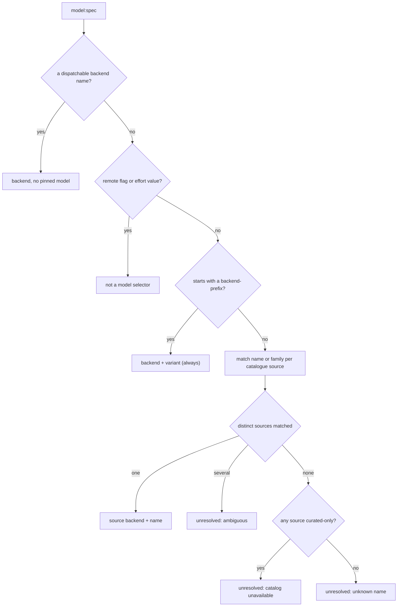

# Release-Proof Model Labels - Plan

## Goal Capsule

- **Objective:** A ticket's `model:` label can name any model or family the installed agent CLIs offer today — including ones released after this aiur build — without an aiur upgrade or new repo labels.
- **Product authority:** Kevin Weaver (operator), decisions taken in the 2026-09-24 brainstorm.
- **Open blockers:** none.
- **Execution profile:** one branch, one PR against `main`; units land as separate commits in U-ID order.
- **Stop conditions:** `make ci` from `src/` is green, every Acceptance Example has a passing test, and each new test fails with its production hunk reverted.
- **Product Contract preservation:** changed R4, R6, AE4 and the Summary during plan review — R4 keeps prefixed labels as exact pins (so existing version labels keep working, per the settled decision), R6 names the cooldown, AE4 names the cold-cache precondition, Summary names the remote flag. No scope change.

---

## Product Contract

### Summary

aiur stops treating its compiled model list as the authority on model names. A `model:` label resolves against what the installed CLIs report, so `model:opus`, `model:astra`, `model:claude-opus`, or a fully pinned version all work the day a model ships. `aiur init` seeds backend, effort, remote-flag, and current-family labels only.

### Problem Frame

New model names and versions ship every few weeks. Today each one needs two things before a ticket can use it: an aiur release that adds it to the registry list, and a new label created in every repo. For Codex, a family alias like `sol` is resolved to a concrete id (`gpt-5.6-sol`) only against the list compiled into aiur, so a new family (`astra`) reaches the Codex CLI as a bare, invalid name. A label without a backend prefix (`model:opus`) is ignored silently. `aiur init` also seeds version-specific labels (`model:claude-opus-4-8`) that go stale and clutter every repo.

aiur already has the pieces to ask the CLIs: `aiur init` probes each installed CLI's `model/list`, and the OpenAI-compatible backends keep a refreshed catalogue cache. Neither is used when a ticket is dispatched.

### Key Decisions

- **The installed CLI is the authority on model names.** aiur ships no model list that a user must wait on. Claude family aliases pass straight through to `claude --model`. For Codex, aiur resolves a family to the newest matching id in the Codex CLI's own live model list. (session-settled: user-directed — chosen over a config alias table and pure pass-through: no aiur release or config edit per model.)
- **A bare `model:<name>` label infers its backend.** aiur finds which installed backend offers the name or family (`opus` → claude, `astra` → codex). (session-settled: user-directed — chosen over keeping the backend prefix mandatory: the family name is what people type.)
- **An unresolvable label falls back, it does not block.** The ticket dispatches on its complexity routing as if the label were absent, and aiur raises a ticket-scoped warning naming the label, why it did not resolve, and which model ran. (session-settled: user-directed — chosen over hold-and-alert: keep work moving.)
- **`aiur init` seeds no version-specific labels.** It creates backend labels, effort labels, the remote flag, and the family names the installed CLIs report at init time. (session-settled: user-directed — chosen over seeding nothing model-specific.)
- **Existing version labels are left alone.** Labels already in repos keep working as exact pins; init does not delete them. (session-settled: user-directed — chosen over offering deletion.)
- **The warning is the ticket's attention alert, not a GitHub comment.** A fallback happens at session start, which repeats on every retry; a tracker comment per retry would spam the issue and spend API quota, while the ticket-scoped attention alert is deduplicated and already where the Executor looks.

### Requirements

**Label resolution**

- R1. A `model:` label resolves in this order: backend name (`model:claude`), remote flag (`model:remote`), effort (`model:high`), backend-prefixed model (`model:codex-astra`), then bare model or family name (`model:astra`).
- R2. A bare model or family name resolves to the one dispatchable backend whose known models contain that name or family. Known models are the registry list plus the backend CLI's discovered list.
- R3. A family name resolves to the newest model in that family. For Claude the family alias passes through to the CLI unchanged; for Codex it resolves to the newest matching id the Codex CLI reports.
- R4. A backend-prefixed label (`model:claude-opus-4-8`, `model:codex-astra`) always selects that backend; its variant resolves as a family when it names one and otherwise passes through as an exact pin.
- R5. A bare backend label (`model:claude`) keeps today's behaviour: the complexity-routing model when routing names that backend, otherwise the backend's own default.

**Discovery**

- R6. aiur learns each CLI backend's model list from the installed CLI and caches it, refreshing when stale. A bare label that misses the cache triggers one bounded refresh before the ticket dispatches, unless that backend was refreshed within the cooldown window.
- R7. Discovery never blocks the orchestrator and never fails dispatch; with no CLI or no answer, resolution uses the registry list alone.
- R8. `agent.backend_configs.<backend>.model_discovery: false` turns discovery off for a CLI backend, as it already does for OpenAI-compatible ones.

**Fallback**

- R9. A label that does not resolve is ignored for routing; the ticket runs on its complexity route.
- R10. The ticket gets one warning attention naming the label, the model that ran instead, and the cause: unknown name, name offered by more than one backend, or model list unavailable.

**Init**

- R11. `aiur init` seeds `model:<backend>` for each selected backend, the effort labels, `model:remote` when Claude is selected, and a bare `model:<family>` for each family the installed CLIs report.
- R12. `aiur init` seeds no version-specific model labels and deletes none that exist.

### Acceptance Examples

- AE1. **Covers R2, R3.** Given the Codex CLI lists `gpt-5.7-astra` and aiur's registry does not, when a ticket carries `model:astra`, then it dispatches to Codex with model `gpt-5.7-astra`.
- AE2. **Covers R2, R3.** Given the Claude CLI lists alias `opus`, when a ticket carries `model:opus`, then it dispatches to Claude with `--model opus`.
- AE3. **Covers R9, R10.** Given no installed CLI knows `opsu`, when a ticket carries `model:opsu` and `complexity:3`, then it runs the complexity-3 route and the ticket shows a warning naming `opsu`, the model that ran, and "unknown name".
- AE4. **Covers R6, R7, R10.** Given no Codex model list has ever been discovered and the Codex CLI cannot be started, when a ticket carries `model:astra`, then it runs its complexity route and the warning says the model list was unavailable.
- AE5. **Covers R2, R10.** Given two dispatchable backends both list `foo`, when a ticket carries `model:foo`, then it runs its complexity route and the warning names both backends and suggests the prefixed form.
- AE6. **Covers R11, R12.** Given a repo with `model:claude-opus-4-8`, when `aiur init` runs, then it offers `model:opus` and similar family labels, offers no version labels, and leaves `model:claude-opus-4-8` in place.

### Scope Boundaries

- Deleting or migrating version-specific labels already in repos.
- An aiur-published or remote model catalogue, and a config alias table.
- Resolving unknown models in `agent.routing` / `agent.priority` values; routing keeps today's pass-through-and-alert behaviour.
- A per-backend, per-complexity default model for bare backend labels.

### Dependencies / Assumptions

- Both supported CLIs answer `model/list` over their app-server (already used by `aiur init`).
- Codex model ids keep the `<prefix>-<version>[-<tier>]` shape the family grammar parses; an id outside that grammar can still be pinned but contributes no family.

### Sources / Research

- `src/lib/aiur/coding_agent.ex` — registry (`models`, `model_aliases: :derived | :native`), `resolve_model/2`, `override/1` label parsing.
- `src/lib/aiur/coding_agent/models.ex` — family grammar and `latest/2`.
- `src/lib/aiur/model_catalog.ex` — CLI `model/list` probe used by `aiur init`.
- `src/lib/aiur/model_discovery.ex` — cached, TTL-refreshed catalogue for OpenAI-compatible backends.
- `src/lib/aiur/agent_runner/session_lifecycle.ex` — `resolve_session_options/3` and `maybe_alert_unsupported_model/5`.
- `src/lib/aiur/init/labels.ex`, `src/lib/aiur/github/labels.ex` — init label stages.

---

## Planning Contract

### Key Technical Decisions

- KTD1. **Put CLI backends into the existing `Aiur.ModelDiscovery` cache rather than building a second catalogue.** `ModelDiscovery` already owns a TTL-refreshed, file-backed, test-injectable catalogue with a kill switch and a per-backend `model_discovery` opt-out; it only lacks a source for CLI backends. The CLI source is `Aiur.ModelCatalog.discover/2`, which `aiur init` already uses. Backends are keyed by their catalogue source (`model_catalog_backend`), so `claude-repl` reads `claude`'s entry. (Implements Key Decision "The installed CLI is the authority on model names", session-settled: user-directed — chosen over a config alias table and pure pass-through: no aiur release or config edit per model.)
- KTD2. **Label resolution is a pure module fed a catalogue reader.** A new `Aiur.CodingAgent.ModelLabel` maps a `model:` spec to `{:backend, b}`, `{:model, b, variant}`, `:not_a_selector`, or `{:unresolved, cause, detail}`. Its reader returns, per catalogue source, `{ids, :discovered | :curated_only}`, so the resolver can tell an unknown name from a missing catalogue without touching the file system.
- KTD3. **Hot paths only read the cache; refreshes happen in the agent runner.** `backend_for/1`, `model_for/1`, `resolve_model/2`, the dashboard, and status reports read the cache file and never schedule a refresh. The agent runner, once per session start, (a) lets its session backend's catalogue refresh when stale, and (b) when a bare label is unresolved for `:unknown_name` or `:catalog_unavailable`, refreshes the CLI catalogues concurrently under one 20-second deadline, then resolves again.
- KTD4. **Every refresh attempt is recorded, success or failure, and a 10-minute per-source cooldown gates the next one.** The cache entry gains a `last_attempt_at` that is merged into the entry rather than replacing its model list, so a failed probe never clobbers a good list and a missing CLI is probed at most once per window.
- KTD5. **A label that resolves after the runner refresh takes effect through the cache, not by mutating the issue.** Because every reader resolves from the refreshed cache, the runner, orchestrator, status report, and rate-limit fallback all see the same backend. A `selected_backend` already set by priority selection or rate-limit fallback still wins, as it does today, and the warning says the label will apply on the next dispatch. The runner does not switch to a backend whose remote-worker placement differs from the one the orchestrator scheduled.
- KTD6. **Bare-name lookup order is fixed:** backend name, remote flag, effort, backend-prefixed spec, then bare model or family. Backends sharing a catalogue source count as one candidate and resolve to the source backend (`opus` → `claude`, never ambiguous with `claude-repl`). A bare name offered by two or more distinct sources is `:ambiguous`. When no source matches and any dispatchable source has only curated ids, the cause is `:catalog_unavailable`, else `:unknown_name`. (Implements Key Decision "A bare `model:<name>` label infers its backend", session-settled: user-directed — chosen over keeping the backend prefix mandatory: the family name is what people type.)
- KTD7. **Backend-prefixed labels never fall back.** `model:<backend>-<variant>` selects the backend unconditionally, resolves the variant as a family when it names one, and otherwise passes it through as today; the existing `unsupported_model` attention keeps reporting unlisted variants. Fallback applies only to bare names. (Implements Key Decision "Existing version labels are left alone", session-settled: user-directed — chosen over offering deletion.)
- KTD8. **Family resolution for CLI-catalogued `:derived` backends reads registry ids plus discovered ids — never derived aliases.** `resolve_model/2` for Codex resolves against the registry `:models` list plus cached discovered ids, so `codex:sol` in routing follows a newly shipped `*-sol`. OpenAI-compatible `:derived` backends (OpenRouter) keep resolving against the registry list only, so their routing is unchanged.
- KTD9. **Claude families come from the Claude id grammar.** `Models.family/1` gains the existing `@claude_family` rule (`opus|sonnet|haiku`), so `opus-5-5` and `claude-opus-5-5` belong to `opus`. Aliases the CLI lists verbatim (`default`, `opusplan`) are resolvable as exact names but are not seeded as labels.
- KTD10. **Unresolved bare labels are dropped from routing and reported by a ticket-scoped attention,** `ticket.<id>.agent.attention.model_label_unresolved`, carrying the label, the cause, and the backend and model that ran. (Implements Key Decisions "An unresolvable label falls back, it does not block", session-settled: user-directed — chosen over hold-and-alert: keep work moving; and "The warning is the ticket's attention alert".)
- KTD11. **Init seeds family labels from discovery, with the registry as fallback.** Per selected backend: `model:<backend>`, then `model:<family>` for each family derived from the discovered ids (registry ids when discovery fails). Families equal to a backend name, an effort value, or `remote`, or outside the label charset, are skipped. The separate "newly discovered model labels" stage is removed; version-specific labels are never offered. (Implements the settled init decisions.)

### High-Level Technical Design

Label resolution (directional):



Session start (directional):

```mermaid
sequenceDiagram
  participant O as Orchestrator poll
  participant R as Agent runner start
  participant D as ModelDiscovery
  participant C as Installed CLIs
  O->>D: read cache (no refresh)
  O->>O: unresolved bare label is ignored; complexity route
  R->>D: bare label unresolved (unknown or unavailable)?
  alt sources off cooldown
    R->>D: refresh CLI sources concurrently, 20 s deadline
    D->>C: model/list
    C-->>D: ids or failure (attempt recorded either way)
  end
  R->>R: re-resolve from cache; label applies unless a selection already exists
  opt still unresolved or deferred
    R->>R: emit model_label_unresolved attention
  end
```

### Assumptions

- Reading `model-catalog.json` on hot paths is cheap; it only happens for tickets whose label is not a backend, flag, effort, or prefixed spec.
- The 10-minute cooldown and 20-second deadline are internal constants, not config keys.

### Scope Boundaries (planning)

#### Deferred to Follow-Up Work

- An in-memory memo of the discovery cache if the hot-path read shows up in profiles.
- Aborting and re-queueing a dispatch when a label resolves late to a backend with different remote-worker placement (today it warns and applies next dispatch).

---

## Implementation Units

### U1. Discover CLI backends' models into the shared cache

- **Goal:** `ModelDiscovery` refreshes and caches the model ids of CLI-catalogued backends through `model/list`, keyed by catalogue source, with attempt recording and a cooldown on every refresh path.
- **Requirements:** R6, R7, R8; KTD1, KTD4.
- **Dependencies:** none.
- **Files:** `src/lib/aiur/model_discovery.ex`; `src/test/aiur/model_discovery_test.exs`.
- **Approach:** A backend is discoverable when it has an OpenAI-compatible `models_endpoint` or a `model_catalog` extractor. Resolve every read and write through the catalogue source key. CLI refresh calls `ModelCatalog.discover/2` (injectable via a `:discover` opt, mirroring `:fetch`) and stores `%{"id" => id}` entries; pricing and drift reporting stay OpenAI-compatible-only. Record `last_attempt_at` on every attempt by merging into the entry. `stale?/2` stays TTL-based on `fetched_at`; a new `refresh_due?/2` also requires `last_attempt_at` older than the cooldown, and both the async path and a new bounded `refresh_now/2` use it. Add `catalogue/2` returning `{ids, :discovered | :curated_only}` for a source, and a `refresh: false` default for reads.
- **Patterns to follow:** existing `refresh/2`, `ingest/1`, `persist/5`, `guarded_refresh/2`.
- **Test scenarios:**
  - Covers AE1. A codex refresh with injected discover `["gpt-5.7-astra", "gpt-5.6-sol"]` stores both; `catalogue("codex")` returns them tagged `:discovered`.
  - `claude-repl` reads the entry a `claude` refresh wrote.
  - A failing discover after a good refresh keeps the good ids and records `last_attempt_at`.
  - Two refresh attempts within the cooldown call discover once, after a failure and after a success.
  - Reading the cache with default opts never starts a refresh task.
  - `model_discovery: false` makes `refresh_now` return disabled without calling discover.
  - An id containing `:` is still rejected at ingest.
- **Verification:** module tests pass; no test reaches a real CLI.

### U2. Pure `model:` label resolver and Claude family rule

- **Goal:** One pure function resolves a spec per KTD6/KTD7, and `Models.family/1` understands Claude ids.
- **Requirements:** R1–R4; KTD2, KTD6, KTD7, KTD9.
- **Dependencies:** none.
- **Files:** `src/lib/aiur/coding_agent/model_label.ex` (new); `src/lib/aiur/coding_agent/models.ex`; `src/test/aiur/coding_agent/model_label_test.exs` (new); `src/test/aiur/coding_agent/models_test.exs`.
- **Approach:** Inputs are the spec, the dispatchable backends, a `source_for(backend)` map, and a reader returning `{ids, provenance}` per source. A name matches a source when it is one of its ids or equals `Models.family/1` of one. Keep the longest-backend-first prefix rule from `resolve_known_backend_spec/2`.
- **Test scenarios:**
  - `claude` → backend; `claude-repl-opus` → `{:model, "claude-repl", "opus"}`.
  - `remote`, `remote-opus`, `high` → `:not_a_selector`.
  - Covers AE2. `opus` with claude and claude-repl both dispatchable, source claude ids `["opus", "opus-5-5"]` → `{:model, "claude", "opus"}`.
  - Covers AE1. `astra` with codex ids `["gpt-5.7-astra"]` → `{:model, "codex", "astra"}`.
  - `claude-opus-9-9` (unlisted) → `{:model, "claude", "opus-9-9"}` (prefixed never falls back).
  - Covers AE3. `opsu`, all sources discovered, no match → `:unknown_name`.
  - Covers AE5. `foo` in codex and an OpenAI-compatible source → `:ambiguous` naming both.
  - Covers AE4. `astra`, codex curated-only, no match → `:catalog_unavailable` naming codex.
  - `Models.family("claude-opus-5-5")` and `("opus-5-5")` → `"opus"`; existing Codex and slug families unchanged.
- **Verification:** resolver and models tests pass; every flowchart branch has a test.

### U3. Route issues through the resolver on cache-only reads

- **Goal:** `override_backend/1`, `model_for/1`, `backend_for/1` use U2 with a cache-only reader; `resolve_model/2` follows KTD8; a `model_label_status/2` reports an unresolved bare label and its cause.
- **Requirements:** R1–R5, R9; KTD3, KTD8.
- **Dependencies:** U1, U2.
- **Files:** `src/lib/aiur/coding_agent.ex`; `src/test/aiur/coding_agent_test.exs`.
- **Approach:** Replace the body of `override/1` with U2 over `ModelDiscovery.catalogue/2` (no refresh). Add `model_label_status(issue, opts)` for U4. In `resolve_model/2`, the `:derived` branch uses registry `:models` plus cached ids only when the backend has a CLI `model_catalog`. Tests write a `model-catalog.json` fixture beside a per-test workflow file and run `async: false`.
- **Test scenarios:**
  - `model:opus` + `complexity:3` routed to codex → backend claude, model `opus`.
  - `model:astra` with cached codex `gpt-5.7-astra` → backend codex; `resolve_model` gives `gpt-5.7-astra`.
  - `model:opsu` + `complexity:3` → complexity-3 route; status `:unknown_name`.
  - `resolve_model("codex", "sol")` → `gpt-5.6-sol` with an empty cache, and `gpt-5.7-sol` when the cache lists it.
  - `resolve_model("openrouter", "claude")` unchanged when the cache lists more OpenRouter slugs.
  - `model:claude` with routing naming claude keeps the routing model (R5 guard).
- **Verification:** `coding_agent_test.exs` passes; each new test fails with its hunk reverted.

### U4. Refresh on miss and warn on fallback at session start

- **Goal:** At session start the runner refreshes per KTD3/KTD4 and raises the `model_label_unresolved` attention when a bare label still does not apply.
- **Requirements:** R6, R9, R10; KTD3, KTD5, KTD10.
- **Dependencies:** U1, U3.
- **Files:** `src/lib/aiur/agent_runner.ex`; `src/lib/aiur/agent_runner/session_lifecycle.ex`; `src/test/aiur/agent_runner/session_lifecycle_test.exs`.
- **Approach:** In `AgentRunner.run`, before the first `backend_for/1`, call a session-lifecycle helper that checks `model_label_status/2` and, for `:unknown_name` / `:catalog_unavailable`, refreshes the CLI sources concurrently under one deadline (injectable refresh via opts). If the label now resolves but the issue already carries a `selected_backend`, or the resolved backend's remote placement differs, record it as deferred. In `run_session/5`, after the backend and model are final, emit the attention when the label is unresolved or deferred, with one sentence per cause.
- **Patterns to follow:** `maybe_alert_unsupported_model/5` (alert shape, severity `"warning"`).
- **Test scenarios:**
  - Covers AE3. `model:opsu` + `complexity:3`: session uses the complexity-3 backend/model; attention names `opsu`, "unknown name", and that model.
  - Covers AE4. Injected refresh fails: `model:astra` falls back; attention says the model list was unavailable.
  - Cold cache, injected refresh returns `gpt-5.7-astra`: `model:astra` runs codex/`gpt-5.7-astra`, no attention.
  - A priority-selected issue whose label resolves only after refresh keeps the selection and gets a "applies next dispatch" attention.
  - Covers AE5. Ambiguous `model:foo` falls back; attention lists the prefixed forms.
- **Verification:** runner tests pass; no test reaches a real CLI.

### U5. Seed backend, effort, remote, and family labels in `aiur init`

- **Goal:** init offers `model:<backend>`, family labels per KTD11, effort labels, and `model:remote`; no version labels; nothing deleted.
- **Requirements:** R11, R12; KTD11.
- **Dependencies:** U2 (Claude family rule).
- **Files:** `src/lib/aiur/init/labels.ex`; `src/lib/aiur/github/labels.ex`; `src/lib/aiur/coding_agent.ex` (`override_labels/1`); `src/test/aiur/init/labels_test.exs`; `src/test/aiur/coding_agent_test.exs` (existing `override_labels` assertions).
- **Approach:** Model stage = `model:<backend>` per selected backend plus families derived from `deps.discover_models` results (registry ids on failure), filtered per KTD11. Remove `maybe_offer_discovered_model_labels/5`. Effort and remote stages unchanged.
- **Test scenarios:**
  - Covers AE6. Claude discovery `["opus", "sonnet", "default", "opus-5-5"]`, codex discovery `["gpt-5.7-astra", "gpt-5.6-sol"]`: model stage offers `model:claude`, `model:codex`, `model:opus`, `model:sonnet`, `model:astra`, `model:sol` (not `model:default`); effort labels and `model:remote` are still offered; no offered label contains a digit.
  - Covers AE6. Existing `model:claude-opus-4-8` produces no delete call.
  - Discovery failing: families come from the registry (`model:opus`, `model:sol`, …).
  - A discovered family equal to `high` or `remote` is not offered.
- **Verification:** init label tests and updated `override_labels` tests pass.

### U6. Document model labels

- **Goal:** Operators can find how `model:` labels resolve, what init seeds, and what the fallback attention means.
- **Requirements:** R1–R12.
- **Dependencies:** U3, U4, U5.
- **Files:** `website/docs-app/concepts/ticket-lifecycle.md`; `website/docs-app/reference/configuration.md`.
- **Approach:** A short "Model labels" section; update the `model_discovery` row to cover CLI backends.
- **Test expectation:** none -- documentation only; no config key is added, so the config-docs check is unaffected.
- **Verification:** config-docs check passes.

---

## Verification Contract

| Gate | Command (from `src/`) | Applies to |
|---|---|---|
| Touched-module tests | `mise exec -- mix test test/aiur/model_discovery_test.exs test/aiur/coding_agent/model_label_test.exs test/aiur/coding_agent/models_test.exs test/aiur/coding_agent_test.exs test/aiur/agent_runner/session_lifecycle_test.exs test/aiur/init/labels_test.exs` | U1–U5 |
| Affected tests | `mise exec -- mix aiur.affected_tests`, then run the command it prints | U1–U5 |
| Compile, no new warnings | `mise exec -- mix compile --warnings-as-errors` | all |
| Format | `mise exec -- mix format --check-formatted` | all |
| Lint (specs + credo) | `mise exec -- mix lint` | all |
| Dialyzer | `mise exec -- mix dialyzer` | all |
| Full gate | `make ci` | final |
| Config docs | `python3 scripts/check-config-docs.py` (repo root) | U6 |
| Revert check | For each new test, revert its production hunk in the worktree, confirm the test fails, restore | U1–U5 |

## Definition of Done

- Every unit's verification holds and `make ci` passes on the branch.
- AE1–AE6 each have a named passing test.
- Each new test was shown to fail with its production hunk reverted; the PR body lists them.
- PR body starts with `Closes #<issue>`, follows `.github/pull_request_template.md`, and passes `mix pr_body.check`.
- No abandoned-attempt code remains in the diff.
