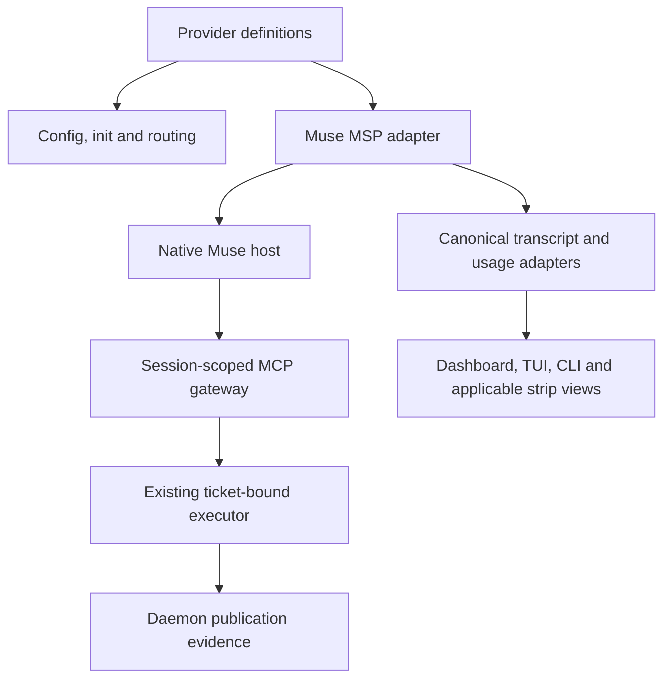

# Native Muse Integration - Plan

## Goal Capsule

Add native Muse CLI support as a precursor to the broader modular refactor.
The operator has installed and authenticated Muse and authorized implementation plus real Aiur CLI/TUI verification.
The confirmed scope includes configuration, initialization, routing, skills/tools, lifecycle/chat and usage displays.
The broader research remains paused until this feature is implemented and verified; its original deliverables remain required afterward.
No product-scope blockers remain; live protocol behavior and observation availability require verification.

## Product Contract

### Summary

Operators can choose Muse as a first-class Aiur backend and use the existing orchestration, conversation and usage surfaces.
Provider-specific behavior stays consolidated so adding another native agent does not require scattered conditionals.

### Problem Frame

Adding a native agent touches configuration, protocol messages, workspace tools, skills, lifecycle control, transcripts and accounting.
Treating each surface as a separate special case increases the maintenance burden the refactor is intended to remove.
The existing backend registry already supplies capabilities, skills, presentation and usage hooks, but this does not establish that every consumer is provider-neutral.

### Key Decisions

- **Native protocol first.** Prefer Muse's stdio MSP session host over an extra compatibility process; introduce an aiur-muse package only if a verified gap requires it. This direction was proposed with the wrapper tradeoff and approved by the user (session-settled: user-approved — chosen over an unconditional wrapper: avoid maintaining a second process boundary when the native protocol can satisfy the contract).
- **Consolidated provider integration.** Use explicit provider capabilities and owning adapters rather than Muse branches scattered across consumers.
- **Truthful usage.** Show account allowance/reset windows and per-agent token/context usage where authoritative observations exist. Missing, stale or unsupported observations must remain distinguishable from zero.
- **Real acceptance.** Automated tests complement a real authenticated Muse agent driven through Aiur's CLI and rendered TUI; logs or direct HTTP calls alone do not satisfy acceptance.

### Requirements

**Backend and operator workflows**

- R1. Muse is selectable through configuration, initialization and per-ticket/model routing without changing existing backend defaults.
- R2. Muse uses the installed CLI and existing login without copying credentials into configuration, transcripts or public artifacts.
- R3. Muse sessions support start, turn completion, follow-up messages, interruption, supported resume and cleanup through Aiur's normal lifecycle.
- R4. Aiur renders Muse assistant output, reasoning when exposed, tool activity and errors through the existing conversation surfaces.
- R5. Unsupported native capabilities are advertised and rejected explicitly rather than silently treated as successful.

**Agent access and modularity**

- R6. Muse receives the applicable bundled Aiur and CE skills plus repository instructions through its native workspace discovery.
- R7. Muse can invoke the shared Aiur coordination tools with the same ticket/run authority and delivery evidence as existing agents.
- R8. Provider-owned configuration, protocol, transcript, tool provisioning and usage behavior has explicit module ownership and shared contracts.
- R9. New modules target 200 lines or fewer and must stay within the user's 500-line hard file limit; decomposition follows responsibilities, not arbitrary line slicing.
- R10. Existing backend behavior remains compatible, with shared extraction characterized before changes.

**Usage and presentation**

- R11. Muse account usage bars show current-window and weekly consumption, reset times and observation age on the dashboard and applicable shared provider surfaces.
- R12. Per-agent token totals and context occupancy preserve Muse's counting semantics and avoid replay or child-session double counting.
- R13. Unavailable, stale and over-quota observations are represented honestly; a percentage above 100 remains visible even if the visual bar saturates.
- R14. Usage is attributed to the correct provider/account/session and must not survive an account change as apparently current data for another identity.
- R15. Costs are shown only when pricing and usage evidence support them; unknown cost is not zero.

**Delivery and verification**

- R16. Update existing configuration, CLI/setup, skills and provider documentation wherever Muse support changes documented behavior.
- R17. Verify a real authenticated Muse agent in Aiur's foreground CLI/TUI, including visible output, a real Aiur tool call, follow-up delivery, lifecycle control and observed usage or explicit unavailability.
- R18. Verify usage rendering in the actual dashboard and test existing providers for regressions.
- R19. After Muse acceptance, resume the full refactor research and incorporate integration findings plus the 500-line limit/200-line preference into the package plan.

### Actors and Flows

- A1. The Executor selects the backend, operates the run and inspects usage.
- A2. The Muse agent performs ticket work with scoped tools and workspace skills.
- F1. Initialize or configure Muse, route a ticket, launch the agent and open its chat pane. Covers R1–R7.
- F2. Send a follow-up through the TUI, observe delivery, interrupt when supported and resume with continuity. Covers R3–R5.
- F3. Inspect provider usage and agent context, including unavailable/stale data and reset times. Covers R11–R15.

### Acceptance Examples

- AE1. Given an installed authenticated Muse, selecting it launches a real agent that reads an installed Aiur skill and executes an authorized Aiur tool; both output and tool activity appear in its chat pane. Covers R1–R7, R17.
- AE2. Given no usage observation, the Muse surface shows unavailable rather than a full allowance or zero consumption. Once data arrives, it shows the provider values and their age. Covers R11–R14.
- AE3. Given a replayed token event after resume, accounting does not count the same completion twice. Child usage is not implicitly added again to parent totals. Covers R12.
- AE4. Given an account change or failed probe, retained usage cannot appear as fresh evidence for the new identity. Covers R14.
- AE5. Given an unsupported capability, configuration or control reports its limitation instead of claiming an action occurred. Covers R5.

### Scope Boundaries

Implement the shared extractions necessary for native Muse integration and characterize affected existing providers.
The complete repository-wide decomposition remains the subsequent refactor; it is not a prerequisite for the first Muse agent.
Do not promise provider-specific features Muse does not expose or invent a cost conversion for subscription usage.

### Dependencies and Planning Questions

- Installed baseline: Muse Code 1.4.0 (1.4.0-R4302.1). Its offline stable schema was exported directly during intake; declarations are not live proof.
- Determine native MSP framing, initialization, cursors, command receipts and terminal events before choosing transport reuse.
- Determine how the shared Aiur tool catalog reaches native Muse MCP without expanding agent authority.
- Confirm native workspace skill discovery and instructions precedence.
- Determine account identity evidence for usage invalidation; lack of account binding must not be papered over.
- Inventory all existing usage surfaces and preserve their freshness/unknown semantics.
- The full refactor plan must define line counting and generated/vendor treatment; no file-size exception has been authorized.

### Sources

- `src/lib/aiur/coding_agent.ex`: backend capabilities, skill locations, provider presentation, usage adapters and meter probes.
- `src/lib/aiur/config/schema/agent.ex`: explicit provider embeds and backend configuration storage.
- `src/lib/aiur/agent_skills.ex`: registry-driven workspace installation.
- `src/lib/aiur/codex/frames.ex`: current thread-oriented RPC and dynamic tool injection.
- `src/lib/aiur/provider_meter_projection.ex`: shared dashboard, TUI and CLI usage projection.
- `AGENTS.md`: real foreground CLI/TUI verification and mutation-test requirements.
- Installed `muse --help`, `muse serve --help`, `muse schema generate-json-schema`: native session host and exact installed protocol schema. Private schema cross-references and local account data are excluded.

## Planning Contract

Product Contract unchanged.
Plan depth: Deep, because this crosses external protocol, scoped tool authority, lifecycle and accounting boundaries.
Implementation is local to the isolated feature checkout; do not rebuild, restart or overwrite another Executor's release or live run.

### Key Technical Decisions

- KTD1. **Own MSP in Muse modules.** Implement a native adapter with small protocol, session, turn, transcript and usage modules. Preserve the approved native-first decision from the Product Contract. Reuse JSON-line framing, environment scrubbing and process ownership where their contracts match; do not route MSP through Codex-specific thread/interrupt frames.
- KTD2. **Extract provider descriptors.** Move concrete backend metadata into provider-owned definitions behind the existing registry API, retaining existing defaults. Central consumers iterate descriptors and capabilities; they do not branch on Muse. Validate third-provider behavior with a synthetic backend fixture.
- KTD3. **Use a scoped Streamable HTTP MCP gateway.** A daemon-owned loopback listener independent of dashboard enablement exposes only initialization, tool listing and calls to the shared catalog. A revocable random capability binds one session and active attempt to its existing ToolExecutor closure; clients cannot select arbitrary ticket, run or executor identity. Inject the capability through native session MCP headers, never command arguments or workspace config, and redact it from Aiur diagnostics. Verify Muse's handling of headers in session records, traces and failure output before accepting this transport; unintended durable exposure is a blocking incompatibility. No global Supervisor token or GitHub credential is forwarded.
- KTD4. **Keep MCP and MSP ownership separate.** MSP owns Muse session/turn control; the generic MCP gateway owns Aiur tool delivery. This avoids a mandatory standalone aiur-muse package. If installed Muse cannot support the required scoped native MCP contract, stop and document the precise incompatibility before choosing a shim.
- KTD5. **Bind tools at turn execution.** Create the session gateway route before native MCP startup, expose catalog availability, and attach the active runner-built executor before submitting a turn. Calls outside an active authorized attempt fail closed. Revoke routes on startup failure, stop, owner death and restart; resume receives a new capability.
- KTD6. **Separate receipts from outcomes.** JSON-RPC request IDs may remain integers; they are distinct from UUIDv7 command IDs. Use UUIDv7 command IDs, native session IDs, turn IDs and observed view cursors. A write or accepted request is not delivery, interruption or completion. Interpret typed terminal facts, not free-text reason strings; unsupported terminal variants remain unknown errors.
- KTD7. **Preserve invocation evidence without invented identity.** The gateway assigns a stable invocation identity within its session/request namespace and uses ToolExecutor.execute with it. Duplicate same-session request IDs return the recorded result; conflicting arguments reject. Do not automatically retry a mutating call after an ambiguous disconnect. Native item IDs correlate display only unless runtime evidence proves a safe join to the MCP request.
- KTD8. **Use canonical usage events once.** Count session/tokenUsage using its counted-once prompt/total and cumulative semantics. Do not add overlapping turn/completed totals; parent counters exclude child usage. Cursor replay and counter epochs remain distinct from account generation.
- KTD9. **Keep allowance and context separate.** Translate usage/read and usage/changed into current/weekly meter windows with the provider observation stamp. Translate context usage independently; absent capacity has no invented percentage. Do not infer dollar cost, model or account identity from subscription tier.
- KTD10. **Fence observations conservatively.** Bind observations to the native host lifecycle and trusted account evidence when available. Retire on host/credential lifecycle changes; never join unknown account identity across hosts. If identity cannot be established, label the observation's scope as unverified and do not use it as admission evidence or carry it into another session as fresh.
- KTD11. **Make supported capabilities explicit.** Use registry-derived native model discovery and effort validation. Initially advertise local execution only unless remote MCP reachability and authority are verified. Claude Remote Control remains unsupported for Muse; reject that combination through capabilities.
- KTD12. **Native skills, existing authority.** Install to Muse's .agents/skills convention and make workspace trust a documented launch setting. Keep approval/sandbox policy explicit and scoped to the agent workspace; do not silently add a blanket bypass merely to avoid a blocked prompt.

### Structure and Dependencies

Before substantial U1–U3 implementation, run a minimal real-host protocol spike with a temporary loopback MCP endpoint: verify the sessionMcp grant, header authentication, one benign tool call and native credential retention. Discover and use the operator-selected Sol model without silently substituting another model. Record any incompatibility before building the full gateway.
U1 establishes provider ownership; U2 and U3 then establish the gateway and native lifecycle.
U4 integrates conversation delivery, U5 integrates usage, and U6 covers public surfaces/docs.
U7 verifies the integrated feature.
Parallel work is allowed only after shared interfaces are fixed; U2/U3 must agree on session ownership and U3/U5 on observation identity.

### Risks and Execution-Time Questions

- MCP request IDs and native item IDs may not be directly joinable. Prove the bridge's own audit identity and replay behavior before broad feature wiring; never claim durable exactly-once native calls without evidence.
- Resume remains unadvertised until restart/rejoin succeeds; failures must distinguish a clean start from continuation. Late or duplicate acknowledgements and pending messages at pause/exit need explicit reconciliation.
- MSP schema declarations are not runtime acceptance. Validate capability grants, MCP startup, session persistence, model availability and skills against the installed binary.
- An account usage read may return no observation on a fresh host. The zero-model-call probe must report unavailable; a paid turn is never launched solely to fill a meter.
- Trusted account continuity may be unavailable. The conservative host-scoped policy in KTD10 is mandatory; live usage acceptance must report that limitation if present.
- Approval or user-input requests can occur during a turn. Reuse the existing policy where it has an equivalent native choice; otherwise pause visibly for the Executor, without auto-approving.
- Shared large modules need focused extraction before new responsibilities are added. New production/test files must remain <=500 physical lines and should target <=200; final repository-wide enforcement belongs to the full refactor.
- These are execution validation gates, not permission to drop tool parity, replace real acceptance with fixtures, or declare the feature complete with unresolved live failures.

## Implementation Units

### U1. Consolidate provider ownership

- **Goal / trace:** Registry-based onboarding without Muse branches in shared consumers. R1, R8–R10; F1; KTD2.
- **Files:** src/lib/aiur/coding_agent.ex; src/lib/aiur/coding_agent/backend.ex; new src/lib/aiur/coding_agent/registry.ex and provider definition modules; src/lib/aiur/config/schema/agent.ex; src/lib/aiur/config.ex; src/lib/aiur/model_discovery.ex.
- **Approach:** Extract existing descriptors and provider-owned configuration access while preserving compatibility. Add Muse configuration through the existing backend-config path; avoid a third parallel embedded schema when registry-owned validation can serve it.
- **Tests:** src/test/aiur/coding_agent_test.exs; src/test/aiur/config/priority_routes_test.exs; src/test/aiur/model_discovery_test.exs; new src/test/aiur/coding_agent/registry_test.exs.
- **Scenarios:** Existing defaults unchanged; configured Muse selected; unknown backend/model/effort rejects; synthetic third backend reaches registry, configuration and routing consumers without provider-specific edits. U6 verifies initialization and presentation consumers.
- **Evidence:** Characterize existing behavior first; verify targeted tests and exact renamed-reference census.

### U2. Expose scoped coordination tools

- **Goal / trace:** Real Muse access to all applicable Aiur tools without expanded authority. R2, R7–R10; AE1, AE5; KTD3–KTD7.
- **Files:** Extract neutral catalog facade from src/lib/aiur/codex/dynamic_tool.ex; new src/lib/aiur/agent_tools/mcp/ modules for listener, protocol, capabilities and calls; src/lib/aiur/agent_runner/tool_executor.ex; src/lib/aiur/agent_runner/turn_loop.ex; application supervision.
- **Approach:** Keep existing tool schemas/handlers authoritative. Serve a narrow MCP endpoint on loopback with Origin validation, bounded requests, explicit version negotiation and per-session capability authentication. Bind execution to the runner closure only during the authorized attempt.
- **Tests:** New src/test/aiur/agent_tools/mcp/protocol_test.exs and authority_test.exs; existing src/test/aiur/agent_runner/tool_executor_test.exs; src/test/aiur/app_server/tool_call_ledger_test.exs.
- **Scenarios:** Initialize/list/call round trip; real handler execution; bad/missing/expired capability; cross-ticket request; inactive turn; duplicate/conflicting request ID; concurrent sessions; revocation while a call is pending; listener survives one malformed client; daemon-owned publication outcome joins the invocation.
- **Evidence:** Prove the failure cases before implementing access. Verify the gateway works with the dashboard disabled. Exercise startup/failure diagnostics with a marker session capability and assert its absence from logs, errors, traces and durable records; confirm revocation denies further calls. Inspect real Muse retention separately from fixture redaction. No session capability or broad bearer credential in workspace files or diagnostic evidence.

### U3. Implement native session lifecycle

- **Goal / trace:** Launch and control real native Muse sessions. R2–R5, R8–R10; F1/F2; AE5; KTD1, KTD5–KTD7, KTD11–KTD12.
- **Files:** New src/lib/aiur/muse/coding_agent.ex, protocol.ex, session.ex, turn.ex and transport.ex; provider definition; targeted shared transport extraction from src/lib/aiur/app_server/adapter.ex and rpc.ex only where reusable; src/lib/aiur/agent_runner/session_lifecycle.ex.
- **Approach:** Initialize MSP and require the sessionMcp grant; configure the scoped gateway on start/resume; generate UUIDv7 commands; model/catalog selection and reasoning effort use native methods. Own the port and descendants through existing teardown primitives.
- **Tests:** New src/test/aiur/muse/protocol_test.exs, session_test.exs and lifecycle_test.exs; existing src/test/aiur/app_server/adapter_test.exs and src/test/aiur/codex/coding_agent_test.exs.
- **Scenarios:** Valid handshake; missing grant; unsupported version; split/large/invalid frames; startup failure cleans gateway/processes; successful turn; typed failure; quota pause; approval/user-input pause; disconnect; interrupt accepted then terminal; resume miss clean-start distinction; cleanup does not claim proof from an ignored result.
- **Evidence:** Protocol fixtures plus controlled real native host smoke; no schema-only capability claim.

### U4. Integrate skills and conversation delivery

- **Goal / trace:** The Executor sees Muse work and can converse through Aiur. R3–R7, R17; F1/F2; AE1; KTD6–KTD7, KTD12.
- **Files:** New src/lib/aiur/muse/transcript.ex, operator_delivery.ex and view.ex; src/lib/aiur/agent_skills.ex; affected canonical conversation/event adapters and model presentation.
- **Tests:** New src/test/aiur/muse/transcript_test.exs, operator_delivery_test.exs and skills_test.exs; src/test/aiur/agent_skills_test.exs; affected opencode/chat projection tests.
- **Scenarios:** Assistant/tool/reasoning/error frames; unknown item kind; empty text; replayed item appears once; view gap triggers recovery or explicit incomplete state; queued mid-turn message; stale-turn steer rejection; resume with cursor; missing/trust-disabled skills reported; native skill discovery and use.
- **Evidence:** Test message lifecycle receipts separately from delivery/terminal facts. Real acceptance must type through pane 0.1 and inspect rendered content.
- **Approval recovery:** Show the pending native request, its reason and permitted actions in the conversation. Bind any Executor response to that request and active attempt; reject stale responses and show the native outcome. If no equivalent response control exists, show how to cancel the turn and restart with an explicitly chosen supported policy. Never present ordinary chat text as an approval. Verify both resolution and cancellation paths.

### U5. Integrate usage observations

- **Goal / trace:** Truthful provider allowance and agent accounting. R11–R15; F3; AE2–AE4; KTD8–KTD10.
- **Files:** New src/lib/aiur/muse/usage.ex, meter_probe.ex and account_context.ex; new src/lib/aiur/usage/headless/muse/ adapters; registry usage hooks; existing meter snapshot/projection and usage ledger boundaries.
- **Tests:** New src/test/aiur/muse/usage_test.exs and meter_probe_test.exs; src/test/aiur/provider_meter_projection_test.exs; src/test/aiur/provider_meter_projection_integration_test.exs; affected usage ledger tests.
- **Scenarios:** Current/weekly observations; over-100 value; absent usage; stale clock/observation; malformed values; probe timeout; no model call on probe; account/host replacement; duplicate/reordered cursor; cumulative reset epoch; overlapping terminal usage; child scope; unknown model/pricing; context with missing capacity.
- **Evidence:** Use real native observations for final acceptance and fixtures for exact boundary/mutation checks. Preserve counted-once totals and native timestamps.

### U6. Complete onboarding and usage surfaces

- **Goal / trace:** Muse appears consistently wherever backend selection and usage are exposed. R1, R11–R16, R18; F1/F3; AE2, AE4.
- **Files:** src/lib/aiur/init/agent_cli.ex, questions.ex, templates.ex and labels.ex; .aiur/examples/; src/examples/workflows/; provider presentation assets; src/lib/aiur_web/operator_control_center/provider_meters_presenter.ex; dashboard provider meter components; src/lib/aiur/agent_list/renderer/chrome.ex and model.ex; src/lib/aiur/agent_control_cli.ex; src/lib/aiur_web/streamdeck_strip.ex; website/docs-app/reference/configuration.md, reference/cli.md, skills.md and affected guide/concepts pages.
- **Approach:** Render from shared descriptors and canonical projections. Put Muse alongside existing provider cards; current/weekly rows carry value, reset and age. Agent context stays a separate agent measurement. Replace touched two-provider assumptions with generic descriptors.
- **Tests:** src/test/aiur/init/agent_cli_test.exs, templates_test.exs and labels_test.exs; src/test/aiur_web/operator_control_center/provider_meters_presenter_test.exs; src/test/aiur_web/components/operator_control_center/provider_meters_test.exs; src/test/aiur/agent_list/renderer/chrome_usage_test.exs; src/test/aiur_web/streamdeck_strip_test.exs.
- **Scenarios:** Muse installed/missing; generated config round trip; preserved default provider; mobile/narrow layouts; stale/unavailable labels and ages actually rendered; populated but account-unverified observations explicitly labeled in dashboard, TUI and CLI; >100 text with bounded bar; inaccessible credential details absent; descriptor-only provider renders in each applicable surface.
- **Evidence:** Real browser inspection plus foreground TUI captures. No new standalone dashboard or copied renderer.

### U7. Verify acceptance and preserve refactor continuity

- **Goal / trace:** Demonstrate the requested operator journey and resume the original research scope. R9–R10, R16–R19; AE1–AE5.
- **Files:** Focused test additions above; documentation evidence in the PR; the research branch's continuation and refactor constraints after acceptance.
- **Approach:** Use the canonical Executor-root foreground wrapper-tmux recipe in AGENTS.md with an isolated instance/config and authorized sandbox ticket. Never bypass the issue-workspace --test guard or reset a different run's tickets. Select a running Muse row, open chat, type a follow-up, inspect output and tools, exercise interruption/resume, then inspect dashboard usage and clean up owned resources.
- **Scenarios:** Real authenticated model responds; follows an installed skill; executes a benign Aiur tool; visible tool/assistant output; queued follow-up delivered once; interrupt outcome visible; restart continuity and replay correct; usage observed or explicitly unavailable; existing Codex/Claude behavior unchanged.
- **Evidence:** Record exact release/commit, Muse version, instance identity, sanitized rendered captures and test/mutation commands. Real usage absence is a stated limitation, not proof of a working populated bar.
- **Completion:** Only after these gates pass, feed integration lessons into the full refactor research and its hard 500-line/preferred 200-line decomposition plan.

### Post-Muse research completion

The current Executor owns continuation through completion, not merely a handoff. Resume the research branch's `CONTINUATION.md` inventory: finish duplication/concept/constants and runtime coverage, skeptical high-priority finding checks, feature challenges, claim reconciliation, privacy/provenance and corrected reports/problem map/requirements/questions. Deliver the full CE brainstorm/plan/deepening package, including cohesive decomposition to the hard 500-line limit, preferred 200-line modules and automated enforcement, then perform the final coverage and evidence audit. Muse acceptance completes the precursor only; the broader user request is complete when those research deliverables and the full refactor plan are finished. Production implementation of that entire refactor is outside this precursor's implementation scope.

## Verification Contract

| Gate | Required evidence |
|---|---|
| Source and build isolation | Feature worktree and release stamp match; no live shared-release mutation |
| Unit/integration | Exact targeted test files for U1–U6, with real internal chain and external-boundary fixtures |
| New-test sensitivity | Every new regression fails with its production hunk reverted in a clean isolated worktree; exact command recorded |
| Unknown-state sensitivity | Replace unavailable with zero/default and prove tests fail; verify rendered age |
| Compile/format/lint | Repository build entry and make ci from src; lint includes specs.check and credo; no new compiler warnings |
| Coverage/static analysis | Required coverage gate, regression checks and dialyzer; no new ignore_modules entries |
| Configuration docs | scripts/check-config-docs.py and scripts/test-check-config-docs.sh |
| File sizes | Count physical lines including blanks/comments; every new source/test module <=500 and review >200 for cohesion |
| CLI/TUI/browser | U7 real foreground run, typed interaction, pane captures and actual dashboard inspection |
| Privacy | No credentials, private account data or raw private schema links in commits, fixtures or PR evidence |

## Definition of Done

- R1–R18 have implementation and matching evidence; no lifecycle/tool/usage capability is advertised solely because it exists in the schema.
- New provider integration is consolidated, existing providers pass regression checks, and all new files obey the file-size constraint.
- Native Muse works through the real authenticated CLI/TUI journey, and usage rendering is verified with live availability accurately reported.
- Documentation ships with the behavior; security, replay, cleanup, unavailable-state and mutation checks pass.
- Independent code review findings are resolved before publication; use the repository PR template and include verification limitations precisely.
- R19 requires the Executor to complete the post-Muse research deliverables and full refactor plan above, preserving the original audit inventory until every item is resolved.

### Planning References

Historical plans are design evidence, not proof of current behavior: docs/plans/1439-registry-driven-backends.md; docs/plans/2026-06-24-010-fix-claude-dynamic-tool-injection-plan.md; docs/plans/2026-07-13-003-feat-provider-account-generation-plan.md; docs/plans/2026-07-15-002-feat-canonical-usage-ledger-plan.md.
MCP gateway framing, version negotiation and transport protections follow the [official MCP transport specification](https://modelcontextprotocol.io/specification/2025-06-18/basic/transports); the installed Muse schema determines its actual supported transport and capability surface.
