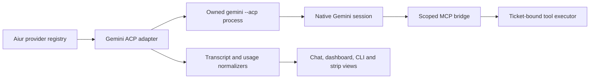

# Native Gemini CLI backend

## Goal Capsule

Add Gemini CLI as a native, locally executed Aiur coding backend at the level of the Muse integration. Release gate satisfied: Aiur `v0.0.7` is published for all four npm packages and installable through npm, Yarn, Bun and pnpm (the latter with its build script explicitly allowed). Implement from current `main` in an isolated worktree, preserve existing backend defaults, and finish with real foreground Aiur CLI/TUI acceptance. The Executor continues refactor research while a background worker implements this ticket.

---

## Product Contract

### Summary

An operator who has installed and authenticated Gemini CLI can choose `gemini` for a ticket or workflow. The agent performs ticket work using Aiur's scoped coordination tools; its text, tool activity, approvals, follow-ups, lifecycle and truthful usage state appear on the same operator surfaces as other native backends.

### Problem Frame

Muse's MSP protocol and Gemini's ACP protocol are distinct. A superficial command switch would lose persistent conversation control, approval decisions or tool authority. Native support must use Gemini's own supported interface and fit Aiur's provider contracts without spreading Gemini-specific branches across generic consumers.

### Key Decisions

- **Native ACP control.** Use Gemini CLI's documented `--acp` JSON-RPC stdio mode for a persistent local session. `-p --output-format stream-json` is a one-shot automation path and does not provide the same bidirectional control contract. This is a planning choice grounded in the installed CLI and official documentation; recheck the protocol against the installed implementation before coding.
- **Supported ACP authentication.** Use a Gemini Developer API key or supported Vertex key through ACP authentication. The installed CLI rejects cached personal OAuth in ACP mode; Aiur must not store, print or copy credentials into a ticket workspace.
- **Explicit approvals.** Surface Gemini's request choices to the Executor and send only the selected answer. No blanket `yolo` default or silent approval of mutating tools.
- **Evidence-based usage.** Show token/model/context or allowance data only when a native, attributable observation supports it. Unknown is distinct from zero; no assumed subscription price or account identity.

### Requirements

- R1. `gemini` is selectable in config, initialization, routing, model labels and examples without changing other backends' default behavior.
- R2. Launch the installed Gemini CLI under Aiur's owned local process, authenticate through its supported ACP key method and reject missing credentials, personal OAuth or an incompatible CLI with an actionable error.
- R3. Start and resume native sessions by a persisted session ID; deliver initial and queued operator prompts exactly once or report uncertain delivery. Support cancellation and stop with typed outcomes.
- R4. Normalize streamed assistant text, reasoning when exposed, tool calls/results, errors and approvals into Aiur's transcript and rendered chat without inventing unsupported events.
- R5. Send a TUI-typed follow-up through the live session and show its delivery or failure, including pause/stop races.
- R6. Expose Aiur's existing ticket-scoped tools to Gemini using the approved MCP bridge with revocable, attempt-scoped authority; no global supervisor token or GitHub credential enters Gemini configuration or logs.
- R7. Honor Gemini's workspace instructions/skills and folder-trust policy explicitly. Never enable workspace trust or broad tool approval merely to avoid a prompt.
- R8. Discover/select models using the CLI/ACP's observed catalog; reject unsupported effort or model controls honestly.
- R9. Present usage and quota only from trustworthy native observations, preserving freshness, account scope and unavailable states across CLI/dashboard/TUI/strip surfaces.
- R10. Unsupported remote worker, Claude Remote Control, provider control or meter capabilities are declared and rejected rather than simulated.
- R11. Update all existing docs falsified by this backend in the same PR: configuration, quick start, TUI approvals, operating modes, skills and usage as applicable.
- R12. Tests cover native protocol framing, lifecycle, authorization, rendering and failures. New regression tests fail with the production behavior reverted; real foreground TUI acceptance remains mandatory.

### Actors and Flows

- A1. Executor configures Gemini and handles approval requests in Aiur's chat pane.
- A2. Gemini agent works one ticket with an active scoped tool executor.
- F1. Configure or route `gemini`, launch a ticket, stream a native turn and inspect transcript/tool activity.
- F2. Send an Executor message through the TUI, approve or reject a native tool request, pause/cancel and resume the exact session.
- F3. Inspect usage as observed, stale or unavailable on the relevant shared surfaces.

### Acceptance Examples

- AE1. With an authenticated Gemini CLI, a real ticket opens a chat pane, renders streamed agent prose and a tool call, and successfully invokes an authorized Aiur tool.
- AE2. An Executor follow-up typed into that pane reaches the same native session once and the response renders there.
- AE3. A native mutating-tool request displays choices; selecting denial prevents execution, while an approved request produces a confirmed result.
- AE4. After process restart, a valid stored session ID resumes the same conversation; an auth or transport failure remains an error, not a silent fresh session. A confirmed missing session may start cleanly under the documented policy.
- AE5. Missing usage or an unverified account displays unavailable/unknown with its observation age where an age exists, never a fabricated 0 or fresh allowance.
- AE6. Remote execution or unsupported native control is rejected with an explicit reason.

### Scope Boundaries

Local Gemini CLI only in this ticket. No Gemini API-only backend, replacement of Muse, arbitrary ACP compatibility framework, inferred dollar pricing, or repository-wide refactor. Keep shared extractions limited to the contract this integration proves necessary. New files should target 200 lines and remain within the 500-line refactor limit.

### Sources

- [Gemini CLI ACP developer guide](https://geminicli.com/docs/cli/acp-mode/): stdio JSON-RPC, initialize, authenticate, new/load session, prompt, cancel, modes, model control and MCP extension.
- [Gemini CLI CLI reference](https://geminicli.com/docs/cli/cli-reference/): `--acp`, `--model`, `--approval-mode`, `--resume` and output formats.
- [Gemini CLI authentication](https://geminicli.com/docs/get-started/authentication/): API key and Vertex alternatives. The installed 0.61.0 ACP route rejects cached personal OAuth with a migration error.
- Local probe on 2026-09-29: installed `gemini --version` is `0.61.0`; `gemini --acp` answered ACP protocol version 1, reported `loadSession: true`, image/audio/embedded prompt capabilities and HTTP/SSE MCP capabilities. This proves initialization only, not authenticated turns or usage.
- `docs/plans/2026-09-27-001-feat-native-muse-plan.md` and `src/lib/aiur/muse/`: provider boundary, lifecycle, MCP bridge, transcript and usage precedent.
- `AGENTS.md`: same-PR docs, mutation-test discipline and real CLI/TUI acceptance.

---

## Planning Contract

### Key Technical Decisions

- KTD1. **ACP belongs to Gemini adapter modules.** Reuse owned process launch, JSON-line framing and shared provider callbacks where contracts match. Keep ACP request IDs, session notifications and permission requests distinct from Muse MSP frames.
- KTD2. **Handshake before dispatch.** Parse initialize capabilities and auth methods from the installed CLI. Validate required session/load/prompt and MCP support, then establish a session; refuse incompatible versions with an explicit message. No static model list is authoritative.
- KTD3. **Use the existing scoped MCP gateway.** Bind a fresh revocable capability to the active ticket attempt and tool executor. Confirm Gemini ACP's MCP connection semantics and whether HTTP transport plus secret header is retained safely before production use. Fail closed if the bridge cannot be scoped safely.
- KTD4. **Persist a native session handle.** Save Gemini's returned session ID only after confirmed creation/load. On restart, try exact-ID load and maintain delivery evidence across uncertain process exits. Never substitute `--resume latest`, which could join another ticket.
- KTD5. **Treat approval as a request-response.** Map ACP permission request and choices to the existing approval UI/queue; send a response only after an Executor decision and correlate it to the request. Timeout, disconnect, unknown choice and duplicate reply are explicit outcomes.
- KTD6. **Preserve evidence limits.** Decode ACP usage only from verified fields and counting semantics. A recent upstream Gemini ACP issue reports token data solely under `_meta.quota` rather than standard `usage`/`usage_update`; treat that as an investigation cue, not a stable contract. Do not promise account allowance windows absent a native source.
- KTD7. **Provider descriptor owns variance.** Register Gemini adapter, model discovery, config validator, capabilities, presentation and usage adapter in its provider entry. Only extract common code where Muse and Gemini actually share the same contract.

### High-Level Technical Design

Directional integration path:

Directional session sequence: launch owned process → initialize and validate capabilities → establish scoped MCP route → new/load exact native session → attach active tool executor → prompt and consume session updates plus permission requests → record terminal result and session handle → revoke route and stop process on owner exit. Receipt, turn outcome and tool publication are separate evidence.

Directional state model: `starting → ready → turning ↔ awaiting_permission → ready`; `turning → cancelling → ready` on confirmed cancellation; any state may enter `failed`, and owner stop enters `stopped`. An unconfirmed response after a transport loss is `outcome_unknown`, never assumed retryable.

### Assumptions and Execution-Time Probes

- Gemini 0.61.0 local initialization succeeds. Cached personal OAuth failed at `session/new` with ACP error `-32000`; an API or Vertex key was unavailable on this host, so authenticated creation, load, permission flow, tool bridge, model listing and usage remain live acceptance gates. Fixture tests exercise the protocol, but only a supported local credential can complete the foreground TUI proof.
- ACP method names and payloads must be taken from the current official protocol and observed CLI, not inferred from Muse. Standard ACP names may differ from the guide's shorthand.
- Local Gemini auth state is user-controlled. Tests may use a fixture server; live acceptance needs an authenticated CLI and must report the exact blocker if unavailable.
- GEMINI.md and Gemini skill directories differ from Muse's `.agents/skills`; confirm installed discovery and trust behavior before writing init templates.
- Remote worker and Remote Control remain unsupported unless an independently verified transport and authority path is added in a separate ticket.

---

## Implementation Units

### U1. Protocol probe and provider registration

**Requirements:** R1, R2, R8, R10; KTD1, KTD2, KTD7.

Inspect official/current ACP wire plus the local CLI in an isolated fixture workspace. Register a Gemini provider descriptor, config schema, init/workflow selection and actionable installed/auth diagnostics. Keep model catalog dynamic and effort capabilities evidence-based.

**Test scenarios:** valid Gemini selection reaches its adapter; absent binary/incompatible handshake reports precise error; an unsupported effort/model/remote mode cannot dispatch; existing Codex/Claude/Muse defaults stay intact.

### U2. Session, turn and recovery

**Requirements:** R3, R5; KTD1, KTD4.

Implement bounded ACP transport, exact-ID session new/load, prompt streaming, cancellation and owned-process cleanup. Correlate request responses and session updates; distinguish pre-admission failure, accepted work and uncertain outcome. Apply Aiur queue/pause semantics without duplicate follow-up delivery.

**Test scenarios:** new turn and same-session follow-up; valid exact-ID load after restart; missing ID versus auth failure; duplicate/late frames; process exit before and after admission; pause/stop race; cancel accepted but unconfirmed.

### U3. Scoped tools and approvals

**Requirements:** R4, R6, R7; KTD3, KTD5.

Connect Gemini's native MCP configuration to Aiur's existing scoped gateway; ensure route revocation and no credential persistence. Normalize tool calls/results and permission requests; expose choices through Aiur's approval workflow and return the selected choice.

**Test scenarios:** authorized tool reaches only its bound ticket; cross-ticket/revoked/expired attempt fails closed; approval, denial, timeout, disconnect and duplicate response; no implicit approval; displayed tool result matches publication evidence.

### U4. Transcript, models and usage

**Requirements:** R4, R8, R9; KTD6, KTD7.

Normalize ACP content and tool updates to the shared transcript. Probe model catalog and actual selected model; attribute only evidenced usage with source/version and observation age. Render unknown/stale states and avoid double counting resumed or repeated cumulative records.

**Test scenarios:** streamed text and tool activity render once; unavailable reasoning stays absent; unknown usage is not zero; stale observation shows age; repeated usage update does not add twice; account/host change cannot reuse fresh-looking prior data.

### U5. Docs, regression and real acceptance

**Requirements:** R1–R12; AE1–AE6.

Update existing docs, examples and skills guidance. Run focused and full relevant tests, required lint/type gates and mutation checks for new behavior. Independently review the PR, fix findings, then drive real `scripts/aiurdev --test` foreground via tmux: open Gemini chat, inspect rendered prose/tool activity, type a follow-up and decide a native approval. Inspect actual dashboard usage state; report any unsupported field plainly.

**Test scenarios:** schema/docs consistency; setup examples resolve; TUI message roundtrip and approval choice; stopped/restarted session behavior; existing providers and shared presentation unchanged.

---

## Verification Contract

- Author uses an isolated worktree and follows `AGENTS.md`. No reset/stash of the shared checkout or interference with the Executor's live Aiur/Khala sessions.
- Run the repo's relevant Elixir unit/integration, JavaScript/browser and required CI gates. Add fixture-level ACP tests around actual observed frames.
- For each new behavior regression, remove its corresponding production hunk in the isolated worktree, confirm the test fails, restore, and confirm pass; document exact commands/results in the PR.
- Perform a real authenticated foreground Aiur CLI/TUI run, navigate to the Gemini chat pane, type an Executor message, inspect rendered assistant/tool/approval output and make an approval decision. Logs/API alone do not satisfy manual acceptance.
- Independent code review and CI precede merge. The Executor handles final PR review and landing.

## Definition of Done

- `gemini` can be selected, dispatched and controlled through a native ACP session with scoped Aiur tools and honest unsupported-state handling.
- All acceptance examples are demonstrated or a verified external blocker is reported before claiming completion; no silent downgrade of tool, approval or resume requirements.
- Same-PR docs, meaningful regressions, real foreground TUI evidence and required CI are attached to the PR; the Executor reviews and merges the final change.
