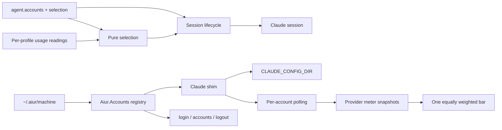

# Multi-Claude Accounts - Plan

## Goal Capsule

- **Objective:** Run Claude Code workers under any configured set of logged-in profiles, selected by usage balance or configured priority.
- **Authority:** The acceptance contract in issue #3028 is authoritative; existing single-account behavior remains the compatibility baseline.
- **Execution profile:** Implement the reusable account registry and selection component, then the Claude shim and its CLI, dispatch, metering, and dashboard integrations.
- **Stop conditions:** Keep the default `~/.claude` profile untouched; never read, log, print, or serialize OAuth tokens; unsupported harnesses report the missing multi-account capability without crashing.
- **Tail ownership:** Complete documentation, scoped verification, adversarial review, draft PR, and CI handoff under the repository ticket workflow.

---

## Product Contract

### Summary

Claude workers can use multiple logged-in accounts on one machine. The operator configures available accounts and a selection policy, while a reusable account component owns registry, profile, usage, and selection behavior independently of orchestration internals.

### Problem Frame

Claude usage limits bind workers to one login, even when the operator has access to several accounts with independent plans. Account switching must remain safe across dispatch, metering, and status surfaces while preserving current installations without configuration changes.

### Requirements

- R1. An `Aiur.Accounts` component owns account registry, profile paths, profile setup, selection, and read APIs without depending on orchestration modules.
- R2. `Aiur.Accounts.Shim` defines harness-specific profile environment, shared paths, never-shared paths, login command, identity, and usage behavior; Claude is the only shim in this change.
- R3. Machine-local account definitions live in `~/.aiur/machine`; non-default profiles live under `~/.aiur/accounts/<harness>/<name>/`; the existing `~/.claude` is adopted as `default` untouched and receives no config-dir environment override.
- R4. `agent.accounts` configures ordered account names per harness and `agent.account_selection` selects `balance` or `priority`, defaulting to `balance`; absent or empty accounts preserve single-account behavior.
- R5. Selection is a pure `select(harness, candidates, mode, usage)` function. Balance chooses the lowest weekly utilization with five-hour usage as tie-break; priority uses list order; at-limit accounts are skipped; unknown usage sorts last and retains its reason.
- R6. A ticket’s selected account is fixed for its session, passed through the shim environment, and exposed in running status, agents output, and the units row.
- R7. CLI commands support interactive Claude login/adoption, redacted account listing in text and JSON with freshness, and registry logout with optional profile purge; `default` cannot be removed.
- R8. Usage polling covers each configured account, with meter snapshots keyed by `{harness, account}`.
- R9. The dashboard continues to show one provider bar: for multiple accounts, show an `×N` chip and one equally sized colored segment per account, filled by that account's weekly utilization, with per-account percentages in label and tooltip; the total utilization is the plain average and the single-account render remains unchanged.
- R10. Harnesses without a shim report `accounts.multi` unavailable rather than raising.
- R11. Tests prove selection modes and edge cases, exact Claude environment, safe profile linking, dispatch environment, multi-account and legacy dashboard rendering, and token-free JSON output; each new behavior test fails when its production hunk is reverted.
- R12. Configuration, CLI, and setup-guide documentation ship with the implementation, including sidebar discoverability.

### Actors

- The machine operator creates and removes profiles, reviews account identity and usage, and sets repository-specific account order and selection mode.
- The dispatcher chooses an account for a ticket; workers inherit only the selected Claude profile directory.

### Acceptance Examples

- **Default migration:** With no `agent.accounts` value, a Claude worker launches with the same environment and identity used before this feature.
- **Balanced selection:** Given weekly percentages 70 and 20, choose the second account; when weekly percentages tie, choose the lower five-hour percentage.
- **Unavailable usage:** Given one account at its limit and another with unknown usage, exclude the limited account and select the unknown account only as a last resort while preserving its reason.
- **Profile linking:** Shared configuration and memory paths link into a new profile; `.claude.json`, transcripts, sessions, history, remote settings, and policy limits do not.
- **Secret boundary:** `aiur accounts --json` reports account identity and usage but contains no OAuth token material.

### Scope Boundaries

#### Deferred to Follow-Up Work

- Adding multi-account shims for other harnesses is issue #3030.
- Handing a running session to another account at a usage limit is issue #3029.

#### Outside this Change

- Changing Claude’s own OAuth login, credential refresh, or usage endpoint protocols.
- Copying or linking any Claude state listed as never shared.

---

## Planning Contract

### Key Technical Decisions

- KTD1. Keep registry policy and profile lifecycle in `Aiur.Accounts`, with Claude filesystem and credential behavior behind `Aiur.Accounts.Shim.Claude`; this lets later harnesses add one shim without orchestration changes.
- KTD2. Make account selection a pure function over candidate names and supplied usage readings. Unknown/unavailable readings remain explicit and rank last, so missing data cannot look like zero utilization.
- KTD3. Preserve the existing default profile as an implicit `default` account and omit `CLAUDE_CONFIG_DIR` for it. This avoids changing macOS Keychain identity, whose key depends on the exact environment string.
- KTD4. Add account identity to meter snapshots and events instead of overloading provider account generation. This preserves existing generation fencing while distinguishing concurrently polled profiles.
- KTD5. Keep the `Aiur.Accounts` API independent of `Aiur.Orchestrator`; session lifecycle asks the component to select and resolve environment, then records the result as execution metadata.
- KTD6. Login remains interactive and logout only edits the registry unless `--purge` is explicit. The operator retains control of credentials and profile deletion.
- KTD7. Represent account identity explicitly in provider meter snapshots and use a separate account-aware projection alongside the existing generation-fenced store. This avoids changing the established `{provider, backend, generation}` identity contract for current account-bound adapter events while allowing usage-API observations to be keyed by `{harness, account}`.
- KTD8. Treat each configured account as equal capacity in the combined usage bar. This product decision avoids fabricating plan capacities because the Claude usage endpoint supplies percentages only. Each segment has equal width, and total utilization is the plain average of weekly percentages.

### High-Level Technical Design

The registry resolves named profiles and default-profile adoption. The shim owns linked paths, profile environment, identity parsing, and account-specific usage credentials. Dispatch selects once before session startup and attaches the selected name to session execution metadata. Polling publishes independently keyed account snapshots; the presenter combines account snapshots into one equally weighted card while retaining each account’s freshness and percentage.

### Implementation Constraints

- Read Claude identity fields from `.claude.json` only; do not read or print credential token fields.
- Use an account-specific cache key for `Aiur.Claude.UsageApi`; its existing process cache is currently global.
- Shared paths are exactly `settings.json`, `CLAUDE.md`, `plugins`, `skills`, and `projects/*/memory`; never link `.claude.json`, project transcripts, `sessions/`, `history.jsonl`, `remote-settings.json`, or `policy-limits.json`.
- Do not import from or merge `origin/research/refactor-findings`; the issue’s three named research contracts are not present there at the stated paths or elsewhere on that ref.
- Public Elixir functions require adjacent `@spec`; keep modules cohesive and under repository size guidance.

### System-Wide Impact

- Account names are safe non-secret identifiers; tokens and raw credential files remain in profile storage and must never cross CLI, logs, status JSON, dashboard, or meter-event payloads.
- Per-account snapshots must retain independent observed time, freshness, failure reason, and identity. A failed account poll must not replace another profile’s reading.
- The agent environment builder strips inherited provider credentials, so the selected Claude config-dir override must be applied after sanitization and only for the selected non-default account.
- The units dashboard currently receives provider-family snapshots. It will need an account collection shape at the presenter boundary while keeping the existing single-account shape visually and semantically identical. Claude seat tier remains descriptive metadata and does not affect segment sizing.

### Risks & Dependencies

- Claude profile layout or `.claude.json` identity fields can change. Keep parsing tolerant and report unavailable identity fields without exposing unrecognized credential values.
- Hard links may not be possible across filesystems. Profile setup should use the repository’s safe path-linking conventions and report a structured error instead of silently omitting a path.
- The usage endpoint throttles requests. Preserve the configured polling interval and isolate caches per profile so concurrent account polling does not share readings or trigger duplicate requests for one account.
- The three research artifacts linked from the issue were absent at the named locations in `origin/research/refactor-findings`; implementation follows the issue’s binding design contract and current source seams.

### Decision

- The Executor selected equal capacity: every account receives an equal-width segment and total utilization is the plain average of account weekly percentages. Balance-mode dispatch still selects the account with the lowest weekly utilization.

### Sources / Research

- `src/lib/aiur/claude/usage_api.ex` owns OAuth usage fetching and currently has one global persistent-term cache.
- `src/lib/aiur/agent_runner/session_lifecycle.ex` resolves backend options before session start and reports runtime session execution metadata to the orchestrator.
- `src/lib/aiur/agent_environment.ex` builds a scrubbed environment; `src/lib/aiur/app_server/adapter.ex` applies per-session `env:` values after that baseline.
- `src/lib/aiur/orchestrator/state.ex` retains session execution metadata, and `src/lib/aiur/orchestrator/status_report.ex` projects it into status rows.
- `src/lib/aiur/provider_meters/input.ex`, `src/lib/aiur/provider_meters/store.ex`, and `src/lib/aiur/provider_meter_projection.ex` own validated snapshots, retention, and consumer projection.
- `src/lib/aiur_web/operator_control_center/provider_meters_presenter.ex` and `src/lib/aiur_web/components/operator_control_center/provider_meters.ex` own provider meter view data and rendering.
- Institutional learnings and `CONCEPTS.md` are absent from this checkout; the authored conventions in `AGENTS.md` and `CONTRIBUTING.md` govern.

---

## Implementation Units

### U1. Account registry, shim contract, and selection policy

- **Goal:** Add the reusable account registry and pure selection API, including the Claude shim’s machine-local profile setup and account identity/usage adapters.
- **Requirements:** R1, R2, R3, R5, R10.
- **Files:** `src/lib/aiur/accounts/`, `src/lib/aiur/accounts/shims/claude.ex`, `src/lib/aiur/claude/usage_api.ex`, account-focused tests under `src/test/aiur/accounts/`.
- **Approach:** Follow `Aiur.Alerts` path/config patterns for `~/.aiur/machine`; inject filesystem and usage boundaries for tests. Adopt `~/.claude` lazily as `default`; never create a copied or linked default profile.
- **Test Scenarios:** Priority chooses the first eligible candidate; balance compares weekly usage and then five-hour usage; at-limit candidates are skipped; unknown and unavailable readings rank last and keep their reason; Claude profile env has the exact path without a trailing slash; linking includes memory and excludes every never-shared path; default identity resolves from `~/.claude.json`; usage caches remain isolated by account.
- **Verification:** New tests execute in the configured ExUnit test tree and fail with their guarded production change reverted.

### U2. Configuration and command-line account lifecycle

- **Goal:** Add account configuration fields and shared-launcher commands for login, redacted account listing, and logout.
- **Requirements:** R3, R4, R7, R10, R12.
- **Files:** `src/lib/aiur/config/schema/agent.ex`, `src/lib/aiur/cli.ex`, relevant new account CLI module/tests, `packaging/npm/aiur-cli/libexec/aiur-engine.sh`, `website/docs-app/reference/configuration.md`, `website/docs-app/reference/cli.md`, `website/docs-app/guide/`, `website/docs-app/.vitepress/config.ts`, `.aiur/examples/*.example`, `src/examples/workflows/`.
- **Approach:** Keep command dispatch in the release CLI so `aiur` and `aiurdev` share behavior. Make login idempotent, reject trailing slash in `--dir`, link before invoking the interactive shim command, and make logout registry-only unless `--purge` is supplied.
- **Test Scenarios:** Config accepts and rejects valid/invalid harness lists and modes; login creates a profile or adopts an existing directory; repeated login is safe; trailing slash is rejected; account listing JSON includes identity, usage, and freshness without tokens; logout protects `default`, retains files without `--purge`, and removes only the chosen profile with purge.
- **Verification:** CLI parser/unit tests cover success and boundary/error cases; docs include both config keys, each command, setup steps, and sidebar entry.

### U3. Dispatch account pinning and running status

- **Goal:** Select a configured Claude account once for each session, pass its shim environment into worker startup, and retain account name in execution status.
- **Requirements:** R4, R5, R6, R10.
- **Files:** `src/lib/aiur/agent_runner/session_lifecycle.ex`, `src/lib/aiur/claude/coding_agent.ex`, `src/lib/aiur/app_server/adapter.ex` only if needed, `src/lib/aiur/orchestrator/state.ex`, `src/lib/aiur/orchestrator/status_report.ex`, unit-row presenter/renderer modules, directly related tests.
- **Approach:** Resolve the account after backend selection and before the provider process starts. Add its name and shim environment to session options; apply profile env after the standard scrubbed environment. Extend execution metadata instead of re-reading repository config on status requests.
- **Test Scenarios:** A non-default Claude dispatch passes exact `CLAUDE_CONFIG_DIR`; default dispatch does not set it; account name reported by session appears unchanged in running status, agents output, and units row; config changes after launch do not change an active session’s account; non-Claude backends remain on current behavior.
- **Verification:** Focused session lifecycle, adapter env, orchestrator status, and units presentation tests run through the configured selector.

### U4. Per-account usage polling and provider meter storage

- **Goal:** Poll every configured account and retain independent meter observations keyed by harness and account.
- **Requirements:** R2, R8, R10.
- **Files:** `src/lib/aiur/claude/usage_api.ex`, `src/lib/aiur/provider_meter_probe.ex`, `src/lib/aiur/provider_meter_refresh.ex`, `src/lib/aiur/provider_meters/input.ex`, `src/lib/aiur/provider_meters/store.ex`, `src/lib/aiur/provider_meters/events.ex`, `src/lib/aiur/provider_meter_projection.ex`, `src/lib/aiur/provider_meter_snapshot.ex`, related tests.
- **Approach:** Keep the existing provider/backend/generation identity and event path intact for session-bound observations. Add an account-aware usage projection for shim-polled account readings, keyed by `{harness, account}`. Use account-specific cache keys and request credentials from the shim. Retain per-account freshness and failure data through projection boundaries.
- **Test Scenarios:** Every configured profile is probed; one account’s rate limit or authentication error does not overwrite another’s reading; account keys remain distinct for equal harness and different names; repeated reads for one profile share its cache while another profile does not; unsupported shim returns unavailable outcome.
- **Verification:** Focused probe, store, projection, and refresh tests cover account isolation and existing single-account snapshots.

### U5. Multi-account provider meter presentation and documentation completion

- **Goal:** Render multiple account readings as one equally weighted provider bar and preserve the current one-account render.
- **Requirements:** R9, R12.
- **Files:** `src/lib/aiur_web/operator_control_center/provider_meters_presenter.ex`, `src/lib/aiur_web/components/operator_control_center/provider_meters.ex`, corresponding component and browser tests, and any guide assets needed for setup documentation.
- **Approach:** Build one equally sized segment per account, filled to its weekly utilization, and show the `×N` chip. Compute total utilization as the plain average of weekly percentages. List account names, percentages, and freshness in accessible labels and tooltip. Keep the legacy one-account DOM/classes/labels unchanged.
- **Test Scenarios:** Two accounts render two equal-width colored segments and `×2`; aggregate percentage is the plain average; accessible text lists each percentage and freshness; an unavailable account remains unknown rather than being rendered as zero; one-account HTML matches the existing render contract.
- **Verification:** Presenter and component tests plus relevant browser test prove rendered behavior; the config docs checker covers both new dotted keys.

---

## Verification Contract

- `cd src && mise exec -- mix compile --warnings-as-errors`
- `cd src && mise exec -- mix format --check-formatted`
- From repository root, run `cd src && mise exec -- mix aiur.affected_tests` and execute each printed test command with `--max-cases 4`.
- Run `python3 scripts/check-config-docs.py` and the documented targeted website/docs checks if available.
- Run the repository CI gate only at its prescribed PR stage; do not run Credo locally.
- Run mutation checks for each added behavior test in an isolated, unique worktree; before each revert assert clean status and intended HEAD, revert only the guarded production hunk, confirm the test fails, restore it, then confirm the test passes.
- Agent workspace manual `scripts/aiurdev --test` is prohibited; use focused CLI/parser and runtime boundary tests, and report the restriction rather than constructing an alternate harness.

## Definition of Done

- U1–U5 are implemented with no account identity or token leakage.
- Existing single-account behavior is unchanged when both account config values are absent.
- All issue-listed acceptance tests are collected, pass, and have documented mutation results in the PR body.
- Configuration, CLI, and setup guide documentation are present and accurate, with the guide linked in the sidebar.
- Focused local pre-PR verification passes; the draft PR is self-reviewed and handed to CI on authoritative base `main`.
- Abandoned or experimental implementation paths are removed from the final diff.
