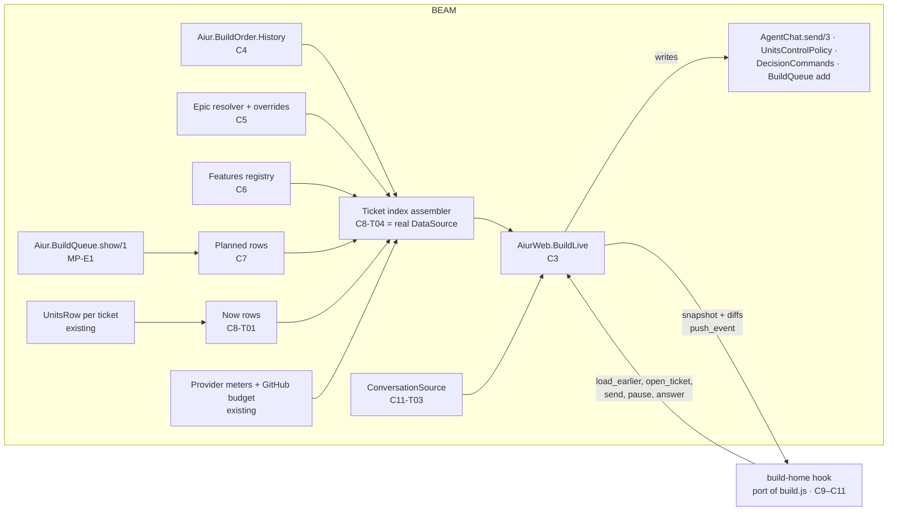

# MP-E8 Continuous build history: feature plan

**Target repo:** aiur. Code paths are repository-relative. Code is cited at
`origin/main` `58854d4c8` (2026-10-07). Design citations: `J` = `design-source/assets/build.js`,
`C` = `design-source/assets/build.css`, `H` = `design-source/Aiur Dashboard.html`.

| File | Contents |
| --- | --- |
| [decisions.md](decisions.md) | Kevin's decisions E8-D1..D14, E8-R1 |
| [claude-design-source-of-truth.md](claude-design-source-of-truth.md) | The pixel-perfect rule |
| [baseline.md](baseline.md), [options.md](options.md) | Facts and options (2026-10-06) |
| [chunks.md](chunks.md) | Chunks C1–C14 |
| [tickets/README.md](tickets/README.md) | The 76-ticket work-order for writer agents |
| [tickets/CONTRACT-REQUESTS.md](tickets/CONTRACT-REQUESTS.md) | Requests to other features' owners |
| [questions.md](questions.md) | Owner questions, including the new OQ-E8-1..10 |
| [../../owner-design-tasks/DESIGN-E8.md](../../owner-design-tasks/DESIGN-E8.md) | The gate, with new sign-off items S-1..S-17 |

---

## 1. Summary

MP-E8 replaces the Units page and the Build Order page with one home page at `/`.
The page is a continuous, scrollable build history: past tickets by real time, a
sticky "now" band with every active agent, planned tickets in MP-E1 queue order,
and a not-queued section. It has dynamic epic columns, feature focus and compact
modes, Timeline, Gantt and List views, filters, a usage strip, and a ticket/agent
modal with a live conversation, a minimap preview sidebar, a composer and Command
answers.

**Kevin's sizing instinct is right.** The page is not eight pieces of work. It is
14 chunks and 76 tickets (complexity sum 210), against the ten items DESIGN-E8
asks Kevin to design. There are three reasons:
1. The design is a whole-dashboard redesign. Around the board it restyles the
   shared shell, adds a palette system and new tokens.
2. The design's behaviour is a client-side layout engine (about 1,600 lines of
   `build.js`). Pixel parity means porting it subsystem by subsystem.
3. Real data that the mock invents does not exist today: closed-ticket history,
   epics, features, estimates, start times and conversation events.

The plan:
- **Port the design's code** into a LiveView hook, and feed it real data through
  one versioned payload. Do not re-derive the visuals on the server.
- **Prove parity by machine** with the design's own data generator and a
  side-by-side screenshot runner (C1), before any visual ticket.
- **Ship in wave 0b on a seam** (E8-D14), including **read and write** to every
  agent chat through the paths that exist today. MP-E4 and MP-E7 later swap the
  data and send adapters without changing the UI (C14).

## 2. Problem frame

- **Two pages show the same tickets differently, and neither shows the past.**
  Units shows only the current run (baseline §3.1). Build Order shows only members
  of a root (§2.2). No store keeps closed tickets (§4).
- **About 90 % of tickets have no epic or feature signal** (§5), so the column
  model needs a rule, config and cheap overrides.
- **The forward view does not exist.** MP-E1 ships the queue CLI-only, and its
  dashboard view is folded into this page (E8-D14).
- **Talking to an agent today means the chat drawer** on the Units page. Retiring
  Units must not remove the ability to read and write agent chats.

## 3. Requirements trace

| ID | Requirement | Source | Where |
| --- | --- | --- | --- |
| E8-Q1 | The page matches the Claude Design pixel for pixel, motion included | design source of truth | C1, C2, C9–C11, C12-T08 |
| E8-Q2 | History by real time; planned by MP-E1 order; a not-queued section | E8-D3 | C4, C7, C9-T02 |
| E8-Q3 | Sticky now band; opens at now; Units nav retired; `?ticket=` modal | E8-D8 | C9-T08, C11-T01, C12-T01 |
| E8-Q4 | General epics (Bugs, Design, Infra, Docs, per-repo override) plus feature epics; exactly one epic per ticket | E8-D1, D9 | C5 |
| E8-Q5 | Columns follow the viewport; zoom changes them; feature focus locks them | E8-D13 | C9-T04 |
| E8-Q6 | Features grow; focus and compact modes; one owner feature plus also-affects | E8-D2, D11 | C6, C10-T03 |
| E8-Q7 | Gantt: real durations for the past, estimates with recorded overrides for the future | E8-D4, D7 | C4-T04, C7-T03, C9-T09 |
| E8-Q8 | Agent indicators: logo, active/stuck/idle glows, reduced motion, not colour alone | E8-D12 | C9-T06, C12-T05 |
| E8-Q9 | Units columns move into the modal; filters by type, agent and state | E8-D5, D8 | C11, C11-T10 (conditional), C10-T02 (see OQ-E8-4/5) |
| E8-Q10 | Easy, batch, provenance-recorded categorisation for agents | E8-D9 | C5-T03, C6-T04, C5-T04 |
| E8-Q11 | Slow, budget-capped history classification after the build, measured first | E8-D10, DESIGN-E8 item 10 | C13 |
| E8-Q12 | Read and write access to agent chats | Kevin, 2026-10-07 | C11-T03..T09, C14 |
| E8-Q13 | Wave 0b on a seam; the refactor moves it | E8-D14 | C3, plan §5 |
| E8-Q14 | `not_planned` closures collapsed by default; "weighted" figure; separate public list | E8-R1 | C10-T02, C8-T04 (not_planned), C6-T05 (weighted), C6-T01 (`public_ref`) |

## 4. Alternatives considered

| # | Option | Verdict |
| --- | --- | --- |
| R-A | Server-rendered LiveView streams with server-computed `data-dim` (options §4 D-B) | **Rejected now.** It was the pre-design recommendation. The design computes its layout on the client: absolute positions from measured heights, per-day column sets, interval merging for Gantt, a scroll-driven snap. Re-deriving that on the server re-implements `build.js` in Elixir and invites drift, against the "reuse the design's code" rule. |
| R-B | **Port `build.js` into a hook; the server sends a compact ticket index and diffs (chosen)** | Pixel parity by construction. The design already windows the DOM (±700 px) and pages history by day, which answers the scale concern that rejected D-C before. The server keeps data, authorisation, URL validation and every write. |
| R-C | Embed the design HTML as-is in an iframe | Rejected. Mock data, CDN fonts and d3, no auth seam, and the shell would be doubled. |
| W-A | Chat composer disabled until MP-E4/E7 (the RC-25 pattern) | **Rejected.** Units' drawer can already send today (`AgentChat.send/3`, #2717 rule). Disabling it when Units retires is a regression. |
| W-B | **Composer on today's send path in wave 0b; receipts and journal later (chosen)** | RC-36 makes `AgentChat.send/3` delegate to `Aiur.Listener.send/3` once MP-E7-C3 lands, so this is not an interim path to rewrite. Only the receipt UI changes (C14-T02). |

## 5. Architecture and seams

- **The seam (E8-D14).** `AiurWeb.Build.DataSource` is a behaviour, like
  `AiurWeb.BuildOrder.DataSource`. Its fixture implementation serves the design
  data (C1-T01), and the real one is C8-T04. MP-R1 moves the stores
  (`Aiur.BuildOrder.History`, `.Features`) into `build-orders` and the page into
  its web surface. The hook, the payload and the UI do not change. A source-scan
  test (C3-T04) keeps the imports on the seam.
- **The payload (C3-T02)** is versioned. Diffs are keyed by ticket id with a
  generation number. On a gap or a rejoin, the server sends a full snapshot.
- **URL state is server-owned (C3-T03).** The hook asks LiveView to patch the
  URL, so links are shareable and validated. Unknown values are dropped.
- **Writes are server events only.** Each one re-checks `dashboard_writable` and
  the control policy, as `DashboardLive.handle_writable_event` does today.
- **Assets.** There is no bundler. A hook is a hand-served file registered in
  four places, and `dashboard.css` is read at compile time (`static_assets.ex`).
  The home hook uses one `build-home/` directory and one loader, as
  `aiur-dom-svg-layout` does, so later tickets add files without touching
  `layouts.ex`. Containers the hook writes into (`#build-root`, `#tk-backdrop`)
  are `phx-update="ignore"`.

### 5.1 What is reused

| Need | Reused code (at `58854d4c8`) |
| --- | --- |
| Layout, visuals, motion | The design's `build.js` and `build.css`, ported and cleaned |
| Shell | `OperatorControlCenter.DashboardShell` (restyled), `NavToggle`/`ThemeToggle` hooks, `route_registry.ex` |
| Data seam pattern | `AiurWeb.BuildOrder.DataSource`, `SourceRuntime`, `ContextRuntime` |
| Live agent fields | `UnitsPresenter`, `UnitsRow` (`projection`, `fields`, `sources`), `UnitsPresentation.agent_family`, `UnitsPolicy` |
| Pause and resume | `UnitsControlPolicy.affordance/recheck`, `AgentChat.pause/resume` |
| Chat read | `Aiur.LiveConversation` (live), `agent.ndjson` through a new tail-first paged reader (`Aiur.AgentLog.read_workspace` reads whole files and cannot tell "not retained"), the drawer state vocabulary in `ConversationDrawer.Presenter` |
| Chat write | `DashboardLive.send_operator_message`/`message_id_for_send`/`send_agent_message` (moved into a shared module that returns the request id), `AgentChat.send/3`, paused-agent auto-resume in `operator_messages.ex`. Delivery polling (`AgentChat.delivery_status/2`) is new dashboard code, modelled on `agent_control_cli.ex` |
| Command answers | `AiurWeb.OperatorControlCenter.DecisionCommands.record_answer/4` → `DecisionStore.answer/5` (BuildLive provides the `selected_decision` and `decision_actions` assigns it needs) |
| Dictation | `conversation-voice-controller.js`, `voice-capture-worklet.js` |
| Issue body and facts | `TicketContextPresenter`, `TicketDetailCoordinator`, `TicketHistoryProvider` |
| Planning-pack items | The pack loader inside `AiurWeb.BuildOrder.PlanningSource`, called as an extra read (the module itself replaces the live source) |
| Persistence | `Aiur.JsonStore.write!`, `Config.Paths.decision_state_dir` |
| History feeds | `ResourceStore`, `RecentMergeStore`, run telemetry, the open-issue poll, webhooks |
| Usage | `ProviderMeterRefresh`, `FinancialDataAccess` |
| Queue | `Aiur.BuildQueue.show/1` and queue add (MP-E1) |
| Browser tests | `src/browser/` (Playwright, `support/visual.mjs`), `src/test/browser/fixture_server.exs` |

Not reused: `GraphAnalysis` (it truncates at 100 nodes), the `BuildOrderGrid`
hook and the `.bo-*` CSS (the design replaces them), `FleetTable`/`FleetFilters`
(dead code, deleted in C12-T03).

## 6. Ownership with MP-E1, MP-E3, MP-E4 and MP-E7

| Capability | Owner | E8's part |
| --- | --- | --- |
| Queue read model, holds, attentions | MP-E1 (C6-T01, C5-T02, C7-T02) | E8 consumes it (C7-T01). **MP-E1-C8-T01/T02 are superseded** by C7-T01, C9 and C12-T07 (CR-E8-1) |
| "Add to queue" | MP-E1 queue add (C6-T02) | Button in the modal (C11-T02) |
| Modal conversation UI: log, minimap, composer, Command card, mic | **MP-E8** | C11 |
| Wave-0b conversation data (live projection, workspace log) | **MP-E8** adapter over existing code | C11-T03, deleted in C14-T01 |
| Durable journal, history API, anchors, jump points | MP-E4 (C1–C4) | Consumed in C14-T01 |
| Full conversation page `/conversations/:id` | MP-E4-C5 | Linked from the modal (C14-T03) |
| Delivery overlay and receipts | MP-E4-C6-T01, MP-E7-C3-T04 | Consumed in C14-T02 (CR-E8-3) |
| Send routing by listener mode | MP-E7-C3-T03 | Transparent: the composer calls `AgentChat.send/3`, which MP-E7 makes delegate (RC-36). E7 adds the composer to its "unchanged callers" list (CR-E8-2) |
| Executor conversation | MP-E3 | **Not on this page.** The Executor is not a ticket. E3's `/executor` view stays separate |
| Command authority and supersede | MP-E2 | Consumed in C14-T04 |

**Can E8 ship in wave 0b?** Yes. Every wave-0b ticket uses code that exists on
main, or MP-E1 (wave 0, which ships first). The chat **read and write** path
works in wave 0b on today's code. It gets better when MP-E4 lands (past tickets
keep their transcripts, events come from anchors) and when MP-E7 lands (routing
by mode, receipts), without a UI rewrite. The only wave-0b gap is old history:
transcripts of tickets closed before MP-E4 are gone (workspace cleanup), and the
modal says "not retained" (S-6).

## 7. Sequencing inside E8

1. **Level 0, right after DESIGN-E8:** C1-T01, C2-T03, C4-T01, C5-T01.
2. **Harness and foundations:** C1-T02, C2-T01, C3-T01..T03, C4-T02/T03,
   C5-T02/T03, C6-T01.
3. **Two tracks in parallel:**
   - the client (C2-T04 → C9 → C10 → C11) against the fixture source;
   - the server (C4, C5, C6, C7 after MP-E1, C8).
   Six client tickets still wait on server tickets (C9-T09, C9-T13, C10-T02,
   C10-T03, C10-T04, C11-T02); tickets/README.md lists them.
4. **Join** at C8-T04 (the real DataSource).
5. **Cutover** C12-T01, then C12-T02..T07 in parallel. The sign-off C12-T08
   follows C12-T01..T06 and C1-T03.
6. **After cutover:** C13 (E8-D10 says "near the end of the build or after it").
7. **Waves 2–3:** C14, as MP-E2, MP-E4 and MP-E7 land.

The critical path has 15 merges and runs through the modal chain (C11-T01 →
T03 → T04 → T05), not the band (tickets/README.md).

## 8. Edge-case catalog

Each case is owned by the tickets listed in tickets/README.md ("Owns").

| ID | Case | Required behaviour |
| --- | --- | --- |
| EC-01 | First paint before data | The design skeleton, never an empty board |
| EC-02 | New repository, no history | "No history yet" marker (J:419) |
| EC-03 | Queue empty vs queue disabled or unavailable | Empty → "Nothing planned". Disabled or unavailable → its own state (S-9). Never shown as empty |
| EC-04 | Not-queued section empty or several hundred long | Renders both; virtualised like the rest |
| EC-05 | No agents, or 20+ agents | `.bd-now-empty`. A tall band stacks in BK columns; the snap gives up when the band leaves no room (J:588) |
| EC-06 | Socket offline or daemon unreachable | Stale mode, "cached HH:MM", offline banner, Reconnect; no live tail or typing |
| EC-07 | A stale source (snapshot, store, queue observation) | Its age is rendered; values shown as stale, never as current |
| EC-08 | Unknown values (model, %, start, estimate, PR, usage) | An explicit unknown rendering. A mutation test proves it is not `0` or the last value |
| EC-09 | 1,300 to 10,000 tickets | Day-paged history; ±700 px DOM window; payload budget; measured in C12-T06 |
| EC-10 | A ticket changes section while the user scrolls | One diff; the scroll anchor is kept; columns follow the 220 ms debounce |
| EC-11 | Reconnect, missed, duplicate or late diffs | A generation gap → full snapshot; old or duplicate diffs are ignored |
| EC-12 | Read-only dashboard, auth, financial data | Writes hidden or disabled with a reason; every write re-checked on the server; usage behind `FinancialDataAccess` |
| EC-13 | Concurrent writers | Two tabs sending; TUI and modal pausing the same agent; two agents setting an epic; a label added on GitHub during a registry join. Settled state wins; writes are journaled |
| EC-14 | Send fails or its outcome is unknown | `outcome_unknown` keeps the draft and id (#2717); agent ended; paused with no free slot (cap error shown); parked; empty or oversized text |
| EC-15 | Command answered elsewhere, expired or superseded | Card shows the settled answer and disables its buttons |
| EC-16 | Transcript absent, empty or huge | "Not retained" for cleaned workspaces (S-6); drawer states; paging with ≤ 500 DOM entries |
| EC-17 | `?ticket=` unknown, closed, outside the loaded window | Fetched by id; not-found state (S-10); real ids, not the mock `AIUR-N` |
| EC-18 | Phone width and WebView | Flow mode, 46 px gutter, the ≤ 720 px modal; tap instead of hover |
| EC-19 | Keyboard, screen reader, reduced motion, forced colours | Focusable cards, focus trap, labels for agent state, static glows, a forced-colours fallback the design lacks |
| EC-20 | Clock and time zone | Browser time zone for display, daemon times for data; day boundaries and DST; fixtures freeze `NOW` |
| EC-21 | Odd data | No epic (Unsorted); several type labels (one epic still); dependency cycles (no infinite recursion); edges to tickets not in the index (dropped); order violations |
| EC-22 | Gantt time edges | Start unknown (S-5); zero or negative duration; tickets across nights and idle days; reopened tickets; multi-day tickets |
| EC-23 | Planned oddities | Queue item for a closed issue; held with no actor; unfiled pack item that is then filed |
| EC-24 | Feature oddities | Added scope after the baseline; no baseline; renamed; only also-affects members; more than six features; focus with no loaded tickets |
| EC-25 | Usage oddities | Not observed; several accounts; credits-only; unknown provider (letter fallback); GitHub budget hold |
| EC-26 | URL edge cases | Invalid parameters dropped; legacy Units and Build Order URLs redirect; back and forward |
| EC-27 | Phone WebView performance | Payload size and memory measured on a device |
| EC-28 | Theme and palette | Dark, light, Gruvbox; persisted; no flash on first paint |
| EC-29 | Repository identity | GitHub links from config, not the design's hard-coded repository |
| EC-30 | Untrusted text | Titles, bodies, transcripts escaped; Markdown sanitised; no new secret exposure |
| EC-31 | Daemon restart | Stores reload; the backfill resumes from its checkpoint |
| EC-32 | GitHub budget | No new steady-state polling; the backfill is paced and held on a budget hold; label writes paced |

## 9. Risks

| # | Risk | Mitigation |
| --- | --- | --- |
| K-1 | **Parity is unprovable**, and every review becomes an argument about pixels | C1 is the first chunk; each visual ticket proves itself by diff against the design with the same data and clock |
| K-2 | **The shell and token change restyles every page**, not only home | OQ-E8-1 asks Kevin. C2 runs the existing `visual-shell` snapshots for the other pages and records the intended change |
| K-3 | **A client-side engine on 10k tickets** is slow on a phone WebView | The design already windows the DOM and pages by day. C12-T06 measures and sets budgets before cutover |
| K-4 | **The history backfill misreads GitHub or spends budget** | One measured, paced, resumable daemon job (about 30 points); `apis/github.md` read first; no steady-state polling |
| K-5 | **Chat regressions at cutover.** Units' drawer is the working write path today | The composer reuses the same send helper (extracted, with the request id returned); delivery polling is the only new send-side code; `/chat/...` stops rendering the Units board; the hidden `/units` route is kept one release for rollback; the manual TUI test is in C11-T06 and C12-T01 |
| K-6 | **Design gaps** (states the design does not show) tempt writers to improvise | S-1..S-12 list them. Each blocked ticket has a written default, and the default is shown in the sign-off package |
| K-7 | **Port drift.** The cleaned CSS changes computed styles | The C2-T04 computed-style snapshot compares every element against the design |
| K-8 | **Payload too big.** The design's dense rows alone are about 451 KB uncompressed, and `/live` has no compression | The initial window is the queue, the band and two days of history; C12-T06 measures the whole index and decides on compression |
| K-9 | **Design decisions conflict with written decisions** (OQ-E8-4 type filter, OQ-E8-5 Units fields vs E8-D5/D8) | The defaults follow the newer design; C11-T10 is sized so the total holds if Kevin keeps E8-D5/D8 |

## 10. Decisions made without the owner

Kevin was away on 2026-10-07. These are the planner's calls. Each is reversible,
and DESIGN-E8 asks Kevin to confirm the whole list at sign-off. An owner question
in a ticket row is a default to follow, not a blocker (tickets/README.md rules).

1. **Architecture R-B:** port `build.js` into a hook fed by a server payload,
   instead of the earlier recommendation of LiveView streams. Reason: the
   pixel-perfect mandate and "reuse the design's code".
2. **The composer is live in wave 0b** on today's send path (W-B), not disabled
   (W-A). Reason: Units' drawer already writes, and disabling it would regress.
3. **E8 owns the modal's chat UI and its wave-0b adapters.** MP-E4 owns the
   journal, anchors and the full page; MP-E7 owns routing. C14 swaps the adapters.
4. **The Executor conversation is not on this page.** It stays MP-E3.
5. **Mock-only controls are dropped:** the "Demo data" select; the models
   counter's cycle action (it shows the real count). The datasets become test
   fixtures.
6. **`?trees=1` stays the only way to turn on chain hover,** as in the design
   (S-3).
7. **The agent-state label is added for screen readers only,** without changing
   pixels (S-4 asks whether a visible glyph is wanted).
8. **Gantt start** is the first `agent:in-progress` label or telemetry dispatch,
   never `createdAt`. Unknown start gets a minimum-height card (S-5).
9. **The ETA divides by `agent.max_concurrent_agents`,** not the design's
   constant 4.
10. **The default estimate is the design's table `[1,2,4,7,11]` hours** by
    complexity, until OQ-E8-7 picks the historical median.
11. **The Units fields the design header omits** (runtime, turns, tokens,
    priority, resume reason, Remote Control link) are not added (OQ-E8-5).
12. **There is no ticket-type filter,** as in the design (OQ-E8-4).
13. **The issue body renders as sanitised Markdown** in the design's article
    styles. The design's "Scope / Done when" lists are mock text.
14. **Feature suggestions** (options §2.4, PQ-12) are deferred. Membership
    changes only by an explicit CLI, label or parent link: no silent tagging.
15. **The classification backfill is an agent ticket** using the batch CLIs, not
    a new job runner (ponytail: reuse).
16. **A hidden `/units` route stays for one release** as a rollback (OQ-E8-3).
17. **The `/build-orders` routes stay reachable without nav** until Kevin confirms
    that the Breakdown, Analytics and Usage panes can go (OQ-E8-9).
18. **No Khala nav item** until OQ-E8-2 is answered.
19. **History start covers all closed issues,** with `not_planned` collapsed by
    the default filter (E8-R1, as recommended).
20. **Two new edge-case behaviours default to the design's vocabulary:**
    "not retained" for conversations and a not-found modal state (S-6, S-10).
21. **The design's shell, tokens and Gruvbox palette apply app-wide,** including
    the hidden decisions banner and page header (OQ-E8-1, S-1).
22. **A real feature's hue** is a stable hash of its slug, overridable with
    `--hue` (OQ-E8-6).
23. **Sending to a parked agent keeps main's behaviour:** it resumes under the
    normal slot gates (OQ-E8-10). No orchestrator change.
24. **When a design element contradicts a written decision, the newer design is
    the default** (OQ-E8-4, OQ-E8-5). The cost of the other answer is sized (C11-T10).
25. **The Model filter lists every model with a logo,** as the design lists all
    `MODELS`.
26. **The `not_planned` state** gets the S-17 default look, since the design has
    none.
27. **C13-T03's confirm flow is kept,** because DESIGN-E8 item 10 asks for it,
    but it waits on S-8.
28. **C3-T04 was merged into C3-T01;** the deepened plan has 76 tickets.

## 11. Verification strategy

- **Parity:** C1-T02 screenshots, C1-T03 motion and interaction scripts, the
  C2-T04 computed-style snapshot, and Kevin's side-by-side sign-off (C12-T08).
- **Behaviour:** ExUnit for stores, the resolver, the payload contract,
  URL parsing, writes and gates. Every unknown branch has the AGENTS.md mutation
  test.
- **Manual (AGENTS.md "Manual testing"):** C11-T06 and C12-T01 drive
  `scripts/aiurdev --test` in the wrapper tmux. They send a message from the
  modal and confirm it in the agent's TUI chat pane, and the reverse.
- **Measurement:** C4-T02 (GraphQL points), C12-T06 (performance), C13-T00
  (classification cost). These state numbers and claim no saving.

## 12. Deferred to follow-up work

- Feature scope suggestions (options §2.4).
- A visible state glyph on agent logos, if S-4 asks for it.
- Editing dependencies from the board (feature constraints doc: non-goal).
- A forecast simulation of the planned section against agent capacity (decisions
  "Questions the Gantt mode raises").
- Moving the new primitives into `packages/aiur-style` (#2792 plan).
- Adding the new tickets to `dependency-graph.json` and `dependency-map.md`. The
  coordinator does this after the per-ticket docs exist (DESIGN-E8 acceptance).

## 13. Review record (deepening, 2026-10-07)

ce-doc-review ran headless with coherence, feasibility, design-lens and
scope-guardian reviewers. The security and adversarial lenses were not run,
because they start a cross-model egress pass that needs an owner sanction;
EC-12 and EC-30 cover security inline.

All P1 and P2 findings were applied:
- the `not_planned` default;
- OQ items are defaults, not blockers;
- the critical path recomputed to 15 merges;
- client tickets that wait on server tickets are listed;
- the payload budget re-based on a 451 KB measurement;
- the parked-send behaviour corrected;
- `#tk-backdrop` is `phx-update="ignore"`;
- the send helper returns the request id, and delivery polling is new code;
- the DecisionCommands assigns and the #2738 resume behaviour;
- the "not retained" detection and the paged reader;
- PlanningSource is called as a loader, not an extra feed;
- `/chat/...` no longer renders Units;
- the hook directory loader;
- the fixture time zone and the `offline` dataset;
- the feature dot removed, the `--ph` unknown rule, unknown-model logos;
- the banner removal added to S-1;
- the Command success state;
- scroll, hover and tree-fade states;
- S-13..S-17;
- C13 reordered so measurement follows the export;
- Gantt edges;
- estimate guidance in skills;
- C11-T10 sized.

Not applied: "move C13-T03 to deferred", because DESIGN-E8 item 10 requires the
confirm UX.
