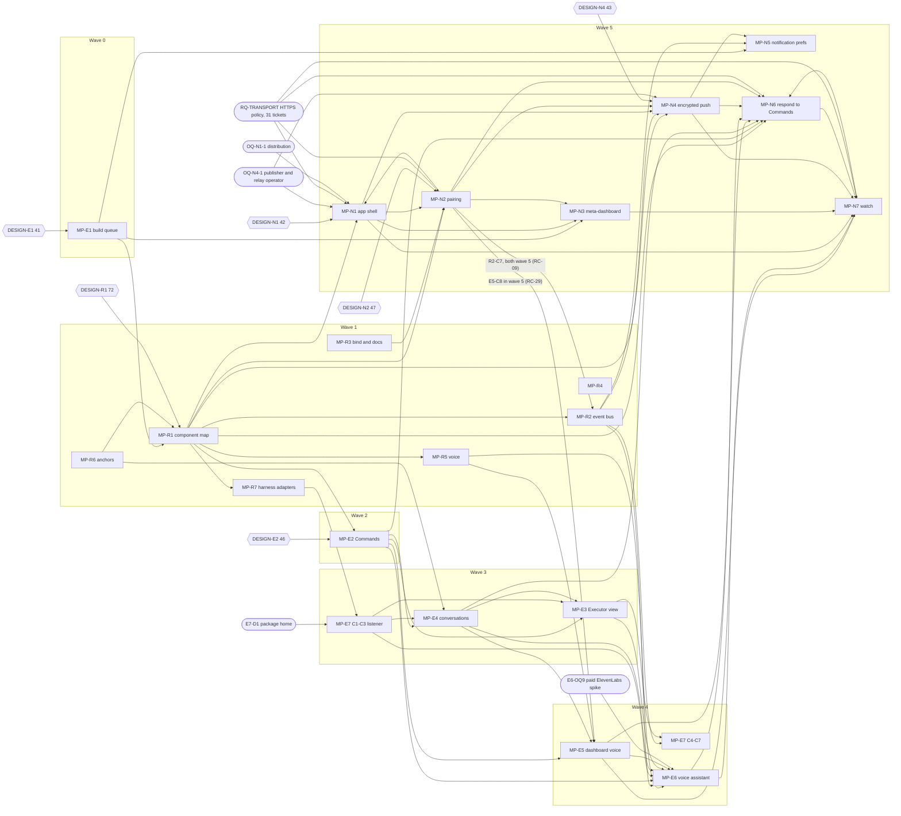

# Dependency map and delivery sequence

This is the one dependency graph and delivery sequence for the pack (brief §6 Phase D). The wave order is the operator's decision D1 ([value-and-sequencing.md](value-and-sequencing.md)). The ticket edges come from the `blocked_by` frontmatter of all 525 ticket files (final Phase D regeneration, after the fix-handoff close-out; [cross-feature-reviews/fix-handoffs-applied.md](cross-feature-reviews/fix-handoffs-applied.md)).

- **Repository base:** `45a290e3` on `research/refactor-findings`. Every ticket records the same `base_sha`.
- **Research date:** 2026-10-06 for every ticket and for this map.
- **Machine-readable graph:** [dependency-graph.json](dependency-graph.json). It has one node per ticket and per non-ticket blocker, and one edge per `blocked_by` entry. Chunk-level and feature-level references are expanded to every ticket in that chunk or feature.
- **Integrity findings:** [cross-feature-reviews/graph-check.md](cross-feature-reviews/graph-check.md) (after Phase D: 0 dangling references, 0 cycles, 0 missing gates, 0 wave inversions; the 11 chunk-level references left are deliberate).
- **Generator:** `depgraph.py`, run with `python3 -I depgraph.py <pack-root> <out-dir>`. It is kept in the Phase D scratchpad and is not part of the pack. Re-run it after any ticket edit; the numbers below are a snapshot.

## Totals

| Item | Count |
|---|---|
| Tickets | 525 (121 `ready`, 404 `blocked`) |
| Ticket-to-ticket edges | 1,328 |
| Edges from gates, research questions, owner items, prior units and external issues | 737 |
| DESIGN gates | 21, one per feature (4 research spikes carry `design_gate: n/a`, RC-32) |
| Longest chain | 27 tickets: MP-R1-C2-T01 → R1-C2-T02 → R1-C3-T01 → R1-C3-T02 → N2-C2-T01 … N2-C5-T05 → N1-C2-T03 → N1-C2-T05 → N7-C1-T03 … N7-C6-T01 → N7-C2-T06 (several chains tie at 27; graph-check §9 prints one) |

`status: ready` means "specification complete", not "can start now". 104 `ready` tickets still have an open ticket predecessor (graph-check §7). Use the graph, not the status field, to decide what can start.

## Delivery sequence by wave

Each row lists the tickets that can start first in that wave. These are the tickets whose ticket predecessors are all in earlier waves. Every one of them also needs its feature's DESIGN gate.

| Wave | Features (tickets) | First tickets in the wave | Longest chain inside | Hand-off to the next wave |
|---|---|---|---|---|
| 0 | MP-E1 (40 of 41; C3-T08 is wave 1) | E1-C1-T01, C1-T03, C1-T04, C1-T05, C1-T06, C2-T01, C3-T01, C7-T01 | 11 (E1-C2-T01 to E1-C9-T04) | E1-C1 hooks (RC-11, RC-19); E1-C7 progress API for N3 and N5 |
| 1 | MP-R1 (69), MP-R2 C1–C4 (24), MP-R7 (21), then MP-R3 (2), MP-R4 (1), MP-R5 (9), MP-R6 (3); MP-E1-C3-T08 (X-21 provider, after R1-C3-T01) | R1-C1-T01, R1-C2-T01; R2-C1-T01 to T06, R2-C2-T04, R2-C4-T05; R7-C1-T01 to T03, R7-C5-T02; R3-C1-T01, R3-C2-T01; R5-C1-T01, R5-C4-T01, R5-C4-T02; R6-C1-T01; R4-C1-T01 (also needs U8) | R1 11, R2 11, R7 9 | **MP-R1-C11-T03** final plan refresh, then the component directory page (R1-C10) |
| 2 | MP-E2 (36) | E2-C1-T01, C2-T05, C3-T01 (after MP-R1-C11-T03, RC-35); spikes E2-C4-T00 and C5-T00 (`design_gate: n/a`, RC-32) | 8 | Command v2, routing and the answering facade (E2-C3-T02) |
| 3 | MP-E7-C1 to C3 (15, incl. the X-21 provider C3-T06), MP-E4 (20), MP-E3 (20) | E7-C1-T01 (needs E7-D1), E7-C2-T01 (needs E7-D5), E7-C2-T02, E7-C3-T01; E4-C1-T00 (measurement); E3-C3-T01 (spike), E3-C1-T01 after E4-C1-T02, E3-C4-T03 | E7 9, E4 8, E3 7 | Listener send path E7-C3-T03 before E3-C5 and E4-C6 (RC-05); E4 anchors (E4-C3) |
| 4 | MP-R2-C5 (4) first (RC-31), MP-E5 C1–C6 (16), MP-E6 (31), MP-E7-C4 to C7 (18) | R2-C5-T01; E5-C1-T01, C1-T02, C2-T01, C2-T03 (after R5-C1); E6-C1-T01 (paid spike, E6-OQ9), E6-C2-T01, E6-C3-T01, E6-C6-T01; E7-C4-T01 (cross-repo), C4-T02, C5-T01, C6-T04, C7-T03 | E6 11, E5 5 | Voice-session and conversation contracts; E7-C6 hook delivery enables the E3-C5 composer (RC-25) |
| 5 | MP-N2 (39), MP-N1 (31), MP-N4 (34), MP-N7 (25), MP-N6 (20), MP-N5 (17), MP-N3 (16); MP-R2-C6/C7 (10); MP-E5-C8 (2) and E5-C7-T01 | N2-C1-T01, N2-C2-T03, N2-C3-T01; N1-C1-T01; N4-C2-T01, N4-C3-T00; N3-C1-T01; N5-C1-T01, N5-C2-T00; N6-C1-T00; N7-C1-T01; R2-C6-T01; E5-C8-T01 after N2-C6 (RC-29) | N2 15, N7 12, N1 11 | Physical-device validation: N2-C9-T02, N2-C10-T05, N4-C7-T02, N1-C10, N7-C6 |

### Wave notes from the graph

- **Wave 5 starts with MP-N2, not MP-N1.** The wave order says N1 → N2 → N3. In the graph, N1 has 16 edges into N2 tickets and N2 has 8 into N1. N2-C1 (machine store and tokens) and N2-C5 (pairing) come before N1-C2-T03 (device pairing in the native cores). Start N2-C1 and N1-C1 together.
- **MP-N4's relay can start early.** N4-C2-T01 (relay skeleton) needs only DESIGN-N4. The whole relay chain N4-C2-T01 to T05 depends on nothing in waves 0 to 4. Its deployment (N4-C2-T06) waits for OQ-N4-1, the publisher and relay-operator decision.
- **MP-E5-C8 is in wave 5 (RC-29).** The device voice path (RC-16) needs N2 device tokens (N2-C1-T03, N2-C6-T01, N2-C7-T01). E5-C7-T01 (end-to-end check and docs audit) waits on E5-C8-T02, so it moves to wave 5 too (graph-check §4).
- **Dashboard Converse no longer waits for pairing (RC-30).** MP-E6-C7-T01 dropped its MP-E5-C8-T01 edge. The Converse closure fell from 45 tickets (20 of them MP-N2) to 23 (24 after the final pass added the MP-E6-C2-T04 → C6-T02 → C4-T01 boot-reconciliation edges).
- **MP-R2-C5 is at the start of wave 4 (RC-31).** MP-E6-C4-T05 and MP-E7-C2-T05 consume the topic catalog there. R2-C6 and R2-C7 stay in wave 5.
- **Refactor before features is now an edge (RC-35).** MP-E2-C1-T01, C2-T05 and C3-T01 wait on MP-R1-C11-T03, the final plan refresh. That pulls 34 wave-0 and wave-1 tickets (R1 23, E1 7, R2 4) into every MP-E2 outcome closure; they are earlier waves, so the wave order does not change.
- **No cycle.** RC-28 dropped the MP-E5-C3-T02 → MP-E6-C7-T02 edge.

## Feature-level graph

Arrows mean "the target feature has tickets that wait on the source feature". The two labelled arrows point back to an earlier-wave feature only for chunks scheduled in wave 5 (MP-E5-C8, MP-R2-C7); no edge runs against the wave order. Hexagons are the DESIGN gates. Rounded nodes are the owner and research items that block the most work. Mutual edges between features (for example N1 and N2) are dependencies between different tickets, not cycles.

The graph draws only the six DESIGN gates that block the most tickets. Every feature has its own gate; the count after each gate is the number of tickets it blocks. All 21 are listed in the next section.

## Blocked on owner design work

Every ticket waits on its feature's DESIGN gate except the four research spikes marked `design_gate: n/a — research spike` (RC-32). Tickets blocked per gate: R1 72, N2 47, E2 46, N4 43, N1 42, E1 41, R2 38, E6 36, E7 35, N7 32, E5 29, N6 27, E3 24, E4 22, R7 22, N3 21, N5 17, R5 9, R6 5, R3 2, R4 1. Some tickets cite a gate in part ("DESIGN-N4 (no-UI release)") or as waived for a backend ticket; graph-check §3 lists the waived ones.

Owner and research items besides the gates (tickets blocked):

- **Mobile:** RQ-TRANSPORT 31 (N1, N2, N3, N5, N6, N7), OQ-N4-1 publisher and relay operator 7 (N1, N4), OQ-N1-4 validation devices 7, OQ-N1-1 distribution 6, plus RQ-N4-2/5/7/8/9, RQ-N7-6, OQ-N4-3, OQ-N7-2/3/4, D-N1-7, N1-RQ3, OWNER-AUTH-N1-PROTO.
- **Platform:** E7-D1 package home 5, E7-D5 mode lifetime, OWNER-NPM-FIRST-PUBLISH, E6-OQ1 to OQ9 (OQ9 authorizes the paid spike), E5-OQ1 to OQ6, OQ-E3-6, RQ-E3-5.
- **Refactor:** prior units U5 (7), U2 (4), U8 (4), U6 (3), U3 (2); RQ-U2-TRANSITION, RQ-U6-STATUS-MODEL, RQ-R7-5; live bug #3009 (one R1 ticket).

## Smallest prerequisite set per outcome

This updates the table in [value-and-sequencing.md](value-and-sequencing.md). "Target tickets" deliver the outcome. "Closure" is every ticket they transitively wait on, including themselves, computed from the graph.

| Outcome | Target tickets | Closure (tickets per feature) | Gates | Other open items |
|---|---|---|---|---|
| Queue stays full | E1-C3-T04, E1-C4-T01, E1-C4-T02 | 17 (all E1) | DESIGN-E1 | none |
| Blocker reaches me in the dashboard | E2-C2-T03, E2-C7-T01 | 42 (R1 23, E2 8, E1 7, R2 4) | DESIGN-E2, R1, R2, E1 | U2, U3, U5, U6, RQ-U2-TRANSITION, RQ-U6-STATUS-MODEL (through MP-R1-C11-T03, RC-35) |
| Native agent questions become Commands | E2-C4-T03 (Codex), E2-C5-T02 (Claude) | 42 and 48 (E2 8 and 14, plus the same 34 refactor tickets) | as above | as above; spikes E2-C4-T00, E2-C5-T00 |
| Read the Executor without Remote Control | E3-C6-T01 | 10 (E3 4, E4 6) | DESIGN-E3, DESIGN-E4 | none |
| Write to the Executor | E3-C5-T01 | 22 (E3 2, E4 6, E7 7, R7 7) | DESIGN-E3, E4, E7, R7 | E7-D5; the composer stays disabled until E7-C6 (RC-25) |
| Worker conversation with jump points and send | E4-C5-T03, E4-C6-T01 | 27 (E4 12, E7 7, R7 7, R6 1) | DESIGN-E4, E7, R6, R7 | E7-D5 |
| Dictate in the dashboard | E5-C4-T01 | 12 (E5 7, R1 3, R5 2) | DESIGN-E5, E2, R1, R5 | E5-OQ1, OQ3, OQ6 |
| Converse in the dashboard | E6-C7-T02 | 24 (E6 12, E5 6, R1 3, R5 3) | DESIGN-E5, E6, R1, R5 | E5-OQ1, OQ6; E6-OQ4/6/7/8/9 |
| Answer a blocker from the phone (iOS) | N6-C3-T01, N6-C2-T02, N4-C4-T02 | 104 (R1 30, N2 23, N1 11, N4 9, E1 7, E4 7, R2 7, N6 5, E2 3, R3 1, R6 1) | DESIGN-E1, E2, E4, N1, N2, N4, N6, R1, R2, R3, R6 | OQ-N4-1, OQ-N1-1, RQ-TRANSPORT; U2, U3, U5, U6 |
| Same, iOS and Android | adds N6-C3-T02, N4-C5-T02 | 107 | as above | as above |
| Answer from the Apple Watch | N7-C2-T03, N7-C2-T04 | 125 (adds N7 9, N3 4; N1 13, N2 24, N4 11, N6 7, E2 4) | as above + DESIGN-N3, N7 | + OQ-N4-3, RQ-N4-2, N1-RQ3 |

Changes since the first Phase D snapshot: the MP-R2 share of the phone closure fell from 17 to 7 once MP-N4-C3-T00 named tickets and dropped its optional MP-R2-C6 edge. The MP-R1 share rose from 20 to 30, and the dashboard-blocker closure from 8 to 42, because RC-35 makes the first MP-E2 tickets wait on the final plan refresh. Those added tickets are all in waves 0 and 1.

## What can proceed concurrently

- **Across waves, after the gates:** the relay service (N4-C2-T01 to T05) and the Khala listener chain (E7-C1-T01, T02, T05, T03; a different repository) have no ticket predecessors outside their own chunk. They can run early if the operator allows work out of wave order. The push crypto (N4-C1) cannot: it waits on N4-C3-T00, which waits on MP-R1-C1-T04/T05 and MP-R2-C5-T03.
- **Wave 1:** R1, R2 and R7 start in parallel (R2-C1 and R7-C1 need no R1 ticket). R3, R5 and R6 entry tickets need no R1 ticket either. Only R7-C3-T05 and R7-C4-T02 to T04, and R2-C2-T11, R2-C4 and R2-C5 to C7, wait on R1 tickets.
- **Wave 3:** the E7-C1 Khala chain runs alongside E7-C2 and C3. E4-C1 (journal) comes first, because E3-C1-T01 waits on E4-C1-T02.
- **Wave 4:** E7-C4, C5 and C6 are independent chains. The E6 backend (C2, C4, C6) runs alongside the paid spike E6-C1-T01. E6-C2-T03 waits for the spike.
- **Wave 5:** N2-C1 and N1-C1 start together; N4-C2 runs alongside both. N3, N5, N6 and N7 each wait on N1 or N2 tickets.
- **Parallel research is not parallel implementation.** Each ticket names its predecessors.

## Tickets eligible first after approvals

These tickets have no ticket predecessor and no open research, owner, prior-unit or external blocker. Each starts as soon as the named gate is approved.

| Gate approved | Tickets eligible at once |
|---|---|
| DESIGN-E1 | MP-E1-C1-T01, C1-T03, C1-T04, C1-T05, C1-T06, C2-T01, C3-T01, C7-T01 |
| DESIGN-R1 | MP-R1-C1-T01, MP-R1-C2-T01 |
| DESIGN-R2 | MP-R2-C1-T01, C1-T02, C1-T03, C1-T04, C1-T05, C1-T06, C2-T04, C4-T05; C6-T01 (scheduled in wave 5; needs KQ-R2-1 inside DESIGN-R2 §2) |
| DESIGN-R3 | MP-R3-C1-T01, MP-R3-C2-T01 |
| DESIGN-R5 | MP-R5-C1-T01, C4-T01, C4-T02 |
| DESIGN-R6 | MP-R6-C1-T01 |
| DESIGN-R7 | MP-R7-C1-T01, C1-T02, C1-T03, C5-T02 |
| DESIGN-E6 | MP-E6-C6-T01 |
| DESIGN-E7 + DESIGN-R7 | MP-E7-C4-T01 (aiur-claude, cross-repo) |
| DESIGN-N2 | MP-N2-C2-T03, MP-N2-C3-T01 |
| DESIGN-N4 | MP-N4-C2-T01 |
| `design_gate: n/a — research spike` (RC-32) | MP-E2-C4-T00, MP-E2-C5-T00, MP-E3-C3-T01 (spikes), MP-E4-C1-T00 (measurement) |

Next after one named owner item: MP-R4-C1-T01 (prior unit U8), MP-E6-C1-T01 (E6-OQ9 paid spike), MP-E7-C1-T01 (E7-D1), MP-E7-C2-T01 (E7-D5), MP-N1-C9-T01 (OWNER-AUTH-N1-PROTO; a proposal, not authorized).

Gates with no immediately eligible ticket: DESIGN-E2 (its entry tickets wait on MP-R1-C11-T03, RC-35), E3, E4, E5, N1, N3, N5, N6, N7 and R4. Their first tickets wait on earlier-wave tickets (see the wave table).

The value order still applies. Approving a later wave's gate early does not mean its tickets should start before the earlier waves end.

## Plan refresh

The refactor moves paths and contracts. Implementers must not rediscover that mapping.

- **MP-R1-C11-T01** builds the plan-refresh tool: a path map, stale citations and size owners between two commits.
- **MP-R1-C11-T02** is the recurring runbook. It refreshes the plan after each move and resolves each ticket's size owner when the ticket starts, against the then-current U8 ledger (**RC-23**: the U8 ledger is pinned at `465aca643`, the pack at `45a290e3`).
- **MP-R1-C11-T03** is the final refresh after all of MP-R1-C9. It is the gate before wave 2 and before the directory page goes live.
- Feature-local refresh tickets: **MP-N4-C3-T00** (daemon push-relay component) and **MP-N6-C1-T00** (device Command API).
- **RC-35 closed the gap:** MP-E2-C1-T01, C2-T05 and C3-T01 list MP-R1-C11-T03, so the gate before wave 2 is an edge in the graph.
- Re-run `depgraph.py` after each refresh, and regenerate this map and graph-check.md from its output.
