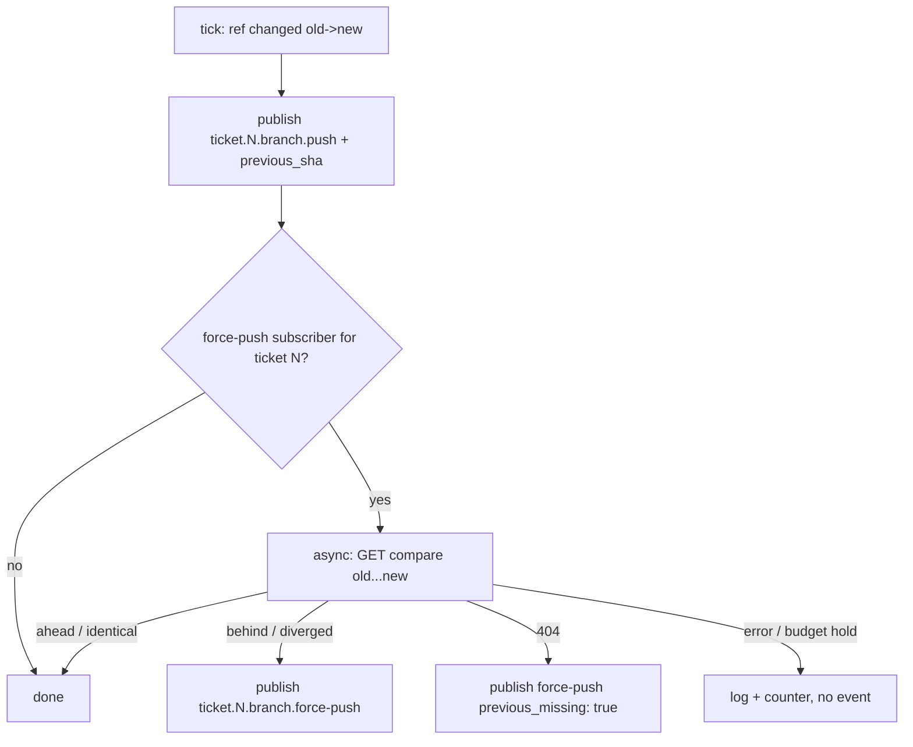

# BQ-G2-3 Publish ticket branch force-push events - Plan

## Summary

`LsRemoteTicker` adds `previous_sha` to every ticket `branch.push` and, for refs that a dependent subscribes to, classifies the move with a GitHub compare call; a non-fast-forward move also publishes `ticket.N.branch.force-push`. Covers brainstorm R10; KD8, KD9.

Product Contract preservation: unchanged.

## Problem Frame

`ticket.N.branch.force-push` is bound for every declared blockee and is mid-turn drain eligible (`src/lib/aiur/orchestrator/auto_subscriptions.ex`), but nothing publishes it (`.claude/skills/aiur-agent/emit-and-subscribe.md` note). The only ticket-branch push publisher, `src/lib/aiur/events/ls_remote_ticker.ex`, sees `ref -> sha` pairs and publishes `branch.push` on any change; it knows the previous SHA (`state.refs`) but drops it. An optimistic dependent therefore cannot tell an append from a rewrite without fetching, and G4 has no fleet signal for rewritten blocker history.

## Requirements

- R10 a non-fast-forward move of a ticket ref publishes `ticket.N.branch.force-push` with `ref`, `sha`, `previous_sha`, `compare_status`; every `branch.push` gains `previous_sha` (nil for a new ref).
- `branch.push` keeps its topic, timing, and existing fields (KD9).

## Key Technical Decisions

- **Classify with GitHub compare `previous...new`** (KD8). `status` `ahead` -> fast-forward (no extra event); `behind` or `diverged` -> force-push; `identical` -> no event; HTTP 404 (previous SHA unknown to GitHub) -> force-push with `previous_missing: true`. Other errors -> no force-push event, a debug log, and a counter (agents' local check is authoritative, KD7). Reuse the request shape from `src/lib/aiur/github/human_review_gate.ex` (`compare/3`, `per_page=1`) through the budget-gated `Transport`.
- **Only for subscribed refs.** Before classifying, check whether any live binding matches `ticket.N.branch.force-push` (new `Exchange.subscribed?/1` over the existing bindings table, or a `SubscriptionStore` registry query; implementer picks the cheaper read). No subscriber -> no API call. Bounds cost to tickets that have dependents.
- **Asynchronous after `branch.push`.** The tick publishes `branch.push` first, then starts a supervised task per classified ref (`Aiur.TaskSupervisor`) that publishes `branch.force-push` on a force verdict. A tick never blocks on GitHub. Order between the two events does not matter to consumers (agents check ancestry locally).
- **Dedupe by `(ref, sha)`.** The task carries the tick's `(ref, previous_sha, sha)`; if the ticker has since seen a newer SHA for the ref, the verdict is still published (it describes that transition) but carries `superseded: true`.
- **No firehose or daemon-side git.** Rejected per KD8 (lossy firehose; object-store and fetch cost).

## High-Level Technical Design

## Implementation Units

### U1. `previous_sha` on branch.push

**Goal:** Every ticket push event carries the SHA it replaced.
**Requirements:** R10.
**Dependencies:** none.
**Files:** `src/lib/aiur/events/ls_remote_ticker.ex` (`maybe_publish_change/3`, `publish_push/4`), `src/test/aiur/events/ls_remote_ticker_test.exs`.
**Approach:** pass `Map.get(state.refs, ref)` into the payload as `previous_sha`. System (base-branch) pushes get it too; harmless.
**Test scenarios:**
- Known ref changes a->b -> payload `previous_sha: a`.
- New ref after bootstrap -> `previous_sha: nil`.
- Bootstrap tick -> nothing published (unchanged).
**Verification:** tests; `BranchRefStore` and `PushRouting.record_blocker_branch_push/3` tests unchanged and green.

### U2. Subscriber check

**Goal:** Cheap answer to "does anyone bind `ticket.N.branch.force-push`?".
**Requirements:** KD8 cost bound.
**Dependencies:** none.
**Files:** `src/lib/aiur/events/exchange.ex` (or `subscription_store.ex`), its test file under `src/test/aiur/events/`.
**Approach:** ETS match over bindings using `Topic.matches?/2` on literal topic; returns boolean; never raises (missing table -> false).
**Test scenarios:**
- Binding `ticket.7.branch.force-push` present -> true for ticket 7, false for ticket 8.
- Only `ticket.7.branch.push` bound -> false.
- Exchange not started -> false.
**Verification:** tests.

### U3. Force-push classifier and publisher

**Goal:** Publish `branch.force-push` on non-fast-forward moves of subscribed refs.
**Requirements:** R10.
**Dependencies:** U1, U2.
**Files:** new `src/lib/aiur/events/branch_rewrite_classifier.ex`, `src/lib/aiur/events/ls_remote_ticker.ex` (spawn after publish; injectable `:classify_fun` and `:subscribed_fun` opts like the existing `:ls_remote_fun` / `:publisher`), `src/lib/aiur/events/github_keys.ex` (topic helper for force-push), `src/test/aiur/events/branch_rewrite_classifier_test.exs`, `src/test/aiur/events/ls_remote_ticker_test.exs`.
**Approach:** classifier maps compare result to `:fast_forward | :rewrite | {:rewrite, :previous_missing} | :unknown`; ticker spawns only when `previous_sha` is non-nil and subscribed. Payload: `source: :system, ref, sha, previous_sha, compare_status, previous_missing, superseded, repo`. Log `aiur_perf ls_remote_ticker phase=publish_force_push ...`.
**Test scenarios:**
- Subscribed ref, compare `diverged` -> one `branch.push` then one `branch.force-push` with `previous_sha`.
- Compare `ahead` -> only `branch.push`.
- Compare `behind` (reset to older commit) -> force-push.
- Compare 404 -> force-push with `previous_missing: true`.
- Compare error / budget hold -> only `branch.push`; ticker stays alive; counter incremented.
- Not subscribed -> classifier never called.
- New ref (no previous) -> classifier never called.
- Integration: a subscribed dependent's `SubscriptionStore` receives the force-push event and `AutoSubscriptions.blocker_critical_digest?/2` is true for it.
**Verification:** tests green; dev-daemon: force-push a blocker branch with a subscribed dependent and see both events in the dependent's inbox.

### U4. Renderers, docs, and the skill note

**Goal:** The event reads well in the agent digest and docs stop saying it is never emitted.
**Requirements:** R10.
**Dependencies:** U3.
**Files:** `src/lib/aiur/agent_list/renderer/event_phrases.ex`, `src/lib/aiur/agent_list/renderer/event_line.ex` (verb "force-pushed"), `src/lib/aiur/agent_runner/events_digest.ex` (summary from `ref`), `.claude/skills/aiur-agent/emit-and-subscribe.md` (replace the "no publisher" note), `.claude/skills/aiur-agent/event-taxonomy.md` (add the topic row), `website/docs-app/concepts/message-bus.md` (topic table), and the matching renderer tests.
**Test scenarios:**
- Digest line for a force-push event names the ref and "force-pushed".
- Agent-list event line renders without raising for a payload missing `previous_sha`.
**Verification:** tests; `rg -n "no publisher currently emits" .claude` returns nothing.

## Scope Boundaries

- Not in scope: acting on force-push in the orchestrator (G3/G4), Executor alerts, waste metrics (G4 consumes the event).

## Risks

- **API budget.** One REST call per push of a ticket with dependents. Mitigation: subscriber gate; calls go through the budget-gated transport and are skipped (not queued) under a hold.
- **False negatives.** A compare error emits nothing; the skill's local ancestry check still catches the rewrite.
- **Previous SHA garbage-collected on GitHub.** Handled as `previous_missing: true` rewrite.

## Rollout

No flag. Effective only for tickets that have `blocker:auto` subscribers, which today means declared blockers and, after BQ-G2-1, optimistic dependents.

## Verification Contract

Unit and integration tests listed above; dev-daemon force-push check recorded on the ticket.

## Definition of Done

Units merged; docs and skill note updated; dev-daemon check recorded.
