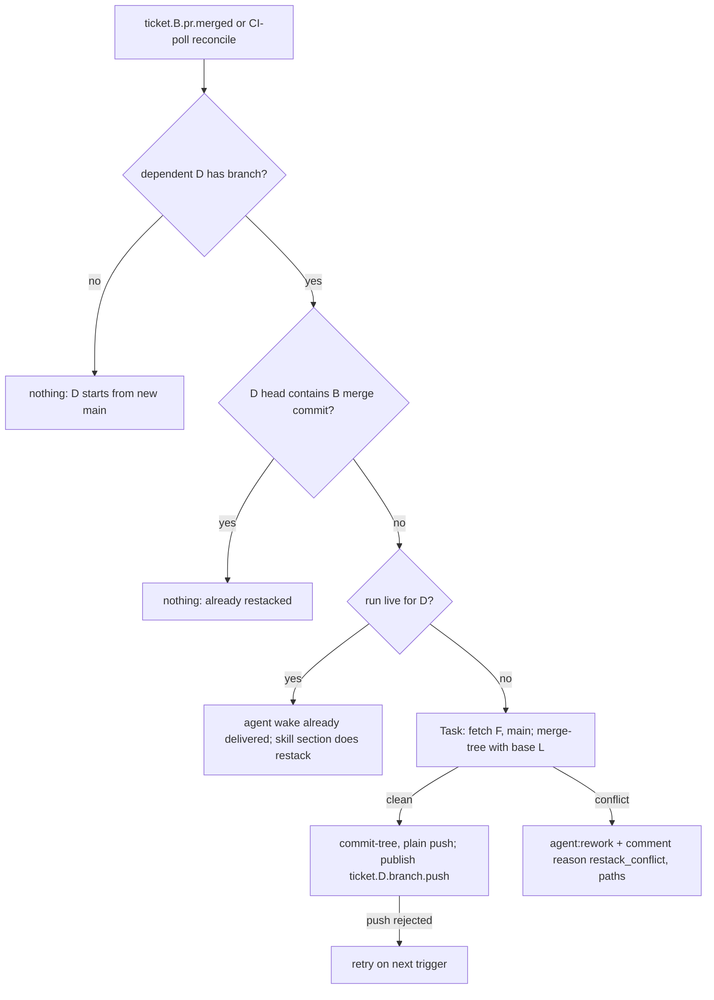

# feat: Restack a dependent after its blocker is squash-merged - Plan

## Goal Capsule

- Objective: when a blocker's PR merges, Aiur moves every dependent branch onto the new `main` with one fast-forward "restack merge" commit. The commit removes the blocker's pre-squash commits from the dependent's diff and puts the blocker's merge commit into the dependent's history. Aiur does this itself when the dependent is idle. It hands the work to the dependent agent when a run is live, and hands conflicts to rework with a clear reason.
- Covers: brainstorm R3, R4, R5, R10 (the restack trailer half). KD2, KD3.
- Code baseline: `origin/main` at `0e5b8d0de`. Paths are repo-relative.
- Product Contract unchanged.

---

## Problem Frame

The repo squash-merges with an empty body and deletes merged head branches. After a blocker merges, the dependent still carries the blocker's original commits, while `main` carries one squash commit with the same net change. GitHub retargets a dependent based on the deleted branch to `main` ([Merging a pull request](https://docs.github.com/en/pull-requests/collaborating-with-pull-requests/incorporating-changes-from-a-pull-request/merging-a-pull-request)), but it does not touch the commits. The dependent's diff again shows blocker code. Integrating with a plain `git merge origin/main` conflicts wherever the dependent edited a line the blocker introduced (reproduced in the brainstorm appendix). That is the conflict GitHub's own docs warn about for later PRs after a squash ([About pull request merges](https://docs.github.com/en/pull-requests/collaborating-with-pull-requests/incorporating-changes-from-a-pull-request/about-pull-request-merges)).

## Requirements

- R3. After the restack, the dependent's diff against `main` holds only its own change, the blocker's merge commit is an ancestor of the dependent head, and the branch only fast-forwarded.
- R4. When no run is live for the dependent, the orchestrator restacks. When a run is live, the agent restacks on the `ticket.<B>.pr.merged` wake it already receives (`src/lib/aiur/orchestrator/auto_subscriptions.ex`, `blocker_critical_topic?/2`).
- R5. A conflict leads to `agent:rework`, with a comment and an event that carry `reason: restack_conflict`, the blocker PR number, and the conflicted paths. Nothing is pushed.
- R10 (part). Each restack commit carries the trailers `Aiur-Restack: blocker=#<B> blocker-head=<F> base=<main sha>`, so a verifier can recompute it (consumed by G3-3).

## Key Technical Decisions

- KTD1. The restack algorithm: F = `refs/pull/<blocker PR>/head` (the ref survives branch deletion; verified on #3742), L = `merge-base(dependent head, F)`, T = `git merge-tree --write-tree --merge-base=L origin/main <dependent head>`, C = `commit-tree T -p <dependent head> -p origin/main`. Push C to the dependent branch as a plain (non-force) push. Why: L as merge base subtracts exactly the blocker changes the dependent already has, and later blocker pushes the dependent never pulled arrive through `main`. The parent order makes C a fast-forward. The push is atomic compare-and-swap on the remote ref. If the agent pushed meanwhile, the push is rejected and the restack retries on the next trigger. The rebase alternative needs a force-push and loses merge-commit conflict resolutions. It was rejected.
- KTD2. The orchestrator path runs plumbing only (fetch into a private ref namespace `refs/aiur/restack/*`, merge-tree, commit-tree, push). It runs in the dependent's existing workspace, under the workspace host lock, and only when `state.running` has no entry for the dependent. Plumbing never touches the index or the working tree, so a later agent turn just fetches.
- KTD3. The work runs off the orchestrator process in a supervised Task. The result comes back as a message, and the orchestrator applies the state transition (rework or nothing). Git calls can take seconds and must not block the GenServer.
- KTD4. Triggers: (a) `ticket.<B>.pr.merged` routed through `Aiur.Orchestrator.EventTopics` next to `CommentWake.mark_pr_merged_issue_done/3`; (b) a reconcile pass on each CI poll of a dependent PR whose blocker facts (from G3-1 U1) show `merged?` and whose head does not contain `merge_commit_sha`. (b) closes missed events, and it is idempotent because a restacked head contains the merge commit.
- KTD5. Dependents are found from the open issues whose `blocked_by` contains B (the orchestrator's hydrated issue set). Subscription bindings are not used to find them. Only tickets with a delivered open PR or a pushed branch are restack candidates. A ticket with no branch yet just starts from the new `main`.
- KTD6. The agent path is documented in the skill, with no new script. A live agent runs the same four plumbing steps, or, on conflict, `git rebase --onto origin/main L` and `push --force-with-lease`. The agent reports that it rebased. If G2 ships `ticket.<n>.branch.force-push`, the force path publishes it.
- KTD7. Config: `tracker.restack_after_blocker_merge` (boolean, default `true`). False keeps the agent path only. The default is on because the idle case is the common optimistic case and the action is fast-forward-only.

## High-Level Technical Design

## Implementation Units

### U1. `Aiur.Stacking.Restack` git core

- Goal: a pure-git function from (workspace path, dependent branch, blocker PR number, integration branch) to `{:ok, :already_contained}`, `{:ok, {:pushed, sha}}`, `{:conflict, paths}`, or `{:error, reason}`.
- Requirements: R3, R5, R10. KTD1, KTD2.
- Files: `src/lib/aiur/stacking/restack.ex` (new), `src/test/aiur/stacking/restack_test.exs` (new; builds real temp repos with a bare "origin").
- Approach: fetch `main` and `refs/pull/<B>/head` into `refs/aiur/restack/<D>/{main,blocker}`, plus the remote dependent branch. If `merge-base --is-ancestor <merge_commit> <dependent>` holds, return already_contained. Otherwise compute L and T and parse the conflicted paths from merge-tree's exit status and output. Build C with the trailer message `Restack onto <main sha> after #<B> merged` plus the R10 trailers. Push `C:refs/heads/<branch>` without force. Use the agent token through the same fail-closed credential path agents use (`.claude/skills/aiur-agent/dev-loop.md` push recipe); never put a token in a URL.
- Execution note: start from the brainstorm appendix reproduction as the first failing test.
- Test scenarios: (happy) dependent edits a blocker-introduced line, the blocker merges by squash, and the result is pushed: `git diff main C` lists only dependent files, C is a fast-forward of the old head, and the merge commit is an ancestor of C. (edge) The dependent never merged the blocker branch (logical dependency only), so the result equals a normal merge of main. (edge) The dependent missed the blocker's last push: that change arrives through main and does not duplicate. (edge) Already restacked: no push. (conflict) Main changed the same line after the blocker merged: conflict with that path, nothing pushed, remote ref unchanged. (race) The remote dependent branch moves between fetch and push: the push is rejected and the result is `{:error, :remote_moved}`. (error) `refs/pull/<B>/head` is missing: error, nothing pushed.
- Verification: each test asserts the remote ref sha before and after.

### U2. Orchestrator wiring

- Goal: trigger U1 for idle dependents on blocker merge and on poll reconcile, and route conflicts to rework.
- Requirements: R4, R5. KTD3, KTD4, KTD5, KTD7.
- Dependencies: U1, BQ-G3-1 U1 (blocker PR facts).
- Files: `src/lib/aiur/orchestrator/event_topics.ex` (pr_merged route also calls the restack scheduler), `src/lib/aiur/orchestrator/restack_scheduler.ex` (new: candidate selection, Task start, result handling, dedup by `{dependent, blocker_merge_sha}`), `src/lib/aiur/orchestrator/state.ex` (in-flight map), `src/lib/aiur/events/github_ci_poller.ex` or `src/lib/aiur/orchestrator/ci_lifecycle.ex` (reconcile hook on poll result), `src/lib/aiur/config/schema/tracker.ex` (`restack_after_blocker_merge`), tests `src/test/aiur/orchestrator/restack_scheduler_test.exs` (new), and `src/test/aiur/orchestrator_firehose_test.exs`.
- Approach: candidates are open issues with B in `blocked_by` and a known branch. Skip when `Map.has_key?(state.running, id)` (live, so the agent path applies), when a restack for the same pair is in flight, or when the flag is off. On `{:pushed, sha}`, log and rely on `LsRemoteTicker` to publish `ticket.<D>.branch.push`. On conflict, call `TicketTransition.write_state(id, "rework", writer: :restack)` (the pattern in `ci_lifecycle.ex` `write_ci_failure_state/1`), post one issue comment naming the blocker PR, the conflicted paths, and the agent recipe, and publish `ticket.<D>.restack.conflict` with the same payload.
- Test scenarios: blocker merge with one idle dependent starts one Task. The same event twice starts one Task (dedup). A live dependent starts no Task. A conflict result writes rework once and posts one comment. A disabled flag starts no Task. Poll reconcile on a dependent whose head lacks the merge commit starts a Task, and on one that contains it does nothing.
- Verification: no new GitHub REST reads on the poll path beyond the existing delivered facts. Git fetches are local process calls.

### U3. Agent skill and docs

- Goal: a live dependent agent knows how to restack on `ticket.<B>.pr.merged`, and operators know the behavior.
- Requirements: R4. KTD6, KTD7.
- Files: `.claude/skills/aiur-agent/dev-loop.md` (new subsection after "Integrating an upstream blocker's branch": "After the blocker merges: restack"), `src/prompts/shared-agent-instructions.md` (one sentence pointing at it), `website/docs-app/concepts/build-orders.md` (Queueing a Build Order: "Stacked dependents are restacked when the blocker merges"), `website/docs-app/reference/configuration.md` (`tracker.restack_after_blocker_merge`), `src/examples/workflows/github-claude.yaml` (commented default).
- Approach: give the four steps in prose, plus the conflict fallback with the force-with-lease rule and a note that the Executor needs a re-review only when the agent rebased.
- Test expectation: none for the prose. The docs prose guard (360 characters per paragraph) and the config-key docs check apply.
- Verification: the AGENTS.md docs table row for the new config key is satisfied in the same PR.

---

## Verification Contract

- `src/test/aiur/stacking/restack_test.exs` passes against real git (2.40 or later, for `merge-tree --merge-base`; CI images carry a newer version, which the implementer confirms).
- The orchestrator tests pass with `--max-cases 2`.
- Live check on two throwaway tickets: the blocker squash-merges, and within one poll the dependent's PR shows only its own files and `gh pr view --json commits` ends with the restack commit.

## Definition of Done

- U1 through U3 are merged. Removing the custom merge base (a plain merge) makes the happy-path test fail with a conflict.

## Rollout

- `tracker.restack_after_blocker_merge: true` by default. Setting it to false leaves only the agent path. Restacks only happen for tickets whose blocker merged while they had a branch. Under G1's default (`pr_merged` start), that happens only for operator-stacked or optimistic tickets.

## Risks

- The restack push dismisses an existing approval (`dismiss_stale_reviews_on_push: true` in `docs/security/human-only-merge-ruleset.json`). Mitigation: G3-3 lets the merge helper re-approve a restack-only delta after recomputing it.
- The push identity is the agent token, the same pusher as agent pushes, so `require_last_push_approval` semantics do not change. Brainstorm Q1 asks Kevin to confirm the daemon may push.
- A semantic conflict (clean textual merge that breaks the build) is not detected here. CI runs on the pushed head, and the CI lifecycle's existing failure path sends the ticket to rework.
- `git merge-tree --merge-base` requires git 2.40 or later. U1 checks the version at boot of the scheduler. On an older git, the flag behaves as false and logs once.

## Seams

- BQ-G3-1 supplies the blocker PR facts (`head_ref`, `merge_commit_sha`).
- G2: if agents rebase instead of merging, G2 owns publishing `ticket.<n>.branch.force-push`. This plan needs no force-push on the orchestrator path.
- G4 owns what happens when the blocker closes unmerged. No restack runs then.
