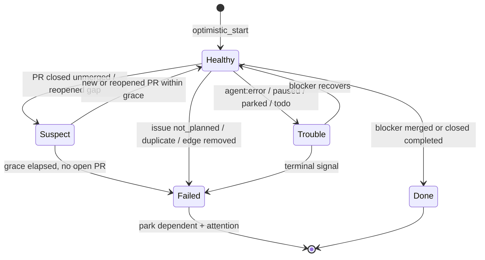

# BQ-G4-2 Park optimistic dependents when their blocker fails - Plan

## Goal Capsule

- **Objective:** When an optimistic blocker fails for good, Aiur pauses and
  parks every dependent that already started on it, keeps all its work, and
  wakes the Executor once per dependent with the cause and the choices. When
  the blocker only has trouble (agent error, paused), the dependent keeps
  running. Works with and without an adopted queue.
- **Product authority:** brainstorm R2-R9a, D1-D4, D7.
- **Product Contract preservation:** Product Contract unchanged.

## Problem Frame

- The queue planner opens `prerequisite_failed` keyed on the blocker
  (`src/lib/aiur/build_queue/planner.ex`, `failed_keys/2`) and never touches a
  running dependent.
- `dependency_changed_after_start` (`planner.ex`, `attention_keys/2` for
  `:claimed`) fires whenever a promoted, claimed dependent's verdict is not
  `:ready`; under optimistic start that is every dependent.
- `ticket.N.pr.closed_unmerged` is published only by
  `Aiur.BuildQueue.PRObserver` for queue prerequisites
  (`src/lib/aiur/build_queue/pr_observer.ex`). `Aiur.Events.GithubFirehose`
  maps only `opened`, `ready_for_review` and merged closes
  (`src/lib/aiur/events/github_firehose.ex`, `pr_topic/3`). Without a queue,
  nothing reports a blocker PR closed unmerged.
- The orchestrator already has the pause path that keeps the session and
  workspace (`Aiur.Orchestrator.PauseResume.pause_agent_reply/2`) and parks via
  `agent:parked` (`Issue.parked?`).

## Requirements

Carried from origin: R2 (park running dependent, keep everything), R3 (same
for finished dependent), R4 (unclaimed dependents are G1/queue), R5
(non-terminal trouble: attention after grace, no pause), R6 (grace for PR
reopen or replacement), R7 (churn never pauses; churn attention at
threshold), R8 (one dependent-scoped attention; `prerequisite_failed` gains
the started dependents), R9 (`dependency_changed_after_start` suppressed for
healthy optimistic dependents, replaced on failure), R9a (no queue required).

## Key Technical Decisions

- **KTD1. Orchestrator component `Aiur.Orchestrator.OptimisticGuard`.**
  Pure decision module plus a thin effect layer called from the orchestrator,
  mirroring `BuildQueue.Planner` (pure) and `AttentionActions` (effects).
  Inputs: open ledger records (BQ-G4-1), blocker observations, now. Output:
  actions `{:park, dep, blocker, cause}`, `{:attention, cause, dep, payload}`,
  `{:resolve, cause, dep}`, `{:update_blocker, dep, blocker, facts}`.
- **KTD2. Two triggers, one decision.** Event path: the orchestrator subscribes
  to `ticket.*.pr.closed_unmerged` and `ticket.*.pr.reopened` (added to
  `@orchestrator_topics` in `src/lib/aiur/orchestrator/lifecycle.ex`) and runs
  the guard for that blocker. Reconcile path: on each orchestrator poll tick,
  the guard runs over open ledger records using issue states the poll already
  fetched plus one `ticket_pull_request/1` read per optimistic blocker whose
  observation is older than `observation_max_age` (bounded: only optimistic
  blockers, typically under 10). The reconcile path is the backstop for missed
  events and restarts.
- **KTD3. Publish closed-unmerged from the firehose.** Add
  `pr_topic(id, "closed", false)` -> `ticket.<id>.pr.closed_unmerged` and
  `"reopened"` -> `ticket.<id>.pr.reopened`. Publish only when `merged` is
  the literal `false`: the Events API sends sparse merge notifications, and a
  `nil` must not read as a failure. The guard confirms with a PR read before
  parking, so a false event cannot park on its own.
- **KTD4. Classification.** Terminal: PR closed unmerged and still no open
  PR for the blocker issue after `optimistic_failure_grace_seconds` (new
  `build_queue` key, default 600, range 60-86400); issue closed `not_planned`
  or `duplicate`; blocker removed from the Build Order / queue edge set.
  Non-terminal: `agent:error`, `agent:paused`, `agent:parked`, reset to
  `agent:todo`. Healthy: anything else, including a merged PR or a closed
  `completed` issue.
- **KTD5. Park action.** Running dependent: call the existing pause path with
  reason `:optimistic_blocker_failed`, then add `agent:parked` (add before
  removing any label, per the project rule). Finished dependent: add
  `agent:parked` only. Both: mark the dependent's PR draft when open and not
  draft; post one issue comment (dedup key `optimistic-park:<dep>:<blocker>`).
  Never close, delete, rebase, or force-push.
- **KTD6. Attention `optimistic_blocker_failed`.** Add to
  `@ticket_causes` in `src/lib/aiur/build_queue/attention.ex`, latched in the
  queue store (present whenever `build_queue.enabled`, even with no queues).
  Topic `ticket.<dep>.queue.attention.optimistic_blocker_failed`, already
  routed to the Executor by `ticket.*.queue.attention.#` in
  `src/lib/aiur/executor_bindings.ex`. Payload adds fields `blocker`,
  `cause`, `action` (`:paused_parked` | `:parked`). Message: "#<dep> started
  on #<blocker> before it merged; #<blocker> <cause>. Aiur paused and parked
  #<dep>; branch and PR kept. Choose: wait for a replacement blocker, re-base
  #<dep> on the default branch and resume it, or close it." When the queue is
  disabled, emit the same topic through `Alerts.emit_system` with an in-memory
  latch (pattern from the `store_unavailable` cause).
  Non-terminal trouble past the grace uses the same cause with
  `severity: "info"` and `action: :none`; it resolves when the blocker recovers.
- **KTD7. Attention interplay.** Planner: `attention_keys/2` for `:claimed`
  skips `dependency_changed_after_start` when the ledger has an open record for
  the dependent (G1's trigger-aware verdict is the primary fix; this check is
  the belt). `AttentionActions.payload({:prerequisite_failed, _}, ...)` adds
  `started: [deps with open ledger records]`, and the message lists them as
  "already started (parked)". Resolution: `optimistic_blocker_failed` resolves
  when the dependent is unparked, closed, or its record closes.
- **KTD8. Churn attention.** When a record's `integrations_conflict` reaches
  `optimistic_churn_attention_threshold` (new key, default 3, 0 disables), open
  `optimistic_blocker_failed` with `cause: :churn`, `action: :none`, severity
  info. Counter writes come from BQ-G4-3's integration event handler.
- **KTD9. Re-dispatch safety.** A parked dependent is never auto-resumed by
  the blocker's later `pr.opened`; the Executor decides (D1). The ledger record
  status becomes `parked`; unpark by the Executor sets it back to `running`
  and bumps `resumes_after_park`.

## High-Level Technical Design

Guard decision table (per dependent x blocker):

| Blocker state | Dependent running | Dependent finished | Attention |
| --- | --- | --- | --- |
| Healthy / Done | none | none | resolve if open |
| Suspect (< grace) | none | none | none |
| Trouble (< grace) | none | none | none |
| Trouble (>= grace) | none | none | info, action none |
| Failed | pause + park + draft + comment | park + draft + comment | warning, action set |

## Implementation Units

### U1. Firehose publishes closed-unmerged and reopened

**Goal:** Blocker PR closure is visible without a queue.
**Requirements:** R9a, KTD3.
**Dependencies:** none.
**Files:** `src/lib/aiur/events/github_firehose.ex`,
`src/test/aiur/events/github_firehose_test.exs`.
**Approach:** Two new `pr_topic/3` clauses; moduledoc table rows; dedup key
unchanged (`pr_dedup_key` includes action).
**Test scenarios:**
- `closed` with `merged: false` -> `ticket.N.pr.closed_unmerged`.
- `closed` with `merged: nil` -> no event.
- `closed` with `merged: true` -> `pr.merged` (unchanged).
- `reopened` -> `ticket.N.pr.reopened`.
**Verification:** tests pass; existing firehose tests unchanged.

### U2. Pure guard decision

**Goal:** Classify blocker state and derive actions.
**Requirements:** R2-R7, KTD1, KTD4, KTD8.
**Dependencies:** BQ-G4-1 U1 (record shape).
**Files:** `src/lib/aiur/orchestrator/optimistic_guard.ex` (new),
`src/test/aiur/orchestrator/optimistic_guard_test.exs` (new).
**Approach:** `decide(records, observations, now_ms, opts) -> actions`.
Observations per blocker: issue open?/state_reason/labels, PR state, PR
closed_at, any open PR for the issue, edge still present.
**Test scenarios:**
- PR closed unmerged 5 min ago, grace 10 min -> no action.
- PR closed unmerged 11 min ago, no open PR -> park running dependent +
  warning attention, `action: :paused_parked`.
- PR closed then a new PR opened within grace -> `update_blocker` to the new
  PR number, no park.
- Issue closed `not_planned` -> park immediately (no grace).
- Issue closed `completed` with PR closed unmerged -> healthy (tracker says done).
- Blocker `agent:error` 5 min -> nothing; 11 min -> info attention, no park.
- Blocker recovers from `agent:error` -> resolve the info attention.
- Dependent already parked by the guard -> no second park, no second attention.
- Dependent with two blockers, one failed -> park once, attention names the
  failed blocker.
- `integrations_conflict` reaches 3 -> churn info attention; threshold 0 -> none.
- Unknown/stale observation -> no action (fail closed on parking).
**Verification:** pure tests cover every row of the decision table.

### U3. Guard effects and orchestrator wiring

**Goal:** Execute actions and run the guard on events and ticks.
**Requirements:** R2, R3, R8, R9a, KTD2, KTD5, KTD9.
**Dependencies:** U1, U2, BQ-G4-1.
**Files:** `src/lib/aiur/orchestrator/optimistic_guard_effects.ex` (new),
`src/lib/aiur/orchestrator/lifecycle.ex` (`@orchestrator_topics`),
`src/lib/aiur/orchestrator/event_topics.ex` (route the two topics),
the orchestrator poll tick that already runs
`PushRouting.recheck_cleared_dependency_pauses/4` (call the guard next to it),
`src/lib/aiur/orchestrator/pause_resume.ex` (accept reason
`:optimistic_blocker_failed` in the pause path),
`src/test/aiur/orchestrator/optimistic_guard_effects_test.exs` (new),
`src/test/aiur/orchestrator/event_topics_test.exs`.
**Approach:** Effects: pause via the existing reply path, label add through
the tracker adapter, PR draft through the code host, comment with dedup key,
ledger `set_status(:parked)` and `bump(:parks)`. Each effect is idempotent and
records its own success, so a crash mid-sequence is finished on the next tick.
The pause path must not run while `globally_paused` (record the park intent;
apply on resume).
**Test scenarios:**
- `pr.closed_unmerged` event for blocker #10 with a dependent #11 running and
  the PR read confirming closed past grace -> #11 paused, `agent:parked` added,
  PR draft, one comment, ledger status parked.
- Same event, PR read says merged -> nothing (sparse event guard).
- Restart between pause and label: next tick adds the label, no second pause,
  no second comment.
- Global pause active -> no pause call; label and attention still applied.
- Effects with a missing PR (dependent never opened one) -> skip draft step.
- Covers success criterion "wakes the Executor exactly once per dependent".
**Verification:** effect tests with stub tracker and code host.

### U4. Attention cause and planner interplay

**Goal:** One dependent-scoped attention; existing attentions stay correct.
**Requirements:** R8, R9, KTD6, KTD7.
**Dependencies:** U2.
**Files:** `src/lib/aiur/build_queue/attention.ex` (cause, fields `blocker`,
`action`, message), `src/lib/aiur/build_queue/attention_actions.ex`
(`prerequisite_failed` payload `started`), `src/lib/aiur/build_queue/planner.ex`
(`attention_keys/2` suppression, `owned_latch?/1` leaves the new cause to the
guard), `src/test/aiur/build_queue/attention_causes_test.exs`,
`src/test/aiur/build_queue/planner_test.exs`.
**Approach:** The guard owns `optimistic_blocker_failed` latches; the planner
never opens or resolves them. Planner receives `:optimistic_dependents`
(MapSet from the ledger) in `opts`.
**Test scenarios:**
- Claimed optimistic dependent with non-ready verdict -> no
  `dependency_changed_after_start`.
- Claimed non-optimistic dependent with non-ready verdict -> attention fires
  (unchanged).
- `prerequisite_failed` for #10 with optimistic #11 started -> payload
  `started: ["11"]`, message says "already started (parked)".
- Attention validation accepts the new cause and fields, rejects
  `action: :bogus`.
- Planner does not resolve a guard-owned latch.
**Verification:** planner and attention tests pass.

### U5. Configuration

**Goal:** Two new keys.
**Requirements:** R6, R7.
**Dependencies:** none.
**Files:** `src/lib/aiur/config/schema/build_queue.ex`,
the existing config schema test under `src/test/aiur/config/` (add one if none covers `build_queue`), `.aiur/examples/config.example`.
**Approach:** `optimistic_failure_grace_seconds` (default 600, 60-86400),
`optimistic_churn_attention_threshold` (default 0 disables, else 1-50,
default 3).
**Test scenarios:** defaults; out-of-range rejected; 0 accepted for threshold.
**Verification:** config tests pass.

## Scope Boundaries

- Out: auto-discard, auto re-dispatch (Q1); pausing on non-terminal trouble (Q2).
- Out: agent-side reaction text (G2 skill section); merge-order gate (G3).

## Risks & Dependencies

- **False park from a sparse event.** Mitigated by KTD3 (literal false) and the
  confirming PR read.
- **PR reopen loop.** An agent that closes and reopens repeatedly stays in
  Suspect; the grace timer restarts on each reopen. Acceptable.
- **G1 verdict.** If G1 does not make the verdict trigger-aware, U4's
  suppression still prevents noise for ledgered dependents.
- **GitHub budget.** Reconcile reads are bounded to optimistic blockers with
  stale observations; no reads when the ledger is empty.

## Documentation Plan

- `website/docs-app/concepts/build-orders.md` "Queue attentions": add the
  `optimistic_blocker_failed` row (opens / clears) and one paragraph on how it
  relates to `prerequisite_failed` and `dependency_changed_after_start`.
- `website/docs-app/concepts/ticket-lifecycle.md` "Build queue": one paragraph
  on what happens to an optimistic dependent when its blocker fails.
- `.claude/skills/aiur-run/references/executor.md`: the three Executor choices
  for an `optimistic_blocker_failed` wake.

## Rollout

Inert until G1 dispatches optimistically (no ledger records). No flag needed
beyond G1's trigger default (`pr_merged`).

## Definition of Done

- U1-U5 tests pass; CI green on the head SHA.
- Manual check on a fixture run: close a blocker PR unmerged; within one tick
  past the grace the dependent is paused and parked, the Executor wake inbox
  has exactly one `optimistic_blocker_failed` record, and the branch still exists.
