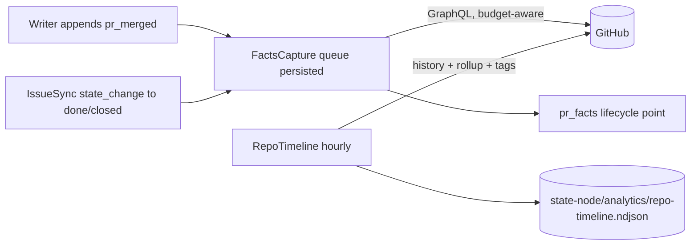

# EXP-X1-4 GitHub facts and repo timeline - Plan

## Summary

Two GitHub capture paths, both budget-aware and fail-open, both gated by `observability.capture_github_facts`:

1. **Ticket PR facts.** One GraphQL read per ticket at a terminal event (PR merged, or ticket closed). It returns the PR's created, ready, first-review, approval and merge times, review counts by state, PR size, the merge commit, and the issue's parent (epic). It is recorded as a `pr_facts` lifecycle point.
2. **Repo timeline.** An hourly read of base-branch history. It returns each commit's status rollup (main-red intervals), revert detection, non-ticket merges, and tags. It is appended to `<state-node>/analytics/repo-timeline.ndjson`, keyed by commit SHA.

## Problem Frame

- Approvals and empty COMMENTED reviews are dropped by the live normalizer (`src/lib/aiur/events/github_webhook/normalizer.ex:828-836`), so first-review and approval times cannot come from live events.
- The existing `Aiur.RunTelemetry.GitHubEnricher` (`src/lib/aiur/run_telemetry/github_enricher.ex`) is generation-time only. Its sole caller is the HTML telemetry dashboard (`src/lib/aiur/run_telemetry/dashboard.ex:65`). It lists all repo PRs (20 pages maximum) per report, keeps only trusted actionable comments, and drops approvals and timestamps of review state.
- Nothing records main-branch CI state, reverts, or merges that are not tickets. X6 needs these as confounders, and the brief names main-red and reverts as core metrics.
- PR size (additions, deletions, files, commits) is the main stratification covariate for X4 besides complexity, and it is not captured.

Requirements: R1, R4, R6, R8. Decisions KD4 and KD8.

## Key Technical Decisions

- **KTD1. GraphQL, one query per ticket.** The query covers: `issue(number){ parent{number} labels closedAt }` and the linked PR found by the ticket branch (`TicketBranch`, as in `github_enricher.ex:162-174`) or by `closingIssuesReferences`. It returns `createdAt`, `mergedAt`, `isDraft`, `timelineItems(READY_FOR_REVIEW_EVENT, CONVERT_TO_DRAFT_EVENT)`, `reviews(first:100){state submittedAt author{login}}`, `additions`, `deletions`, `changedFiles`, `commits{totalCount}`, `mergeCommit{oid}` and `baseRefName`. Reason: one round trip, and GraphQL quota is separate from REST. Note from operator memory: check GraphQL quota through GraphQL, not REST `/rate_limit`.
- **KTD2. Derived scalar fields only** go into the `pr_facts` point, so the privacy contract holds:
  - times: `pr_created_at`, `pr_ready_at` (the first ready event, or `createdAt` when the PR was never a draft), `first_review_at`, `first_review_state`, `first_approval_at`, `merged_at`;
  - review counts: `review_count`, `changes_requested_count`, `approval_count`, `reviewers_distinct`;
  - review classes: `reviewer_classes` (a bounded list of `trusted`, `bot` or `other`, using `CodeOwners.allowed?`);
  - PR size: `additions`, `deletions`, `changed_files`, `commit_count`;
  - merge and epic: `merge_commit_sha`, `epic`.
  No bodies and no logins are recorded, except one: the Executor review identity class. Reason: a review by the Executor counts as a review.
- **KTD3. When it runs.** It runs in a `Aiur.RunTelemetry.FactsCapture` worker under the telemetry supervisor. The worker is triggered by the Writer appending `pr_merged`, and by IssueSync observing a terminal or closed state (through the EXP-X1-3 `state_change`). It dedupes by `{ticket, pr_number, merged_at}`. It retries with backoff up to 3 times, then records `pr_facts` with `coverage: "unavailable"`. It also exposes `capture(ticket)` for backfill (EXP-X1-5).
- **KTD4. Repo timeline.** A `Aiur.RunTelemetry.RepoTimeline` GenServer reads base-branch `history(since: last_cursor)` every hour and once at boot. It reads `oid`, `committedDate`, `messageHeadline` (used only to classify reverts; never stored), `associatedPullRequests(first:1){number headRefName title-prefix-check}` and `statusCheckRollup{state}`. It appends rows of these types to `<state-node>/analytics/repo-timeline.ndjson`:
  - `commit`, with sha, ts, pr_number, ticket (via TicketBranch, or nil), rollup_state and `revert_of`;
  - `main_red_start` and `main_red_end`, from transitions in the rollup state of consecutive commits;
  - `tag`, from `refs(refPrefix:"refs/tags/")` with the target SHA.
  Rows are idempotent by `(type, sha)`. Reason: an append-only file in the state node survives log-root clears and telemetry retention. This is the X6 confounder feed and the X3 tag feed.
- **KTD5. Revert detection.** A commit is a revert when its headline starts with `Revert "` or the commit message contains `This reverts commit <sha>`. The message is read in-process and discarded. `revert_of` is the reverted SHA. The ledger maps that SHA to a ticket through the `merge_commit_sha` in `pr_facts`.
- **KTD6. Budget.** All reads go through `Aiur.GitHub.Transport` with `caller: "analytics_facts"` or `"analytics_repo_timeline"`. They honor the GitHub budget hold (`Aiur.GitHub.Budget`). Under a hold they defer and do not drop: the work queue persists in the facts-pending file so it survives a restart. Expected cost: about one query per merged ticket, plus 24 small queries a day.
- **KTD7. Keep GitHubEnricher.** The HTML dashboard keeps using it. Its approval gap is noted in its moduledoc. Unifying it with FactsCapture is deferred.

## High-Level Technical Design

## Implementation Units

### U1. Facts query and pure normalizer

**Files:** `src/lib/aiur/run_telemetry/github_facts.ex` (new: query builder and pure `normalize(response) -> facts map`), `src/test/aiur/run_telemetry/github_facts_test.exs` with recorded JSON fixtures under `src/test/support/fixtures/github_facts/`.
**Test scenarios:**
- A PR opened as a draft, then marked ready, gives `pr_ready_at` equal to the ready event, not `createdAt`.
- A non-draft PR gives `pr_ready_at == pr_created_at`.
- Reviews COMMENTED (empty), then CHANGES_REQUESTED, then APPROVED give `first_review_at` at the first review of any state, `changes_requested_count: 1` and `first_approval_at` at the approval.
- A ticket with no PR gives facts with `pr_number: nil` and the epic still set.
- A response that includes bodies yields no body field in the output.

### U2. FactsCapture worker

**Dependencies:** U1. It uses the EXP-X1-3 `state_change` trigger when present; until then it triggers on `pr_merged` only.
**Files:** `src/lib/aiur/run_telemetry/facts_capture.ex` (new), `src/lib/aiur/run_telemetry/supervisor.ex`, `src/lib/aiur/run_telemetry/writer.ex` (notify on `pr_merged`), `src/lib/aiur/run_telemetry/lifecycle.ex` (`pr_facts` event and whitelist), `src/test/aiur/run_telemetry/facts_capture_test.exs`.
**Test scenarios:**
- A `pr_merged` append enqueues one capture, and a duplicate merge does not enqueue another.
- A budget hold defers the capture, and the queue survives a worker restart, because it is read back from the pending file.
- Three transport failures give a `pr_facts` with `coverage: "unavailable"`.
- `capture_github_facts: false` gives no request at all.

### U3. Repo timeline

**Files:** `src/lib/aiur/run_telemetry/repo_timeline.ex` (new), `analytics/schema/repo-timeline.v1.json` (new), `src/test/aiur/run_telemetry/repo_timeline_test.exs`.
**Test scenarios:**
- Commits with rollups SUCCESS, FAILURE, FAILURE, SUCCESS give one `main_red_start` at the first FAILURE and one `main_red_end` at the next SUCCESS.
- A headline `Revert "Add X (#123)"` with "This reverts commit abc" gives `revert_of: "abc"`.
- A second run over the same window appends nothing.
- A merge commit whose PR branch is not a ticket branch gives `ticket: nil`, which marks a non-ticket merge.
- PENDING rollups do not open or close a red interval.

### U4. Reducers and docs

**Files:** `analytics/lib/analytics/reduce.py` (carry `pr_facts`), `src/lib/aiur/run_telemetry/dataset.ex`, `analytics/README.md` (the repo-timeline file), `website/docs-app/reference/configuration.md` (`observability.capture_github_facts`, added in EXP-X1-6), tests.

## Interfaces offered to other areas

- X3: `tag` rows and the feature epic's merge (an epic close is visible via `pr_facts.epic` plus the IssueSync `state_change`). X3 owns the trigger logic.
- X6: repo-timeline rows are the confounder feed.
- X4: `additions`, `deletions`, `changed_files` and `commit_count` serve as stratification covariates.

## Risks

- **GraphQL secondary rate limits under a merge burst.** Mitigation: a serial queue with spacing, plus budget-hold deferral.
- **Private consumer repos without the needed token scopes.** Mitigation: the error is a warning with `coverage: unavailable`, and daemon capture still works.
- **The ticket branch convention differs in consumer repos.** Mitigation: fall back to `closingIssuesReferences`.
