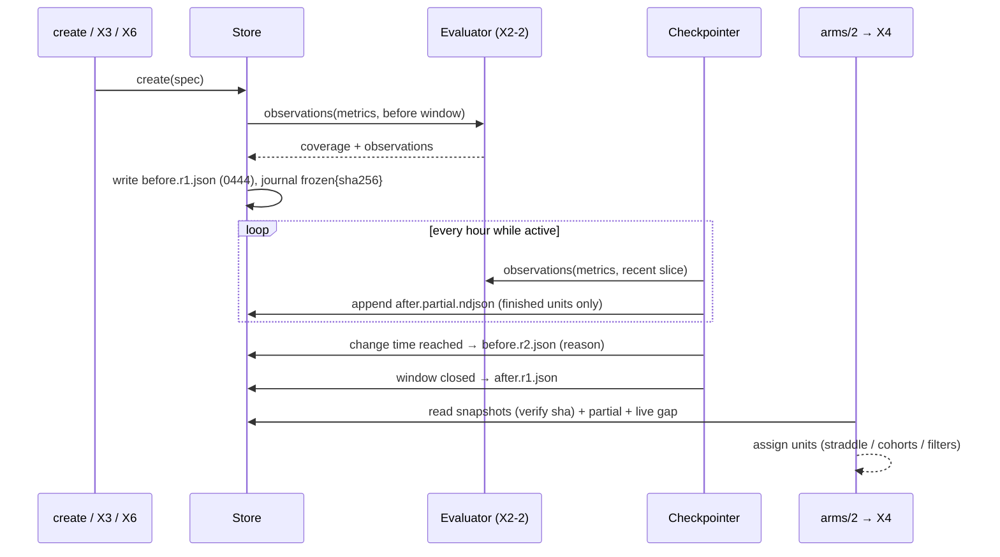

# EXP-X2-4: Freeze baselines, checkpoint running windows and assign arms - Plan

Product Contract: [brainstorm.md](brainstorm.md) (R4, R5, R10, R16, KD3, KD7, KD8, KD10). Product Contract unchanged.
Depends on EXP-X2-2 (evaluator). Does **not** depend on EXP-X2-3: tests use the fixture pack.

## Summary

Make experiment data outlive telemetry retention (30 days / 64 MB, `src/lib/aiur/config/schema/observability.ex:18-19`).
`freeze` writes an immutable snapshot of the raw observations (plus a summary) for a window; `create` freezes the before window at once; a checkpoint worker appends after-window observations as they arrive; `arms/2` assigns units to arms and is the single input X4 needs.

---

## Key technical decisions

- **KTD1. Snapshot = raw observations + summary** (session-settled: KD7). File `snapshots/<window>.r<N>.json`: `schema_version, experiment_id, window{start,end}, revision, computed_at, aiur_version, packs{id, version, definition_sha256}, metrics{ref: {coverage, summary{n, median, p25, p75, min, max}, observations[]}}, sha256` (sha over the canonical JSON without the `sha256` field). The summary is convenience for the page; X4 recomputes from observations.
- **KTD2. Immutability.** Written with `Aiur.Fs.atomic_write/3`, then `chmod 0444`. The journal gets `frozen {window, revision, sha256, observation_count}`. A second `freeze` of the same window requires `--reason` and writes `r<N+1>`; `arms/2` uses the latest revision and `show` lists all. Every read verifies the sha; a mismatch marks the snapshot `tampered` and `arms/2` refuses to use it (returns the error, never silently falls back to live data).
- **KTD3. Size guard** (R10). Above `experiments.max_snapshot_observations` (default 50,000) the freeze fails with the count per metric, and nothing is written. Reason: a silent truncation would bias the baseline.
- **KTD4. Freeze on create** (session-settled: KD3). `create/2` for before/after calls `freeze(:before)` after the spec is written; if the change time is in the future the before window ends at "now" and is re-frozen automatically at the change time by the checkpointer (`r2`, reason `change_time_reached`), so tickets between creation and the change are not lost. For #3755 this means: create before #3763 merges, and the final baseline is captured at the merge.
- **KTD5. Checkpoints protect the after window** (KD8). `Aiur.Experiments.Checkpointer` (`use Aiur.PeriodicWorker`, interval `experiments.checkpoint_interval_ms`, default 1 h) evaluates each `active` experiment over `[last_checkpoint_at − overlap, now)` and appends new observations to `snapshots/<window>.partial.ndjson`, idempotent on `(metric, unit_id)` (a unit's value is final once its `finished_at` is set; unfinished units are not written). When the window closes it writes the frozen `after.r1.json` from the partial file plus a final evaluation.
- **KTD6. Arm assignment is X2's** (KD10). Before/after: unit → `before` if `at < change.time` and (`assign_by: start`) its `finished_at` ≤ change.time else straddler (excluded, counted); `after` if `at ≥ change.time + washout` (washout default 0). `assign_by: finish` assigns by `finished_at`. A/B: unit evaluated against each cohort predicate (`Aiur.Experiments.Predicate`); 0 matches → `filtered`, >1 → `ambiguous`. Spec `filters` apply first.
- **KTD7. Source precedence.** `arms/2` uses frozen snapshot → partial checkpoint → live evaluation, and labels each arm with its `source`. Live data is merged only for the part of the window no snapshot covers.
- **KTD8. Below min samples is reported, not hidden.** `arms/2` returns every arm with `n`; flagging "not enough data" is X4/X5's job using `min_samples` from the spec.

---

## High-level technical design

---

## Implementation units

### U1. Snapshot writer and reader

**Goal:** immutable, verifiable window snapshots.
**Requirements:** R10, KTD1-KTD3.
**Dependencies:** EXP-X2-2.
**Files:** `src/lib/aiur/experiments/snapshot.ex`, `src/test/aiur/experiments/snapshot_test.exs`.
**Test scenarios:**
- Freeze writes `before.r1.json`, mode 0444, journal `frozen` with matching sha.
- Edit one byte → read returns `{:error, :tampered}`.
- Second freeze without reason → error; with reason → `r2`, `r1` kept.
- 50,001 observations → error listing per-metric counts, no file written.
- Canonical JSON: same observations in different input order → same sha.
- Snapshot records pack `definition_sha256`; changing the fixture pack definition after freeze → `show` reports `pack_changed_since_freeze`.

### U2. Arms

**Goal:** the assigned arms X4 consumes.
**Requirements:** R3, R5, KTD6-KTD8.
**Dependencies:** U1.
**Files:** `src/lib/aiur/experiments/arms.ex`, `src/lib/aiur/experiments.ex` (`arms/2`), `src/test/aiur/experiments/arms_test.exs`.
**Test scenarios:**
- Change 12:00: unit 10:00→11:00 → before; 11:30→12:30 → straddle (excluded, `straddle: 1`); 12:10 → after.
- Same with `assign_by: finish` → 11:30→12:30 goes to after.
- A/B claude/codex predicates: a codex unit → `codex`; a unit with `backend: muse` → `filtered`; overlapping predicates → `ambiguous`.
- Frozen before + live after → arms labelled `frozen` and `live`.
- Tampered snapshot → `{:error, {:tampered, "before.r1"}}`, no live fallback.
- Arms with 3 observations and `min_samples: 15` → returned with `n: 3` (no filtering).
- Covers success criterion "baseline survives retention": freeze from fixture telemetry, delete the fixture telemetry, `arms/2` returns identical before observations.

### U3. Checkpointer

**Goal:** after-window data survives retention; baseline re-frozen at the change.
**Requirements:** KD8, KTD4, KTD5.
**Dependencies:** U1.
**Files:** `src/lib/aiur/experiments/checkpointer.ex`, `src/lib/aiur/experiments.ex` (child list), `src/test/aiur/experiments/checkpointer_test.exs`.
**Approach:** `start_paused?` in tests, ticks driven manually with an injected clock. Failures per experiment are journaled as `checkpoint_failed` once per hour and do not block other experiments.
**Test scenarios:**
- Tick appends finished units; second tick with the same data appends nothing (idempotent).
- Unit unfinished at tick 1, finished at tick 2 → written once at tick 2.
- Clock passes change time → `before.r2.json` with reason `change_time_reached`.
- Clock passes after.end → `after.r1.json` built from partial + final slice; partial file kept.
- Concluded or abandoned experiment → skipped.
- Evaluator raises for one experiment → other experiment still checkpointed.

### U4. CLI `freeze`, freeze-on-create, docs

**Goal:** the operator surface.
**Requirements:** R15, R16.
**Dependencies:** U1, U2.
**Files:** `src/lib/aiur/experiments_cli.ex`, `src/lib/aiur/experiments/store.ex` (create hook), `packaging/npm/aiur-cli/libexec/aiur-engine.sh`, `website/docs-app/reference/cli.md`, `website/docs-app/concepts/experiments.md` ("Baselines and retention" section), `src/test/aiur/experiments_cli_test.exs`, `src/test/aiur_engine_test.exs`.
**Approach:** `aiur experiments freeze <id> [--window before|after|observation] [--reason <r>] [--json]`; default window `before` for before/after, `observation` for A/B. `create` prints `froze before window <start>..<end>: <n> observations, coverage <per-metric summary>`; `--no-freeze` skips it. `show` gains snapshot rows (window, revision, sha prefix, n, coverage) and per-arm `n`.
**Test scenarios:** `create` quick form → output names the frozen window and count, journal has `created` then `frozen`; `--no-freeze` → no snapshot; `freeze` on A/B with `--window before` → exit 64; `freeze` twice without `--reason` → exit 1 naming the existing revision.
**Verification:** on a dev daemon, create an experiment over the last 14 days, then `show` lists `before.r1` with n > 0 for `start_to_merge`.

---

## Risks

| Risk | Mitigation |
|---|---|
| The before window is already partly pruned when the experiment is created | Coverage `partial` with `covered_from`; X6 reports it as a threat to validity. |
| Baseline for #3755 must exist before #3763 merges, but this ticket lands after X2-1/X2-2 | X7 should create the spec as early as possible; until this ticket lands, X7 can copy the current run summaries into the experiment's `report/` directory as a fallback (X7 owns that call). |
| Checkpointer load on a busy daemon | Hourly, incremental slices, finished units only. |
| Snapshot growth across many experiments | 50k-observation guard; ticket-unit data is small (A2). |

## Definition of done

U1-U4 merged; deleting the source telemetry after a freeze leaves `show` and `arms/2` byte-identical; `create` freezes by default; the checkpointer re-freezes at the change time and freezes the after window at its end.
