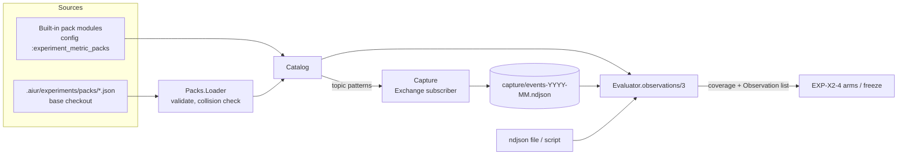

# EXP-X2-2: Add the metric-pack model and consumer-defined packs - Plan

Product Contract: [brainstorm.md](brainstorm.md) (R11, R13, R14, KD2, KD6). Product Contract unchanged.
Depends on EXP-X2-1 ([plan-store.md](plan-store.md)): config section, paths, facade.

## Summary

Define what a metric is and where its observations come from, so a metric pack (built-in or consumer) is the only thing that knows a data source.
Built-in packs implement the `Aiur.Experiments.MetricPack` behaviour. Consumer repos add a JSON file under `.aiur/experiments/packs/` using four generic source kinds (`event_interval`, `event_count`, `ndjson`, `script`); no Aiur code change.

---

## Problem frame

The brief requires the measurement to be generic: "anyone can opt in and use this to measure their own relevant application stats". Today every number Aiur computes is wired to its own ticket lifecycle, and the event bus keeps no history, so a consumer cannot measure anything that happened before they looked.

---

## Key technical decisions

- **KTD1. Metric definition** (data, same for both pack kinds): `id` (`snake_case`), `pack`, `label`, `description`, `unit` (`ms count ratio usd tokens`), `unit_of_analysis` (`ticket pr run hour day` or a consumer string), `kind` (`duration count binary rate bucketed`; X4 picks its test by kind and treats `duration` as censorable), `better` (`lower higher`), `default_direction`, `group` (free label for the page), `requires` (list of capture facts, e.g. `cohort`, `pr_opened`; used to report `not_captured`), `source` (consumer packs only).
- **KTD2. Behaviour for built-in packs.** `id/0`, `version/0`, `metrics/0`, `observations(metric_ids, window, ctx) :: %{metric_id => {coverage, [%Observation{}]}}`. `ctx` carries the clock and injectable data sources so tests run without a daemon. Built-ins are registered in `src/config/config.exs` (`:experiment_metric_packs`), the `:capability_providers` precedent; EXP-X2-3 adds `delivery-speed`.
- **KTD3. Consumer packs are JSON, read from the base checkout only** (session-settled: KD6). Directory list from `experiments.pack_dirs`, resolved against `RepoBase.base_path(repo)` (the default-branch checkout), never an agent workspace. Pack file: `{schema_version: 1, id, version, metrics: [...]}`. Pack id must not collide with a built-in id; collisions are rejected and reported, the built-in wins.
- **KTD4. Four source kinds** (R13). Directional shapes:
  - `event_interval`: `{start: <topic pattern>, end: <topic pattern>, unit_key: <payload JSON pointer or "topic:<segment index>">, attrs: {name: <pointer>}}` → one observation per unit: `end.at - start.at` (first start, first end after it).
  - `event_count`: `{match: <topic pattern>, unit_key | per: hour|day, attrs}` → count per unit or period bucket.
  - `ndjson`: `{path: <repo-relative or state-node-relative path>}`; each line `{unit_id, value, at, attrs?}`.
  - `script`: `{argv: [...], cwd: "repo"}` run with env `AIUR_EXPERIMENT_WINDOW_START`, `AIUR_EXPERIMENT_WINDOW_END`, `AIUR_EXPERIMENT_METRIC`; prints NDJSON observations. No shell; `script_timeout_ms` (default 60 s); stdout cap 8 MB; non-zero exit → `unavailable` with the first stderr line.
- **KTD5. Declared-topic capture journal** (R14). `Aiur.Experiments.Capture` subscribes to the union of `event_interval`/`event_count` patterns through `Aiur.Events.Exchange.subscribe/2` and appends `{topic, at, unit, attrs}` (only the declared fields; never whole payloads, which can hold comment bodies) to `experiments/capture/events-YYYY-MM.ndjson`. Retention: monthly files older than `max(365 days, oldest active experiment window)` are deleted; a frozen snapshot is independent of this journal. Consumers publish their own topics with the existing `aiur executor-emit <topic> --payload <json>`, so no new publish surface is needed.
- **KTD6. Coverage is computed, never assumed** (R11). For each metric and window: `unavailable` (source failed or pack disabled), `not_captured` (a `requires` fact is absent from the data, e.g. no `cohort` on any ticket record), `partial` (earliest datum is after window start, or capture began after window start; reports `covered_from`), `captured`. Zero observations with `captured` is a valid "nothing happened"; zero with anything else is not.
- **KTD7. Spec validation upgrade.** `create`/`amend` now reject a metric ref not in `metric_catalog/0`, listing the closest ids. A spec referencing a pack that later disappears still loads; its metrics report `unavailable`.
- **KTD8. Trust boundary.** Scripts and ndjson paths come only from the base checkout, are resolved and contained with `Aiur.PathSafety`, run with `Aiur.AgentEnvironment`-style scrubbed env (no `GITHUB_TOKEN`, provider keys or `AIUR_SUPERVISOR_TOKEN`). The same trust level as `hooks.*` (operator-owned repo config). Recorded as open question Q2 in the brainstorm.

---

## High-level technical design

---

## Implementation units

### U1. Metric definition, Observation and behaviour

**Goal:** the shared data types.
**Requirements:** R11, KTD1, KTD2, KTD6.
**Dependencies:** EXP-X2-1.
**Files:** `src/lib/aiur/experiments/metric_pack.ex` (behaviour), `src/lib/aiur/experiments/metric.ex`, `src/lib/aiur/experiments/observation.ex`, `src/lib/aiur/experiments/coverage.ex`, `src/test/aiur/experiments/metric_test.exs`, `src/test/aiur/experiments/coverage_test.exs`, `src/test/support/experiments/fixture_pack.ex`.
**Approach:** `Observation.new/1` rejects non-numeric values, NaN/inf, and missing `at`. `Coverage.classify(requires, data_facts, window, earliest_at)` is pure.
**Test scenarios:** observation with string value → error; coverage `partial` when earliest is 3 days after window start, with `covered_from`; `not_captured` when `requires: [cohort]` and facts lack `cohort`; `captured` with zero observations.
**Verification:** fixture pack used by later units compiles against the behaviour.

### U2. Catalog and consumer pack loader

**Goal:** one list of every metric this installation can measure.
**Requirements:** R13, KTD3, KTD7.
**Dependencies:** U1.
**Files:** `src/lib/aiur/experiments/catalog.ex`, `src/lib/aiur/experiments/packs/loader.ex`, `src/priv/experiments/pack.v1.schema.json`, `src/lib/aiur/experiments/spec.ex` (catalog check), `src/config/config.exs`, `src/test/aiur/experiments/catalog_test.exs`, `src/test/aiur/experiments/packs/loader_test.exs`.
**Approach:** loader reads `*.json` under each `pack_dirs` entry in the base checkout, validates, and returns `{packs, problems}`; problems surface in `show`, the capability (`experiments.metric_packs: degraded/pack_invalid`) and an `Aiur.Alerts` attention line once per changed file hash. Catalog is recomputed on demand with a cache keyed by file mtimes; `disabled_packs` removes packs.
**Test scenarios:** valid consumer pack listed with `pack/metric` refs; malformed JSON → problem naming the file, other packs still load; pack id `delivery-speed` in a consumer file → rejected, built-in kept; path in `pack_dirs` escaping the checkout (`../x`) → rejected; `create` with unknown metric → error listing near matches; `disabled_packs: [app]` hides `app/*`.
**Verification:** `aiur experiments show <id>` lists catalog problems.

### U3. Capture journal

**Goal:** consumer topic events outlive the in-memory bus.
**Requirements:** R14, KTD5.
**Dependencies:** U2.
**Files:** `src/lib/aiur/experiments/capture.ex`, `src/lib/aiur/experiments.ex` (child spec list), `src/test/aiur/experiments/capture_test.exs`.
**Approach:** GenServer; on start and on catalog change, diffs topic patterns and calls `Exchange.subscribe/2`/`unsubscribe/2`. Each matching event → extract declared pointers only → append. Write failures are logged and counted, never crash the subscriber (telemetry must not become an orchestration dependency, the `Summaries` fail-open rule). Records `capture_started_at` per pattern for coverage.
**Test scenarios:** publish `app.deploy.started` with a payload holding a `body` field → journal line has `unit`, `at`, declared attrs, and no `body`; pattern removed from the pack → unsubscribed, no more lines; unwritable dir → event dropped, counter incremented, process alive; month rollover writes a new file; retention deletes a file older than the limit but keeps one inside an active window.
**Verification:** `executor-emit` of a declared topic on a dev daemon appears in the journal.

### U4. Evaluator for the four source kinds

**Goal:** observations for any metric over any window.
**Requirements:** R11, R13, KTD4, KTD6, KTD8.
**Dependencies:** U2, U3.
**Files:** `src/lib/aiur/experiments/evaluator.ex`, `src/lib/aiur/experiments/sources/{event_interval,event_count,ndjson,script}.ex`, `src/test/aiur/experiments/sources/*_test.exs`, `src/test/fixtures/experiments/consumer_repo/.aiur/experiments/packs/app.json`, `src/test/fixtures/experiments/consumer_repo/bin/latency.sh`.
**Approach:** `Evaluator.observations(metric_refs, window, ctx)` groups refs by pack, calls built-in modules or the source adapters, and returns `%{ref => %{coverage, observations}}`. Script runner uses `System.cmd` with argv, `cd` = base checkout, scrubbed env, a `Task` timeout, and line-by-line parse with the stdout cap.
**Test scenarios:**
- `event_interval`: start at 10:00, end at 10:05 for unit `a` → 300000 ms; end without start → no observation; two starts → first start used; end before window start → excluded.
- `event_count` per hour over a 3-hour window with events in hours 1 and 3 → three observations `1, 0, 1` (empty buckets are zero only when coverage is `captured`).
- `ndjson`: malformed line skipped and counted in coverage notes; out-of-window lines excluded.
- `script`: fixture prints two lines → two observations; sleeps beyond timeout → `unavailable/timeout`; exit 2 → `unavailable` with first stderr line; `GITHUB_TOKEN` set in the daemon env is absent in the script env; stdout above cap → `unavailable/output_too_large`.
- Success criterion: the fixture consumer repo yields observations for both its metrics with zero Aiur code change.
**Verification:** the fixture repo test runs in CI.

### U5. Capability, CLI and docs

**Goal:** operators see the catalog.
**Requirements:** R15, R18.
**Dependencies:** U4.
**Files:** `src/lib/aiur/experiments/capability_provider.ex`, `src/lib/aiur/experiments_cli.ex` (`aiur experiments metrics [--json]`), `packaging/npm/aiur-cli/libexec/aiur-engine.sh`, `website/docs-app/reference/cli.md`, `website/docs-app/concepts/experiments.md` ("Metric packs" section with a full consumer pack example), `src/test/aiur/experiments_cli_test.exs`.
**Approach:** `metrics` lists pack, metric, unit, better, coverage source kind, and pack problems. `experiments.metric_packs` capability: `available`, `degraded/pack_invalid`, `unavailable/disabled`.
**Test scenarios:** `metrics --json` includes consumer and fixture built-in metrics; invalid pack shows a problem row and exit 0.
**Verification:** docs example pack is the same file as the test fixture (one test loads the docs snippet).

---

## Risks

| Risk | Mitigation |
|---|---|
| Consumer script misbehaves (hangs, floods output, reads secrets) | argv only, timeout, output cap, scrubbed env, base checkout only. |
| Topic-based metrics have no history before registration | Coverage reports `partial`/`covered_from`; docs say "register packs before the change". |
| Capture journal grows unbounded on a chatty topic | Only declared fields stored; monthly files; retention rule; size reported by `metrics`. |
| Pack edit after a baseline freeze changes meaning | Snapshot records pack version and definition hash (EXP-X2-4); report flags the drift. |

## Documentation that ships

`concepts/experiments.md` metric-pack section with a worked consumer example; `reference/cli.md` `experiments metrics`; `concepts/capabilities.md` row for `experiments.metric_packs`.

## Definition of done

U1-U5 merged; the fixture consumer repo produces observations for an `event_interval` metric and a `script` metric in CI; `create` rejects unknown metrics.
