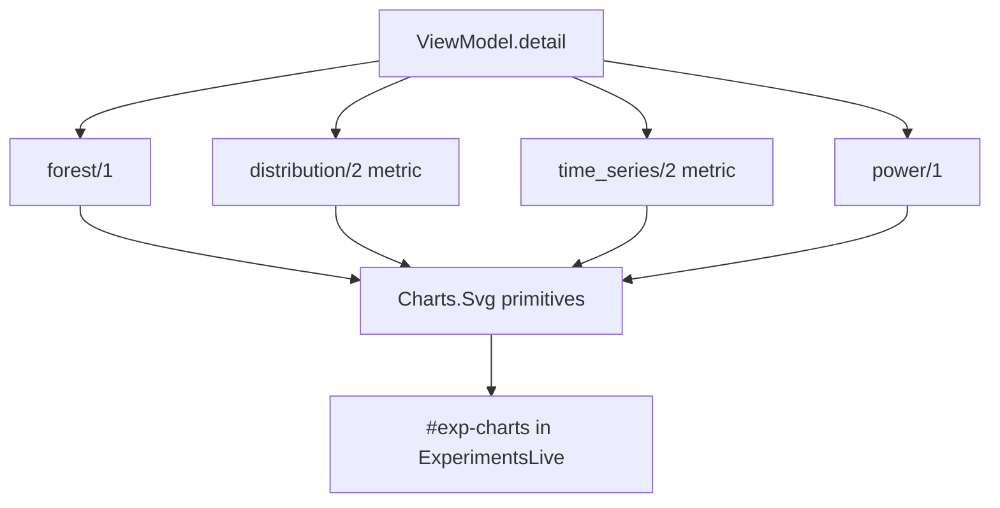

# feat: Experiment charts - metric summary, distributions, time series, power (EXP-X5-2) - Plan

## Goal Capsule

- **Objective.** Fill the `#exp-charts` slot from EXP-X5-1 with four server-rendered SVG charts: the per-metric summary (median difference with CI), the distribution comparison (before/after or cohorts), the time series with the line marked, and the power / samples-needed meter. Each has a text alternative.
- **Product authority.** `docs/research/experiments/x5/brainstorm.md` D4 (sections 2-5), D5, D9, D10, R3, R4, AE1, AE2, AE3. Product Contract unchanged.
- **Open blockers.** EXP-X5-1 (slot, view model, fixtures). X2 facade detail fields (per-group samples with time and stratum; effect with CI; power).

---

## Summary

A new `AiurWeb.Experiments.Charts` module renders inline SVG strings from the view model, the same way `AiurWeb.OperatorControlCenter.Analytics.Charts` does for `/analytics` (`src/lib/aiur_web/operator_control_center/analytics/charts.ex`, 672 lines, private `svg/4`, `x_axis/7`, `y_grid/5` helpers). No client chart library and no statistics in the page.

## Requirements

R3, R4, R6, R8 (chart part); AE1, AE2, AE3.

## Key Technical Decisions

- **KTD1 Own chart module, copied primitives.** The analytics chart helpers are private to `dashboard-ui` and tuned for time-window telemetry. Copy the small SVG primitives (`svg` wrapper, `line`, axis and grid helpers) into `AiurWeb.Experiments.Charts.Svg` rather than making the analytics ones public. Reason: MP-R1 isolation (KTD1 of EXP-X5-1 forbids `Analytics.Charts`), and the experiment charts use a categorical or value axis more than a time axis. About 80 lines of duplication is the accepted cost.
- **KTD2 Metric summary is a forest chart plus the table from EXP-X5-1.** One row per metric. The x-axis is the median difference in percent of the baseline (for cohorts: of the reference cohort, which the spec names). A dot is the point estimate; a bar is the CI from the facade. A dashed vertical rule marks zero. A shaded half-plane marks the expected direction, with a text label "expected" (not colour alone). Rows below the minimum draw a hollow dot and no bar, with "not enough data" text. Percent is chosen so metrics with different units share one axis; absolute values stay in the table. *(KD3: medians, spread and counts visible; no verdict word.)*
- **KTD3 Distribution comparison is box plus dots.** Per group: a box from Q1 to Q3, a median line, whiskers to the most extreme sample within 1.5 IQR, and every sample as a dot. Dots are jittered with a deterministic offset derived from the sample's index (no randomness, so baselines are stable). The y-axis uses the metric's unit; a log scale is used when the facade marks the metric `scale: :log` (durations with long tails). Small samples are the normal case, so showing every dot is honest and readable. A histogram was rejected: it hides n and is unstable below 30 samples.
- **KTD4 Time series.** x = sample time, y = metric value. Dots per sample; a rolling-median line supplied by the facade (the page does not compute it; if the facade omits it, no line is drawn). For a line experiment: a vertical rule at the line time labelled with the line label (for example `v0.0.9` or `epic #3755 merged`), the before and after windows shaded with different tokens, and the frozen-baseline window outlined. For cohorts: no rule; groups differ by colour and marker shape (circle, square, triangle, diamond). Confounder annotations from the facade (X6) are small labelled ticks on the top axis, each with a `<title>` tooltip. Stratum (complexity) is shown as a filter chip row when the facade supplies strata; selecting one is `?stratum=` in the URL and the facade returns the stratified results (no client filtering).
- **KTD5 Power meter.** Per metric, per group: a horizontal bar of samples now against samples needed (from the facade) with text "n 4 of 10 needed" and, when below, "needs 6 more after the line" or "needs 6 more in cohort B". Above the need it reads "enough samples for a 15% effect at 80% power" with the facade's MDE and power. This is a meter, not a chart, so it reuses the `rs-meter` look from the shell.
- **KTD6 Colours.** Before = `var(--faint)` series, after = `var(--accent)`; cohorts use the analytics series palette `--an-s1..--an-s4` (`src/lib/aiur_web/operator_control_center/analytics/styles.ex`), which is already checked for both themes. More than 4 cohorts reuse colours but keep distinct shapes and labels.
- **KTD7 Text alternatives.** Each `<svg>` has `role="img"` and an `aria-label` sentence built by the view model (for example "Start to merge, median 3.1 h before, 2.4 h after, difference -22% (CI -41% to -3%), n 18 and 12"). Under each chart a `
` "Show data" holds a table with the same numbers. Tooltips are SVG `<title>` only; no JavaScript.
- **KTD8 Responsive.** Charts render with a `viewBox` and `width="100%"`. At the mobile breakpoint the forest chart keeps one row per metric with labels above the bar; the time series sits in a horizontally scrollable container with a minimum width of 560 px so the dots stay readable; the document itself never scrolls sideways.
- **KTD9 Metric selector.** The `an-seg` segmented control lists the spec's metrics and patches `?metric=`. On mobile it becomes a native `<select>` styled like `.kh-txt` to avoid a wide control.

## High-Level Technical Design

Chart order inside the slot follows D4: forest, metric selector, distribution, time series, power.

## Implementation Units

### U1. SVG primitives

**Goal:** Copy and adapt the SVG helpers.
**Requirements:** KTD1.
**Dependencies:** EXP-X5-1.
**Files:** `src/lib/aiur_web/experiments/charts/svg.ex`, `src/test/aiur_web/experiments/charts/svg_test.exs`.
**Approach:** Wrapper with `viewBox`, `role`, `aria-label`; linear and log scales; value axis with nice ticks; categorical axis.
**Test scenarios:** nice ticks for ranges 0-1, 0-37, 0.5-9000 (log); every text node is escaped (a label `<b>` renders as text).
**Verification:** unit tests green.

### U2. Forest chart and power meter

**Goal:** Render D4 sections 2 and 5.
**Requirements:** R3, AE1, AE3, KTD2, KTD5.
**Dependencies:** U1.
**Files:** `src/lib/aiur_web/experiments/charts.ex`, `src/test/aiur_web/experiments/charts_test.exs`.
**Test scenarios:**
- Covers AE1. After group n 4 of 10: hollow dot, no CI bar, "not enough data" text; power reads "needs 6 more after the line".
- Covers AE3. Lower-is-better metric: expected half-plane is on the negative side with the text "expected".
- CI crossing zero draws a bar across the zero rule; no colour change implies a verdict (the dot tone is neutral for every row).
- Above the need: power text names MDE and power from the facade.
**Verification:** unit tests green; snapshot of the SVG string for a fixture is stable across two renders.

### U3. Distribution comparison

**Goal:** Render D4 section 3 for both kinds.
**Requirements:** R3, AE2, KTD3, KTD6.
**Dependencies:** U1.
**Files:** `src/lib/aiur_web/experiments/charts.ex`, `src/test/aiur_web/experiments/charts_test.exs`.
**Test scenarios:**
- Line experiment with 12 and 4 samples: two groups labelled "Before" and "After", 16 dots.
- Covers AE2. Two cohorts: groups labelled by cohort names, palette `--an-s1`, `--an-s2`, distinct shapes.
- One group with a single sample: no box, one dot, median tick.
- Log scale metric: ticks are log-spaced.
- Jitter is deterministic: two renders are byte-identical.
**Verification:** unit tests green.

### U4. Time series

**Goal:** Render D4 section 4.
**Requirements:** R3, AE2, KTD4.
**Dependencies:** U1.
**Files:** `src/lib/aiur_web/experiments/charts.ex`, `src/test/aiur_web/experiments/charts_test.exs`.
**Test scenarios:**
- Line experiment: one rule at the line time with its label; before and after shading; baseline window outline.
- Cohort experiment: no rule.
- Two confounder annotations render two ticks with `<title>` text from the facade.
- Facade without a rolling median: no path element for it.
- A sample outside both windows (between the window end and now) is drawn with the "outside window" style and listed in the data table.
**Verification:** unit tests green.

### U5. Wire into the page, selector, stratum chips, text alternatives

**Goal:** Show the charts in `#exp-charts` with URL state.
**Requirements:** R3, R6, KTD7-KTD9.
**Dependencies:** U2, U3, U4.
**Files:** `src/lib/aiur_web/live/experiments_live.ex`, `src/lib/aiur_web/experiments/components.ex`, `src/lib/aiur_web/experiments/styles.ex`, `src/test/aiur_web/live/experiments_live_test.exs`, `src/browser/tests/experiments.browser.spec.mjs`.
**Test scenarios (LiveView):**
- `?metric=pr_open_to_merge` selects that metric in the selector and the distribution and time-series charts.
- An unknown `?metric=` falls back to the first spec metric without an error.
- `?stratum=complexity:2` passes the stratum to `Source.detail/2` and marks the chip pressed.
- Each chart has a "Show data" table whose row count equals the samples or metrics shown.
**Test scenarios (browser):**
- At 1440, switching the metric updates the URL and the two charts without a full reload.
- At 390, the time series container scrolls horizontally and the document does not (`assertNoDocumentOverflow`).
- Axe: no serious or critical violations with charts present, light and dark.
**Verification:** suites green; charts visible on a rebuilt daemon.

---

## Scope Boundaries

- No zoom, brush or pan. No PNG/CSV export.
- No statistics in the page: rolling medians, quartiles, CIs and power all come from the facade (D5).

## Risks

- **Facade lacks sample-level points.** The distribution and time-series charts need per-sample values. If X2 only returns aggregates, the distribution falls back to box only and the time series is omitted with a note; the X2 ticket must carry this field (cross-area link).
- **Large n.** A pack with thousands of samples makes dot plots heavy. The facade caps points per group (assumed 500) and states the cap; the chart notes "showing 500 of 2,310".

## Definition of Done

U1-U5 merged; unit, LiveView and browser suites green on the head SHA; AE1-AE3 visible on the page with fixture data in both themes.
