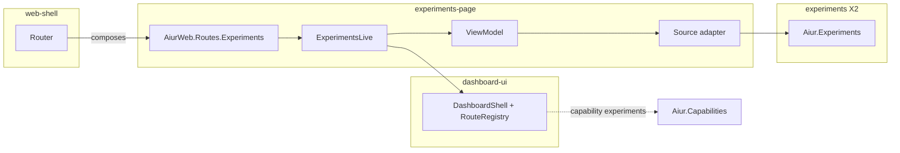

# feat: Experiments page route, index and detail shell (EXP-X5-1) - Plan

## Goal Capsule

- **Objective.** Ship `/experiments` and `/experiments/:id` as a new optional MP-R1 component: route module, nav item, index list, detail header and metric summary table, every empty and partial state, desktop and 390 px layouts. Charts (EXP-X5-2) and the report (EXP-X5-3) plug into slots this ticket creates.
- **Product authority.** `docs/research/experiments/x5/brainstorm.md` (D1-D3, D5-D10, R1, R2, R4-R7). Product Contract unchanged.
- **Open blockers.** The X2 read facade (`Aiur.Experiments`) must exist. Until it merges, build against a test double that implements the assumed interface below; do not merge before X2.

---

## Summary

Add a `experiments-page` component (layer 4, optional) that owns the LiveView, its view model and its route module. It renders inside `DashboardShell` like `AnalyticsLive`, reads data only through `Aiur.Experiments`, and lists the nav item directly below Analytics when the experiments capability is present.

## Problem Frame

There is no page for experiments (brainstorm "Problem"). The shell, nav and route seams already exist: `AiurWeb.Routes.DashboardPages.pages/0` (`src/lib/aiur_web/routes/dashboard_pages.ex:30-56`), the router's composition list (`src/lib/aiur_web/router.ex:64-80`), `RouteRegistry` (`src/lib/aiur_web/operator_control_center/route_registry.ex:4-61`) and `DashboardShell.nav_icon/1` (`src/lib/aiur_web/components/operator_control_center/dashboard_shell.ex:204-232`).

## Requirements

R1, R2, R4, R5, R6, R7 from the brainstorm. Acceptance examples AE1 (index part), AE3, AE4, AE5.

## Assumed interface (X2 owns the names)

| Call | Returns | Used for |
|---|---|---|
| `Aiur.Experiments.list(opts)` | `{:ok, [summary]}` / `{:error, reason}` | index |
| `Aiur.Experiments.fetch(id)` | `{:ok, detail}` / `{:error, :not_found}` / `{:error, reason}` | detail |
| `Aiur.Experiments.status()` | `%{capture: :on \| :off, store: :ok \| {:error, reason}, available?: boolean}` | banners, component-off state |
| `Aiur.Experiments.subscribe()` | `:ok`; then `{:experiments_changed, id \| :all}` messages | live refresh |

Summary and detail fields are listed in the brainstorm ("Dependencies on other areas"). If X2 lands different names, this ticket adapts its single adapter module (U2), not the templates.

## Key Technical Decisions

- **KTD1 Own component `experiments-page`.** Layer 4, kind optional. Paths: `src/lib/aiur_web/live/experiments_live.ex`, `src/lib/aiur_web/experiments/**`, `src/lib/aiur_web/routes/experiments.ex`. Requires `web-kit`, `dashboard-ui`, `experiments` (the X2 component). Forbids `Aiur.RunTelemetry`, `Aiur.RunTelemetry.*`, `Aiur.Orchestrator`, `Aiur.Orchestrator.*`, `Aiur.GitHub`, `Aiur.GitHub.*`, `AiurWeb.OperatorControlCenter.Analytics.Presenter`, `AiurWeb.OperatorControlCenter.Analytics.Charts`, and every `Aiur.Experiments.*` module that X2 does not list as a facade. This mirrors the `build-queue` entry in `components.json` (paths plus `forbid`). Reason: brainstorm D1 reason 3 and KD5. A separate page component keeps the X2 data component (layer 3) free of an upward edge to `dashboard-ui` (rule R-down), which the build-orders entry does not manage today. *(session-settled: user-directed: page reads only the X2 facade)*
- **KTD2 Route module `AiurWeb.Routes.Experiments.pages/0`.** It declares `live "/experiments"` and `live "/experiments/:id"` in the same `live_session :dashboard` options (auth `on_mount: AiurWeb.FinancialDataAccess`). The router composes it right after `DashboardPages.pages()`. `web-shell` gains `experiments-page` in its `optional` list (RC-39 downward composition). Phoenix allows two `live_session` blocks with the same name only once, so the route module opens its own `live_session :experiments` with the same `on_mount`; crossing between sessions is a full navigate, which `RouteRegistry.navigation_mode/2` already returns for a different owner.
- **KTD3 Nav item.** `RouteRegistry` gains `%{id: :experiments, label: "Experiments", path: "/experiments", owner: :experiments, active_actions: [:index, :show]}` placed after `:analytics`. `resolve_runtime_availability/2` (today a no-op, line 101) drops the entry when `Aiur.Experiments.status().available?` is false. Dropping rather than "coming soon" is correct for consumer installs that turned the component off. `nav_icon(:experiments)` draws a flask using `@nav_svg_attrs` (line-art, 24 px grid, same stroke as the others).
  Note: `RouteRegistry` lives in `dashboard-ui`. It must not call `Aiur.Experiments` directly. It reads capability `experiments` (which X2 registers through an `Aiur.Capabilities.Provider`, the same as `src/lib/aiur/build_queue/capability_provider.ex`) from `Aiur.Capabilities.report/1` (`src/lib/aiur/capabilities.ex:8`). `routes/1` already receives a runtime map; the caller passes the capability flag in it, so the registry stays pure and testable. `dashboard-ui` gains `identity` in `requires` if the checker reports the edge.
- **KTD4 One adapter.** `AiurWeb.Experiments.Source` is the only module that calls `Aiur.Experiments`. It turns facade results into a page view model (`AiurWeb.Experiments.ViewModel`) of plain maps: formatted numbers, chip tones, guard copy, ordering. Templates read only the view model. Reason: one place to adapt if X2's names change, and the view model is unit-testable without LiveView.
- **KTD5 Formatting rules live in the view model, not statistics.** The view model formats (percent with sign, one decimal; durations with the pack's unit; `n 4/10`) and picks copy. It never derives a number the facade did not give. A source-scan test fails if `ViewModel` or the LiveView call `Enum.sum`, `median`, `quantile` or `:math` helpers (R4).
- **KTD6 Ordering.** Collecting first, newest `created_at` first; then all other statuses, newest first. Ties by id. Done in the view model so it is tested once.
- **KTD7 Selection is URL state.** `/experiments` on desktop selects the first index item by `push_patch` to its URL; on mobile it shows the index only. Desktop vs mobile is a CSS decision: the LiveView always renders both regions; at the mobile breakpoint CSS shows the index on `/experiments` and the detail on `/experiments/:id`. No server-side user-agent sniffing. `?metric=` holds the chart metric (used by EXP-X5-2), default the first spec metric.
- **KTD8 Styles.** `AiurWeb.Experiments.Styles.css/0` holds page-specific CSS (index list, detail header, summary table, mobile rules) using the shell tokens (`--line`, `--surface`, `--fg`, `--muted`, `--faint`, `--accent-*`, `--good-*`, `--block-*`, `--attn-*`). Cards, KPI tiles, the segmented control and series colours reuse the analytics stylesheet by wrapping content in `.analytics-root` and including `AiurWeb.OperatorControlCenter.Analytics.Styles.css/0`. Copied values for the index rail come from the design's `.decision-card .sev-rail` and `an-*` rules (`design-source/Aiur Dashboard.html:979-1037, 1222-1227`). Reason: D9.
- **KTD9 Live refresh.** `mount/3` calls `Aiur.Experiments.subscribe/0` when connected. `{:experiments_changed, :all}` reloads the index; `{:experiments_changed, id}` reloads the index and, if `id` is open, the detail. No timer (D8).

## High-Level Technical Design

Page layout (desktop): shell nav | index column (fixed 300 px, own scroll) | detail column (fluid). At the mobile breakpoint the two columns collapse into one route-driven view.

## Implementation Units

### U1. Component manifest entry and isolation test

**Goal:** Declare `experiments-page` and prove its boundaries.
**Requirements:** R7, KTD1.
**Dependencies:** X2's `experiments` manifest entry.
**Files:** `components.json`; `scripts/components/allowlist/` (no new rows expected); `src/test/aiur_web/experiments/boundary_test.exs`.
**Approach:** Add the entry (paths, requires, forbid as KTD1; `owns.capabilities: []`). Add `experiments-page` to `web-shell.optional`. The boundary test scans `src/lib/aiur_web/experiments/**` and `live/experiments_live.ex` source for forbidden aliases and statistics helpers (KTD5), so the rule holds before MP-R1-C1 enforces facades.
**Patterns to follow:** `build-queue` entry and its source-scan test (`docs/plans/2026-10-08-build-queue-server.md`).
**Test scenarios:**
- `scripts/check-components.py` passes with the new entry.
- A planted `alias Aiur.RunTelemetry` in a page module makes the boundary test fail (mutation check, done once locally).
- A planted `Enum.sum/1` in `ViewModel` makes the boundary test fail.
**Verification:** component check green; boundary test green.

### U2. Source adapter and view model

**Goal:** Turn facade results into page-ready maps.
**Requirements:** R2, R4, R5, KTD4-KTD6.
**Dependencies:** U1.
**Files:** `src/lib/aiur_web/experiments/source.ex`, `src/lib/aiur_web/experiments/view_model.ex`, `src/test/aiur_web/experiments/view_model_test.exs`, `src/test/support/experiments_fixtures.ex`.
**Approach:** `Source.index/0`, `Source.detail/1`, `Source.status/0` call the facade and map errors to `:not_found`, `:store_unreadable`, `:unavailable`. `ViewModel` builds: index items (name, kind chip text `Before/after` / `A/B` / `A/B/C` / `N cohorts`, status chip, up to 3 headline metrics with signed percent, direction glyph and text "in expected direction" / "against expected direction" / "no change", guard text `n 4/10` and chip, analyst label chips), detail header, summary rows. A metric below its minimum gets `guard: :not_enough_data` and CI/p/effect cells replaced by `"not enough data (n 3 of 10)"`. Fixtures are built from the assumed facade shapes and reused by every X5 test.
**Test scenarios:**
- Covers AE1. 12 before / 4 after, min 10: headline shows `n 4/10`, chip "not enough data", CI cell copy exact.
- Covers AE2 (index part). 2 cohorts gives `A/B`; 3 gives `A/B/C`; 5 gives `5 cohorts`.
- Covers AE3. Custom pack metric `checkout_latency_ms`, lower-is-better, delta -12%: glyph "in expected direction", label and unit from the pack.
- Ordering: two collecting and two reported experiments with mixed dates sort as KTD6.
- No verdict words: rendering every fixture never yields "win", "better", "worse", "regress", "improv" (case-insensitive) outside analyst Markdown.
- Facade `{:error, :enoent}` maps to `:store_unreadable`.
**Verification:** view model tests green.

### U3. Route module, router composition, nav item

**Goal:** Make `/experiments` reachable and listed.
**Requirements:** R1, KTD2, KTD3.
**Dependencies:** U1.
**Files:** `src/lib/aiur_web/routes/experiments.ex`, `src/lib/aiur_web/router.ex`, `src/lib/aiur_web/presenter.ex`, `src/lib/aiur_web/operator_control_center/route_registry.ex`, `src/lib/aiur_web/components/operator_control_center/dashboard_shell.ex`, `src/test/aiur_web/operator_control_center/route_registry_test.exs`, `src/test/aiur_web/components/operator_control_center/dashboard_shell_test.exs`.
**Approach:** As KTD2-KTD3. `AiurWeb.Presenter.analytics_navigation/0` (the map every LiveView passes to `RouteRegistry.routes/1`) gains an `experiments_available?` key read from the capability report, so each existing page shows or hides the item the same way.
**Test scenarios:**
- Registry lists `:experiments` immediately after `:analytics` when the capability is present.
- Registry omits it when the capability is absent; the shell renders no Experiments link.
- `current_route(:show)` returns the experiments route; `navigation_mode` from analytics to experiments is `:navigate`.
- Shell test: the Experiments link carries the flask icon and label, and `aria-current` only when active.
**Verification:** unit tests green; `GET /experiments` with dashboard auth returns 200 in a router test.

### U4. ExperimentsLive: index, detail header, summary table, states

**Goal:** Render the page.
**Requirements:** R1, R2, R5, R6, D2-D4 (sections 1-2), D6-D10, KTD7-KTD9.
**Dependencies:** U2, U3.
**Files:** `src/lib/aiur_web/live/experiments_live.ex`, `src/lib/aiur_web/experiments/components.ex`, `src/lib/aiur_web/experiments/styles.ex`, `src/test/aiur_web/live/experiments_live_test.exs`.
**Approach:** Mount mirrors `AnalyticsLive.mount/3` (`NavState`, `AwaitingCommands`, `current_route`, tracker and agent kind). Render: index `<nav aria-label="Experiments">` of links (D2, D3), detail region with the header (D4.1), the summary table (D4.2, as table on desktop and as one card per metric on mobile via CSS), and two empty slots with stable ids for charts (`#exp-charts`) and report (`#exp-report`). States per D7, each with a `data-empty-reason` attribute the same way `AnalyticsLive` marks `an-empty`. Capture-off banner reads `Source.status/0`. Mobile back link "All experiments" is rendered on detail and hidden above the breakpoint.
**Test scenarios:**
- Covers AE4. Empty store: `data-empty-reason="no_experiments"`, copy names the three creation paths, no `svg` in the detail.
- `/experiments` with two experiments patches to the first item's URL (desktop default) and marks it `aria-current="page"`.
- `/experiments/unknown` renders the not-found state with a link to `/experiments`.
- Store error renders `store_unreadable` without an absolute path in the HTML.
- Capture off: banner text present; experiments still listed.
- `{:experiments_changed, id}` for the open experiment re-renders new numbers; a change for another id updates only the index row.
- Summary table: a metric below minimum shows the not-enough-data copy in CI, p and effect cells.
**Verification:** LiveView tests green; manual run of `aiurdev` shows the page with fixture data in both themes.

### U5. Browser fixture scenarios and functional browser spec

**Goal:** Drive the real page in Playwright with deterministic data.
**Requirements:** R6, R8 (functional part), AE5.
**Dependencies:** U4.
**Files:** `src/test/browser/fixture_server.exs`, `src/test/browser/fixtures/experiments/` (scenario files: `empty`, `mixed`, `not-enough-data`, `cohorts`, `custom-pack`), `src/browser/tests/experiments.browser.spec.mjs`, `src/browser/tests/route-shell.browser.spec.mjs`.
**Approach:** A control route `/experiments-control/:scenario` (same pattern as `/build-queue-control/:state`) points the X2 store root at a scenario directory. Scenario files use X2's on-disk format and include precomputed X4 results so the page is deterministic. Add `/experiments` to the 404/console-error sweep in `route-shell.browser.spec.mjs`.
**Test scenarios (browser):**
- Index-to-detail at 1440: click the second item; URL becomes `/experiments/<id>`; header shows its name; back button returns to the first.
- Covers AE5. At 390x844: `/experiments` shows only the index; tapping an item shows the detail with "All experiments"; `document.documentElement.scrollWidth <= innerWidth` (use `assertNoDocumentOverflow`).
- Every index link and the back link have a hit area of at least 44 px on a touch context.
- Keyboard: Tab reaches the index links in order; Enter opens the experiment; focus is visible.
- Axe scan of `/experiments/<id>` has no serious or critical violations in light and dark.
- `/experiments` with the `empty` scenario shows the empty state and no 404s or console errors.
**Verification:** browser spec green under `src/browser/scripts/run-browser-tests.mjs`.

### U6. Shell baselines for the new nav item

**Goal:** Keep existing visual and parity checks honest after the nav changes.
**Requirements:** R8 (shell part), Q1/Q2.
**Dependencies:** U3.
**Files:** `src/browser/tests/visual-shell.browser.spec.mjs-snapshots/*-nav.png` and `*-shell.png` (regenerated), `src/browser/support/design-parity-allowlist.json`.
**Approach:** Regenerate the affected nav and shell baselines with the pinned Chromium (`src/browser/support/visual.mjs`). Add a `pixel-mask` allowlist entry for the Experiments nav item and the items below it, status `pending-sign-off`, ref to the brainstorm Q1/Q2. Do not touch any other baseline.
**Test expectation:** the visual-shell and parity suites pass; the diff of regenerated PNGs touches only nav and shell images.
**Verification:** CI browser jobs green; PR lists every regenerated file.

---

## Scope Boundaries

- Charts: EXP-X5-2. Report: EXP-X5-3. Page visual baseline matrix: EXP-X5-4.
- No write actions on the page.

### Deferred to Follow-Up Work

- A link from `/analytics` to `/experiments` (brainstorm scope boundaries).

## Risks

- **X2 names differ.** Contained in `Source` (KTD4).
- **Two live sessions.** Moving between `/analytics` and `/experiments` is a full navigate (one extra mount). Acceptable; same as Build Order today.
- **Parity churn.** The new nav row shifts later rows in every parity cell until Kevin signs off (Q2). U6 records it explicitly instead of hiding it.

## Documentation

- `website/docs-app/guide/gui.md`: add Experiments to "The pages" with a short "Read an experiment" subsection (what the guard, CI and power mean; no verdict words). Link the concepts page that X2/X6 write.

## Definition of Done

U1-U6 merged; component check, unit, LiveView and browser suites green on the head SHA; the page runs on a rebuilt daemon and shows fixture or real experiments in both themes at 1440 and 390.
