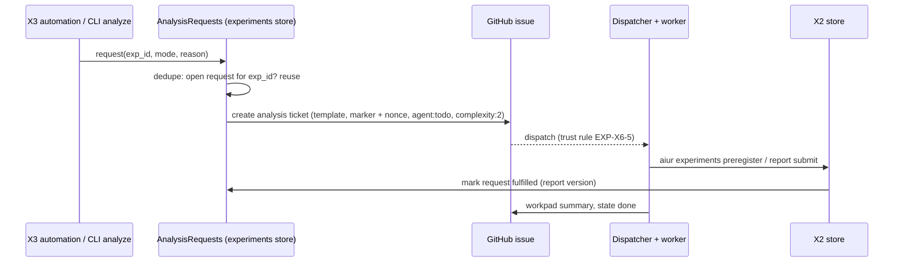

# EXP-X6-4 - Trigger and run the Experiment analyst

## Outcome

Three triggers, one run path, one result:

| Trigger | Mode | Who |
|---|---|---|
| `experiment.created` with `kind: feature` (X3) | `spec` | daemon |
| `experiment.sample_guard_met` (X3) | `report` (interim) | daemon |
| `experiment.planned_n_met` (X3) | `report` (confirmatory) | daemon |
| `aiur experiments analyze <id> [--mode spec\|report]` | as given (default: `spec` when no pre-registration, else `report`) | operator, Executor, consumer user |
| Executor background agent | as given | Executor |

All paths create one **analysis request** in the experiment store and run the
same `aiur-experiment` skill. Brainstorm KD8, KD10, KD11.

## High-level design



### Analysis request record

`~/.aiur/repo/<owner>/<repo>/experiments/<id>/requests.ndjson` (append-only,
written through the X2 facade):

```json
{"request_id": "req-01J...", "experiment_id": "exp-…", "mode": "report",
 "analysis_type": "interim", "reason": "sample_guard_met", "nonce": "<32 hex>",
 "requested_by": "daemon", "ticket": 3812, "state": "open", "at": "…"}
```

States: `open` -> `fulfilled` (submit stored) or `cancelled` (Executor took it
over, or the experiment was archived). One `open` request per experiment;
a new trigger while one is open appends `superseded_reason` and updates mode
to the stronger one (`confirmatory` beats `interim`).

### Analysis ticket template

Title: `Analyze experiment: <title> (<mode>)`. Labels: `agent:todo`,
`complexity:2`, `experiment-analysis`, and priority per config (default none).
Body (generated, no free user text except the experiment title):

```markdown
<!-- aiur-experiment-analysis request=<request_id> nonce=<nonce> -->
Run the `aiur-experiment` skill in **<mode>** mode for experiment `<id>`.

- Inputs: `aiur experiments show <id> --json`, `stats`, `events`.
- Deliverable: a stored <pre-registration|report> via `aiur experiments ...`.
- No code change and no PR. When the submit succeeds, post the summary in the
  workpad and move this issue to done; no human review is needed.
```

Model routing: `complexity:2` routes like any ticket. Confirmatory reports use
`complexity:3` so the stronger model tier writes them.

### `analyze` CLI

```
aiur experiments analyze <id> [--mode spec|report] [--local] [--json]
```

- Default: create or reuse the request and ticket; print the issue URL.
- `--local`: create a request with `requested_by: local`, print the full
  analyst brief (the ticket body plus the skill path) to stdout, file nothing.
  This is the consumer-repo path when no fleet slot is wanted and the Executor
  background-agent path.

### Executor path (aiur-run)

Add a short section to `.claude/skills/aiur-run/SKILL.md` after the
background-review section (origin/main line 1066): to run an analysis in the
Executor session, `aiur experiments analyze <id> --local`, park the analysis
ticket if one exists (`aiur experiments analyze` prints it), dispatch one
background agent with the brief and the `aiur-experiment` skill, then confirm
the submitted report version. Never run two analysts on one experiment.

### Daemon trigger wiring

Subscribe to the three X3 events in the experiments component's own child
(MP-R1: component-owned child spec), not in the orchestrator. Throttle:
at most one ticket creation per experiment per trigger point, ever; a failed
creation retries with backoff and raises an alert after three failures.
Respect `observability.telemetry_enabled == false` (no capture, no
experiments, no triggers) and a new `experiments.analyst.auto_request`
setting (default `true`) so a consumer can keep CLI-only analysis.

## Implementation units

### U1. Analysis requests

- **Files:** `src/lib/aiur/experiments/analysis_requests.ex`,
  `src/test/aiur/experiments/analysis_requests_test.exs`.
- **Tests:** dedupe keeps one open request; confirmatory supersedes interim;
  fulfilled on matching submit (hook in EXP-X6-3 submit path calls
  `fulfill/2`); cancel by Executor.

### U2. Ticket creation

- **Files:** `src/lib/aiur/experiments/analysis_ticket.ex` (render + create via
  a new narrow `Aiur.GitHub.Issues.create/3` POST using the existing
  `request_fun` pattern in `src/lib/aiur/github/comments.ex`),
  tests with a stub `request_fun`.
- **Tests:** body contains the marker with the request nonce; labels include
  `agent:todo` in the same create request (creation rule in
  `.claude/skills/aiur-agent/conventions.md`); title truncation; creation
  failure leaves the request `open` with `ticket: null` and retries.

### U3. CLI `analyze`

- **Files:** `src/lib/aiur/experiments_cli.ex`, `src/lib/aiur/agent_control_cli.ex`,
  CLI tests.
- **Tests:** default mode chosen from pre-registration presence; `--local`
  files nothing and prints the brief; unknown id exit 1.

### U4. Trigger subscriber

- **Files:** `src/lib/aiur/experiments/analyst_trigger.ex` (GenServer in the
  experiments child spec), config schema field
  `experiments.analyst.auto_request` (`src/lib/aiur/config/schema/` file owned
  by X2), tests.
- **Tests:** `experiment.created` kind `release` creates nothing; kind
  `feature` creates a spec request; the same event twice creates one; with
  `auto_request: false` nothing is created.

### U5. Docs

- `.claude/skills/aiur-run/SKILL.md` Executor section; `website/docs-app/reference/cli.md`;
  `website/docs-app/reference/configuration.md` (new key; the config docs
  check `scripts/check-config-docs.py` fails otherwise);
  `concepts/experiments.md` "How analysis runs".

## Risks

- Daemon-created tickets are not dispatchable under today's trust rule. Until
  EXP-X6-5 lands (or Kevin picks option b), the ticket waits for a trusted
  relabel; the CLI prints that.
- An analysis ticket that a worker treats as code work. Mitigation: the body
  says "no PR"; the skill's stop rule; the `experiment-analysis` label lets
  the Executor filter.
