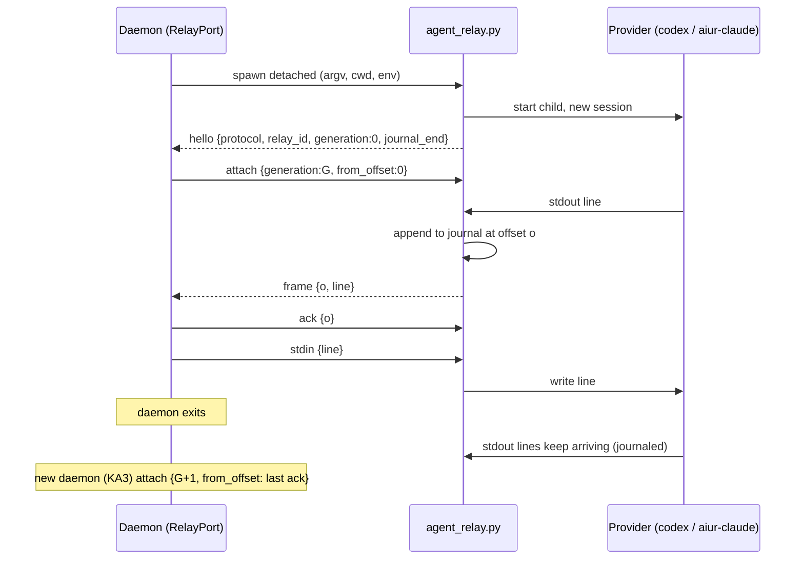

# KA1 Agent relay for app-server backends - Plan

## Goal Capsule

- **Objective:** local Codex app-server and headless Claude (`aiur-claude`)
  agents run behind a detached per-agent relay, so the provider process and its
  conversation survive the daemon BEAM exiting. The daemon talks to the relay
  over a Unix socket instead of owning the provider's stdio through a Port.
- **Product authority:** [brainstorm.md](brainstorm.md) (R3, R5, R8, R15).
- **Open blockers:** none.
- **Product Contract preservation:** unchanged.

---

## Problem Frame

`Aiur.AppServer.Adapter.start_port/4` opens the provider with `Port.open`
(own session via setsid). The Port's stdio closes when the BEAM exits, and
`Aiur.ProcessReaper`, the engine's `reap_aiur_agents` and the BEAM-death
watchdog kill the tree by design. Nothing outside the BEAM can hold the
provider's pipes, so no later daemon can talk to the same process.

## Requirements

- R3 (frames in order, no loss, no duplicates), R5 (one controller, fencing),
  R8 (orphan timeout), R15 (remote workers keep today's path) from the
  brainstorm.
- KA1-R1. With the relay enabled, an agent behaves the same as with a direct
  Port: same frames, same tool calls, same teardown, same telemetry.
- KA1-R2. A relay outlives the BEAM, keeps the provider's stdin open, and
  journals all provider stdout lines while no controller is attached.
- KA1-R3. Disabling the relay (`agent.relay: false`) restores today's direct
  Port path exactly.

## Key Technical Decisions

- **Python relay in `src/priv/agent_relay.py`.** Precedent:
  `src/priv/build_gate_holder.py` (detached, BEAM-independent). No new
  toolchain; stdlib only (`asyncio`, `socket`, `subprocess`).
- **One relay per agent, one provider child per relay.** The relay starts the
  provider with the same argv, env and cwd that `Adapter.start_port/4` uses
  today, in a new session (`start_new_session=True`). The relay itself is
  spawned detached (double fork / setsid) so the BEAM is not its parent.
- **Line-framed journal on disk.** Every provider stdout line is appended to
  `<runtime-state>/agent-relays/<relay-id>/out.journal` with its byte offset
  as the sequence. stderr goes to `err.log`. The controller acks offsets;
  the relay truncates by rotating segments below the acked offset (bounded at
  64 MiB unacked; past that the relay marks itself `lossy` and refuses
  adoption, which KA3 treats as a fallback).
- **Control protocol** (newline JSON over a Unix socket at
  `<relay-dir>/ctl.sock`, mode 0600): `hello {protocol, relay_id, spawn_nonce,
  provider_pid, generation, journal_end}`; `attach {generation, from_offset}`;
  `stdin {line}`; `ack {offset}`; `signal {name}`; `stop {grace_ms}`;
  `detach`. Relay pushes `frame {offset, line}` and `exit {status}`.
- **Generation fencing.** `attach` with a generation not greater than the last
  accepted one is refused; a valid newer attach closes the older connection
  first. Generation is a monotonic counter in
  `<runtime-state>/agent-relays/generation` incremented once per daemon boot.
- **Stable identity.** `relay-id = <repo>.<issue-id>.<spawn-nonce>`; a
  `relay.json` manifest beside the journal records argv, cwd, backend,
  provider pid, pgid, protocol version and created_at. The pid-reuse guard
  checks `/proc/<pid>/cmdline` like `Aiur.ProcessReaper`.
- **Orphan timeout.** With no controller attached for
  `agent.relay_orphan_timeout_seconds` (default 1800), the relay sends TERM to
  the provider's process group, waits 10 s, KILLs, writes `exit`, and removes
  its socket. The journal stays for diagnosis and is swept by the existing
  stale-artifact sweep after 24 h.
- **Daemon side is a transport swap, not a new backend.** A new
  `Aiur.AppServer.RelayPort` process presents the same message shape the
  adapter expects from a Port (`{port, {:data, {:eol, line}}}`,
  `{port, {:exit_status, n}}`), so `Aiur.AppServer.RPC`, `TurnLoop` and the
  Codex/Claude adapters do not change. This keeps the MP-R7 seam intact.
- **ProcessReaper registration.** Register the relay pid with kind `:agent`
  and `comm: "agent_relay.py"`. A normal stop still reaps it (today's
  behaviour); KA3 adds the handoff exemption.
- **Remote workers stay on `SSH.start_port`.** The relay is local only (R15).

## High-Level Technical Design

## Implementation Units

### U1. Relay process

**Goal:** a standalone relay that owns one provider, journals output, serves
one controller, fences generations and enforces the orphan timeout.
**Requirements:** KA1-R2, R3, R5, R8.
**Dependencies:** none.
**Files:** `src/priv/agent_relay.py` (new),
`src/test/priv/agent_relay_test.py` (new; run by the existing Python test
step, or `src/test/aiur/app_server/agent_relay_script_test.exs` if Python
tests are not wired in CI).
**Approach:** asyncio loop; provider stdout reader appends to the journal then
forwards to the attached controller; partial lines are buffered until newline
(Codex frames can exceed 1 MiB, match `Adapter.port_line_bytes/0`);
`fsync` on segment rotation only.
**Patterns to follow:** `src/priv/build_gate_holder.py` (detach, markers,
logging), `src/priv/pidfd_reap.py` (process-group kill).
**Test scenarios:**
- Happy: spawn `cat`-like echo child; attach; stdin round-trips; frames carry
  increasing offsets.
- Detach then reattach from an acked offset replays exactly the unacked
  frames, once each.
- Attach with an equal or lower generation is refused; a higher one closes
  the old connection.
- No controller for the orphan timeout (set to 1 s in test): child process
  group gets TERM, then KILL; relay exits; `exit` recorded in manifest.
- Child exits on its own while detached: exit status is stored and delivered
  on next attach after the remaining frames.
- Unacked journal passes the cap: relay reports `lossy` in `hello`.
- Line longer than 1 MiB is delivered intact.
**Verification:** script tests pass; manual: relay keeps a child alive after
its launching shell exits.

### U2. Daemon transport (`RelayPort`)

**Goal:** the adapter can start a provider through the relay and see the same
messages as from a Port.
**Requirements:** KA1-R1, KA1-R3.
**Dependencies:** U1.
**Files:** `src/lib/aiur/app_server/relay_port.ex` (new),
`src/lib/aiur/app_server/adapter.ex` (choose relay vs Port),
`src/lib/aiur/codex/app_server_port.ex` (process-group metadata from the
relay manifest), `src/lib/aiur/config/schema/agent.ex` (`relay`,
`relay_orphan_timeout_seconds`),
`src/test/aiur/app_server/relay_port_test.exs` (new),
`src/test/aiur/app_server/adapter_test.exs`.
**Approach:** `RelayPort` is a GenServer owned by the runner process; it
connects with `:gen_tcp` on `{:local, path}`, sends `attach`, translates
`frame` to `{self_ref, {:data, {:eol, line}}}` and acks after delivery.
`Port.command/2` and `Port.close/1` call sites go through a small transport
function so both paths share code. `stop_port` maps to `stop {grace_ms}`.
`agent_process_group_id` comes from the relay manifest, keeping
`OrphanedWorkers`/lease-guardian reaping correct.
**Patterns to follow:** `Aiur.AppServer.Adapter.start_port/4` callbacks
(`on_port_started`), `Aiur.ProcessReaper.register/…`.
**Test scenarios:**
- Happy: a fake app-server script behind the relay completes one turn through
  `Aiur.AppServer.TurnLoop` with the same events as the direct Port path.
- `agent.relay: false` uses `Port.open` (existing adapter tests unchanged).
- Relay socket missing at connect: start fails with a clear error and the
  session start falls back to the direct Port once, with a warning.
- Provider exit propagates as `exit_status` with the same code.
- Teardown via `stop_session` terminates the relay and its child (no
  leftover pids).
**Verification:** the existing Codex and Claude adapter suites pass with the
relay enabled.

### U3. Reaper, watchdog and pidfile integration

**Goal:** today's stop still kills relay agents; a crashed BEAM's watchdog
still reaps them.
**Requirements:** KA1-R1 (no regression in teardown).
**Dependencies:** U2.
**Files:** `src/lib/aiur/process_reaper.ex`,
`packaging/npm/aiur-cli/libexec/aiur-engine.sh` (`agent_pid_matches` comm
for relays), `src/test/aiur/process_reaper_test.exs`,
`src/test/aiur_engine_stop_pidfile_test.exs`.
**Approach:** register the relay pid with `comm: "agent_relay.py"`; reaping
the relay's process tree covers the provider (its child session is listed in
the manifest; reap the provider pgid too, since it is a new session).
**Test scenarios:**
- `aiur stop` with a relay agent running leaves no relay and no provider pid.
- BEAM-death watchdog path reaps relay and provider from the pidfile.
- Recycled pid whose cmdline no longer matches is skipped.
**Verification:** pidfile and reaper suites green; manual stop leaves
`pgrep -f agent_relay.py` empty.

## Scope Boundaries

- No handoff, adoption or `--keep-agents` flag (KA3, KA4).
- Claude REPL panes (KA2).
- Remote SSH workers.

## Risks

| Risk | Mitigation |
|---|---|
| Extra hop adds latency to streaming | Unix socket, line-buffered; measure turn wall time on the fake backend before and after (accept < 2 % change). |
| Journal disk growth | Ack-driven rotation, 64 MiB unacked cap, 24 h sweep. |
| MP-R7 moves `adapter.ex` | Keep the change behind one transport function; rebase onto whichever lands first. |

## Verification Contract

- New and existing adapter, reaper and engine pidfile tests pass.
- With `agent.relay: true`, a full local fleet run of at least one Codex and
  one headless Claude ticket completes with no behaviour change visible in
  `aiurdev agents` or the dashboard.

## Definition of Done

U1-U3 merged; relay enabled by default for local workers; `agent.relay` and
`agent.relay_orphan_timeout_seconds` documented in the config reference.
