# KA3 Quiesce, handoff record and adoption on boot - Plan

## Goal Capsule

- **Objective:** the old daemon hands its running agents to the next daemon
  through a versioned handoff record; the next daemon adopts each compatible
  agent mid-turn before its first tick, and takes today's path for the rest.
- **Product authority:** [brainstorm.md](brainstorm.md) (R2, R4, R5, R6, R9,
  R10, R13).
- **Open blockers:** KA1 and KA2 merged.
- **Product Contract preservation:** unchanged.

---

## Problem Frame

Even with agents alive (KA1, KA2), a new daemon starts with an empty running
map. `Aiur.Orchestrator.OrphanedWorkers` says "The runner is stopped, not
adopted", `Aiur.Orchestrator.StartupClaimReconciler` releases claims that no
live entry protects, and the workspace ownership registry is ETS. The new
daemon has no turn state to continue a turn that started in the old one.

## Requirements

- R2, R4, R5, R6, R9, R10, R13 from the brainstorm.
- KA3-R1. `Aiur.Handoff.prepare/1` (RPC) quiesces and writes the record; it is
  idempotent and returns the record path and per-agent summary.
- KA3-R2. Boot reads the record before the Orchestrator's first tick, before
  `StartupClaimReconciler` and before `OrphanedWorkers` run.
- KA3-R3. Each agent is adopted or falls back with a named reason; the record
  is consumed exactly once (renamed to `.consumed` with the outcome).

## Key Technical Decisions

- **Record location and shape.** `<runtime-state>/handoff/current.json`
  written with `Aiur.JsonStore` (atomic rename). Top level: `handoff_schema`
  (int, starts at 1), `handoff_id`, `written_at`, `from_version` (release
  version + git sha), `generation`, `config_fingerprint` (hash of the fields
  that make adoption unsafe: tracker repo, workspace root, worker hosts),
  `agents[]`. Per agent: issue id and identifier, backend, transport
  (`relay` + relay id + socket + protocol + acked offset, or `repl` + agent
  socket + pane id + hook spool offset), thread/session id, launch settings
  (model, effort, command), workspace path and lease id, turn number, active
  turn id and started_at, outstanding outbound request ids with method,
  token totals, dispatch attempt counters, `started_at` for max duration,
  claim state, retry state.
- **Quiesce order.** (1) set an in-memory dispatch hold (not the persisted
  global pause); (2) block new turn starts in runners (they finish the turn
  they are in, but do not start another until adopted); (3) wait up to 60 s
  for in-flight dynamic tool executions (tracked by
  `Aiur.AppServer.ToolCallLedger` claims) to complete and their responses to
  be written to the relay; (4) runners ack their last delivered offset;
  (5) write the record; (6) set `ProcessReaper` to `handoff` mode, which skips
  every entry listed in the record on shutdown. A tool call still running
  after 60 s stays an uncertain ledger tombstone; the new daemon answers it
  from the ledger (refuses re-execution, returns the ledger's error result).
- **Compatibility gate per agent**, in this order, first failure wins:
  `handoff_schema` supported (else whole record falls back); relay protocol
  supported (N and N-1); relay alive, `spawn_nonce` and provider pid match,
  not `lossy`; config fingerprint fields unchanged; workspace path exists and
  host lock is free or held by this agent; backend still registered;
  `worker_host` is nil. Reasons are atoms: `schema`, `relay_protocol`,
  `relay_gone`, `relay_lossy`, `config_changed`, `workspace_missing`,
  `backend_unknown`, `remote_worker`.
- **Fallback is today's path.** Stop the agent through its relay (or kill the
  pane), keep the claim and tracker state, and let the normal redispatch run
  with `SessionHandle` resume. No new code path for fallback beyond the stop.
- **Adoption builds state, not processes.** For each adopted agent: create
  the workspace lease as `active` with a new guardian, skipping provisioning
  and every git operation; insert the running entry marked
  `adopted_from: handoff_id`; start the runner in adopt mode. Adopted entries
  count against slots and protect claims, so `StartupClaimReconciler` sees
  them.
- **Turn continuation.** The adopt-mode runner rebuilds
  `Aiur.AppServer.TurnState` from the record (thread id, turn id, pending
  request ids), attaches the relay with the new generation from the acked
  offset, and enters the existing await loop. Frames whose id answers a
  pending request resolve it; server-to-client requests (tool calls,
  approvals) are handled as usual. Stall timers restart from adoption time;
  max-duration uses the recorded `started_at`. REPL agents: re-bind to the
  pane on the agent socket, replay the hook spool from the recorded offset,
  then resume the hook-driven turn wait.
- **Fencing.** The new daemon increments the relay generation file before
  any attach. The old daemon is already gone (the engine verifies in KA4),
  and the relay refuses an older generation regardless.
- **Config change policy (R13).** Adopted agents keep recorded launch
  settings; new settings apply to new dispatches. If adopted count exceeds
  `max_concurrent_agents`, all are adopted and new dispatch waits.
- **No dispatch accounting.** Adoption does not bill
  `max_dispatches_per_ticket`, does not post a claim comment, and does not
  change `agent:*` labels.

## High-Level Technical Design

```mermaid
stateDiagram-v2
  [*] --> Running
  Running --> Quiescing: prepare_handoff RPC
  Quiescing --> RecordWritten: tool calls done or 60 s
  RecordWritten --> DaemonGone: BEAM exits, reaper skips listed agents
  DaemonGone --> Checking: new daemon boot, before first tick
  Checking --> Adopted: all checks pass
  Checking --> FallBack: any check fails
  FallBack --> Redispatch: stop agent, keep claim, resume via SessionHandle
  Adopted --> Running
  DaemonGone --> Orphaned: no boot within relay orphan timeout
  Orphaned --> Redispatch: relay stopped agent; next boot takes today's path
```

## Implementation Units

### U1. Handoff record module

**Goal:** a versioned record with write, read, validate and consume.
**Requirements:** KA3-R3, R6.
**Dependencies:** none.
**Files:** `src/lib/aiur/handoff/record.ex` (new),
`src/test/aiur/handoff/record_test.exs` (new).
**Approach:** pure struct plus `Aiur.JsonStore`; forward-versioned or
corrupt records return `{:error, :schema}`; consume renames atomically.
**Patterns to follow:** `Aiur.SessionHandle` (crash-safe, never raises,
versioned).
**Test scenarios:** round-trip; unknown schema; corrupt JSON; consume twice
returns `:already_consumed`; record older than the relay orphan timeout is
treated as `stale`.
**Verification:** suite green.

### U2. Quiesce and prepare

**Goal:** `Aiur.Handoff.prepare/1` runs the quiesce order and writes the
record; reaper honours handoff mode.
**Requirements:** KA3-R1, R4.
**Dependencies:** U1, KA1, KA2.
**Files:** `src/lib/aiur/handoff.ex` (new),
`src/lib/aiur/orchestrator.ex` and `src/lib/aiur/orchestrator/dispatcher.ex`
(dispatch hold), `src/lib/aiur/agent_runner/turn_loop.ex` (hold before next
turn), `src/lib/aiur/process_reaper.ex` (`handoff` mode),
`src/lib/aiur/shutdown.ex`, `src/lib/aiur/agent_control_cli.ex` (RPC verb),
`src/test/aiur/handoff_test.exs` (new), `src/test/aiur/process_reaper_test.exs`.
**Test scenarios:**
- Two fake agents mid-turn: prepare returns both, record lists both with
  acked offsets and pending request ids.
- A dynamic tool running 2 s: prepare waits and the response reaches the
  relay before the record is written.
- A tool running past the deadline: record written; ledger holds an uncertain
  tombstone.
- After prepare, `Application.stop` leaves listed relay and pane pids alive;
  an unlisted agent is reaped.
- No new dispatch and no new turn start after prepare.
- Prepare twice returns the same record.
**Verification:** suite green.

### U3. Boot-time adoption

**Goal:** the new daemon adopts or falls back per agent before its first tick.
**Requirements:** KA3-R2, R2, R5, R6, R9, R10, R13.
**Dependencies:** U1, U2.
**Files:** `src/lib/aiur/handoff/adopter.ex` (new),
`src/lib/aiur/orchestrator/lifecycle.ex` (call before first poll and before
`OrphanedWorkers`), `src/lib/aiur/orchestrator/startup_claim_reconciler.ex`
(count adopted entries as live), `src/lib/aiur/workspace/ownership.ex`
(adopt an active lease without provisioning),
`src/lib/aiur/agent_runner.ex` and `src/lib/aiur/agent_runner/session_lifecycle.ex`
(adopt mode), `src/lib/aiur/app_server/turn_state.ex` (rebuild from record),
`src/lib/aiur/claude/repl_agent.ex` (rebind pane, spool replay),
`src/test/aiur/handoff/adopter_test.exs` (new),
`src/test/aiur/orchestrator/startup_claim_reconciler_test.exs`,
`src/test/aiur/orchestrator/orphaned_workers_test.exs`.
**Execution note:** start with a failing integration test that runs prepare,
stops the app, restarts it with the same runtime-state dir, and asserts the
fake agent's turn completes in the new instance.
**Test scenarios:**
- Covers AE1 (unit level). Fake Codex agent mid-turn survives an app restart;
  the turn completes; no dispatch event, no claim comment, dispatch counter
  unchanged.
- Covers AE2. Fake agent issues a dynamic tool call while the app is down;
  after adoption the tool runs once and the agent gets the result.
- Covers AE3. Record with `handoff_schema: 99`: every listed relay is
  stopped, one alert, tickets redispatch with resume.
- Covers AE4. A second attach with the old generation is refused.
- `config_changed`: tracker repo differs; that agent falls back, others adopt.
- `relay_gone`: relay pid dead; fallback, claim kept.
- REPL agent: `Stop` only in the spool is replayed and the turn completes.
- `StartupClaimReconciler` releases nothing for adopted tickets.
- `OrphanedWorkers` leaves adopted runners alone.
- Adopted count above `max_concurrent_agents`: all adopted, no new dispatch.
- Max-duration measured from recorded `started_at`.
**Verification:** suite green; adopted entries visible in
`Aiur.Orchestrator.StatusReport` with `adopted_from`.

## Scope Boundaries

- CLI, engine stop path and operator report are KA4.
- Warm first poll is KA5.

## Risks

| Risk | Mitigation |
|---|---|
| Turn state rebuilt wrong, agent hangs | Integration test per backend; stall timer still fires and takes the normal recovery path. |
| A runner change adds per-turn state the record does not carry | Record is explicit; adding a field bumps nothing unless required; the adopter test fails if a required field is absent. |
| Lease adoption races the ownership reconciler | Adoption runs before the reconciler's first pass (same ordering guarantee as KA3-R2). |

## Verification Contract

New suites green, existing orchestrator suites green, and the KA4 end-to-end
test passes on top of this ticket.

## Definition of Done

U1-U3 merged; `Aiur.Handoff.prepare/1` reachable through the control RPC;
adoption outcome logged and recorded in the consumed record.
