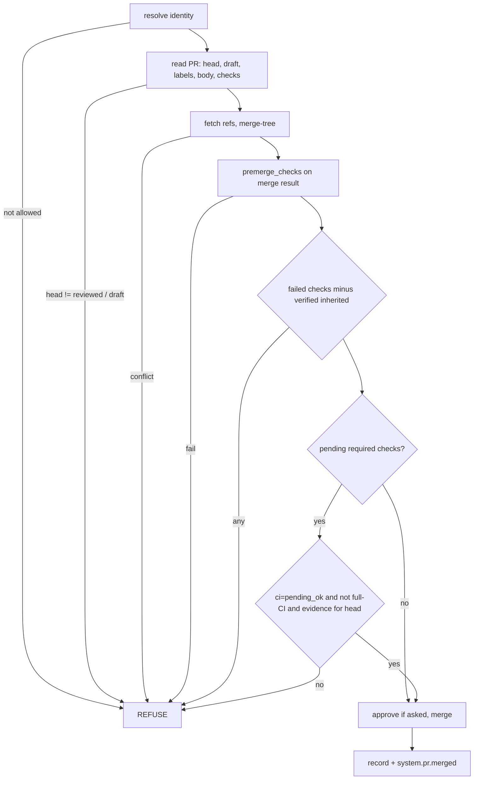

# MP2 aiur pr merge - Plan

## Goal Capsule

- **Objective:** `aiur pr merge <N> --reviewed-sha <sha>` is the only merge
  path the Executor needs. It does everything `merge-if-safe.sh` does, reads
  `merge_policy`, and acts only as a `human_mergers` identity.
- **Product authority:** [brainstorm.md](brainstorm.md) (R2, R4, R5, R6, R7;
  Key Decisions on the standalone command, `human_mergers`, inherited
  failures, evidence).
- **Open blockers:** MP1 (config), MP3 (evidence parser `Aiur.LocalTestEvidence`).
- **Product Contract preservation:** unchanged.

---

## Problem Frame

`~/.aiur/review-scratch/merge-if-safe.sh` is the only thing that stops a
failed check from merging: the ruleset bypass actor skips the status-check
rule as well as the approval rule. The script lives outside the repo, is
untested, hardcodes the repo, and trusts an operator-typed `INHERITED_FAILS`.

## Requirements

- R2, R4, R5, R6, R7 from the brainstorm.
- MP2-R1. Exit codes: 0 merged, 2 refused by policy (one `REFUSE <reason>`
  line per reason), 1 tool or network error. `--dry-run` runs every check and
  merges nothing.
- MP2-R2. `--approve-body-file <f>` posts an approving review before the merge;
  without it the command merges only if the PR already has an approval or the
  identity is a bypass actor.
- MP2-R3. Output names the policy applied and pending checks at merge.

## Key Technical Decisions

- **Standalone CLI path, not daemon RPC.** Add `pr` to the standalone
  commands in `src/lib/aiur/cli.ex` (beside `findings` and `accounts`). It
  loads config from disk, so it works with the daemon down. The token never
  enters the daemon.
- **Credential:** `gh auth token` run with `GITHUB_TOKEN` and `GH_TOKEN`
  removed from its environment, then `GET /user` for the login. Refuse when the
  login is `bot_account` or the App account or is not in `human_mergers`
  (case-insensitive, `GitHubConfig.human_merger_allowed?/2`). Refuse when
  `AIUR_AGENT_BIN` is set or the working directory is under `workspace.root`.
- **Git work in a cache repo, not the operator's checkout.** Fetch base and
  `pull/<N>/head` into refs under `refs/aiur/pr-merge/<N>/` of the configured
  repo root, run `git merge-tree --write-tree`, build the merge commit with
  `commit-tree`, and add a temporary detached worktree under
  `workspace.root/premerge/` only when `premerge_checks` is non-empty. Remove
  refs and worktree on every exit path. No branch is created.
- **Premerge checks run with a timeout (10 min each) and `nice`**, output to
  a log under `~/.aiur/logs/pr-merge/`, last 20 lines printed on refusal.
- **Check states from GraphQL `statusCheckRollup`**, so legacy statuses and
  check runs are covered. Template-name checks containing `${{` are ignored
  as in the script. Required checks come from the base branch rules API; a
  required check not yet reported counts as pending.
- **Evidence check (pending only).** Under `pending_ok` with pending required
  checks, the PR body must have a `Local tests` section whose `Tested head`
  equals the current head SHA (parsed by `Aiur.LocalTestEvidence` from MP3). Missing or stale evidence
  makes the command refuse with "no local-test evidence for <sha>; wait for
  CI". Under `wait` the command does not read evidence.
- **Full CI forced** when `MergePolicy.requires_full_ci?/2` is true for the PR
  labels plus its linked ticket's labels plus its changed paths.
- **Inherited failures.** `--inherited <check>` (repeatable) is accepted only
  when the daemon's main-watch record (RPC read, MP4) shows that check failing
  on a base SHA at or before the PR's merge base and passing on a later base
  SHA. With no daemon or no record, the flag refuses. Until MP4 ships the flag
  always refuses.
- **Attribution scan** (when enabled) over title and body with the script's
  patterns, kept in one module constant: `co-authored-by: claude`,
  `generated with [claude`, `claude-session`, `claude.ai/code/session`.
- **Merge call:** squash, subject `<title> (#N)`, empty body, `--admin`
  equivalent (REST merge with the bypass) only when checks are pending. Report
  GitHub's refusal text verbatim.
- **Record:** append a JSON line to `~/.aiur/logs/pr-merge/merges.ndjson` and
  send `system.pr.merged` (PR, SHA, merged SHA, pending count, policy) to a
  running daemon over RPC; failure to reach the daemon is a warning.
- **Main state shown, not enforced.** When the daemon reports main red, print
  `NOTE main is red since <t> (fixer #<n>)` and continue (brainstorm open
  question 4).

## High-Level Technical Design

## Implementation Units

### U1. Command shell and routing

**Goal:** `aiur pr merge` reaches the Elixir entry point without the daemon.
**Dependencies:** MP1.
**Files:** `packaging/npm/aiur-cli/bin/aiur.js` (`nonLaunchCommands`),
`packaging/npm/aiur-cli/libexec/aiur-engine.sh` (`pr)` case, usage text),
`src/lib/aiur/cli.ex`, `packaging/npm/aiur-cli/test/launcher.test.mjs`.
**Test scenarios:** `aiur pr` prints usage; `aiur pr merge` without
`--reviewed-sha` exits 2 with usage; the launcher does not treat `pr` as a
session launch.

### U2. Identity guard

**Goal:** only a `human_mergers` operator can merge.
**Requirements:** R6.
**Files:** `src/lib/aiur/pr_merge/identity.ex` (new), test.
**Test scenarios:**
- Covers AE4. Login `its-applekid` (bot_account): refuse.
- `aiur-daemon[bot]`: refuse.
- `AIUR_AGENT_BIN` set: refuse before any network call.
- `human_mergers: []`: refuse with a message naming the config key.
- `its-everdred` listed: allowed.

### U3. Gate evaluation

**Goal:** a pure function from PR facts plus policy to merge or refusals.
**Requirements:** R2, R4, R5, MP2-R1.
**Files:** `src/lib/aiur/pr_merge/gate.ex` (new),
`src/test/aiur/pr_merge/gate_test.exs` (new).
**Approach:** collect every refusal, not only the first, so one run tells the
Executor everything.
**Test scenarios:**
- Covers AE1. `wait`, one pending: refuse "waiting for CI (policy ci=wait)".
- Covers AE2. `pending_ok`, one failed: refuse "CI failed: coverage (2/4)".
- Covers AE3. `pending_ok`, label `main-fix`, pending: refuse "full CI
  required (label main-fix)".
- `pending_ok`, path `.github/workflows/ci.yml` in `full_ci_paths`, pending:
  refuse naming the path.
- `pending_ok`, pending, evidence for an older SHA: refuse.
- `pending_ok`, all passed, no evidence: merge (evidence only gates early
  merges).
- `--inherited lint` with a matching main record: merge; without: refuse.
- Head moved and draft together: both reasons printed.

### U4. Git and premerge checks

**Goal:** conflict and structural checks on the real merge result.
**Requirements:** R4.
**Files:** `src/lib/aiur/pr_merge/merge_result.ex` (new), test with a temp
repo fixture.
**Test scenarios:**
- Conflicting PR: refuse "conflict", no refs left behind.
- Clean merge, failing premerge command: refuse with log tail; worktree
  removed.
- Command exceeding the timeout: refuse "premerge check timed out".
- Files changed on both sides without conflict: `NOTE overlap` line, no
  refusal.

### U5. Merge, record, event

**Goal:** perform and record the merge.
**Requirements:** R7, MP2-R2, MP2-R3.
**Files:** `src/lib/aiur/pr_merge.ex` (new orchestrating module),
`src/lib/aiur/agent_control_cli.ex` (RPC entry to publish
`system.pr.merged`), `src/lib/aiur/executor_bindings.ex`, tests.
**Test scenarios:**
- Approve body given: review posted before merge.
- GitHub returns 405 (bypass missing): exit 1 with GitHub's message.
- Daemon down: merged, warning printed, ledger line written.
- `--dry-run`: no review, no merge, exit 0 when all checks pass.

## Scope Boundaries

- Squash merge only. No merge queue, no auto-merge arming.
- The command does not rebase or update the PR branch.

## Risks

- Agents share the operator's Unix user and could run the command with a
  scrubbed environment. The ruleset (approval plus bypass list) stays the real
  boundary; the guard stops accidents.

## Verification Contract

- Gate and identity unit tests; temp-repo integration test for U4; a
  `--dry-run` against a real open PR shows the same verdict as
  `merge-if-safe.sh`.

## Definition of Done

- Merged and rebuilt; the Executor merges one real PR with `aiur pr merge`.
