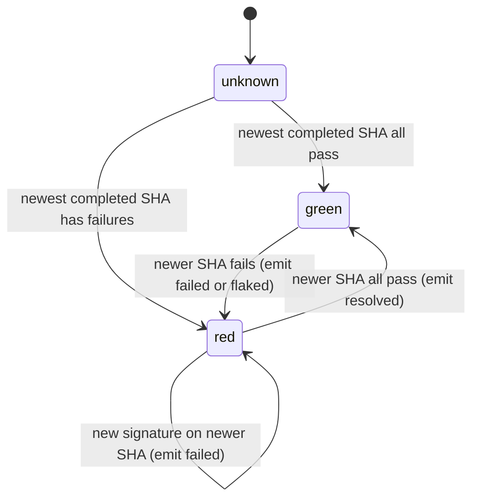

# MP4 Daemon main-watch - Plan

## Goal Capsule

- **Objective:** when `merge_policy.main_watch.enabled`, the daemon knows
  whether the base branch is green or red, emits `system.main.ci.failed` once
  per failure signature with the failing tests and suspect merges, emits
  `.resolved` on recovery, and keeps a canary when main runs stop completing.
- **Product authority:** [brainstorm.md](brainstorm.md) (R7, R11, R14; F2, F3,
  F4; Key Decisions on flakes and reruns).
- **Open blockers:** MP0 (failure digest), MP1 (config).
- **Product Contract preservation:** unchanged.

---

## Problem Frame

`~/.aiur/review-scratch/main-watch.sh` runs only while an Executor shell runs
it. In the daemon, a completed `check_suite` or `check_run` delivery for a
main push has no `pull_requests` and is dropped
(`src/lib/aiur/events/github_webhook/normalizer.ex`, `check_reconcile/2`). The
CI poller polls PR heads only (`src/lib/aiur/events/github_ci_poller.ex`).
Main runs supersede each other (#3212), so a red run can be cancelled before
it reports, and long gaps without a completed run hide breaks.

## Requirements

- R7, R11, R14 from the brainstorm.
- MP4-R1. Webhook path: a completed check delivery whose `head_branch` is the
  configured base branch triggers a main-CI reconcile instead of being
  dropped.
- MP4-R2. Poll fallback: every `polling.interval_seconds`, and on each
  `system.<base>.branch.push`, read check state for the newest base SHAs that
  have completed runs (up to 20 commits).
- MP4-R3. State survives a restart and does not re-emit an already-emitted
  signature.
- MP4-R4. `--inherited` verification data (MP2): per check name, the base SHAs
  where it failed and the first later SHA where it passed, readable over RPC.
- MP4-R5. Canary: when no watched run completed (success or failure) for
  `canary_minutes`, rerun the newest cancelled run if Actions: write is
  available; otherwise raise attention once per window.

## Key Technical Decisions

- **State machine per watched workflow set**: `unknown -> green | red`;
  `red(signature)`; a later SHA whose watched checks all pass moves to
  `green` and emits `system.main.ci.failed.resolved`. A newer SHA still
  running does not change state.
- **Red is decided on the newest completed, non-cancelled SHA**, not on any
  failed run, so a fixed-then-superseded failure does not alert.
- **Watched set**: checks whose workflow name is in `main_watch.workflows`
  (empty = all). Check runs carry the workflow through their check suite's
  app and name; the aiur repo sets `[ci]`, which leaves #3835's `website`
  failures out.
- **Events through `Aiur.Alerts.emit_system/2`**
  with topic `system.main.ci.failed`, durable, dedup key `sha+signature`,
  and `.resolved`; plus `system.main.ci.flaked` (informational) when every
  failure is a known flake. Add all three to `ExecutorBindings` defaults so
  the Executor wakes.
- **Payload**: SHA, run URLs, failing checks, failing tests with
  classification (from `Aiur.CI.FailureDigest`), last green SHA, and the PRs
  merged between last green and red with `early: true` when the MP2 ledger
  event recorded pending checks at merge.
- **Persistence**: one small record in `Aiur.GitHub.ResourceStore` (last green
  SHA, current state, emitted signatures, per-check fail/pass history for 7
  days). It is restart-durable already.
- **Reruns gated on a capability probe.** At boot, record whether the App has
  Actions: write (installation permissions endpoint). Without it, flake-only
  red and the canary raise Executor attention with the run URL.
- **Status line**: MP1's `MERGE POLICY` line appends `main=green`,
  `main=red since 14:02 (#4100)` or `main=unknown`.
- **Webhook subscription**: no new GitHub event type is needed;
  `check_suite` and `check_run` are already subscribed.

## High-Level Technical Design

## Implementation Units

### U1. Normalizer and poll triggers

**Goal:** base-branch check results reach main-watch.
**Requirements:** MP4-R1, MP4-R2.
**Dependencies:** MP1.
**Files:** `src/lib/aiur/events/github_webhook/normalizer.ex` (new reconcile
kind `:main_ci` when `head_branch == base_branch` and no PR),
`src/lib/aiur/events/github_webhook.ex` (route it),
`src/test/aiur/events/github_webhook/normalizer_test.exs`.
**Test scenarios:**
- Completed `check_suite`, `head_branch: main`, `pull_requests: []`:
  `{:reconcile, %{kind: :main_ci, head_sha: ...}}`.
- Same with `head_branch: feature`: still dropped as unresolved.
- `action: requested`: dropped.
- main_watch disabled: dropped as today.

### U2. Main-watch server

**Goal:** hold state, decide transitions, emit events.
**Requirements:** R11, MP4-R3, MP4-R4.
**Dependencies:** U1, MP0.
**Files:** `src/lib/aiur/main_watch.ex` (new GenServer under the
orchestrator supervisor, started only when enabled),
`src/lib/aiur/main_watch/state.ex` (pure transitions),
`src/lib/aiur/executor_bindings.ex`, tests
`src/test/aiur/main_watch/state_test.exs`, `src/test/aiur/main_watch_test.exs`.
**Patterns to follow:** `ci_lifecycle.ex` `publish_ci_terminal_event/4` for
payload and dedupe; its alert reseed after restart.
**Test scenarios:**
- Covers F2. Green then a failing SHA with one new test: one
  `system.main.ci.failed` with the test and suspect PRs.
- Covers AE5 (detection half). Two later SHAs with the same signature: no
  second event.
- New signature while red: second event.
- Covers F3. Only known flakes failing: `system.main.ci.flaked`, no
  `failed`.
- Covers F4. Red then all pass: `.resolved` once.
- Digest `tests: :unknown`: treated as real failure.
- Restart while red with signature S: no re-emit of S.
- Newest SHA still running, older SHA failed and newer passing exists:
  green.
- Inherited query: check failed at SHA a, passed at later b; query with merge
  base a or earlier returns `inherited`, query with merge base after b returns
  `not_inherited`.

### U3. Canary and reruns

**Goal:** detect silent gaps; rerun when allowed.
**Requirements:** MP4-R5.
**Dependencies:** U2.
**Files:** `src/lib/aiur/main_watch/canary.ex` (new),
`src/lib/aiur/github/pull_requests.ex` or a new Actions client (rerun call),
tests.
**Test scenarios:**
- No completed run for 46 min, cancelled run exists, Actions: write:
  one rerun, none again within the window.
- Same without Actions: write: one attention alert per window.
- A rerun already in progress (attempt > 1, not completed): no new rerun.
- `canary_minutes: 0`: never fires.

### U4. Status and RPC

**Goal:** operators and `aiur pr merge` read main state.
**Requirements:** R14, MP4-R4.
**Dependencies:** U2.
**Files:** `src/lib/aiur/agent_control_cli.ex` (status line, RPC
`main_watch_state/0`, `main_watch_inherited?/2`), tests in
`src/test/aiur/agent_control_cli_test.exs`.
**Test scenarios:**
- Covers AE6. Red state: status line shows `main=red since <t>` and the fixer
  ticket when MP5 set one.
- Disabled: `main_watch=off`, no main state.

### U5. Docs

**Files:** `website/docs-app/apis/github.md` (main-watch reads, Actions
permission note), `website/docs-app/reference/configuration.md` (behavior of
each `main_watch` key).
**Test expectation:** none -- docs; docs guards pass.

## Scope Boundaries

- Filing and dispatching the fixer is MP5.
- No log download; test detail comes only from MP0 annotations.

## Risks

- GitHub delivers `check_suite` for several apps; filter to the Actions app
  so a third-party status does not flip state.
- A burst of main merges produces many SHAs; the poll cap of 20 commits and
  per-SHA digest cache bound the reads.

## Verification Contract

- State tests and normalizer tests pass.
- Live check: the next real red main run on the aiur repo produces exactly one
  `system.main.ci.failed`, and the following green run one `.resolved`.

## Definition of Done

- Merged and rebuilt with `main_watch.enabled: true`; `aiur status` shows
  main's state; the Executor stops running `main-watch.sh`.
