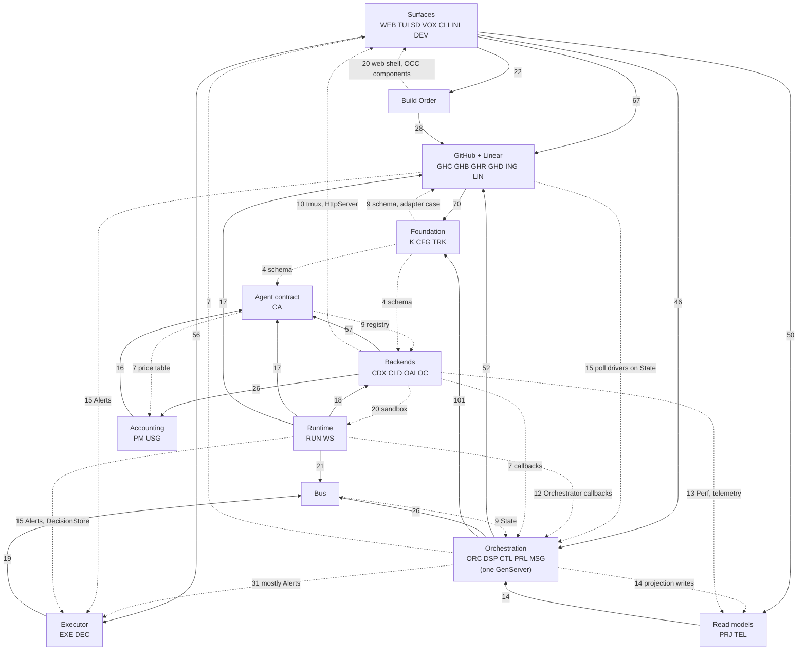

# Aiur feature boundaries — codebase survey

Measured 2026-09-26 against `main` at `0972f0297`, read-only. Scratch data and
scripts: `~/.aiur/research/refactor-2026-09-26/scratch/`.

## Summary

- **Size.** `src/lib` has 1,028 Elixir files and 260,300 lines: 219,421 in
  `aiur/`, 38,762 in `aiur_web/`, and 2,117 in `aiur.ex` plus Mix tasks. On
  2026-07-06 it had 162 files and 58,684 lines, so the code grew 4.4× in under
  three months. Tests are larger than the code: 846 `*_test.exs` files and
  310,187 lines in `src/test`.
- **One knot.** 35 of the 36 candidate boundaries form one strongly connected
  component. Only the dev/test harness is outside it. 99 boundary pairs depend
  on each other in both directions. Nothing can move to a separate repository
  today without first inverting some edges.
- **The knot is mostly mechanical.** 320 of the 2,123 cross-boundary module
  edges point "upward" against a natural layering. Six edge classes cause most
  of them: every feature calls `Aiur.Alerts` directly; every feature calls
  `RunTelemetry.Lifecycle` or `Perf` directly; lower layers call back into the
  `Aiur.Orchestrator` facade; `Aiur.Config` validates by calling feature
  modules; the coding-agent registry and `Aiur.Tracker` name their concrete
  adapters; and generic primitives (crash-safe journal, tmux transport, process
  reaper, agent environment) live inside features that others must import. A
  simulation that moves 57 modules and inverts 71 edges in these classes removes
  61% of the upward edges (320 → 125). The residue is small and listed in §3.4.
- **The orchestrator is one process.** 26 modules under
  `Aiur.Orchestrator.*` state "All functions execute inside the orchestrator
  GenServer process". They share one `Orchestrator.State` struct with about 96
  fields. That struct holds dispatch, retry, pause, CI lifecycle, 21 alert-latch
  fields, and about 17 GitHub poll cursor and ETag fields. `Aiur.Orchestrator`
  exposes 100 public functions and 104 `handle_*` clauses. The July refactor
  split files. It did not split this process or this state.
- **The operator's two examples are real boundaries, but only one is cuttable
  today.** The GitHub caching layer (resource store and read cache, 22 files,
  7,220 lines) is already a set of its own processes and ETS tables, with a
  narrow surface. It can be a package now. The GitHub listeners (event
  ingestion, 40 files, 11,464 lines) are not cuttable yet: the orchestrator
  process drives the comment poll, the firehose and the CI poller (the comment
  poll runs in a task, but the orchestrator starts it and folds the result in),
  and their cursors live in `Orchestrator.State`.
- **Executor attention is scattered and pull-based.** Attention signals leave
  the daemon by at least five paths. The daemon routes wakes by a hard-coded
  topic allowlist and ignores the `needs_attention` flag that alerts carry (57
  files emit alerts). About 50 emitted topics never reach the wake inbox, among them
  `system.pr_health.stale_unreviewed`, `ticket.*.agent.stalled`,
  `ticket.*.agent.usage_limit_exhausted`, and `system.executor_takeover.*`.
  A fleet that is idle because it has no ready work, or because it is globally
  paused, emits no wake at all. The daemon computes "Executor stalled" only when
  a CLI asks for it. §6 has the evidence.

## Method

- **Module graph.** A script parses every `.ex` file under `src/lib`. It
  removes heredoc strings (so `@moduledoc` text does not count) and comments,
  then resolves `alias` forms (`alias A.B`, `alias A.{B, C}`, `as:`,
  `__MODULE__`). It maps every `Aiur.*` or `AiurWeb.*` reference to the longest
  defined module name. The unit is the file's primary module. The result has
  1,062 defined modules and 4,012 distinct module-to-module edges.
- **Boundary map.** Ordered regular expressions assign each primary module to
  one candidate boundary (`scratch/bmap.py`). Matrix cells count **distinct
  module-to-module edges**, not call sites.
- **Other evidence.** Processes are modules that `use GenServer`, `Agent`,
  `Supervisor`, `DynamicSupervisor`, `Task`, or `Phoenix.LiveView`. ETS tables
  are `:ets.new` sites. Churn is the number of commits since 2026-06-01 that
  touched a file (`git log --name-only`).
- **Limits.** The graph is static. It does not see calls through
  `Application.get_env` module injection, `apply/3`, registry names such as
  `Aiur.PubSub` (104 references) or `Aiur.TaskSupervisor` (22), or string
  topics. It undercounts runtime coupling, so treat every number as a floor.

## 1. Inventory

### 1.1 Boundary summary

Codes are used in every table below. "Depends on" and "Depended on by" count
distinct other boundaries. *Churn = commits since 2026-06-01 that touched a
file in the boundary.

| Code | Boundary | Files | Lines | Churn* | Depends on (#) | Depended on by (#) | Processes | ETS |
|---|---|---:|---:|---:|---:|---:|---:|---:|
| K | Kernel primitives | 16 | 1258 | 32 | 3 | 29 | 1 | 0 |
| CFG | Config & workflow | 41 | 7092 | 274 | 15 | 34 | 1 | 1 |
| TRK | Tracker contract (+memory) | 7 | 867 | 31 | 3 | 25 | 0 | 0 |
| LIN | Linear adapter | 3 | 859 | 15 | 2 | 2 | 0 | 0 |
| GHC | GitHub client/auth | 14 | 4907 | 136 | 10 | 20 | 1 | 0 |
| GHB | GitHub budget governor | 20 | 7588 | 87 | 11 | 16 | 4 | 2 |
| GHR | GitHub resource store & read cache | 22 | 7220 | 101 | 7 | 10 | 7 | 4 |
| GHD | GitHub tracker domain | 25 | 9359 | 170 | 10 | 18 | 1 | 1 |
| ING | GitHub event ingestion | 40 | 11464 | 197 | 13 | 14 | 3 | 1 |
| BUS | Event exchange & subscriptions | 20 | 5019 | 104 | 13 | 22 | 6 | 2 |
| ORC | Orchestrator core | 17 | 9670 | 312 | 16 | 21 | 4 | 1 |
| DSP | Dispatch & admission | 15 | 7447 | 128 | 20 | 9 | 0 | 0 |
| CTL | Pause/resume & control lifecycle | 12 | 7299 | 75 | 19 | 11 | 1 | 0 |
| PRL | PR/CI/review lifecycle | 11 | 6313 | 69 | 18 | 10 | 1 | 0 |
| MSG | Operator messaging to agents | 11 | 3021 | 68 | 10 | 10 | 2 | 1 |
| RUN | Agent runner runtime | 35 | 11991 | 271 | 21 | 16 | 5 | 0 |
| WS | Workspace & repo base | 21 | 6554 | 112 | 11 | 15 | 3 | 0 |
| CA | Coding-agent contract & routing | 34 | 5989 | 103 | 14 | 20 | 1 | 0 |
| CDX | Codex backend | 36 | 5837 | 126 | 11 | 6 | 0 | 0 |
| CLD | Claude backend | 33 | 7184 | 159 | 14 | 11 | 3 | 0 |
| OAI | OpenAI-compat backend | 20 | 2639 | 36 | 9 | 1 | 1 | 0 |
| OC | opencode integration | 44 | 8750 | 124 | 10 | 7 | 14 | 1 |
| PM | Provider meters & accounts | 22 | 2975 | 44 | 5 | 9 | 4 | 0 |
| USG | Usage & pricing ledger | 52 | 9625 | 95 | 7 | 8 | 3 | 0 |
| EXE | Executor attention (wake/alerts) | 26 | 6425 | 87 | 13 | 19 | 8 | 0 |
| DEC | Decisions | 55 | 15930 | 183 | 9 | 15 | 6 | 0 |
| PRJ | Current-run read models | 50 | 8321 | 81 | 15 | 10 | 7 | 1 |
| TEL | Run telemetry & host health | 19 | 6589 | 55 | 13 | 15 | 6 | 0 |
| BO | Build Order | 84 | 20085 | 339 | 15 | 8 | 6 | 0 |
| CLI | Control plane / CLI / daemon lifecycle | 14 | 6887 | 210 | 31 | 4 | 1 | 0 |
| TUI | Terminal UI (tmux) | 49 | 7871 | 150 | 12 | 8 | 4 | 0 |
| WEB | Dashboard (Phoenix) | 96 | 24477 | 628 | 27 | 9 | 9 | 1 |
| SD | Stream Deck server side | 12 | 4425 | 57 | 12 | 1 | 2 | 0 |
| VOX | Voice (ElevenLabs) | 9 | 1545 | 11 | 2 | 3 | 4 | 0 |
| INI | Init wizard & upgrade | 24 | 3987 | 146 | 8 | 4 | 0 | 0 |
| DEV | Dev/test harness & mix tasks | 19 | 2831 | 44 | 11 | 0 | 0 | 0 |

### 1.2 `src/lib/aiur/` namespaces

A namespace is a directory, or a top-level file with no directory. The
boundary column uses the codes from §1.1; a namespace split across boundaries lists
every boundary that holds at least 10% of its lines.

| Namespace | Files | Lines | Boundary | Purpose |
|---|---:|---:|---|---|
| `orchestrator` | 58 | 33,484 | ORC/DSP/CTL/PRL | The orchestrator GenServer and the 57 modules that run inside it or beside it: dispatch, retry, pause/resume, CI lifecycle, comment wake and polling, operator messages, status. |
| `github` | 78 | 27,759 | GHD/GHR/GHB/GHC | GitHub integration: transport and credentials, budget and quota, resource store and read cache, issues/PRs/review threads/labels/CI readiness, poll batches. |
| `build_order` | 56 | 11,084 | BO | Build Order domain: planning packs, catalog, graph projection and analysis, pack status, ad-hoc source, ticket history and detail, GitHub graph fetch. |
| `opencode` | 43 | 8,544 | OC | opencode chat-pane bridge: serve and attach slots, pre-warm, bridge-as-LLM chat completions, session writers, turn markers. |
| `events` | 23 | 8,197 | ING/BUS | Event bus (exchange, topics, publisher, subscriptions, id generator, sanitizer) plus the GitHub pollers, firehose, webhook tail and ls-remote ticker. |
| `claude` | 33 | 7,184 | CLD | Claude backends: headless adapter, REPL agent and launcher, Remote Control, hooks, telemetry receiver, transcript tailers, usage API. |
| `agent_runner` | 16 | 6,099 | RUN | Executes a single issue in its workspace with the configured coding agent. |
| `codex` | 36 | 5,837 | CDX | Codex app-server backend: port, handshake, approvals, turn loop, rate limits, transcript, and the dynamic agent tools (`DynamicTool.*`). |
| `decision_store` | 6 | 5,514 | DEC | The single public Decision application service and serialized writer. |
| `run_telemetry` | 12 | 5,513 | TEL | Facade for daemon-owned run telemetry. |
| `workspace` | 19 | 4,726 | WS | Creates isolated per-issue workspaces for parallel Codex agents. |
| `config` | 33 | 4,545 | CFG | Runtime configuration loaded from the aiur config file (.aiur/config). |
| `agent_list` | 28 | 4,142 | TUI | The agent-list TUI pane: state, input, activation, and the table renderer. |
| `usage` | 26 | 3,687 | USG | Usage pricing: price tables and windows, grouped scopes, headless per-provider usage adapters. |
| `agent_control_cli` | 1 | 3,392 | CLI | The control-RPC command surface: one function per `aiur` subcommand the shell engine invokes in the running node. |
| `init` | 19 | 3,286 | INI | Interactive aiur init wizard. |
| `open_ai_compat` | 20 | 2,639 | OAI | OpenAI-compatible coding-agent backend: transport, registry, tools, command runner, balance baseline, meter probe. |
| `pane_manager` | 13 | 2,297 | TUI | Owns the mapping from agent_identifier to its tmux pane id and drives the conversation-pane grid around the persistent agent-list pane. |
| `app_server` | 17 | 2,230 | CA | Shared core for app-server backends (Codex, Claude headless): JSON-line RPC, turn loop and state, interrupts, tool-call ledger, operator delivery. |
| `webhooks` | 14 | 2,189 | ING | Default-safe facade over per-repo webhook delivery mode. |
| `executor` | 9 | 2,010 | EXE | Executor wake-stream claims, roster, principal, state paths, handoff seeding, takeover advisory. |
| `current_run_membership` | 14 | 1,978 | PRJ | Headless-safe, current-run membership projection. |
| `coding_agent` | 5 | 1,964 | CA | Adapter boundary for coding agent backends. |
| `current_run_projections` | 13 | 1,820 | PRJ | Owns the two current-run read models behind one supervised runtime child. |
| `usage_ledger` | 8 | 1,790 | USG | Stable daemon-owned seam for canonical raw usage accounting. |
| `repo_base` | 1 | 1,539 | WS | Maintains one warm, pre-compiled base checkout of the target repo's configured tracker.base_branch at ~/.aiur/repo/<owner>/<name>/latest so per-issue  |
| `decision_metrics` | 12 | 1,465 | DEC | Bounded Decision lifecycle latency metrics. |
| `usage_envelope` | 4 | 1,464 | USG | A provider-neutral, content-free raw usage measurement. |
| `tmux` | 8 | 1,432 | TUI | tmux integration via shell-out commands. |
| `usage_aggregate` | 8 | 1,387 | USG | Stable daemon-owned seam for the crash-safe usage aggregate/query projection. |
| `usage_compaction` | 6 | 1,297 | USG | Retention/compaction of retired raw usage records. |
| `live_conversation` | 5 | 1,282 | PRJ | Supervised in-memory projection of bounded, generation-isolated conversation evidence. |
| `decision_event` | 2 | 1,150 | DEC | Validated discriminated envelope for append-only Decision lifecycle facts. |
| `eleven_labs` | 6 | 1,100 | VOX | ElevenLabs realtime speech-to-text, text-to-speech, and credit quota. |
| `issue_log` | 1 | 1,049 | RUN | Per-issue file writer that captures the same transcript + alert stream the opencode pane shows. |
| `decision_projection` | 1 | 1,039 | DEC | Pure reducer over the canonical Decision audit stream. |
| `provider_meters` | 6 | 915 | PM | Canonical provider-neutral account meter projection. |
| `provider_account_generation` | 12 | 908 | PM | Owns opaque local account generations for trusted provider auth bindings. |
| `ticket_activity` | 3 | 861 | PRJ | Headless-safe projection of content-free ticket activity observations. |
| `linear` | 3 | 859 | LIN | Linear GraphQL client, config and tracker adapter. |
| `model_discovery` | 5 | 846 | CA | Asks an OpenAI-compatible provider's own HTTP catalogue which models it currently serves, and caches the answer beside the other runtime JSON state. |
| `test_reset` | 1 | 832 | DEV | Implements the aiur --test reset workflow for the 3-ticket events sandbox. |
| `env` | 3 | 828 | CFG | Runtime behaviour built on Aiur.Env.Schema: startup validation, the disabled-integrations boot notice, .env.example generation, and the ~/.aiur/.env v |
| `build_gate` | 1 | 797 | RUN | Shared filesystem lease metadata for agent-launched Mix verification. |
| `codeowners` | 2 | 779 | GHD | Reads GitHub CODEOWNERS files and classifies comment authors. |
| `decision_api` | 4 | 750 | DEC | Machine-facing application facade for canonical Decision operations. |
| `alerts` | 1 | 746 | EXE | Loads alert definitions, emits structured alert events, and optionally plays one configured sound clip. |
| `upgrade` | 5 | 701 | INI | Channel-aware upgrade version notice for aiur run. |
| `workflow_store` | 2 | 692 | CFG | Caches the last known good workflow and reloads it when the config (.aiur/config) or its referenced prompt_file: / hooks_file: changes. |
| `agent_environment` | 1 | 642 | RUN | Helpers for preparing child agent process environments. |
| `executor_wake_inbox` | 1 | 619 | EXE | Durable, cursored Executor wake journal (ndjson) with leased acknowledgement; serves `executor-wait`. |
| `cli` | 1 | 609 | CLI | Escript entrypoint for running Aiur with an explicit config-file path. |
| `agent_queue_store` | 1 | 597 | MSG | In-memory queue state and transitions for agent-facing items. |
| `agent_process_log` | 1 | 576 | RUN | Records agent-workspace subprocess spawns to a durable log. |
| `current_run_outcome_snapshot` | 5 | 561 | PRJ | Read API for merge outcomes associated with the current run. |
| `recent_merge` | 1 | 558 | PRL | Validated, bounded repository-merge fact used by the Executor control center. |
| `open_ticket_source` | 2 | 553 | PRJ | Event-sourced projection of every open ticket on the repository. |
| `current_run_summary` | 5 | 542 | PRJ | Read API for the versioned current-run summary projection. |
| `agent_github_guard` | 1 | 541 | GHB | Installs the fleet guards that wrap agent-launched gh and git commands. |
| `decision_history` | 1 | 540 | DEC | Read-only Executor history projected from Aiur.DecisionStore records. |
| `progress_retention` | 1 | 532 | PRJ | Durable last-known progress readings per ticket. |
| `executor_events` | 1 | 525 | EXE | Durable, Executor-scoped events. |
| `decision_query` | 4 | 524 | DEC | Bounded retained-Decision read contracts. |
| `alert_feed` | 2 | 508 | EXE | Reads persisted structured alert events from the project-scoped alert ledger. |
| `decision_dispatch_tasks` | 5 | 502 | DEC | Bounded, keyed execution for Decision delivery dispatches. |
| `github_cost_cli` | 1 | 498 | GHB | aiur github-cost — where the GitHub API budget actually goes, ranked. |
| `decision_validation` | 1 | 494 | DEC | Normalizes an untrusted decision.requested payload into an Aiur.Decision struct, or returns the first validation failure found as a structured, matcha |
| `poll_cadence` | 1 | 483 | CFG | The single source of truth for "how often should we have heard by now". |
| `decision_attention` | 1 | 477 | DEC | Turns open agent attentions into durable Executor-decision alerts. |
| `alert_ledger` | 2 | 467 | EXE | The project-scoped alert ledger that Aiur.AlertFeed reads. |
| `agent_log` | 1 | 444 | RUN | Reads and parses per-agent workspace logs into a chat-style list of user/assistant/system/tool messages. |
| `coordination_tasks` | 1 | 433 | MSG | Bounded, keyed admission for best-effort coordination side effects. |
| `workflow` | 1 | 431 | CFG | Loads workflow configuration and the agent prompt from the aiur config file. |
| `provider_meter_projection` | 1 | 429 | PM | The consumer-facing read model for registry-declared provider meter facts. |
| `pause_containment` | 1 | 404 | CTL | Pause containment: verifies paused agent process trees are actually stopped. |
| `agent_event_feed` | 1 | 399 | BUS | Bounded, durable event feed for a single agent. |
| `model_availability` | 1 | 398 | CA | Durable observations used by the opt-in model rate-limit fallback. |
| `agent_skills` | 1 | 389 | RUN | Installs aiur's bundled agent-operating skills into each issue-worker workspace. |
| `executor_command_cli` | 1 | 387 | CLI | `aiur executor-answer/escalate/...` Command CLI. |
| `recent_merge_store` | 1 | 387 | PRL | Single-writer store for bounded recent repository merges. |
| `provider_meter_probe` | 1 | 383 | PM | Observes provider usage without an agent ticket. |
| `decision_revision` | 1 | 373 | DEC | Immutable, ordered correction to one active Decision action. |
| `build_orders_cli` | 1 | 369 | BO | Terminal read of the /build-orders page: packs, members, completion, edges. |
| `ci_approval_store` | 1 | 349 | GHD | Durable record of CI lifecycle facts per ticket PR: the head CI approved for human review, the head whose test failure was already deferred once, and  |
| `process_reaper` | 1 | 343 | RUN | Central registry of agent OS processes and tmux panes, reaped through one chokepoint at shutdown so no agent survives an aiur exit. |
| `units_cli` | 1 | 333 | CLI | `aiur units` terminal table of fleet units. |
| `agent_events` | 1 | 325 | BUS | Canonical payload contracts for per-agent and orchestrator-wide PubSub events. |
| `executor_listener` | 1 | 322 | EXE | Daemon-resident, supervised consumer for the reviewed Executor wake bindings. |
| `decision_answer` | 1 | 321 | DEC | Immutable, validated Executor or supervisor answer to one Decision version. |
| `analytics_cli` | 1 | 320 | CLI | `aiur analytics` terminal report. |
| `decision_delegation` | 1 | 318 | DEC | Fail-closed normalization for one supervisor-delegated Decision answer. |
| `supervision_health` | 3 | 307 | TEL | Liveness reporting for the application's fixed supervision contract. |
| `tracker_identity` | 1 | 291 | TRK | Versioned, repository-qualified identity for tracker records. |
| `prewarm` | 1 | 289 | WS | Repo-agnostic toolchain detection for the warm-base build command. |
| `findings` | 1 | 285 | EXE | Durable executor findings stored as bounded NDJSON records in repository state nodes. |
| `decision` | 1 | 280 | DEC | Canonical, versioned Decision representation. |
| `decision_log` | 1 | 279 | DEC | Crash-aware append/replay primitives for the canonical decisions.ndjson audit stream. |
| `http_server` | 1 | 271 | CLI | Compatibility facade that starts the Phoenix observability endpoint when enabled. |
| `github_usage_cli` | 1 | 258 | GHB | aiur github-usage — who is driving the shared GitHub hourly budget. |
| `commands_cli` | 1 | 246 | CLI | `aiur commands` terminal list of Executor Commands (Decisions). |
| `saturation_sentinel` | 1 | 245 | TEL | Daemon-side saturation diagnostics recorder (daemon crash diagnosis, #1429). |
| `rtk` | 1 | 241 | RUN | Admission gate and savings reader for rtk, the CLI output-compression proxy. |
| `decision_revision_dispatch` | 1 | 236 | DEC | Fresh target-state gate for corrective Decision revision delivery. |
| `provider_meter_refresh` | 1 | 236 | PM | Decides *when* provider usage is observed. |
| `log_file` | 1 | 230 | TEL | Configures OTP's built-in file logger handler for application logs. |
| `shutdown` | 1 | 229 | CLI | Centralized shutdown chokepoint. |
| `decision_enrichment` | 1 | 227 | DEC | Pure normalization for a supervising-agent enrichment of one Decision. |
| `build_gate_hold_monitor` | 1 | 223 | RUN | Daemon-side needs-attention alerting for build-gate slots held beyond the configured maximum hold duration (#2349; the #2311 acceptance criterion). |
| `ticket_observation` | 1 | 223 | BUS | A versioned, safe observation attached to ticket-scoped event publications. |
| `model_catalog` | 1 | 210 | CA | Asks a backend's own app-server which models it currently accepts. |
| `opencode_theme` | 1 | 206 | OC | Activates a small opencode theme override that dims the markdownBlockQuote color in chat panes — without forking opencode. |
| `memory` | 2 | 203 | TRK | In-memory tracker adapter for tests and local development. |
| `prompt_builder` | 1 | 201 | RUN | Builds agent prompts from issue data. |
| `agent_resource_guard` | 1 | 192 | RUN | Runtime guard for agent process trees that spawn synthetic CPU load generators. |
| `logs` | 1 | 190 | TEL | Bounds the unified log home to the configured size. |
| `decision_provenance` | 1 | 188 | DEC | Versioned, trusted runtime facts captured when a Decision is accepted. |
| `affected_tests` | 1 | 187 | DEV | Deterministic mapping from changed source paths to the ExUnit test files the scoped pre-PR gate should run, so an agent does not spend a reasoning pas |
| `decision_expiry` | 1 | 186 | DEC | Retires open Decisions after their owning ticket leaves the live agent set. |
| `decision_attention_signals` | 1 | 183 | DEC | Heuristics that flag suspicious Decision classifications for attention. |
| `specs_check` | 1 | 182 | DEV | `mix specs.check` implementation (public functions must carry @spec). |
| `ssh` | 1 | 181 | K | SSH shell-out helper for remote worker hosts. |
| `agent_pubsub` | 1 | 173 | BUS | Thin Phoenix.PubSub wrapper for agent events. |
| `git` | 1 | 168 | K | Thin wrappers around git shell-outs used by Aiur subsystems that need out-of-band access to a remote's refs without making a GitHub REST call. |
| `asks` | 1 | 166 | EXE | Durable Executor-authored requests for the repository operator. |
| `issue_context` | 1 | 166 | RUN | Builds a compact, human-readable summary of an issue for the opencode pane's "intro" system message. |
| `executor_command_attention` | 1 | 165 | EXE | Opens one durable attention per Executor Command version. |
| `session_handle` | 1 | 164 | RUN | Durable per-issue coding-agent session handle, so an in-flight issue can resume its prior agent thread after an aiur restart instead of cold-starting  |
| `tracker` | 1 | 162 | TRK | Adapter boundary for issue tracker reads and writes. |
| `progress_tracker` | 1 | 151 | PRJ | Pure helpers + ETS-backed sample store for the agent-list progress column (R2). |
| `system_file_descriptors` | 1 | 151 | DSP | Reads per-process file-descriptor usage and the soft open-file limit. |
| `agent_chat` | 1 | 147 | MSG | Public facade for Executor messages sent to active agent sessions. |
| `decision_sanitizer` | 1 | 147 | DEC | Redacts untrusted Decision content before persistence/exposure. |
| `launch_state_adoption` | 1 | 145 | EXE | Legacy launch file discovery and one-time project alert-ledger adoption. |
| `token_usage` | 1 | 145 | CA | Shared token usage normalization and display helpers. |
| `decision_authority` | 1 | 141 | DEC | Evaluates whether the configured supervising agent may mutate a Decision and exposes the narrower floor for direct Executor answers. |
| `asks_store` | 1 | 140 | EXE | Durable store behind `Aiur.Asks`. |
| `daemon_lifecycle` | 1 | 131 | CLI | Records daemon start and stop in the durable control-lifecycle journal (<repository-state>/executor/<repo>.control-lifecycle.json). |
| `boot` | 1 | 128 | K | Records the monotonic time at which Aiur's BEAM started, so every subsystem can emit elapsed_ms=<N> in its phase logs. |
| `fs` | 1 | 119 | K | Shared filesystem primitives. |
| `pr_ready_ledger_store` | 1 | 118 | GHD | Durable record of what the polls know about each ticket PR's draft state. |
| `agent_command_installer` | 1 | 116 | RUN | Installs wrapper command shims into a workspace bin dir (used by the gh/git and build guards). |
| `executor_wake_projection` | 1 | 116 | EXE | Reduces an allowlisted event to an identifier-only wake record. |
| `issue` | 1 | 116 | TRK | Normalized issue representation used across all tracker backends. |
| `operator_wait_log` | 1 | 116 | MSG | Records how long Executor messages sit between submission (Aiur.AgentChat.send/3 accept) and provider-confirmed delivery. |
| `event_humanizer_helpers` | 1 | 115 | CA | Shared map-access helpers for event humanizers. |
| `findings_cli` | 1 | 115 | CLI | `aiur findings` terminal surface. |
| `global_config_startup` | 1 | 113 | CFG | Pre-dispatch setup when a run uses shared home-directory settings. |
| `progress_checkin` | 1 | 113 | EXE | Periodic check-in: every interval_ms (default 5 minutes), publish ticket.<id>.operator.progress_request for each active agent so it emits a 1–10 progr |
| `system_cpu` | 1 | 110 | DSP | Samples short-window host CPU headroom from Linux /proc/stat. |
| `decision_artifact` | 1 | 108 | DEC | Validates a single Decision artifact reference: a local path must be absolute and canonicalize (symlink-resolved) beneath one of the caller-supplied s |
| `decision_dispatch` | 1 | 108 | DEC | Renders and sends one durable Decision answer through OperatorMessages. |
| `test_shard` | 1 | 105 | DEV | Content-stable assignment of ExUnit test files to CI coverage shards. |
| `perf` | 1 | 104 | TEL | Always-on structured perf logger for the pane-open hot path and opencode lifecycle. |
| `provider_meter_snapshot` | 1 | 104 | PM | A redacted, versioned projection of one provider account's meter facts. |
| `agent_event_log` | 1 | 103 | RUN | Writes every agent event to the per-workspace structured event stream and materializes the compatibility markdown projection from the same record. |
| `path_safety` | 1 | 101 | K | Symlink-safe path canonicalization. |
| `periodic_worker` | 1 | 101 | K | Shared skeleton for self-rescheduling periodic GenServers (pollers and tickers) — the periodic-tick frame from dup-infra.md cluster 1. |
| `asks_cli` | 1 | 100 | CLI | `aiur asks` terminal surface. |
| `external_content` | 1 | 93 | RUN | The single <external-content> wrapper for text Aiur did not author. |
| `dispatch_budget_store` | 1 | 91 | DSP | Durable per-ticket dispatch lifetime counters. |
| `pubsub_boot` | 1 | 91 | BUS | Starts Phoenix.PubSub for Aiur.PubSub only once the names of a previous incarnation have been released. |
| `launcher_watchdog` | 1 | 90 | CLI | Self-halt safety net for the detached release BEAM. |
| `conversations` | 1 | 89 | MSG | Agent-native facade for opening and closing conversation surfaces. |
| `ticket_branch` | 1 | 88 | TRK | Canonical Aiur ticket branch generation and parsing. |
| `agent_scratch` | 1 | 76 | RUN | Per-workspace scratch directory for agent temporary files. |
| `decision_pubsub` | 1 | 76 | BUS | Phoenix PubSub helpers for Decision change notifications. |
| `process_identity` | 1 | 70 | K | OS-process liveness checks. |
| `secret_redactor` | 1 | 70 | K | Shared well-known credential and capability-URL redaction. |
| `agent_queue_item` | 1 | 65 | MSG | Normalized queue item envelope for agent-facing messages and events. |
| `protocol` | 1 | 63 | CA | Shared atom/string-tolerant access helpers for protocol maps. |
| `decision_command_type` | 1 | 62 | DEC | Data-driven classification of Command types into the authority and reversibility policy they should carry when a request omits those fields. |
| `event_publication_log` | 1 | 62 | BUS | Persists locally-known event publication outcomes independently of agent transcripts. |
| `json_store` | 1 | 60 | K | Atomic-rename JSON file helper for durable persistence. |
| `os` | 1 | 60 | K | Runtime-environment helpers that need to be portable across the platforms Aiur targets (Linux + macOS). |
| `agent_queue` | 1 | 54 | MSG | Queue-item builders for agent-facing conversation and coordination flows. |
| `distribution` | 1 | 54 | CLI | Aiur's Erlang distribution bring-up and monitoring. |
| `executor_bindings` | 1 | 53 | EXE | The hard-coded allowlist of 26 topic patterns that may wake the Executor. |
| `yaml` | 1 | 50 | K | YAML reads that never call :application_controller. |
| `system_memory` | 1 | 49 | DSP | Reads Linux MemAvailable for host memory admission decisions. |
| `alert_topic` | 1 | 45 | EXE | Alert topic helpers: attention keys and `.resolved` pairing. |
| `agent_directory` | 1 | 41 | RUN | Read-side MCP-shaped primitives for agents. |
| `current_run_projection` | 1 | 41 | PRJ | Value type shared by the current-run projections. |
| `metrics` | 1 | 38 | K | Shared path convention for runtime metric files. |
| `agent_build_guard` | 1 | 36 | RUN | Installs shell-independent elixir, mix, and mise entrypoints for the build gate. |
| `shell` | 1 | 36 | K | Single canonical POSIX single-quote shell escaping. |
| `system_load` | 1 | 36 | DSP | Reads the host's 1-minute load average so the orchestrator can hold new agent dispatch when the box is already saturated (#465). |
| `supervisor_token` | 1 | 34 | DEC | Classifies the bearer credential used by the Supervisor Decision API. |
| `jsonl` | 1 | 28 | K | Decode-or-skip helpers for line-oriented JSON (JSONL / ndjson) logs and transcripts. |
| `opaque_identifier` | 1 | 26 | K | Shared boundary validation for opaque identifiers safe to retain or expose. |
| `json_safe` | 1 | 22 | K | Normalizes runtime terms into values that Jason can encode predictably. |
| `sandbox` | 4 | 18 | DEV | Tiny fixture modules for the event-flow sandbox tests. |
| `event_humanizer` | 1 | 11 | CA | Behaviour for humanizing agent event messages in the status dashboard. |
| `agent_config` | 1 | 7 | CA | Behaviour for coding-agent-specific configuration modules. |
| `tracker_config` | 1 | 7 | TRK | Behaviour for tracker-specific configuration modules. |
| **total (194 namespaces)** | **871** | **219,421** | | |

### 1.3 `src/lib/aiur_web/` namespaces

| Namespace | Files | Lines | Boundary | Purpose |
|---|---:|---:|---|---|
| `operator_control_center` | 43 | 9,706 | WEB | Operator Control Center presenters and policies: units, decisions, revisions, analytics, provider meters, run summary, GitHub cache page. |
| `components` | 39 | 8,550 | WEB/BO | Shared function components and layouts, including the Operator Control Center and Build Order components. |
| `live` | 5 | 7,490 | WEB/SD | LiveView pages: dashboard shell, GitHub cache, Stream Deck emulator, analytics, Build Order. |
| `build_order` | 13 | 4,454 | BO | Build Order LiveView runtimes and presenters (planning source, ticket context, route state). |
| `build_order_presenter` | 1 | 1,045 | BO | Pure join from one planning generation, one orchestrator snapshot, and one ticket-activity snapshot into the versioned Build Order view model. |
| `controllers` | 6 | 829 | WEB/ING/DEC | Controllers: observability JSON API, Decision API, GitHub webhook receiver, health. |
| `financial_data` | 6 | 691 | WEB | Protected query, cache, and PubSub facade for financial dashboard records. |
| `streamdeck_logs` | 1 | 637 | SD | Server-side projection of a ticket's activity onto the Stream Deck logs surface. |
| `streamdeck_channel` | 1 | 609 | SD | Phoenix channel the Stream Deck sidecar joins (`streamdeck:fleet`). |
| `presenter` | 1 | 594 | WEB | Shared projections for the observability API and dashboard. |
| `streamdeck_projection` | 1 | 540 | SD | Fleet projection pushed to the Stream Deck. |
| `financial_data_access` | 3 | 417 | WEB | Establishes and verifies the server-side authorization boundary for financial dashboard data. |
| `router` | 1 | 363 | WEB | Router for Aiur's observability dashboard and API. |
| `voice_channel` | 1 | 331 | VOX | Browser dictation channel: the second producer feeding the shared ElevenLabs transcription path. |
| `github_webhook` | 4 | 305 | ING | Shared constants for the GitHub webhook receiver. |
| `stream_deck_grid` | 1 | 286 | SD | Purpose-shaped Stream Deck projection over one orchestrator snapshot. |
| `control_center_presenter` | 1 | 270 | WEB | Composes the Operator Control Center's read model from independent domain providers. |
| `static_assets` | 1 | 260 | WEB | Serves bundled static assets. |
| `build_order_view_model` | 1 | 233 | BO | Versioned, body-free read model for Build Order graph consumers. |
| `markdown` | 1 | 176 | WEB | Minimal, dependency-free Markdown renderer for bounded, already-sanitized ticket and pull-request description text. |
| `streamdeck_strip` | 1 | 166 | SD | Presentation-only descriptors for the mode-dependent Stream Deck touch strip. |
| `streamdeck_commands` | 1 | 132 | SD | Maps Stream Deck key presses to control actions. |
| `streamdeck_key_face_contract` | 1 | 124 | SD | Data-only visual contract shared by the web emulator and @aiur/streamdeck. |
| `control_center_cache` | 1 | 103 | WEB | Serializes and briefly caches the expensive Operator Control Center payload. |
| `supervisor_auth` | 1 | 91 | DEC | Dedicated bearer authentication boundary for the Decision API. |
| `endpoint` | 1 | 86 | WEB | Phoenix endpoint for Aiur's optional observability UI and API. |
| `voice_session_limiter` | 1 | 73 | VOX | Bounds concurrent dashboard dictation sessions. |
| `streamdeck_auth` | 1 | 46 | SD | Stream Deck socket token auth. |
| `streamdeck_transcript_relay` | 1 | 42 | SD | Relays agent transcript lines to the Stream Deck. |
| `voice_socket` | 1 | 41 | VOX | Socket for dashboard dictation audio. |
| `streamdeck_socket` | 1 | 29 | SD | Phoenix socket for the Stream Deck sidecar. |
| `observability_pubsub` | 1 | 27 | WEB | PubSub helpers for observability dashboard updates. |
| `error_html` | 1 | 8 | WEB | Phoenix error view. |
| `error_json` | 1 | 8 | WEB | Phoenix error view. |
| **total (34 namespaces)** | **145** | **38,762** | | |

### 1.4 Other Elixir

| Path | Files | Lines | Purpose |
|---|---:|---:|---|
| `src/lib/aiur.ex` | 1 | 610 | `Aiur` and `Aiur.Application`: boot sequence and the `:rest_for_one` supervision tree of about 90 children. |
| `src/lib/mix/tasks/` | 11 | 1,507 | Mix tasks: `lint`, `specs.check`, `pr_body.check`, `aiur.affected_tests`, `aiur.test_shard`, `aiur.test.reset`, `aiur.cost_report`, `aiur.pricing_window`, `aiur.env.example`, `aiur.telemetry.dashboard`, `workspace.before_remove`. |
| `src/test/` | 914 | 310,187 | Tests. 846 `*_test.exs`. The tree mirrors `lib/` (orchestrator 67, github 67, opencode 36, agent_list 35 test files). 221 files are `async: false` because they share the booted application. |
| `src/priv/` | 36 | 32,556 | Agent-side guards and assets: `github_quota_guard.sh` (3,403), `build_gate.bash` (1,912), `build_gate_holder.py` (1,025), `github_budget.py` (919), `github_push_guard.sh`, `pidfd_reap.py`, `dashboard.css` (10,273), vendored ELK worker, Build Order demo packs. |
| `src/browser/` | 201 (excl. `node_modules`) | — | Playwright browser harness for the dashboard and Stream Deck emulator. |
| `src/examples/workflows/` | 6 | 350 | Portable example configs and prompts. |
| `src/prompts/` | 1 | — | `shared-agent-instructions.md`. |

### 1.5 Non-Elixir parts

| Part | Files | Lines | Purpose |
|---|---:|---:|---|
| `packaging/npm/aiur-cli/` | 11 | 6,219 | The product launcher. `libexec/aiur-engine.sh` (4,179 lines of bash) is the shared command engine; `bin/aiur.js` (248) is the npm entry; `scripts/postinstall.mjs`. It controls the node through `release rpc` with 39 distinct `Aiur.*` function names, 32 of them on `Aiur.AgentControlCLI`, plus the `__AIUR_CONTROL_EXIT__:` marker protocol. |
| `packaging/scripts/`, `packaging/npm/platform/` | 13 | 1,051 | Release and per-platform package scripts. |
| `scripts/` | 49 | 5,614 | `aiurdev` dev shim, CI checks (`check-config-docs.py`, `check-env-example.py`, `check-test-shard-parity.py`), merge-ruleset scripts, CI failure reporters, tmux config. |
| `packages/streamdeck/src/` | 79 | 13,486 | Node/TypeScript Stream Deck sidecar (direct HID). Talks to the Phoenix channel `streamdeck:fleet`; `key-face-contract.json` is the shared contract. Already a separate npm package. |
| `website/` (`src`, `tests`, `scripts`) | 15 | 3,150 | Marketing site (Vite, Netlify, aiur.team). |
| `website/docs-app/` | 25 | 4,817 | VitePress product docs: `reference/configuration.md`, `reference/cli.md`, `guide/`, `concepts/`, `apis/github.md`. |
| `.claude/skills/aiur-*` | 125 | 24,625 | Aiur's own skills: `aiur-build` 15,680 (planning pack tooling), `aiur-run` 4,250, `aiur-meta` 1,443, `aiur-agent` 1,439, `aiur-debug` 864, `aiur-monitor` 635, `aiur-intro` 182, `aiur-handoff` 132. `aiur-run` and `aiur-monitor` ship executable Executor logic (`executor-retrospective.sh` 901, `watch-alerts.sh` 417, `executor-cli-check.sh` 274). |
| `.claude/skills/ce-*` and others | 265 | 46,866 | Vendored Compound Engineering skills (30), `lfg`, `release`, `design-import`. |
| `docs/` | — | — | Brainstorms, plans, design, measurements, and the July refactor pack (`docs/refactor/`). |

## 2. Proposed feature boundaries

Each entry gives: responsibility; members today; public surface (the modules
other boundaries call, with the number of distinct calling boundaries);
dependencies (outgoing module edges per target boundary); recommendation; and
cut risk. The recommendation uses three levels:

- **core** — stays in the main application, as a named internal boundary.
- **package** — its own Mix application in an umbrella or a path dependency,
  in this repository.
- **repo** — its own repository, after it is a clean package.

The list has 40 entries in seven families. Entry 11 does not exist today and
entry 17 is a split out of the runner; the evidence for both is an inversion
that breaks several cycles at once. Entry 25 merges two small boundaries (PM
and USG) that the matrix still reports separately.

### A. Foundation

#### 1. Kernel primitives (`K`)

- **Owns** filesystem, JSON, YAML, path safety, shell escaping, opaque ids,
  secret redaction, the periodic-worker skeleton, boot clock and run id. **Does
  not own** config, logging policy, or any feature state.
- **Members:** `Fs`, `JsonStore`, `Jsonl`, `JSONSafe`, `Yaml`, `Shell`,
  `PathSafety`, `OpaqueIdentifier`, `SecretRedactor`, `PeriodicWorker`,
  `Boot`, `Os`, `Metrics`, `ProcessIdentity`, `Git`, `SSH`, `PubSub.Boot`
  (16 files, 1,258 lines).
- **Should also own** (moved in by inversion): the crash-safe append journal
  now inside `Aiur.DecisionLog` (used as a generic journal by 7 other
  boundaries: USG paths, EventPublicationLog, ToolCallLedger.Storage,
  Webhooks.DeliveryLog, RecentMergeStore, ExecutorWakeInbox, current-run
  stores); `BuildOrder.Bounded` (used by Config, GitHub.Issues and web);
  `Protocol.MapAccess`; `CoordinationTasks`; process-tree kill
  (`Claude.RemoteControl.graceful_kill_tree`, which `Aiur.Git` calls today).
- **Public surface:** `Boot` (12 boundaries), `Fs` (12), `SecretRedactor` (9),
  `JsonStore` (9), `PathSafety` (8), `JSONSafe` (8), `Shell` (5).
- **Depends on:** CFG 1 (`Metrics → Config.Paths`), TEL 1 (`Metrics →
  LogFile`), CLD 1 (`Git → Claude.RemoteControl`). All three are upward
  edges.
- **Recommendation: package** (`aiur_kernel`). Lowest risk, highest fan-in (29
  boundaries). Do it first.
- **Cut risk:** low. No long-lived process of its own (`PeriodicWorker` is a
  skeleton other processes use), no ETS.
  Fix the three upward edges.

#### 2. Config and workflow (`CFG`)

- **Owns** loading `.aiur/config`, the schema, env-var validation, the
  prompt/hooks files, hot reload, and the path registry. **Does not own**
  feature semantics (model names, budgets, cadences).
- **Members:** `Config` (1,448 lines, 99 public functions), `Config.*` (33
  schema and helper files), `Workflow`, `WorkflowStore`, `Env`, `Env.*`,
  `GlobalConfigStartup`, `PollCadence` (41 files, 7,092 lines).
- **Public surface:** `Config` (33 boundaries, 137 modules), `Config.Paths` (20
  boundaries — the state-directory registry for decisions, usage ledger,
  executor, current-run, takeover and more), `Workflow` (8), `PollCadence` (6).
- **Depends on:** CA 4, GHC 4, K 4, RUN 2, BO 2, TRK 2, and 1 each on ING, EXE,
  GHB, CDX, OC, CLD, INI, DEC, GHD. Examples: `Config.Schema.AgentValidation →
  CodingAgent`, `Config → GitHub.Budget`, `Config → BuildOrder.Cadence`,
  `Config → BuildGate`, `Config → AgentEnvironment`, `PollCadence →
  Webhooks.IntervalPolicy`, `GlobalConfigStartup → GitHub.Labels`,
  `WorkflowStore → Alerts`.
- **Recommendation: package** (`aiur_config`) with **schema registration**:
  each feature package contributes its own section module and validator, and
  its own path key. `GlobalConfigStartup` (GitHub label setup) moves to the
  GitHub family.
- **Cut risk:** medium. `WorkflowStore` process, one ETS table, one
  `persistent_term`, topic `workflow_store:configuration`, 17 app-env keys.
  Config churn is 274, fourth after the web, Build Order and the
  orchestrator core.

#### 3. Tracker contract (`TRK`)

- **Owns** the normalized `Issue`, `TrackerIdentity`, `TicketBranch`, the
  `Tracker` and `TrackerConfig` behaviours, and the in-memory test adapter.
  **Does not own** any real tracker or code host.
- **Members:** `Tracker`, `TrackerConfig`, `TrackerIdentity`, `Issue`,
  `TicketBranch`, `Memory.*` (7 files, 867 lines).
- **Public surface:** `Issue` (21 boundaries), `TrackerIdentity` (16, fan-in
  114 modules), `Tracker` (13), `TicketBranch` (7).
- **Depends on:** CFG 1, GHD 1, LIN 1 — `Tracker.adapter/0` names
  `Aiur.GitHub.Tracker`, `Aiur.Linear.Tracker` and `Aiur.Memory.Tracker` in a
  `case`.
- **Recommendation: package** (`aiur_tracker`). Split the 15-callback
  behaviour into two ports: **IssueTracker** (candidates, states, labels,
  comments) and **CodeHost** (pull requests, review threads, CI, merge queue,
  branches). Linear today returns `{:ok, []}`, `{:ok, nil}` or
  `{:error, :unsupported}` for
  seven of the 15 callbacks, which shows the contract mixes the two.
  Replace the `case` with adapter registration.
- **Cut risk:** low. No processes.

### B. Integrations

#### 4. Linear adapter (`LIN`)

- **Owns** the Linear GraphQL client and the Linear tracker adapter.
- **Members:** `Linear.Client`, `Linear.Config`, `Linear.Tracker` (3 files,
  859 lines).
- **Public surface:** `Linear.Tracker` (TRK), `Linear.Client`
  (`Codex.DynamicTool.LinearGraphQL` — a leak).
- **Depends on:** CFG 3, TRK 3.
- **Recommendation: package now, repo candidate.** It is the smallest and
  cleanest integration. Move the `linear_graphql` agent tool into this package
  as a tool-surface plugin (see 20).
- **Cut risk:** very low.

#### 5. GitHub API client and credentials (`GHC`)

- **Owns** HTTP transport (REST and GraphQL), error taxonomy, credentials,
  GitHub App tokens, auth preflight, connectivity backoff, repo identity
  (`GitHub.Config`). **Does not own** admission (6), caching (7), or domain
  semantics (8).
- **Members:** `GitHub.Transport` (860), `Client` (388), `Errors`,
  `GraphQLErrors`, `Credential`, `CredentialRegistry`, `AppToken`,
  `AppTokenRefresher`, `AppCredentials`, `AuthPreflight`, `Connectivity`,
  `BotIdentity`, `Teams`, `Config` (1,090) — 14 files, 4,907 lines.
- **Public surface:** `GitHub.Config` (18 boundaries, 60 modules — mostly for
  `owner/repo`, which belongs in `TrackerIdentity`), `Transport` (9), `Client`
  (8), `Errors` (6).
- **Depends on:** GHD 11 (`Client` is a facade over `Issues`,
  `PullRequests`, `Comments`, `DependenciesApi`), GHB 9, GHR 4, CFG 3, TRK 3.
- **Recommendation: package inside an `aiur_github` umbrella app** (5–9
  together). Move `Client` (the domain facade) into 8. Move repo identity out
  of `GitHub.Config` into `TrackerIdentity`.
- **Cut risk:** medium. `AppTokenRefresher` process; 4 `persistent_term`
  uses.

#### 6. GitHub budget and rate governor (`GHB`)

- **Owns** request admission across local instances, quota metering per
  credential, GraphQL cost pricing, the request log, local holds, broker
  timeouts, the agent `gh`/`git` guard, and the cost and usage reports.
- **Members:** `GitHub.Quota` (1,380), `Budget` (915), `BudgetMap`,
  `BudgetLedger`, `CredentialHeadroom`, `CredentialSelector`,
  `CredentialUsage`, `LocalHold`, `BrokerTimeout`, `GraphQLCost`,
  `RequestLog`, `HostCommand`, `EndpointPolicy`, `RequestOrigin`,
  `QuotaUsage`, `QuotaHistory`, `AgentGitHubGuard`, `GitHubCostCLI`,
  `GitHubUsageCLI`, `Orchestrator.GithubBudgetPause` (20 files, 7,588 lines).
  Plus `priv/github_budget.py` (919), `priv/github_quota_guard.sh` (3,403),
  `priv/github_push_guard.sh`.
- **Public surface:** `Budget` (6), `AgentGitHubGuard` (4), `Quota` (4),
  `GraphQLCost` (4), `HostCommand` (3), `LocalHold` (3).
- **Depends on:** GHC 11, EXE 5 (Alerts), CFG 5, GHR 4, WS 4, ORC 3, K 3.
- **Recommendation: package** in `aiur_github`. `GithubBudgetPause` reads and
  writes `Orchestrator.State`; move it to 14 (control lifecycle) and have the
  governor publish `quota.recovered` / `quota.exhausted` events instead.
- **Cut risk:** medium. 4 processes, 2 ETS tables, a SQLite ledger at
  `~/.aiur/github-budget/budget.sqlite3` shared with the Python broker, 11
  app-env keys. The shell and Python guards are a cross-language contract.

#### 7. GitHub resource store and read cache (`GHR`) — "GitHub caching layer"

- **Owns** restart-durable GitHub state keyed by resource identity, the
  read-through cache at the transport chokepoint, TTL policy, write-through of
  mutation results, change events, the view-state sweep, and the agent-side
  `gh` cache bridge. **Does not own** polling cadence or webhook ingress.
- **Members:** `GitHub.ResourceStore` (2,191), `ReadCache` (556),
  `ReadCache.Policy`, `.Identity`, `.Metrics`, `ResourceFetch`,
  `ResourceEvents`, `WriteThrough`, `CacheInspector.*`, `CacheHistory`,
  `AgentCache`, `AgentCacheBridge`, `AgentCacheMetrics`, `ViewStateSweep`,
  `ViewStateDemand`, `CycleFetchCache`, `OpenIssueSnapshot` (22 files, 7,220
  lines).
- **Public surface:** `ResourceStore` (8 boundaries, 31 modules), `ReadCache`
  (5), `ViewStateSweep` (3), `CycleFetchCache` (3), `ResourceFetch` (2).
- **Depends on:** CFG 4, ING 4 (`ReadCache.Policy → Webhooks.ModeTable` and
  `DeliveryMode`; `ViewStateSweep → Webhooks`; `WriteThrough →
  PollSnapshots`), GHB 3, K 3, GHC 2, WS 1, BO 1 (`ViewStateSweep →
  BuildOrder.PackStatus`).
- **Recommendation: package now.** This is the most self-contained GitHub
  boundary: fan-out 7, all its state in its own processes. Invert the two
  cross links: ingestion publishes "repo is webhook-backed" into a freshness
  port that the cache owns; Build Order registers itself as a view-state
  source instead of being named.
- **Cut risk:** low to medium. 7 processes, 4 ETS tables (created in
  `ReadCache` so a request never pays for a missing table — the boot order in
  `aiur.ex` documents why), a durable store file, `view_state:diverged` and
  store-change topics.

#### 8. GitHub tracker and code-host domain (`GHD`)

- **Owns** GitHub semantics: label-encoded issue state, issues, comments, pull
  requests, review threads and their resolution, native issue dependencies,
  blocked-by reads, human-review gates, merge-queue classification, CI
  readiness, CODEOWNERS, dispatch authorization, the in-body agent marker, and
  the per-PR CI and ready ledgers.
- **Members:** `GitHub.Tracker`, `Issues` (1,246), `IssueState`,
  `StatePolicy`, `Labels`, `Comments`, `PullRequests` (933), `ReviewThreads.*`,
  `IssueDependencies`, `DependenciesApi`, `IssueRelationships`,
  `BoundedBlockedBy`, `HumanReviewGate`, `MergeQueue`, `CiReadiness` (1,148),
  `CodeOwners`, `Codeowners`, `DispatchAuthorization`, `AgentMarker`,
  `CIApprovalStore`, `PrReadyLedgerStore` (25 files, 9,359 lines).
- **Public surface:** `GitHub.Tracker` (6), `Issues` (5), `CiReadiness` (5),
  `CodeOwners` (4), `StatePolicy` (4), `Labels` (4), `AgentMarker` (3).
- **Depends on:** GHC 41, GHR 14, TRK 7, CFG 6, K 3, BO 2, EXE 2.
- **Recommendation: package** in `aiur_github`, implementing the IssueTracker
  and CodeHost ports from 3.
- **Cut risk:** medium. `CodeOwners` process, one ETS table, 3
  `persistent_term` uses, 4 durable stores. `GitHub.Issues →
  Orchestrator.DispatchPolicy` is an upward edge to remove.

#### 9. GitHub event ingestion (`ING`) — "GitHub issue listeners"

- **Owns** every way GitHub news enters the daemon: webhook receipt and
  verification, delivery log and dedup, per-repo delivery mode (webhook or
  polling), the repo-events firehose, the direct comments poller, the CI
  poller, the `git ls-remote` ticker, PR command scanning, and ready-for-review
  detection. Its output should be normalized events on the bus and deposits
  into the resource store. **Does not own** what the orchestrator does with
  them.
- **Members:** `Events.GithubCommentsPoller` (854), `GithubCIPoller` (816),
  `GithubFirehose` (430), `GithubWebhook` (456) with `.Deposit` (991),
  `.Normalizer` (837), `.ThreadResolver`, `LsRemoteTicker`, `PrCommandScanner`,
  `GithubKeys`, `GithubReviewThreadIdentity`, `CommentFilter`;
  `GitHub.CommentPollBatch`, `CIPollBatch`, `RepoEvents`, `PollSnapshots`,
  `DeliveredPullRequest`; `Webhooks.*` (14 files: mode registry, mode table,
  delivery log, interval policy, event sources); `AiurWeb.GithubWebhook*`;
  `Orchestrator.CommentPolling` (1,057) with `.TargetSelection`,
  `CommandScan`, `ReadyForReviewTransitions` (40 files, 11,464 lines).
- **Public surface:** `Webhooks` (5), `Webhooks.ModeRegistry` (3),
  `Orchestrator.CommentPolling` (2), `PollSnapshots` (2).
- **Depends on:** GHC 16, BUS 12, TRK 11, CFG 10, GHR 10, GHD 7, ORC 7, K 5,
  EXE 5.
- **Recommendation: package, but only after a process split.** Today the
  comment poll, firehose and command scan are driven from
  `Orchestrator.CommentPolling` inside the orchestrator GenServer (the poll
  itself runs async since #1837, but its result is folded into
  `Orchestrator.State`), and `GithubCIPoller` is called from
  `Orchestrator.CiLifecycle`. The cursor state lives in `Orchestrator.State`:
  `events_etag`, `events_last_id`, `firehose_partial_streak`,
  `github_comments_since`, `github_comment_etags`,
  `github_comment_issue_updated_at`, `github_comment_issue_list_cache`,
  `github_comment_poll`, `github_comment_reconcile_targets`,
  `github_comment_reconcile_timer`, `last_comment_poll_started_at_ms`,
  `last_ci_poll_started_at_ms`, `pr_review_seen_at`,
  `github_command_scan_since`, `github_poll_delays` and others. Step one is a
  `GitHub.Listeners` supervisor with one process per source that owns this
  state and publishes events. The orchestrator then consumes events.
- **Cut risk:** high today, low after the split. `ModeTable` is the first
  child of the whole tree on purpose (#2531); `DeliveryLog` must replay before
  any receiver admits a delivery. The webhook controller lives in the web app.

### C. Spine

#### 10. Event exchange and subscriptions (`BUS`)

- **Owns** the topic exchange (AMQP-style patterns), the single publish
  boundary, per-ticket durable subscriptions, universal subscriptions, the
  persistent event id, payload sanitization, publication outcomes, and the
  in-process PubSub wrappers.
- **Members:** `Events.Exchange`, `Topic`, `Publisher` (539),
  `SubscriptionStore` (729) and supervisor, `UniversalSubscriptions`,
  `AgentSubscriptionPolicy`, `IdGenerator`, `Sanitizer`, `BranchRefStore`,
  `DebugLog`; `EventPublicationLog`, `TicketObservation`, `AgentEvents`,
  `AgentPubSub`, `DecisionPubSub`; `Orchestrator.EventTopics`,
  `Orchestrator.AutoSubscriptions` (20 files, 5,019 lines).
- **Public surface:** `AgentPubSub` (13), `AgentEvents` (10),
  `Events.Exchange` (8), `Publisher` (7), `IdGenerator` (6),
  `SubscriptionStore` (6).
- **Depends on:** K 6, ORC 6, CFG 5, TRK 3, RUN 3 (`IssueLog`), GHD 3
  (`Sanitizer → CodeOwners, AgentMarker`), EXE 3.
- **Recommendation: package** (`aiur_events`), in this repository. Move
  `EventTopics` and `AutoSubscriptions` (they operate on `Orchestrator.State`)
  to 12, and `BranchRefStore` to 9. Replace the `CodeOwners` call in
  `Sanitizer` with a trust-classifier callback.
- **Cut risk:** medium. 6 processes, 2 ETS tables, 4 `persistent_term` uses.
  There are two buses: `Phoenix.PubSub` as `Aiur.PubSub` (104 references, 45
  subscribing files, 53 broadcasting files) and `Events.Exchange` (durable,
  topic-routed). The package must own both or define which one each fact uses.

#### 11. Signal and telemetry port (new)

- **Owns** the one call every feature makes to say "this happened": an alert
  with severity and `needs_attention`, a lifecycle telemetry point, a perf
  sample, a "dashboard should refresh" hint. **Does not own** where the signal
  goes (ledger, wake inbox, sound, dashboard, telemetry dataset).
- **Why it must exist:** these four calls are the largest source of upward
  edges. `Aiur.Alerts` has fan-in 56 modules from 16 boundaries;
  `RunTelemetry.Lifecycle` 16 modules from 8 boundaries; `Perf` 20 modules;
  `AiurWeb.ObservabilityPubSub` is called from `Alerts`,
  `Orchestrator.SnapshotStore`, `RecentMergeStore` and
  `CurrentRunProjections`, so core depends on the web app.
- **Recommendation: package** in the kernel layer: `Signal.emit/2` (publishes
  to the bus) and `:telemetry.execute/3` events. The ledger writer, the wake
  router (26), the sound player, the dashboard and the telemetry writer attach
  as consumers.
- **Cut risk:** low as code, high as behaviour: every alert today writes up to
  four files and three broadcasts inline (§6).

### D. Orchestration (the core product)

Entries 12–16 run in **one GenServer process** today. They cannot become
packages until they stop sharing `Orchestrator.State`. The recommendation for
all five is **core**, with the internal cuts named below. Their mutual edges
(§3.3) are the tightest in the codebase.

#### 12. Orchestrator core (`ORC`)

- **Owns** the poll cycle, reconciliation of running entries against tracker
  state, issue sync, the running set, status and snapshots, tracker health,
  the runtime watchdog, waiting reasons.
- **Members:** `Orchestrator` (996 lines, 100 public functions, 104
  `handle_*` clauses), `State` (1,027 lines, ~96 fields), `Lifecycle`,
  `Reconciler`, `IssueSync` (2,185), `StatusReport` (1,426), `SnapshotStore`,
  `SnapshotPublisher`, `TrackedSet`, `TrackerHealth`, `RuntimeWatchdog`,
  `WaitingReason`, `StatusReason`, `MembershipLifecycle` (17 files, 9,670
  lines).
- **Public surface:** `Orchestrator` (21 boundaries, 82 modules),
  `Orchestrator.State` (7 boundaries), `TrackedSet`, `SnapshotStore`,
  `StatusReport`, `IssueSync`, `Reconciler`, `TrackerHealth` (3 each).
- **Depends on:** DSP 25, CTL 21, TRK 17, CFG 11, BUS 9, EXE 8, MSG 8, PRJ 7,
  GHD 5, PRL 4, ING 4.
- **Recommendation: core.** Make `State` fields owned by named sub-boundaries
  and make sub-modules return `{state, effects}` instead of calling back into
  the `Orchestrator` facade.
- **Cut risk:** very high. Highest churn of any file (`orchestrator.ex`, 130
  commits since June). 4 processes, 1 ETS table (`TrackedSet`, read by
  `Publisher` without a call to avoid deadlock).

#### 13. Dispatch and admission (`DSP`)

- **Owns** candidate selection, dispatch policy, load/memory/FD gates, slots
  and the adaptive envelope, capacity binding, retries and thrash breaker,
  auto-resume, priority, startup claim reconciliation, orphaned workers.
- **Members:** `Orchestrator.Dispatcher` (2,654), `DispatchPolicy` (1,205),
  `RetryEngine` (1,540), `AutoResume`, `PriorityControl`, `Slots`,
  `CapacityBinding`, `StartupClaimReconciler`, `OrphanedWorkers`;
  `DispatchBudgetStore`, `SystemLoad`, `SystemCpu`, `SystemMemory`,
  `SystemFileDescriptors` (15 files, 7,447 lines).
- **Public surface:** `DispatchPolicy` (7 boundaries), `Dispatcher` (4),
  `Slots` (4), `CapacityBinding` (3), `RetryEngine` (3).
- **Depends on:** ORC 28, TRK 13, CFG 7, GHC 6, EXE 5, CTL 4. `Dispatcher`
  calls `GitHub.Tracker.fetch_candidate_issues_conditional/1` and
  `hydrate_blocked_by/1` directly, bypassing the tracker contract, and
  `GitHub.CiReadiness` (14 references).
- **Recommendation: core**, with the pure parts (`DispatchPolicy`,
  `CapacityBinding`, `Slots`, `System*` samplers) as a small **package**
  (`aiur_dispatch_policy`) that takes plain data.
- **Cut risk:** high (runs in the orchestrator process).

#### 14. Control lifecycle (`CTL`)

- **Owns** per-agent pause, resume and reactivation, the global pause switch,
  correlated control requests and fences, push routing and sleeping state,
  remote-control promotion, interrupts, teardown, rate-limit fallback, pause
  containment.
- **Members:** `Orchestrator.PauseResume` (2,471), `GlobalPause`,
  `GlobalPauseStore`, `ControlLifecycle` (950), `ControlLifecycleStore`,
  `LifecycleFence`, `PushRouting` (1,087), `RemoteControlMode`, `Interrupts`,
  `AgentTeardown`, `RateLimitFallback`, `PauseContainment` (12 files, 7,299
  lines). `PauseContainment` is a separate process that checks OS process
  trees; it moves to 17.
- **Public surface:** `ControlLifecycle` (5), `PauseContainment` (4),
  `ControlLifecycleStore`, `AgentTeardown`, `PauseResume`, `PushRouting`,
  `LifecycleFence` (3 each).
- **Depends on:** ORC 28, DSP 12, TRK 11, CFG 6, CLD 5 (`Claude.ReplAgent`,
  `Claude.RemoteControl`), BUS 5, EXE 4, CA 4, MSG 4.
- **Recommendation: core.** Replace the direct Claude calls with backend
  capabilities (`remote_session`, `interrupt`) on the coding-agent contract.
- **Cut risk:** high.

#### 15. PR, CI and review lifecycle (`PRL`)

- **Owns** what happens after an agent opens a PR: CI waiting and approval,
  trusted-comment wake and rework routing, human-review gates, rework
  preconditions and requeue, merged-ticket closing, PR health scanning,
  PR-anchored routing, recent merges.
- **Members:** `Orchestrator.CiLifecycle` (1,672), `CommentWake` (1,467),
  `HumanReview`, `ReworkGate`, `ReworkRequeue`, `MergedTicketReconciler`,
  `PRHealthScanner`, `ReviewFreshness`, `PrAnchored`; `RecentMerge`,
  `RecentMergeStore` (11 files, 6,313 lines).
- **Public surface:** `RecentMergeStore` (4), `CommentWake` (4),
  `CiLifecycle` (3), `RecentMerge` (3).
- **Depends on:** TRK 16, ORC 15, GHC 11, EXE 9, GHD 8, DSP 7, CTL 6. Direct
  GitHub calls: `GitHub.Tracker` from `PRHealthScanner`, `ReworkRequeue`,
  `HumanReview`, `ReworkGate`; `GitHub.Client` from six modules;
  `GitHub.MergeQueue`, `ReviewThreads`, `Issues`, `LocalHold`.
- **Recommendation: core now; package later** (`aiur_pr_lifecycle`) over the
  CodeHost port. This is the GitHub-specific half of orchestration, and it is
  where idle gaps around "agent opened a PR" are decided. `PRHealthScanner` and
  `ReworkRequeue` are already separate `PeriodicWorker` processes, so they can
  move first.
- **Cut risk:** high for `CiLifecycle` and `CommentWake` (in-process,
  `state.ci_lifecycle` is the second most used state field, 44 uses); low for
  the two periodic workers.

#### 16. Operator messaging to agents (`MSG`)

- **Owns** the Executor-to-agent message queue, delivery policy and
  capabilities, event digests, the `AgentChat` facade, conversation surfaces,
  wait-time metrics.
- **Members:** `Orchestrator.OperatorMessages` (1,148) with
  `.DeliveryPolicy`, `.Capabilities`; `DigestCoalescer`; `AgentChat`,
  `AgentQueue`, `AgentQueueItem`, `AgentQueueStore`, `Conversations`,
  `OperatorWaitLog`, `CoordinationTasks` (11 files, 3,021 lines).
- **Public surface:** `OperatorMessages` (4), `AgentChat` (4 — CLI, opencode,
  Stream Deck, web).
- **Depends on:** ORC 9, BUS 6, CTL 4, TRK 3, PRL 3, OC 2
  (`DeliveryPolicy → Opencode.ActiveTurns`), TUI 1 (`Conversations →
  PaneManager`).
- **Recommendation: core.** `AgentChat` is the right facade; remove the
  opencode and pane-manager calls.
- **Cut risk:** high (queue state is `state.queue_store` in the orchestrator).

### E. Agent execution

#### 17. Agent sandbox (split out of `RUN`)

- **Owns** everything about an agent OS process that is not the conversation:
  environment and credential scrubbing, the `gh`/`git` guard install, the
  build gate and its hold monitor, command shims, the process reaper,
  resource and pause containment, the process log, scratch dirs.
- **Members:** `ProcessReaper`, `AgentEnvironment`, `AgentBuildGuard`,
  `BuildGate`, `BuildGateHoldMonitor`, `AgentCommandInstaller`,
  `AgentResourceGuard`, `AgentProcessLog`, `AgentScratch`, `PauseContainment`,
  plus `AgentGitHubGuard` from 6, and `priv/build_gate*.{bash,py}`,
  `priv/pidfd_reap.py`.
- **Evidence:** every backend and the workspace call these: `AgentEnvironment`
  is called from CA, CDX, CFG, CLD, OAI, OC, WS (7 boundaries);
  `ProcessReaper` from CDX, CLD, CLI, OC, ORC, TEL (6); `BuildGate` from CFG,
  CLI, DSP, OAI, TEL, WS (6). Because they sit in the runner today, the
  backends and the workspace depend upward on the runner, which depends on
  them (RUN⇄WS 14/9, RUN⇄CLD 6/5, RUN⇄CDX 4/7, RUN⇄OC 5/5).
- **Recommendation: package** (`aiur_agent_sandbox`), below the backends and
  the workspace. This single move breaks four cycles.
- **Cut risk:** medium. `ProcessReaper` must outlive the task supervisor
  (child order in `aiur.ex`); `process_reaper_registrations` app env.

#### 18. Agent runner (`RUN`, turn engine)

- **Owns** one ticket's agent session: start, prompt, turn loop, tool
  execution, queue drain, checkpoint delivery, session resume, the per-issue
  log.
- **Members:** `AgentRunner` (608) and `AgentRunner.*` (16 files:
  `SessionLifecycle` 1,084, `ToolExecutor` 864, `QueueDrain` 821,
  `MessageHandler` 671, `TurnLoop` 463 …), `PromptBuilder`, `IssueContext`,
  `SessionHandle`, `AgentSkills`, `AgentLog`, `AgentEventLog`, `IssueLog`
  (1,049), `AgentDirectory`, `ExternalContent`, `Rtk` (35 files with 17's
  members, 11,991 lines).
- **Public surface (today):** `AgentEnvironment` (7), `ProcessReaper` (6),
  `BuildGate` (6), `IssueLog` (4), `AgentRunner.ToolExecutor` (2 — Claude and
  Codex approvals call it). The first three move to 17, which leaves the
  runner with almost no inbound surface except the orchestrator's spawn.
- **Depends on:** TRK 23, BUS 20, CA 17, WS 14, CFG 13, K 9, ORC 8, CDX 7,
  GHC 6, EXE 6, CLD 5, OC 5, TEL 5, DEC 5. Backend internals it reaches:
  `Codex.SessionRecovery`, `Codex.DynamicTool`, `Claude.RemoteControl`,
  `Claude.DisplayTailer`, `Claude.Telemetry`, `Opencode.ApiClient`,
  `ActiveTurns`, `SessionWriterRegistry`, `TurnMarkers`.
- **Recommendation: core.** Remove the backend-internal and opencode calls
  (they belong behind the contract, 20, and behind events, 24). Replace the 8
  calls back into `Aiur.Orchestrator` (`restore_queue_item_pending`,
  `mark_queue_item_failed` …) with messages to a pid given at start.
- **Cut risk:** medium. Runner tasks run under `Aiur.TaskSupervisor`.

#### 19. Workspace and repo base (`WS`)

- **Owns** per-issue workspace creation, ownership leases, host locks,
  provisioning, hooks, refresh and removal, reconstruction, git metadata, the
  warm pre-compiled base checkout, toolchain detection, workspace cleanup.
- **Members:** `Workspace` and `Workspace.*` (19 files: `Ownership.Guardian`
  759, `Provisioner` 733, `Hooks` 381 …), `RepoBase` (1,539),
  `Prewarm.Detect`, `Orchestrator.WorkspaceCleanup` (21 files, 6,554 lines).
- **Public surface:** `RepoBase` (10 boundaries — several only for the
  `~/.aiur/repo/<owner>/<name>` path), `Workspace` (6), `Workspace.Ownership`
  (4), `Workspace.Layout` (3).
- **Depends on:** K 11, CFG 10, RUN 9 (goes away with 17), GHC 5, TRK 5, EXE 4
  (`RepoBase → Asks, Findings`; `Hooks → Alerts`), CLD 1
  (`Ownership.Guardian → Claude.RemoteControl`).
- **Recommendation: package** (`aiur_workspace`). Move the repository state
  path out of `RepoBase` into `Config.Paths`; `Executor.StatePaths`, `Asks`
  and `Findings` use `RepoBase` only for that path.
- **Cut risk:** medium. `RepoBase`, `Ownership.Store` and
  `Ownership.Reconciler` processes, an ownership registry, durable ownership
  state. Workspace safety rules in `src/AGENTS.md` apply.

#### 20. Coding-agent contract, routing and tool surface (`CA`)

- **Owns** the `CodingAgent.Backend` behaviour, backend resolution per issue,
  model grammar and family aliases, route credentials and failure
  classification, the shared app-server core, model availability, catalog and
  discovery, token accounting, event humanizing, and the **agent tool
  surface** (dynamic tools: `emit_alert`, `emit_event`, subscriptions,
  review threads, blockers).
- **Members:** `CodingAgent` (1,331, 62 public functions),
  `CodingAgent.Backend`, `.Models`, `.RouteCredentials`, `.RouteFailure`;
  `AppServer.*` (17 files); `Protocol.MapAccess`; `ModelAvailability`,
  `ModelCatalog`, `ModelDiscovery.*`; `TokenUsage`, `EventHumanizer*`,
  `AgentConfig`; `Orchestrator.TokenAccounting` (34 files, 5,989 lines).
  **Move in:** `Codex.DynamicTool.*` (called by Claude, OpenAI-compat and the
  runner — it is not Codex-specific).
- **Public surface:** `CodingAgent` (17 boundaries, 66 modules),
  `ModelAvailability` (6), `Protocol.MapAccess` (5), `CodingAgent.Backend`
  (3), `AgentConfig` (3), `TokenUsage` (3).
- **Depends on:** CFG 12, USG 6, CLD 4, CDX 3, OAI 2 — the registry names its
  backends (`CodingAgent → Codex.CodingAgent, Claude.CodingAgent,
  Claude.ReplAgent, OpenAICompat.Registry`) and `AppServer.Adapter` reaches
  `Claude.RemoteControl` and `Codex.DynamicTool`.
- **Recommendation: package** (`aiur_agent_contract`). Backends register
  themselves; split `CodingAgent` into registry, routing and model grammar;
  add capability callbacks for remote sessions, resume and interrupt policy.
- **Cut risk:** medium. `AppServer.ToolCallLedger` process; pricing data in
  `Usage.PriceTable` is read here.

#### 21. Codex backend (`CDX`)

- **Members:** `Codex.*` minus `DynamicTool` (about 25 files: app-server port,
  handshake, approvals, turn loop, rate limits, account generation,
  transcript, humanizer, session recovery).
- **Public surface:** `Codex.CodingAgent`, `Transcript`, `SessionRecovery`
  (runner — leak), `EventHumanizer` (CLI — leak), `Config` (CFG — leak).
- **Depends on:** CA 32, CFG 5, RUN 4 (`AppServerPort → AgentEnvironment,
  ProcessReaper`; `Approvals → AgentRunner.ToolExecutor`), K 4, PM 4, CTL 2
  (`PauseContainment`), LIN 1, CLD 1 (`AppServerPort →
  Claude.RemoteControl`).
- **Recommendation: package now, repo candidate** once 17 and 20 exist.
- **Cut risk:** low. No named processes of its own (ports run under the
  runner).

#### 22. Claude backend (`CLD`)

- **Members:** `Claude.*` (33 files, 7,184 lines): headless adapter over the
  sibling `aiur-claude` app-server, REPL agent and launcher in tmux, Remote
  Control, hook events and settings, telemetry receiver, transcript and
  display tailers, usage API, account meters.
- **Public surface:** `Claude.RemoteControl` (7 boundaries: CA, CDX, CLI,
  CTL, K, RUN, WS), `ReplAgent` (3), `Telemetry` (2).
- **Depends on:** CA 16, K 7, TUI 6 (`Repl.* → Tmux`), CFG 6, RUN 6
  (`ProcessReaper`, `ToolExecutor`), PM 5, USG 4, TEL 3, CLI 1
  (`Repl.Launcher → HttpServer` for the hook endpoint).
- **Recommendation: package now; repo later**, next to `aiur-claude`. First
  hide `RemoteControl` behind a backend capability and move the tmux
  transport down (33).
- **Cut risk:** medium. `Claude.Telemetry` owns a loopback listener and must
  start before the orchestrator; 3 processes.

#### 23. OpenAI-compatible backend (`OAI`)

- **Members:** `OpenAICompat.*` (20 files, 2,639 lines): transport, registry,
  tools, command runner, balance baseline, meter probe.
- **Public surface:** `Registry`, `Transport` — both only from CA.
- **Depends on:** PM 9, CA 8, CFG 4, USG 4, K 3, RUN 3 (`CommandRunner →
  AgentBuildGuard, AgentEnvironment, BuildGate`), GHB 2.
- **Recommendation: package now, repo candidate.** Fan-in 1. The cleanest
  backend.
- **Cut risk:** low.

#### 24. opencode chat-pane bridge (`OC`)

- **Owns** the opencode serve and attach processes, slots and pre-warm, the
  bridge that pretends to be an LLM so opencode renders agent turns, session
  writers into opencode's SQLite, turn markers, theme.
- **Members:** `Opencode.*` and `OpencodeTheme` (44 files, 8,750 lines).
- **Public surface:** `ActiveTurns` (4), `SlotRegistry` (3),
  `SessionWriterRegistry` (2); the rest only from the application root and the
  TUI.
- **Depends on:** TEL 8 (`Perf`), K 7, CFG 6, BUS 5, RUN 5, ORC 3, TUI 3
  (`Tmux`).
- **Recommendation: package** (`aiur_opencode`), grouped with the TUI. It is
  a renderer: invert the runner calls so the bridge subscribes to agent turn
  events.
- **Cut risk:** high internally (14 processes, registries, an ETS table,
  opencode's SQLite), low for the rest of the system once inverted.

#### 25. Provider accounting (`PM` + `USG`)

- **Owns** provider-neutral account meters and their refresh policy, account
  generations, the raw usage ledger, compaction, the aggregate query model,
  price tables and pricing.
- **Members:** `ProviderMeter*`, `ProviderMeters.*`,
  `ProviderAccountGeneration.*` (22 files, 2,975 lines); `Usage.*`,
  `UsageLedger.*`, `UsageEnvelope.*`, `UsageAggregate.*`, `UsageCompaction.*`
  (52 files, 9,625 lines).
- **Public surface:** `ProviderAccountGeneration` (4), `ProviderMeterProjection`
  (4), `ProviderMeters` (3), `UsageEnvelope` (3), `UsageAggregate` (3),
  `Usage.GroupedScopes` (3).
- **Depends on:** CA 16, K 11, CFG 12, TRK 7, DEC 5 (`DecisionLog` as a
  journal — moves to 1), CLD 2.
- **Recommendation: package** (`aiur_accounting`). The `Usage.Headless.Adapter`
  behaviour (6 implementations) and the `UsageLedger` behaviour are already
  clean seams. Repo later only if another product needs it.
- **Cut risk:** medium. 7 processes, crash-recovery stores with explicit boot
  order (`UsageLedger` → `UsageCompaction.Coordinator` →
  `UsageAggregate.Store`).

### F. Executor-facing

#### 26. Executor attention (`EXE`)

- **Owns** getting the Executor's attention: the wake bindings and router, the
  durable wake inbox and cursor, claims and the roster, the principal, Command
  events, alerts (definitions, ledger, feed, sound), asks, findings, handoff
  seeding, the takeover advisory, progress check-ins.
- **Members:** `ExecutorBindings`, `ExecutorListener`, `ExecutorWakeInbox`
  (619), `ExecutorWakeProjection`, `ExecutorEvents` (525),
  `ExecutorCommandAttention`, `Executor.*` (`Claims` 485, `Roster`,
  `Principal`, `StatePaths`, `Handoff`, `TakeoverAlert.*`), `Alerts` (746),
  `AlertTopic`, `AlertLedger`, `AlertFeed`, `Asks`, `Findings`,
  `LaunchStateAdoption`, `ProgressCheckin.Worker` (26 files, 6,425 lines).
- **Public surface:** `Alerts` (16 boundaries), `AlertFeed` (6 — the
  orchestrator reads it back to decide whether an alert is still active),
  `ExecutorEvents` (3). The CLI calls `Executor.Claims` 15 times.
- **Depends on:** K 13, BUS 13, CFG 12, WS 6 (paths), DEC 3, ORC 2, GHC 2, WEB
  1 (`Alerts → ObservabilityPubSub`).
- **Recommendation: package** (`aiur_executor`), in this repository. This is
  the boundary the idle-gap fix lives in. After 11 exists, its fan-in drops
  from 16 boundaries to one bus subscription, and routing can be one policy
  (§6).
- **Cut risk:** medium. 8 processes; the claim store lock; the wake journal
  and cursor files under `~/.aiur/repo/<owner>/<repo>/executor/`; 14 app-env
  keys; recording children must start after `Exchange` and `Publisher`.

#### 27. Decisions (`DEC`)

- **Owns** the canonical Decision model (requested, enriched, answered,
  revised, expired), its append-only audit log and projection, authority and
  delegation, the Supervisor Decision API, dispatch of answers to agents,
  metrics, retained queries.
- **Members:** `Decision*` (55 files, 15,930 lines; `DecisionStore` 4,826
  lines, 42 public functions), `SupervisorToken`,
  `AiurWeb.DecisionApiController`, `AiurWeb.SupervisorAuth`.
- **Public surface:** `DecisionStore` (7), `DecisionLog` (7 — as a generic
  journal), `DecisionMetrics` (3), `DecisionAttention` (3), `Decision` (3).
- **Depends on:** K 15, EXE 8 (`DecisionStore → Alerts` 14 references,
  `ExecutorEvents`, `ExecutorCommandAttention`), BUS 6, CFG 5, TRK 5, ORC 3,
  DSP 3, MSG 2 (`DecisionDispatch → OperatorMessages`).
- **Recommendation: package** (`aiur_decisions`); **repo candidate** later
  (it has its own HTTP API and durable log). Deliver answers by publishing
  `decision.answered` and letting 16 consume it.
- **Cut risk:** medium. 6 processes; the `decisions.ndjson` audit stream and
  crash replay; boot order (`DecisionStore` → metrics writer → metrics).

#### 28. Current-run read models (`PRJ`)

- **Owns** headless-safe projections for surfaces: current-run membership,
  outcomes and summary, ticket activity, open tickets, live conversation
  evidence, progress.
- **Members:** `CurrentRunMembership.*`, `CurrentRunOutcomeSnapshot.*`,
  `CurrentRunProjection*`, `CurrentRunSummary.*`, `TicketActivity.*`,
  `OpenTicketSource.*`, `LiveConversation.*`, `ProgressTracker`,
  `ProgressRetention` (50 files, 8,321 lines).
- **Public surface:** `CurrentRunMembership` (6), `TicketActivity` (5),
  `LiveConversation` and `.Source` (4 each).
- **Depends on:** TRK 21, K 9, CFG 5, BUS 5, WEB 4 (`→ OperatorControlCenter.
  UnitsRow`, `UnitsPolicy`, `ObservabilityPubSub`), ORC 4, GHC 3, PRL 3.
- **Recommendation: package** (`aiur_projections`). Move `UnitsRow` and
  `UnitsPolicy` in from the web app. Feed it from events, not from direct
  calls in `IssueSync`, `Reconciler` and `CommentWake`.
- **Cut risk:** medium. 7 processes, one ETS table, durable membership store.

#### 29. Run telemetry and host health (`TEL`)

- **Owns** the run telemetry dataset, sampler and writer, retention,
  summaries, the saturation sentinel, supervision health, perf logging, log
  file and log retention.
- **Members:** `RunTelemetry.*` (12 files, 5,513), `SaturationSentinel`,
  `SupervisionHealth.*`, `Perf`, `LogFile`, `Logs.Retention` (19 files, 6,589
  lines).
- **Public surface:** `RunTelemetry.Lifecycle` (8), `Perf` (5),
  `RunTelemetry` (4).
- **Depends on:** CFG 5, K 3, GHC 3 (`GithubEnricher`), and small edges into
  DSP, CA, PRL, RUN.
- **Recommendation: package** (`aiur_telemetry`) that consumes
  `:telemetry` events (11).
- **Cut risk:** low to medium. 6 processes, procfs sampling.

#### 30. Build Order (`BO`)

- **Owns** planning packs, the dependency graph projection, pack status,
  ad-hoc sources, ticket history and detail, and the Build Order pages.
- **Members:** `BuildOrder.*` (56 files, 11,084), `BuildOrdersCLI`,
  `AiurWeb.BuildOrder*`, and the `AiurWeb.OperatorControlCenter.BuildOrder*`
  components (84 files, 20,085 lines).
- **Public surface:** small. `BuildOrder.Bounded` (3 — a generic utility),
  `TicketDetailCoordinator`, `TicketHistoryProvider`, `PackStatus`,
  `Metadata` (2 each).
- **Depends on:** TRK 49, WEB 20 (web shell and OCC components), GHC 14
  (GraphQL transport), CFG 11, K 9, GHR 5, USG 4. Churn 339 commits since
  June, second only to the web.
- **Recommendation: package now; repo candidate.** Upward edges into it are
  few and named: `Config → BuildOrder.Cadence`, `GlobalConfigStartup →
  Bounded`, `GitHub.Issues → Bounded`, `GitHub.IssueRelationships →
  TicketDetail.DestinationNormalizer`, `GitHub.Client → ProviderResult,
  GitHubGraph`, `ViewStateSweep → PackStatus`.
- **Cut risk:** medium. 6 processes (graph projection, coordinators,
  sources), 8 app-env keys, planning packs in `priv/build_orders`.

### G. Surfaces and delivery

#### 31. Control plane and composition root (`CLI`)

- **Owns** the application boot and supervision tree, the control-RPC command
  surface, daemon lifecycle journal, shutdown ordering, distribution, the
  launcher watchdog, the HTTP server facade, and the feature CLIs.
- **Members:** `Aiur.Application` (in `aiur.ex`), `AgentControlCLI` (3,392
  lines, depends on 38 modules), `CLI`, `CommandsCLI`, `ExecutorCommandCLI`,
  `AsksCLI`, `FindingsCLI`, `AnalyticsCLI`, `UnitsCLI`, `DaemonLifecycle`,
  `LauncherWatchdog`, `Shutdown`, `Distribution`, `HttpServer` (14 files,
  6,887 lines).
- **Depends on:** 31 boundaries (by design for a composition root).
- **Recommendation: core.** Each package exposes its own CLI verbs and child
  specs; the root assembles them. Split `AgentControlCLI` by feature. Replace
  the 12 `agent_control_cli_*` app-env test seams (28 app-env keys across the
  boundary) with explicit dependencies.
- **Cut risk:** high as a hub (`aiur.ex` has 92 commits since June), but it
  moves last by definition.

#### 32. Launcher and packaging (non-Elixir)

- **Members:** `packaging/npm/aiur-cli` (engine 4,179 lines of bash),
  `scripts/aiurdev`, `packaging/scripts`, the tmux config.
- **Contract with the daemon:** 39 Elixir function names called through
  `release rpc`, 32 of them `Aiur.AgentControlCLI.*`, and the exit-marker
  protocol duplicated in both languages.
- **Recommendation: stays in this repository** until the control surface is a
  versioned protocol (one `Aiur.Control.call(verb, args)` entry or an HTTP/JSON
  control endpoint). Then it can be its own repository.

#### 33. Terminal UI (`TUI`)

- **Owns** the tmux integration, the agent-list pane, the pane manager grid.
- **Members:** `Tmux` and `Tmux.*` (8 files), `AgentList.*` (28 files),
  `PaneManager.*` (13 files) — 49 files, 7,871 lines.
- **Public surface:** `Tmux` (5 boundaries: CLD, CLI, CTL, OC, RUN),
  `PaneManager` (3).
- **Depends on:** OC 17, BUS 13, TEL 8, K 7.
- **Recommendation:** move the **tmux transport** (`Tmux`, `Tmux.Exec`,
  `Query`, `Input`, `Layout`, `Style`) down into the kernel layer — the
  Claude REPL, opencode and interrupts need it, not only the UI. Then
  `AgentList` and `PaneManager` form a **package** (`aiur_tui`) with opencode.
- **Cut risk:** medium. 4 processes, interactive-only children.

#### 34. Dashboard (`WEB`)

- **Members:** `AiurWeb.*` except Build Order, Stream Deck and voice (96
  files, 24,477 lines): endpoint, router, layouts, components, the Operator
  Control Center (43 files, 9,706), `DashboardLive` (2,858), `GithubCacheLive`
  (1,809), `AnalyticsLive`, financial data, presenters, observability API.
- **Depends on:** 27 boundaries. `DashboardLive` alone depends on 61 modules.
- **Recommendation: package** (`aiur_web`, already namespaced). Split a **web
  shell** (endpoint, router, auth, layouts, shared components) that feature
  packages (Build Order, Stream Deck, voice, GitHub cache page) depend on.
  Highest churn of all boundaries (628).
- **Cut risk:** medium. `ControlCenterCache` (ETS), `FinancialData`
  supervisor, 9 app-env keys.

#### 35. Stream Deck (`SD` + sidecar)

- **Members:** `AiurWeb.Streamdeck*`, `StreamDeckGrid` (12 files, 4,425
  lines); `packages/streamdeck` (79 source files, 13,486 lines of
  TypeScript).
- **Recommendation:** the sidecar is already a separate package; **repo
  candidate** now that `key-face-contract.json` and the `streamdeck:fleet`
  channel are the contract. Keep the server side with the web package.

#### 36. Voice (`VOX`)

- **Members:** `ElevenLabs.*`, `AiurWeb.Voice*` (9 files, 1,545 lines).
- **Recommendation: package**, optional. Depends only on CFG and the web
  shell.

#### 37. Init wizard and upgrade notice (`INI`)

- **Members:** `Init` and `Init.*` (19 files), `Upgrade.*` (5 files) — 24
  files, 3,987 lines.
- **Depends on:** GHD 10 (labels), CFG 9, CA 5, GHC 4.
- **Recommendation: package** (`aiur_init`). Upward edges into it to remove:
  `Env → Init.Dotenv`, `RateLimitFallback → Init.AgentCli`,
  `Executor.Handoff → Init.Templates`.

#### 38. Dev and test harness (`DEV`)

- **Members:** `TestReset`, `TestShard`, `SpecsCheck`, `AffectedTests`,
  `Sandbox.*`, Mix tasks; `scripts/` CI checks.
- **Recommendation: core** tooling. Each new package needs its own test
  helper; today 221 test files are `async: false` because they share one
  booted application.

#### 39. Skills and prompts

- **Members:** `aiur-agent` and `src/prompts/shared-agent-instructions.md`
  (installed into every workspace by `AgentSkills`); Executor skills
  `aiur-run`, `aiur-monitor`, `aiur-meta`, `aiur-handoff`, `aiur-debug`,
  `aiur-intro`, `aiur-build`; vendored `ce-*`.
- **Recommendation:** `aiur-agent` is versioned with the daemon (it documents
  the agent tool surface). The Executor skills are a **repo or plugin
  candidate**, but only after the wake routing and attention logic they carry
  (§6) moves into the daemon. Vendored skills stay vendored.

#### 40. Website and docs

- **Recommendation:** the marketing site (`website/src`, Netlify) is a **repo
  candidate**. `website/docs-app` must stay with the code: the
  docs-ship-with-the-change rule in `AGENTS.md` depends on it, and
  `scripts/check-config-docs.py` checks config keys against it.

## 3. Dependency graph

### 3.1 Family level (current)

Numbers are distinct module-to-module edges. Solid arrows go down the
intended layering. Dashed arrows go up; each dashed arrow closes a cycle.

At this grouping, 1,397 module edges point down, 281 point up, and 27 run
between groups on the same level. Every dashed edge closes at least one cycle.

The full family matrix:

Rows depend on columns; columns are in layer order, so every number right of the diagonal is an upward edge, except between groups on the same level (Bus, Accounting and GitHub+Linear; Executor, Read models and Build Order).

| from \ to | Foundation | Agent contract | Bus | Accounting | GitHub+Linear | Backends | Runtime | Orchestration | Executor | Read models | Build Order | Surfaces |
|---|---|---|---|---|---|---|---|---|---|---|---|---|
| **Foundation** | · | 4 |  |  | 9 | 4 | 2 |  | 2 | 1 | 2 | 1 |
| **Agent contract** | 15 | · |  | 7 |  | 9 | 2 | 1 | 2 | 1 |  |  |
| **Bus** | 14 |  | · |  | 7 |  | 3 | 9 | 4 |  |  |  |
| **Accounting** | 30 | 16 |  | · |  | 2 | 1 | 1 | 5 |  |  |  |
| **GitHub+Linear** | 70 | 2 | 12 |  | · |  | 6 | 15 | 15 | 3 | 5 |  |
| **Backends** | 45 | 57 | 10 | 26 | 4 | · | 20 | 7 |  | 13 |  | 10 |
| **Runtime** | 71 | 17 | 21 | 1 | 17 | 18 | · | 12 | 15 | 8 |  | 1 |
| **Orchestration** | 101 | 9 | 26 |  | 52 | 9 | 11 | · | 31 | 14 |  | 7 |
| **Executor** | 52 |  | 19 |  | 3 |  | 7 | 10 | · | 1 |  | 3 |
| **Read models** | 44 | 2 | 6 |  | 12 |  | 3 | 14 | 3 | · | 1 | 4 |
| **Build Order** | 69 |  | 3 | 4 | 28 |  | 2 | 3 |  | 3 | · | 20 |
| **Surfaces** | 92 | 24 | 31 | 37 | 67 | 32 | 17 | 46 | 56 | 50 | 22 | · |

### 3.2 Boundary matrix

Rows depend on columns. Cells are distinct module-to-module edges. 440 of the
1,260 possible ordered pairs have at least one edge.

| from \ to | K | CFG | TRK | LIN | GHC | GHB | GHR | GHD | ING | BUS | ORC | DSP | CTL | PRL | MSG | RUN | WS | CA | CDX | CLD | OAI | OC | PM | USG | EXE | DEC | PRJ | TEL | BO | CLI | TUI | WEB | SD | VOX | INI | DEV |
|---|---|---|---|---|---|---|---|---|---|---|---|---|---|---|---|---|---|---|---|---|---|---|---|---|---|---|---|---|---|---|---|---|---|---|---|---|
| **K** | · | 1 |  |  |  |  |  |  |  |  |  |  |  |  |  |  |  |  |  | 1 |  |  |  |  |  |  |  | 1 |  |  |  |  |  |  |  |  |
| **CFG** | 4 | · | 2 |  | 4 | 1 |  | 1 | 1 |  |  |  |  |  |  | 2 |  | 4 | 1 | 1 |  | 1 |  |  | 1 | 1 |  |  | 2 |  |  |  |  |  | 1 |  |
| **TRK** |  | 1 | · | 1 |  |  |  | 1 |  |  |  |  |  |  |  |  |  |  |  |  |  |  |  |  |  |  |  |  |  |  |  |  |  |  |  |  |
| **LIN** |  | 3 | 3 | · |  |  |  |  |  |  |  |  |  |  |  |  |  |  |  |  |  |  |  |  |  |  |  |  |  |  |  |  |  |  |  |  |
| **GHC** | 1 | 3 | 3 |  | · | 9 | 4 | 11 | 1 |  | 1 |  |  |  |  |  |  |  |  |  |  |  |  |  | 2 |  |  |  | 2 |  |  |  |  |  |  |  |
| **GHB** | 3 | 5 |  |  | 11 | · | 4 |  | 2 |  | 3 |  | 1 |  |  | 1 | 4 | 1 |  |  |  |  |  |  | 5 |  |  |  |  |  |  |  |  |  |  |  |
| **GHR** | 3 | 4 |  |  | 2 | 3 | · |  | 4 |  |  |  |  |  |  |  | 1 |  |  |  |  |  |  |  |  |  |  |  | 1 |  |  |  |  |  |  |  |
| **GHD** | 3 | 6 | 7 |  | 41 |  | 14 | · | 1 |  |  | 1 |  |  |  |  |  | 1 |  |  |  |  |  |  | 2 |  |  |  | 2 |  |  |  |  |  |  |  |
| **ING** | 5 | 10 | 11 |  | 16 | 1 | 10 | 7 | · | 12 | 7 |  |  | 2 |  |  |  |  |  |  |  |  |  |  | 5 | 1 |  | 3 |  |  |  |  |  |  |  |  |
| **BUS** | 6 | 5 | 3 |  | 1 |  | 1 | 3 | 2 | · | 6 |  | 1 | 2 |  | 3 |  |  |  |  |  |  |  |  | 3 | 1 |  |  |  |  |  |  |  |  |  |  |
| **ORC** |  | 11 | 17 |  | 3 |  |  | 5 | 4 | 9 | · | 25 | 21 | 4 | 8 | 2 | 3 | 2 |  |  |  |  |  |  | 8 |  | 7 |  |  |  |  | 1 |  |  |  |  |
| **DSP** | 3 | 7 | 13 |  | 6 | 2 | 1 | 2 | 2 | 1 | 28 | · | 4 | 3 | 1 | 2 | 3 | 3 |  |  |  |  |  |  | 5 | 1 | 1 | 2 |  |  |  |  |  |  |  |  |
| **CTL** | 3 | 6 | 11 |  |  | 2 |  |  | 1 | 5 | 28 | 12 | · | 1 | 4 |  |  | 4 |  | 5 |  | 2 |  |  | 4 | 1 |  | 1 |  | 1 | 2 |  |  |  | 1 |  |
| **PRL** | 4 | 5 | 16 |  | 11 | 2 |  | 8 | 3 | 5 | 15 | 7 | 6 | · | 1 |  | 1 |  |  |  |  |  |  |  | 9 | 1 | 1 | 2 |  |  |  | 1 |  |  |  |  |
| **MSG** | 2 |  | 3 |  |  |  |  |  |  | 6 | 9 |  | 4 | 3 | · |  |  |  |  |  |  | 2 |  |  | 1 | 1 |  |  |  |  | 1 |  |  |  |  |  |
| **RUN** | 9 | 13 | 23 |  | 6 | 2 |  | 2 |  | 20 | 8 |  | 3 |  | 1 | · | 14 | 17 | 7 | 5 |  | 5 |  | 1 | 6 | 5 | 2 | 5 |  |  | 1 |  |  |  |  |  |
| **WS** | 11 | 10 | 5 |  | 5 | 1 |  | 1 |  | 1 |  |  |  |  |  | 9 | · |  |  | 1 |  |  |  |  | 4 |  |  | 1 |  |  |  |  |  |  |  |  |
| **CA** | 1 | 12 | 2 |  |  |  |  |  |  |  |  |  | 1 |  |  | 1 | 1 | · | 3 | 4 | 2 |  | 1 | 6 | 1 | 1 |  | 1 |  |  |  |  |  |  |  |  |
| **CDX** | 4 | 5 |  | 1 | 1 |  |  |  |  | 2 |  |  | 2 |  |  | 4 |  | 32 | · | 1 |  |  | 4 |  |  |  |  | 1 |  |  |  |  |  |  |  |  |
| **CLD** | 7 | 6 | 3 |  |  |  |  |  |  | 2 | 1 |  |  |  |  | 6 |  | 16 | 1 | · |  |  | 5 | 4 |  |  | 1 | 3 |  | 1 | 6 |  |  |  |  |  |
| **OAI** | 3 | 4 |  |  |  | 2 |  |  |  | 1 |  |  |  |  |  | 3 |  | 8 | 1 |  | · |  | 9 | 4 |  |  |  |  |  |  |  |  |  |  |  |  |
| **OC** | 7 | 6 |  |  |  |  |  |  |  | 5 | 3 |  |  |  | 1 | 5 | 2 | 1 |  |  |  | · |  |  |  |  |  | 8 |  |  | 3 |  |  |  |  |  |
| **PM** |  | 3 |  |  |  |  |  |  |  |  | 1 |  |  |  |  |  | 1 | 5 |  | 1 |  |  | · |  |  |  |  |  |  |  |  |  |  |  |  |  |
| **USG** | 11 | 9 | 7 |  |  |  |  |  |  |  |  |  |  |  |  |  |  | 11 |  | 1 |  |  | 1 | · |  | 5 |  |  |  |  |  |  |  |  |  |  |
| **EXE** | 13 | 12 | 2 |  | 2 |  |  | 1 |  | 13 | 2 |  |  |  |  | 1 | 6 |  |  |  |  |  |  |  | · | 3 | 1 |  |  |  |  | 1 |  |  | 1 |  |
| **DEC** | 15 | 5 | 5 |  |  |  |  |  |  | 6 | 3 | 3 |  |  | 2 |  |  |  |  |  |  |  |  |  | 8 | · |  |  |  |  |  | 1 |  |  |  |  |
| **PRJ** | 9 | 5 | 21 |  | 3 | 1 | 2 | 1 | 1 | 5 | 4 | 2 |  | 3 |  |  |  |  |  |  |  |  |  |  |  | 2 | · |  | 1 |  |  | 4 |  |  |  |  |
| **TEL** | 3 | 5 | 1 |  | 3 |  |  | 1 |  | 1 | 1 | 2 |  | 2 |  | 2 | 1 | 2 |  |  |  |  |  |  | 1 |  |  | · |  |  |  |  |  |  |  |  |
| **BO** | 9 | 11 | 49 |  | 14 | 3 | 5 | 3 | 3 | 3 | 3 |  |  |  |  | 1 | 1 |  |  |  |  |  |  | 4 |  |  | 3 |  | · |  |  | 20 |  |  |  |  |
| **CLI** | 6 | 11 | 1 |  | 4 | 8 | 7 | 5 | 5 | 6 | 9 | 3 | 4 | 3 | 3 | 7 | 5 | 3 | 1 | 3 |  | 9 | 5 | 3 | 20 | 12 | 7 | 8 | 6 | · | 4 | 12 |  | 1 | 2 |  |
| **TUI** | 7 | 3 | 4 |  |  |  |  |  |  | 13 | 3 |  |  |  |  |  | 1 | 1 |  |  |  | 17 | 1 |  |  |  | 3 | 8 |  | 3 | · |  |  |  |  |  |
| **WEB** | 2 | 10 | 19 |  | 1 | 7 | 6 | 3 | 2 | 4 | 7 | 2 | 1 | 4 | 2 | 2 |  | 10 |  | 1 |  |  | 5 | 9 | 1 | 17 | 12 | 10 | 14 |  | 1 | · | 2 | 3 |  |  |
| **SD** |  | 4 |  |  |  |  |  |  |  | 7 | 3 |  |  |  | 2 |  |  | 4 |  |  |  |  | 5 |  |  | 5 |  |  | 2 | 1 | 1 | 12 | · | 1 |  |  |
| **VOX** |  | 3 |  |  |  |  |  |  |  |  |  |  |  |  |  |  |  |  |  |  |  |  |  |  |  |  |  |  |  |  |  | 4 |  | · |  |  |
| **INI** | 1 | 9 |  |  | 4 | 1 |  | 10 |  |  |  |  |  |  |  |  | 2 | 5 |  |  |  |  |  |  | 1 |  |  |  |  |  |  |  |  |  | · |  |
| **DEV** | 2 | 8 | 2 |  | 1 | 2 |  | 1 |  | 1 |  |  |  |  |  |  |  | 1 |  |  |  | 1 |  | 9 |  |  |  | 2 |  |  |  |  |  |  |  | · |

### 3.3 Cycles

**Strongly connected components.** At boundary level: one component of 35
boundaries (everything except DEV). At the twelve-group level of §3.1: one
component containing all twelve groups. 99 boundary pairs are mutual. The heaviest mutual pairs, with
the edge to invert:

| Pair | a→b / b→a | Why | Edge to invert |
|---|---:|---|---|
| DSP ⇄ ORC | 28 / 25 | Same process, same `State` | Inside core: sub-modules return `{state, effects}`; only `Orchestrator` calls them. |
| CTL ⇄ ORC | 28 / 21 | Same process | As above. |
| BO ⇄ WEB | 20 / 14 | Build Order pages use the web shell; web routes to Build Order | Split web shell below feature pages; BO → shell only. |
| GHC ⇄ GHD | 11 / 41 | `GitHub.Client` is a facade over the domain | Move `Client` into GHD. |
| RUN ⇄ WS | 14 / 9 | Workspace calls `AgentEnvironment`, `BuildGate`, `AgentSkills` | Extract agent sandbox (17) below both. |
| GHB ⇄ GHC | 11 / 9 | `Transport` calls `Quota`/`Budget`; budget reads `GitHub.Config`, `Credential` | Admission behaviour that `Transport` calls; keep both in one umbrella. |
| MSG ⇄ ORC | 9 / 8 | Same process | Inside core. |
| CA ⇄ USG | 6 / 11 | `CodingAgent` reads price tables; usage adapters read `CodingAgent` | Price lookup behind a port owned by USG. |
| BUS ⇄ ORC | 6 / 9 | `EventTopics`/`AutoSubscriptions` operate on `State`; `SubscriptionStore → Orchestrator` | Move the two modules into ORC; pass a predicate to the store. |
| CLD ⇄ RUN | 6 / 5 | Claude calls `ProcessReaper`, `ToolExecutor`; runner calls `RemoteControl`, `Telemetry`, `DisplayTailer` | Sandbox (17) + backend capabilities (20). |
| OC ⇄ RUN | 5 / 5 | Runner posts turn markers; opencode calls `ProcessReaper`, `IssueLog` | opencode subscribes to turn events. |
| CA ⇄ CFG | 12 / 4 | Schema validation calls `CodingAgent` | Schema registration. |
| CA ⇄ CLD / CDX / OAI | 4/16, 3/32, 2/8 | Registry names backends | Backend registration. |
| ORC ⇄ PRL | 4 / 15 | Same process | Move `PRHealthScanner`, `ReworkRequeue` out first (already processes). |
| GHR ⇄ ING | 4 / 10 | Cache TTL reads webhook mode | Ingestion publishes mode into a cache-owned freshness port. |
| DEC ⇄ EXE | 8 / 3 | Decisions raise alerts; wake inbox uses `DecisionLog` as a journal | Signal port (11); journal to kernel. |
| PRJ ⇄ WEB | 4 / 12 | Projections use OCC `UnitsRow`/`UnitsPolicy` | Move those into PRJ. |
| RUN ⇄ ORC | 8 / 2 | Runner calls `Orchestrator.*` queue functions | Messages to a pid given at start. |
| EXE ⇄ ORC | 2 / 8 | Orchestrator raises alerts; takeover and check-in read orchestrator | Signal port; read snapshots from `SnapshotStore`. |
| K ⇄ CFG, K → CLD | 1 / 4, 1 | `Metrics → Config.Paths`; `Git → Claude.RemoteControl` | Pass paths in; move kill-tree to K. |
| TRK → GHD, LIN | 1, 1 | `Tracker.adapter/0` `case` | Adapter registration. |

### 3.4 What inversion buys (simulation)

`scratch/sim.py` applies the relocations and inversions above to the measured
graph and recounts upward edges against this layering: K (0) < CFG, SIG,
TERM (1) < TRK, CA, SBX (2) < GHC, GHB, LIN, USG, PM, BUS, WS (3) < GHR, GHD
(4) < ING, CDX, CLD, OAI, OC (5) < RUN (6) < ORC, DSP, CTL, PRL, MSG (7) <
DEC, EXE, PRJ, TEL, BO (8) < surfaces (9).

- 57 modules relocated: `Alerts`, `RunTelemetry.Lifecycle`, `Perf`,
  `LogFile`, `ObservabilityPubSub` → signal port; `DecisionLog`,
  `BuildOrder.Bounded`, `Protocol.*` → kernel; `Tmux.*` → terminal adapter;
  the sandbox modules → 17; `Codex.DynamicTool.*` → CA; `GitHub.Client` →
  GHD; orchestrator-resident poll and subscription modules → ORC;
  `Executor.StatePaths` → CFG; `UnitsRow`/`UnitsPolicy`, `RecentMerge*` → PRJ.
- 71 edges inverted: 23 config→feature (schema registration), 17
  orchestrator callbacks from lower layers (events), 14 backend registry, 10
  Remote Control outside Claude (capability), 5 alert-feed read-backs from the
  orchestrator (signal state), 2 tracker adapter lookups.
- Result: upward edges fall from **320 to 125**. The largest residues:
  BO→WEB 20 (fixed by the web-shell split), ORC→PRJ 7 and PRL→PRJ 4 (feed
  projections from events), RUN→DEC 5 (agent tools create Decisions; place
  DEC below RUN and deliver answers by event), sandbox→GHC/WS 8 (credential
  and repo path lookups; pass them in), GHB→GHR 4 (the budget map page reads
  the cache; move that page's presenter up).

## 4. God modules

Largest or most depended-on modules. Fan-in and fan-out count distinct
modules. Churn = commits since 2026-06-01 that touched the file.

| Module | Lines | Fan-in | Fan-out | Churn | Why it is hard to carve |
|---|---:|---:|---:|---:|---|
| `Aiur.DecisionStore` | 4,826 | 26 | 30 | 32 | Single serialized writer for all Decision mutations; raises alerts (14 refs), writes Executor events, dispatches through `OperatorMessages`. |
| `Aiur.AgentControlCLI` | 3,392 | 2 | 38 | 61 | Every CLI verb in one module; the bash engine calls 32 of its functions by name. |
| `AiurWeb.DashboardLive` | 2,858 | 0 | 61 | 57 | Widest fan-out in the codebase. |
| `Orchestrator.Dispatcher` | 2,654 | 11 | 38 | 47 | Poll cycle entry; bypasses the tracker contract; inside the orchestrator process. |
| `Orchestrator.PauseResume` | 2,471 | 12 | 28 | 27 | Pause/resume state machine on `State`. |
| `GitHub.ResourceStore` | 2,191 | 31 | 5 | 33 | Large but clean: high fan-in, low fan-out. Not a carving problem. |
| `Orchestrator.IssueSync` | 2,185 | 3 | 22 | 22 | Emits 21 alert calls; holds capacity-starvation latches. |
| `BuildOrder.GraphProjection` | 1,825 | 3 | 12 | 15 | Contained inside Build Order. |
| `AiurWeb.GithubCacheLive` | 1,809 | 0 | 21 | 15 | Page. |
| `AiurWeb.StreamdeckLive` | 1,799 | 0 | 23 | 15 | Page. |
| `Orchestrator.CiLifecycle` | 1,672 | 3 | 28 | 23 | Calls the CI poller and GitHub directly from the orchestrator process. |
| `Orchestrator.RetryEngine` | 1,540 | 10 | 25 | 24 | Retry budgets on `State`. |
| `Aiur.RepoBase` | 1,539 | 19 | 7 | 13 | Used by 10 boundaries, several only for a path. |
| `Orchestrator.CommentWake` | 1,467 | 10 | 21 | 18 | Trusted-comment rework routing. |
| `Aiur.Config` | 1,448 | **137** | 17 | 66 | 99 public functions; imports feature modules to validate. |
| `Orchestrator.StatusReport` | 1,426 | 14 | 28 | 24 | Builds status from `State` plus projections. |
| `GitHub.Quota` | 1,380 | 8 | 12 | 17 | Budget chokepoint. |
| `Aiur.CodingAgent` | 1,331 | **66** | 21 | 33 | Registry, routing and model grammar in one module; names concrete backends. |
| `Orchestrator.DispatchPolicy` | 1,205 | 25 | 13 | 22 | Pure — a good package candidate. |
| `GitHub.Config` | 1,090 | **60** | 10 | 28 | Mostly used for `owner/repo`. |
| `Aiur.Orchestrator` | 996 | **82** | 33 | **130** | 100 public functions, 104 `handle_*` clauses; the GenServer every in-process module runs in. |
| `Orchestrator.State` | 1,027 | 43 | 11 | 43 | ~96 fields: 21 alert latches, ~17 GitHub poll cursors. |
| `Aiur.Alerts` | 746 | **56** | 15 | 19 | Called from 16 boundaries; fans out to 4 files and 3 broadcasts. |
| `Aiur.Application` (`aiur.ex`) | 610 | — | 114 | 92 | Composition root; ~90 children in `:rest_for_one` order. |
| `Aiur.TrackerIdentity`, `Aiur.Issue` | 291, 116 | 114, 67 | 0, 1 | — | Value types. High fan-in is fine. |

## 5. Existing seams

| Seam | Kind | Implementations | Verdict |
|---|---|---|---|
| `Aiur.Tracker` | behaviour, 15 callbacks | GitHub, Linear, Memory | **Leaks.** 38 modules use it, but 64 modules in 18 non-GitHub boundaries call `Aiur.GitHub.*` directly (`GitHub.Config` 37, `Client` 11, `Transport` 10, `GitHub.Tracker` 9). `Dispatcher` calls GitHub-only functions. Linear stubs 7 callbacks. The contract mixes issue tracking and code hosting. |
| `Aiur.TrackerConfig` | behaviour, 1 callback | 3 | Clean. |
| `Aiur.CodingAgent.Backend` | behaviour, 6 callbacks | Codex, Claude, Claude REPL, OpenAI-compat | **Partly leaks.** The runner and control lifecycle reach `Codex.SessionRecovery`, `Codex.DynamicTool`, `Claude.RemoteControl` (7 boundaries), `ReplAgent`, `DisplayTailer`, `Telemetry`. The registry names each backend. Remote sessions, resume and interrupt policy are not callbacks. |
| `Aiur.AppServer.Adapter` | behaviour, 9 callbacks | Codex, Claude headless | Mostly clean shared core; reaches `Claude.RemoteControl`, `AgentEnvironment`, `PauseContainment`. |
| `Aiur.Codex.DynamicTool.Handler` | behaviour, 3 callbacks | 6 tools | Clean inside, **misfiled**: the agent tool surface for all backends lives under `Codex`. |
| `Aiur.Usage.Headless.Adapter` | behaviour, 6 callbacks | 6 providers | Clean. |
| `Aiur.UsageLedger` | behaviour, 8 callbacks | 1 | Clean storage seam. |
| `Aiur.ModelDiscovery.Source` | behaviour, 2 callbacks | Anthropic, OpenAI, OpenRouter | Clean. |
| `Aiur.Webhooks.EventSource` | behaviour, 1 callback | polling, webhook | Clean — the right shape for the listeners boundary. |
| `AiurWeb.BuildOrder.DataSource` | behaviour, 16 callbacks | 1 | Clean port for Build Order data. |
| `GitHub.CacheInspector.Source`, `ElevenLabs.Realtime.Transport`, `Upgrade.Registry.Transport` | behaviours | 1 each | Test seams; clean. |
| `Aiur.GitHub.Transport` | chokepoint module | — | Clean single path for GitHub HTTP (credential, cache, admission, cost). |
| `Aiur.Events.Publisher` | chokepoint module | — | Clean single publish boundary, but a second bus (`Aiur.PubSub`) runs beside it. |
| `Aiur.Config.Schema.*` | 33 section modules | — | **Leaks upward**: sections validate by calling feature modules; `Config.Paths` owns every feature's state directory. |
| Control RPC | 39 function names over `release rpc` | bash engine | **Brittle wire contract**: Elixir module and function names are the protocol. |
| Injection by app env | 141 distinct `Application.get_env(:aiur, …)` keys | — | Many are test seams (`agent_control_cli_*_fun`, `github_client_module`). Hidden coupling the static graph does not see. |

## 6. What the structure does to Executor focus and idle gaps

These are structural findings from the code. The `gaps/` study measures how
often each one happens.

1. **Nothing is pushed to the Executor's harness. It must poll or tail a
   file.** The daemon subscribes to the bus and projects wakes into
   `~/.aiur/repo/<owner>/<repo>/executor/<repo>.executor.wakes.ndjson`.
   The Executor gets them by (a) `aiur executor-wait` (an RPC long-poll that
   blocks until a wake or timeout — the authoritative path), (b) a skill-side
   `tail -F … | jq` of the same file, (c) `watch-alerts.sh`, which polls every
   workspace's `logs/agent.ndjson` every 2 seconds and misses the central
   `alerts.ndjson`, (d) `aiur watch --full` / `aiur alerts` on a timer, and
   (e) ten-minute capacity and hourly meta timers. The `aiur-run` skill says
   it directly: "Nothing pushes."
2. **Routing is defined in three places and they disagree.**
   `ExecutorBindings` has 26 patterns (the skill text says 24). The skill's
   `jq` filter matches 8 topic classes and omits `pr.merged`, `ci.passed`,
   `agent.paused`, `pr.parked_ready` and every `system.*capacity*` wake.
   `watch-alerts.sh` covers only per-workspace alerts.
3. **The `needs_attention` flag does not route.** `Alerts` sets
   `needs_attention` and severity on every alert, and 57 files emit alerts.
   `ExecutorListener` routes only by topic allowlist. Of about 81 topic
   literals emitted in `src/lib`, about 50 match no binding. These never wake
   the Executor, and several of them are raised as needs-attention alerts:
   `system.pr_health.stale_unreviewed`, `system.pr_health.unmergeable_author`,
   `ticket.*.agent.stalled`, `ticket.*.agent.thrash_circuit_open`,
   `ticket.*.agent.usage_limit_exhausted`, `ticket.*.agent.model_fallback_waiting`,
   `system.executor_takeover.*` (the convergence-age advisory built to tell
   the Executor to take over), `system.supervision.degraded`,
   `system.build_gate.hold_timeout`, `system.ci_readiness.not_ready`,
   `system.dispatch.decision_store_unavailable`,
   `system.github.budget_broker_degraded`, `system.github_app_token.*`.
4. **An idle fleet is silent.** `IssueSync.fleet_capacity_starved?/1`
   requires `not globally_paused and ready_count > 0`. So a fleet idle because
   no ticket is ready (every ticket waits on review, merge, or a label the
   Executor must add) raises nothing. `GlobalPause` publishes nothing when it
   engages, and the pause survives restarts. These are the states where only
   the Executor can unblock work, and they produce no wake. Meanwhile the
   Executor's adaptive quiet-audit wait widens toward its ceiling each time
   nothing wakes it.
5. **An idle fleet also looks less often.** `TrackerHealth.poll_schedule/2`
   multiplies the poll interval by `polling.idle_widen_factor` (default 5.0,
   max 100) while the fleet is idle, up to a 10-minute ceiling. A label written
   with `gh` (not `aiur --todo`) on a repository without webhooks can wait out
   that interval. `aiur --todo` and webhook label deliveries do request a
   prompt poll.
6. **"Executor stalled" is computed only on demand.** `Executor.Roster`
   derives `active / idle / stalled / expired` from lease and acknowledgement
   evidence, but only `AgentControlCLI` calls it, when a CLI asks. No daemon
   process watches for "wakes pending and the owner has not acknowledged" and
   escalates to the human (sound, Stream Deck, dashboard, voice).
7. **Executor commands queue behind GitHub reads.** The orchestrator's tracker
   poll runs inside its GenServer. `GitHub.Transport` documents that the
   orchestrator waits in a selective receive during a poll and "the
   Orchestrator's mailbox still grows while its poll cycle fetches" (#1837).
   `AgentControlCLI` warns that `set max-agents` can look hung for up to 5
   seconds behind a GitHub-bound poll (#2137). Pause, message and status all
   go through the same mailbox.
8. **Alert state lives in the orchestrator.** 21 fields of
   `Orchestrator.State` are alert latches (`*_alert_active`,
   `*_resolution_emitted`, `observed_error_alerts`, `active_attention_topics`
   …), and 5 orchestrator modules read `AlertFeed` back from disk to decide if
   an alert is still active. Attention policy is spread over the orchestrator,
   `Alerts`, `AlertFeed`, `ExecutorBindings`, `ExecutorListener`,
   `ExecutorWakeProjection`, `DecisionAttention`, `ExecutorCommandAttention`,
   `TakeoverAlert`, `PRHealthScanner`, `RuntimeWatchdog`, `BuildGateHoldMonitor`,
   `BrokerTimeout` and two skill scripts.

**What the boundaries should make easy.** With 11 (signal port) and 26
(Executor attention) in place, one policy module can decide: every signal with
`needs_attention` wakes the Executor; "fleet idle with Executor-owned work"
(no ready tickets but PRs awaiting review or merge, or global pause on) is a
first-class wake; "wakes pending and owner not acknowledging" escalates to the
human channels. The harness then needs one push path (`executor-wait`, or a
server-sent stream of the same records), not five.

## 7. Suggested carve order

Order by low coupling and high value first. Each step is shippable alone and
keeps behaviour.

1. **Kernel and signal port (1, 11).** Move the journal primitive,
   `Bounded`, `MapAccess`, process-kill helpers into `aiur_kernel`. Add
   `Signal.emit` and `:telemetry` events; turn `Alerts`, `RunTelemetry` and
   `ObservabilityPubSub` into consumers. This removes the most upward edges
   per line changed and is the enabler for the Executor fix.
2. **Executor attention (26), with the routing fix.** Route by
   `needs_attention`, add idle-fleet and global-pause wakes, add the
   daemon-side stall escalation. This is the direct attack on idle gaps. It
   needs step 1 plus three small new signals from the orchestrator (fleet idle
   with Executor-owned work; global pause on; global pause off).
3. **Tracker contract (3) and adapter/backend registration (3, 20).** Split
   IssueTracker and CodeHost ports; replace the `case` lookups. Then
   **Linear (4)** and **OpenAI-compat (23)** become packages with almost no
   other change.
4. **GitHub caching layer (7) and budget governor (6)** as packages inside an
   `aiur_github` umbrella app, with the client (5) and domain (8). Invert the
   webhook-mode read in `ReadCache.Policy`.
5. **Agent sandbox (17)**, then **workspace (19)**. This breaks the
   runner/backend/workspace cycles.
6. **Coding-agent contract (20)** with the tool surface moved out of Codex,
   then **Codex (21)** and **Claude (22)** as packages. Move the tmux transport
   down first (33).
7. **Accounting (25)**, **telemetry (29)**, **projections (28)**,
   **Decisions (27)** as packages; each is mostly self-contained after steps
   1 and 3.
8. **Build Order (30)**, **web shell and dashboard (34)**, **Stream Deck
   (35)**, **voice (36)**, **init (37)**.
9. **GitHub listeners (9).** First move the poll drivers and their cursor
   fields out of the orchestrator process into a `GitHub.Listeners`
   supervisor that publishes events; then package them with the rest of
   `aiur_github`. Move `PRHealthScanner` and `ReworkRequeue` out of core at the
   same time. Do the same for the tracker candidate poll (`Dispatcher`'s
   fetch): a poller process publishes snapshots and the orchestrator reads the
   latest one, so Executor commands stop queueing behind GitHub reads (§6, item 7).
   If the gaps study finds §6, item 7 is a real cause of idle time, move this step
   ahead of step 5.
10. **Last: orchestration (12–16) and the composition root (31).** Give each
    `State` field one owner, make sub-modules return effects, pull the CI
    lifecycle and comment wake behind events, and split `AgentControlCLI` by
    feature. Only after that consider separate processes for PR lifecycle (15)
    and operator messaging (16).

**Repository candidates, in order of readiness:** Stream Deck sidecar (35),
marketing site (40), Linear adapter (4), OpenAI-compat backend (23), Build
Order (30), Decisions (27), Codex and Claude backends (21, 22), the
`aiur_github` family (5–9). The launcher (32) and the Executor skills (39) can
leave only after the control surface is a versioned protocol and the
attention logic is in the daemon.

## Appendix — scratch files

All under `~/.aiur/research/refactor-2026-09-26/scratch/`:

- `deps.py` → `deps.json` (module graph), `fan.py` (fan-in/out),
  `bmap.py` (boundary map), `matrix.py` → `bmatrix.json`, `cycles.py`,
  `layers.py` (upward edges), `sim.py` (inversion simulation), `pair.py
  'A>B'` (list module edges between two boundaries), `surface.py` →
  `surface.json`, `state.py` → `state.json` (processes, ETS, app env),
  `churn.txt`, `churnb.py`, `moduledocs.tsv`, `invtable.py`, `mkinv.py`,
  `mkmatrix.py`, `family.py`.
