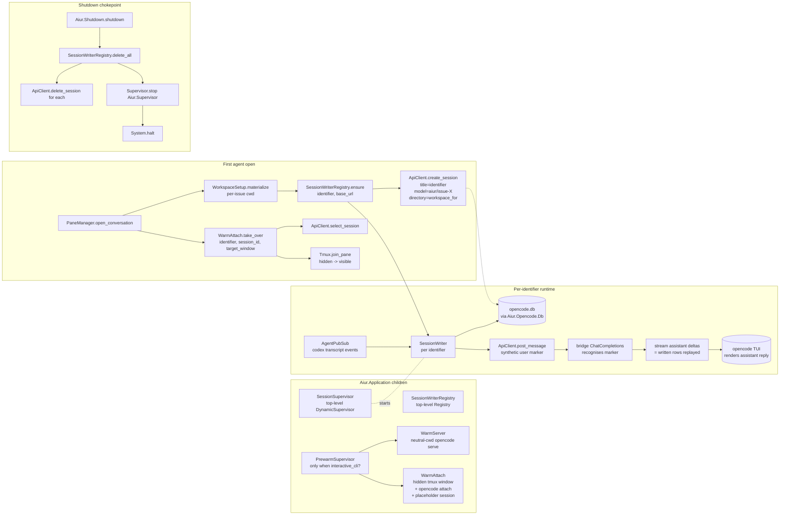

# opencode pre-warm + SQLite history injection

## Overview

Replace the visible "loading screen + POST-based history relay" with a background pre-warmed `opencode serve` + `opencode attach` pair in a hidden tmux window, plus per-identifier writers that inject agent transcript events directly into opencode's SQLite DB. v1 makes the user's *first* agent open in an `aiur` run feel instant; v2 (deferred) reuses the same machinery to pre-create sessions for every active agent and lets the user navigate with opencode's native Ctrl+P.

---

## Problem Frame

Today's pane-open path costs ~15 s of visible loading and surfaces history as a single blue user bubble. The fake placeholder disappears before opencode actually draws, agent autonomous output never reaches the chat unless the user types, and 28 sessions accumulate in `opencode.db` per run because we create a new session every open. (See origin: `elixir/docs/brainstorms/2026-05-20-opencode-prewarm-and-history-injection-requirements.md`.)

Phase 1 verification already proved the mechanical pieces work: `POST /tui/select-session` switches a live TUI to any session, `tmux join-pane` preserves both the running process and pane id when moving across windows, and opencode's `message`/`part` table schema accepts straight JSON inserts.

---

## Requirements Trace

- R1. First-agent open in a fresh `aiur` run renders the opencode chat within 500 ms **when pre-warm has completed**; falls back to opencode's native cold attach (~6.7 s) when the user beats the warm. (origin Goal 1, Acceptance 1)
- R2. Historical agent activity renders as if the agent typed it — assistant-role messages, time-ordered, with command/output formatting (origin Goal 2, Acceptance 1)
- R3. Live agent output (commands, agent messages, alerts) appends to the chat within ~1 s of the underlying transcript event, with no user input required (origin Goal 3, Acceptance 2)
- R4. Clean aiur shutdown deletes every opencode session Aiur created during the run; ungraceful prior exits are reaped on the next boot (origin Goal 4, Acceptance 3)
- R5. Second-and-onward agent opens in the same run cold-start cleanly with no fake placeholder visible (origin Acceptance 4)
- R6. opencode pinned to `1.15.6` in `mise.toml`; `mix test`, `mix format --check-formatted`, `mix specs.check` all green (origin Acceptance 5)

**v1 design constraints (not external requirements)** — surfaced from origin v2 implications so v1 module boundaries don't force a v2 rewrite:

- D1. The SQLite writer is per-identifier (not per-pane-open), spawned via an idempotent `ensure/1` entrypoint that callers outside the pane-open code path can use unchanged in v2.
- D2. Pre-warmed attach is reusable across multiple `select-session` switches without restart (needed for v1 cold/warm fallback and v2 Ctrl+P navigation).

---

## Scope Boundaries

- Pre-warming a pool of N panes; v1 ships single pre-warm only
- Pre-creating sessions for every active agent (v2; deferred)
- Replacing opencode or building a non-opencode chat surface
- Multi-user / multi-aiur-instance coordination over the same opencode DB
- Recovering history for agents whose `aiur.<id>.log` file is missing or truncated

---

## Context & Research

### Relevant Code and Patterns

- **Supervision tree:** `elixir/lib/aiur.ex` (`Aiur.Application.start/2`). New pre-warm subsystem slots in after `Aiur.Opencode.BridgeSupervisor`, inside the `interactive_cli?` block.
- **Per-identifier GenServer + Registry + DynamicSupervisor template:** `elixir/lib/aiur/issue_log.ex` (`child_spec/1`, `attach/1` idempotent, `via/1`, `start_writer/1`). Copy this shape for `Aiur.Opencode.SessionWriter`. The other in-repo example, `Aiur.Opencode.PaneSession`, is also fine but IssueLog is closer to the new module's responsibility.
- **opencode wire-shape boundary:** `elixir/lib/aiur/opencode/protocol.ex`. Per `elixir/AGENTS.md:21-26`, all opencode-specific wire/config shapes go here — that includes the new SQLite row JSON shapes.
- **opencode HTTP client:** `elixir/lib/aiur/opencode/api_client.ex`. Existing pattern is a thin per-endpoint helper wrapping `request/4`. Add `select_session/2`, `delete_session/2`, `list_sessions/1` here; extend `create_session/2` to take `opts` for `model` and `directory`.
- **Port-spawn opencode serve:** `elixir/lib/aiur/opencode/server.ex` (`Port.open/2` with `bash -c`, parses `listening on http://host:port` from stdout). The warm server reuses this module unchanged.
- **Tmux command escape hatch:** `Aiur.Tmux.command/3` at `elixir/lib/aiur/tmux.ex:32`. Existing helpers (`split_pane/5`, `respawn_pane/3`, `send_keys_literal/3`) are the right shape to mirror for the new `new_hidden_window/3` + `join_pane/3`.
- **Bridge-token registry:** `elixir/lib/aiur/opencode/token_registry.ex`. Pre-warm path also needs a token (placeholder session may receive a stray `/v1/chat/completions` request).
- **Agent-list ready signal:** `AgentPubSub.subscribe_running()` + `{:running_changed, summaries}` from `Aiur.Orchestrator.notify_dashboard/1` at `elixir/lib/aiur/orchestrator.ex:1266-1269`. The first `:running_changed` is "orchestrator has done at least one poll". Pre-warm doesn't have to wait for it — but v2 will.
- **Shutdown bypass to fix:** `Aiur.AgentList.App.quit/1` at `elixir/lib/aiur/agent_list/app.ex:90` calls `System.halt(0)` directly, skipping `Aiur.Application.stop/1`. `Aiur.CLI.wait_for_shutdown/0` at `elixir/lib/aiur/cli.ex:227-244` also halts after `:DOWN` from `Aiur.Supervisor`.
- **Existing modules to delete or modify** (full list in U10/U13/U14/U15 below):
  - `elixir/lib/aiur/opencode/transcript_relay.ex` — delete
  - `scripts/aiur-pane-loading` — delete
  - `elixir/lib/aiur/pane_manager.ex` `__aiur_opencode__` branch — remove placeholder wrapper, use WarmAttach

### Institutional Learnings

`docs/solutions/` does not exist in this repo (no captured prior learnings on opencode integration, tmux orchestration, native deps, or shutdown). Treat as greenfield from an institutional-knowledge standpoint. Capture learnings to a new `docs/solutions/` after the plan lands via `/ce-compound`.

### External References

- opencode TUI control API: `POST /tui/select-session`, `POST /tui/publish`, `POST /tui/append-prompt`, etc. (in-process OpenAPI dump at `/doc` on a running `opencode serve`).
- opencode session schema (`session`, `message`, `part` tables; `data` column is opaque JSON) — verified live against opencode `1.15.6` SQLite at `~/.local/share/opencode/opencode.db`.
- `exqlite` is the idiomatic Elixir SQLite driver; supports prepared statements, ETS-backed pool, no separate process per query.

---

## Key Technical Decisions

- **Module split into a Prewarm subsystem under `Aiur.Opencode.*`**, not a single `Aiur.Opencode.Prewarm` GenServer. New modules: `WarmServer`, `WarmAttach`, `SessionWriter`, `SessionWriterRegistry`, `SessionSupervisor`, `PrewarmSupervisor`, plus the `Db` isolation layer. Each piece has a distinct lifecycle (`WarmServer` is a Port owner; `WarmAttach` owns tmux state; `SessionWriter` is per-identifier; `Db` is stateless). The per-identifier writer registry is named `SessionWriterRegistry` (not just `SessionRegistry`) to avoid confusion with the existing `Aiur.Opencode.PaneRegistry` and to read accurately — it tracks writers, not sessions themselves (sessions live in opencode's DB).
- **Live-update mechanism: bridge-mediated synthetic-turn round-trip, NOT `/tui/publish`.** Phase-2 verification proved `POST /tui/publish` only accepts `EventTui*` event types — `EventMessagePartDelta` is rejected. Direct SQLite writes don't fire opencode's `/event` SSE stream, so the attached TUI won't refresh until the user navigates away and back. The live-update path therefore goes through opencode's own message-creation flow:
  1. `SessionWriter` receives a transcript event from `AgentPubSub`.
  2. Writes the assistant message + parts directly to SQLite (so re-open / re-select still sees the row).
  3. POSTs a hidden synthetic user message to `/session/<id>/message` with the text part flagged `synthetic: true` and the assistant content embedded in the request body.
  4. opencode triggers a chat-completion call to the Aiur bridge.
  5. Bridge's `ChatCompletions` recognises the synthetic marker, looks up the just-written assistant rows, streams them back as SSE deltas.
  6. opencode renders the streamed deltas as the assistant response.
  Round-trip cost ~50–100 ms locally. Live update remains "agent typing in real time" from the user's perspective; the synthetic user message is invisible.
- **History injection via direct SQLite is still the right call** for the one-shot replay on session creation. `SessionWriter` writes assistant rows directly into `message`/`part`; opencode reads them on first `select-session`. Live updates use the round-trip above because the TUI is already attached and the DB-only write is silent.
- **Schema conformance spike before U6.** opencode's `GET /session/<id>/message` validates against `AssistantMessage` schema which requires `id`, `sessionID`, `role`, `time: {created, completed}`, `parentID: ^msg`, `modelID`, `providerID`, `mode`, `agent`, `path: {cwd, root}`, `cost`, `tokens`. Plan-time spike (folded into U3): trigger a real assistant completion against a throwaway opencode session, dump the exact row JSON, copy verbatim into `Aiur.Opencode.Protocol.assistant_message_data/1`. Don't ship the writer without round-tripping a real `GET /message` against our writes in a test.
- **Per-session `?directory=` override.** `POST /session?directory=<workspace>` works (verified) and is required so opencode's file picker, diff view, and session sidebar show the right path. `Aiur.Opencode.SessionWriterRegistry.ensure/2` calls `ApiClient.create_session/3` with both `model: {providerID: "aiur", id: "issue-<X>"}` and `directory: workspace_for(identifier)`. `WorkspaceSetup.materialize/5` must run before `ensure/2` for that identifier so the directory exists on disk.
- **SQLite mechanism: add `:exqlite` dependency, wrap behind `Aiur.Opencode.Db`.** `:exqlite` is the standard Elixir SQLite NIF and `Ecto` is already a (dormant) dep so NIFs are not foreign to this project. The `Aiur.Opencode.Db` wrapper isolates `:exqlite` configuration and provides a tight test surface for the INSERT logic; the wrapper is justified by testability and busy-timeout handling, not by hypothetical CLI fallback.
- **`:exqlite` concurrent-write safety**: opencode runs SQLite in WAL mode by default. `Db.with_conn/1` opens the connection with `PRAGMA busy_timeout = 5000` and uses short transactions (open → INSERT → commit → close). One Aiur write + opencode's own writes can interleave safely. A retry-on-`SQLITE_BUSY` wrapper around `insert_message/3` and `insert_part/4` provides belt-and-suspenders for the rare conflict.
- **Session ownership tag: in-memory `SessionWriterRegistry` is the source of truth during a run.** Aiur tracks every session it created (placeholder + per-identifier) in the Registry. On shutdown, it walks that Registry and `DELETE /session/<id>` for each. Belt-and-suspenders: at `WarmServer` boot, list opencode sessions whose `model.providerID == "aiur"` and whose title doesn't match a currently-active identifier — delete those — catches ungraceful prior exits. Kept for v1 because crash-path coverage matters more given Aiur is a dev tool that gets killed often.
- **Pre-warm-not-ready fallback: silent cold-path.** No system message in the chat; just a debug log. The old fake placeholder is gone; what the user sees during a cold path is opencode's own attach output (mostly blank for ~6 s) — acceptable per the brainstorm's "Acceptance 4". This is the only path that satisfies R1 when the user beats the warm.
- **`tmux join-pane` is the swap mechanism.** Spike verified that `join-pane -s <pane> -t <session>:<window>` preserves both the running process and the pane id when crossing windows on aiur's socket. The pre-warmed `opencode attach` lives in a hidden window from boot; on first open it's joined into the visible PaneManager-managed window. After hand-off, the WarmAttach state goes `:handed_off`; v1 doesn't re-warm. (v2 keeps the SAME attached TUI alive and uses `select-session` to navigate; v2 doesn't open more panes per agent.)
- **Graceful shutdown ordering: cleanup → Supervisor.stop → System.halt.** `Aiur.Shutdown.shutdown(code)`:
  1. `SessionWriterRegistry.delete_all(timeout)` — synchronously walks writers, calls `ApiClient.delete_session/2` for each, then stops the writer GenServers.
  2. `Supervisor.stop(Aiur.Supervisor, :normal, 5_000)` — orderly OTP shutdown; lets `WarmAttach.terminate/2` and `WarmServer.terminate/2` close their resources.
  3. `System.halt(code)`.
  Replace the direct `System.halt` calls in `Aiur.AgentList.App.quit/1` and `Aiur.CLI.wait_for_shutdown/0`. `Aiur.Application.stop/1` ALSO calls `SessionWriterRegistry.delete_all/1` (idempotent — second call on an emptied registry is a no-op) to cover the SIGTERM path where OTP shutdown happens before our chokepoint. Bounded ~5 s on each phase so a stuck DELETE doesn't block exit. Crash-path coverage (kill -9, BEAM crash) is acknowledged as unsalvageable here — that's what U7's boot-time GC is for.
- **Wire-shape boundary respected.** New SQLite row JSON (`message.data`, `part.data`) builders go in `Aiur.Opencode.Protocol`, not in `Db` or `SessionWriter`. The writer/db modules deal with row IDs and INSERTs; Protocol owns the JSON shapes.
- **Placeholder session uses `model: {providerID: "aiur", id: "placeholder"}`.** `Aiur.Opencode.ChatCompletions.identifier_from_model/1` is extended to recognise `"placeholder"` as a sentinel and return a graceful 204 / `{:error, :placeholder_session}` so a stray opencode completion call against the placeholder doesn't crash or hit codex.
- **Test coverage exemption.** New `Aiur.Opencode.*` modules added to this subsystem follow the existing precedent (`elixir/mix.exs:17-77` lists current `Aiur.Opencode.*` and `Aiur.PaneManager` as scaffold-exempt). Add the new modules to that list to keep the gate green; revisit when the subsystem stabilises.

---

## Open Questions

### Resolved During Planning

- **Module split** (one Prewarm vs many): split into the modules listed in Key Technical Decisions, with the writer registry named `SessionWriterRegistry` to disambiguate from the existing `PaneRegistry`.
- **SQLite mechanism** (`exqlite` vs CLI shell): `:exqlite` dependency, wrapped by `Aiur.Opencode.Db`. See Key Technical Decisions.
- **`tmux join-pane` reliability** (spike): verified preserves PID and pane id across windows on aiur's socket. Safe to use as the swap mechanism.
- **Live-update mechanism**: NOT `/tui/publish` (rejected by opencode for `EventMessagePartDelta`). Bridge-mediated synthetic-turn round-trip; see Key Technical Decisions.
- **Per-session directory**: use `POST /session?directory=<workspace>` (verified opencode accepts the query parameter). One shared warm server, each session has its real per-agent cwd.
- **Session ownership tag**: in-memory `SessionWriterRegistry`; boot-time GC walks opencode-DB sessions where `model.providerID == "aiur"` and title doesn't match an active identifier.
- **Pre-warm-not-ready UX**: silent cold-path fallback, debug log only.
- **R1 acceptance**: <500 ms applies *when pre-warm has completed*. Cold fallback path is acceptable and not a regression because the prior fake placeholder is removed (origin Acceptance 4).

### Deferred to Implementation

- **Schema-conformance spike (folded into U3)**: trigger a real assistant completion against a throwaway opencode session, dump the row JSON for `message` and each `part` type, copy verbatim into `Aiur.Opencode.Protocol`. Validate every U6 write by `GET /session/<id>/message` round-trip. This is non-negotiable — without it the writer ships broken rows.
- **Exact SQLite row id format**: opencode uses `msg_<26char>` and `prt_<26char>` (Crockford base32 from time + entropy). Use a known Elixir ULID generator (or hand-roll — it's <30 lines) to produce compatible IDs. Decide at U2 implementation.
- **Synthetic-turn round-trip mechanics (folded into U6 + U12)**: empirically determine whether `{type: "text", text: "", synthetic: true}` user message renders invisibly OR if the message itself shows but only the part is hidden. If parts-only, switch to `noReply: true` + the bridge holding the chat-completion stream open. Spike at U6.
- Whether `Aiur.Opencode.Server` can be reused as-is for `WarmServer` or needs a thin wrapper (probably yes, as-is; the warm cwd just goes in `opts.workspace`). Decide at U7.
- The exact `aiur stop` signal handling — `scripts/aiur` uses `pkill -TERM`; we need the BEAM to actually run cleanup before exiting. Verified manually at the end of U16.

---

## Output Structure

    elixir/lib/aiur/opencode/
      db.ex                              # new — SQLite isolation wrapper (insert + fetch)
      prewarm_supervisor.ex              # new — supervises WarmServer + WarmAttach
      session_supervisor.ex              # new — DynamicSupervisor for SessionWriter (top-level)
      session_writer.ex                  # new — per-identifier GenServer (history + live)
      session_writer_registry.ex         # new — registry + ensure/2 (top-level)
      warm_attach.ex                     # new — hidden tmux window + warm opencode attach
      warm_server.ex                     # new — neutral-cwd opencode serve + boot-time GC

      api_client.ex                      # modify — extend create_session, add select/delete/list
      chat_completions.ex                # modify — placeholder model + synthetic-stream marker
      config.ex                          # modify — prewarm_workspace/0, prewarm_disabled?/0
      pane_session.ex                    # modify — stop starting TranscriptRelay
      protocol.ex                        # modify — SQLite row builders, aiur_owned?/1
      workspace_setup.ex                 # modify — accept neutral cwd for warm
      transcript_relay.ex                # DELETE

    elixir/lib/aiur/
      pane_manager.ex                    # modify — warm hand-off on first open, drop placeholder shell
      shutdown.ex                        # new — Aiur.Shutdown.shutdown/2 chokepoint
      tmux.ex                            # modify — new_hidden_window/3, join_pane/3
      cli.ex                             # modify — wait_for_shutdown goes through Shutdown
      orchestrator.ex                    # modify — add list_active_identifiers/0 helper
      agent_list/app.ex                  # modify — quit/1 goes through Shutdown
      aiur.ex                            # modify — Application.stop/1 cleanup, add new children

    elixir/test/aiur/opencode/
      db_test.exs                        # new
      session_writer_test.exs            # new
      warm_attach_test.exs               # new
      warm_server_test.exs               # new (boot-time GC scenarios)
      chat_completions_test.exs          # modify — placeholder + synthetic-marker tests
      transcript_relay_test.exs          # DELETE if present

    elixir/test/aiur/
      shutdown_test.exs                  # new

    elixir/mise.toml                     # modify — pin opencode = "1.15.6"
    elixir/mix.exs                       # modify — add :exqlite dep + new coverage exemptions
    scripts/aiur                         # modify — remove AIUR_PANE_LOADING_BIN
    scripts/aiur-pane-loading            # DELETE

---

## High-Level Technical Design

> *This illustrates the intended approach and is directional guidance for review, not implementation specification. The implementing agent should treat it as context, not code to reproduce.*

Key dataflow points to validate during review:

1. **SessionWriterRegistry + SessionSupervisor are top-level Application children**, NOT under PrewarmSupervisor. v1 needs writers running independently of the warm subsystem (cold-path opens still spawn writers; D1).
2. **History replay** uses direct SQLite injection (silent, fast, one-shot on `ensure/2`). **Live updates** use the round-trip: SQLite write → synthetic POST → bridge stream → opencode renders. The TUI only refreshes via opencode's own event pipeline.
3. The `WarmServer` + `WarmAttach` pair are aiur-boot lifetime, completely independent of any agent identifier. They handle the "where the pane lives" question; `SessionWriter` handles "what content fills the pane."
4. `WarmAttach.take_over/3` is the only place that knows about `select-session` + `join-pane` ordering. PaneManager calls it as a single operation. v1's `take_over` consumes the warm pane; v2 makes it reusable so multiple `select-session` calls share the SAME attached TUI.
5. Shutdown collapses to "delete every session we created" → "supervisor stop" → "halt", in that order. Cleanup MUST happen before supervisor stop because `SessionWriterRegistry.delete_all/1` needs the Registry alive.

---

## Implementation Units

- [ ] U1. **Pin opencode 1.15.6 in `mise.toml`**

**Goal:** Lock the opencode version so SQLite schema and TUI control API changes can't break us silently.

**Requirements:** R6

**Dependencies:** none

**Files:**
- Modify: `elixir/mise.toml`

**Approach:**
- Change `opencode = "latest"` to `opencode = "1.15.6"`.
- Run `mise install` to confirm it pulls the pinned version.

**Patterns to follow:**
- Existing `erlang = "28"` and `elixir = "1.19.5-otp-28"` pins.

**Test scenarios:**
- Test expectation: none -- pure config change. Validation is `mise current opencode` reporting `1.15.6` and `mise exec -- opencode --version` returning `1.15.6`.

**Verification:**
- `mise current opencode` reports `1.15.6`.

---

- [ ] U2. **Add `:exqlite` dep + `Aiur.Opencode.Db` wrapper module**

**Goal:** Single Elixir-side boundary for all opencode-DB reads/writes. Hides the choice of driver and gives a clean test surface.

**Requirements:** R2, R3, D1

**Dependencies:** none

**Files:**
- Create: `elixir/lib/aiur/opencode/db.ex`
- Create: `elixir/test/aiur/opencode/db_test.exs`
- Modify: `elixir/mix.exs` (add `:exqlite` to `deps/0`)

**Approach:**
- Add `{:exqlite, "~> 0.27"}` (or latest stable) to `deps/0`.
- `Aiur.Opencode.Db` exposes:
  - `path/0` — returns opencode DB path (configurable via `Aiur.Opencode.Config.db_path/0`, defaults to `~/.local/share/opencode/opencode.db`)
  - `with_conn/1` — opens a connection with `PRAGMA busy_timeout = 5000`, yields it, closes
  - `insert_message/3` — `(session_id, message_id, data_map)` → `:ok | {:error, term}`. Retry once on `SQLITE_BUSY` (defensive against opencode's own writes).
  - `insert_part/4` — `(session_id, message_id, part_id, data_map)` → `:ok | {:error, term}`. Same retry.
  - `fetch_message_with_parts/2` — `(session_id, message_id)` → `{:ok, %{message_data, parts: [part_data, ...]}} | {:error, term}`. Used by `ChatCompletions` (U12) for the synthetic-stream round-trip.
  - `msg_id/0` / `prt_id/0` — ULID generators producing IDs that match opencode's `^msg[A-Z0-9]+` / `^prt[A-Z0-9]+` patterns. Crockford base32 from monotonic time + 80 bits of random entropy.
- Add `Aiur.Opencode.*` modules new in this plan to `ignore_modules` in `elixir/mix.exs:17-77` so test-coverage gate stays green.

**Patterns to follow:**
- `Aiur.Opencode.ApiClient` — thin per-operation functions wrapping a shared lower-level helper.
- `@spec` on every `def` per `elixir/AGENTS.md:43-46`.

**Test scenarios:**
- Happy path — `insert_message` followed by `insert_part` against a temp SQLite file; verify both rows visible via `SELECT`. Inputs: known session_id, generated message_id, fixture JSON data.
- Happy path — `fetch_message_with_parts/2` returns the inserted rows decoded as maps.
- Edge case — `insert_message` twice with the same id returns `{:error, _}` (unique constraint preserves opencode's invariants).
- Edge case — `with_conn` works when the DB file doesn't yet exist (opencode may not have created it; we should fail with a clear error, not silently succeed).
- Error path — invalid JSON in `data_map` (e.g. unencodable term) returns `{:error, _}` not a raise.
- Concurrency — two parallel `insert_message/3` calls against the same DB succeed (one waits on the WAL lock). Run with `Task.async_stream`.
- ID format — `msg_id/0` returns a string matching `^msg[A-Z0-9]+$` and is monotonic across calls.

**Verification:**
- All `db_test.exs` cases pass against a temp DB. `mix specs.check` clean.

---

- [ ] U3. **SQLite row JSON shapes in `Aiur.Opencode.Protocol` (with schema-conformance spike)**

**Goal:** Per `elixir/AGENTS.md:21-26`, all opencode-wire shapes live in Protocol. Add builders for the `message.data` and `part.data` JSON we inject. **Non-negotiable prerequisite:** dump a real opencode-generated assistant message (and at least one tool-call/tool-result pair) and copy the shape *exactly*. Plan review confirmed the schema is strict — `GET /session/<id>/message` validates and will reject rows missing `time`, `parentID`, `mode`, `agent`, `path`, `cost`, `tokens`.

**Requirements:** R2, R3

**Dependencies:** none

**Files:**
- Modify: `elixir/lib/aiur/opencode/protocol.ex`
- Modify: `elixir/test/aiur/opencode/protocol_test.exs`

**Execution note:** Begin with a spike: spawn `opencode serve`, point a real OpenAI key at it (one-off, outside Aiur), have it generate one assistant message with at least one tool-call part. `sqlite3 ~/.local/share/opencode/opencode.db 'select data from message where id=…'` and `select data from part where message_id=…`. Save the raw JSON to `docs/notes/opencode-row-shapes-1.15.6.md` for future bumps. THEN write the builders to match. Skip-this-step risk: shipping broken rows that opencode rejects on attach.

**Approach:**
- Add `assistant_message_data/1` — returns the JSON map for an assistant message row. Includes EVERY required `AssistantMessage` field: `sessionID`, `role: "assistant"`, `time: {created: now_ms, completed: now_ms}`, `parentID` (synthetic root msg id for history-replay; real parent for live events), `modelID: "issue-<X>"`, `providerID: "aiur"`, `mode: "build"`, `agent: "build"`, `path: {cwd, root}`, `cost: 0`, `tokens: {input: 0, output: 0, reasoning: 0, cache: {read: 0, write: 0}}`, `finish: "stop"`.
- Add `synthetic_root_message_data/1` — for history replay, the first message in the sequence needs a parent that exists. Either synthesise a root user-role message at the head of the replay, or set the first assistant message's `parentID` to itself / opencode's accepted "no parent" sentinel — whichever the spike reveals.
- Add `text_part_data/1` — `{type: "text", text: ...}`.
- Add `tool_part_data/3` — for command transcript events, the spike output dictates the exact shape (one part with `type: "tool"` containing both input + output, OR a tool-call + step-finish pair). Don't guess.
- Add `step_start_part_data/0` / `step_finish_part_data/1` — opencode wraps assistant turns with these markers.
- Add `aiur_owned?/1` — given a session row's `model` JSON, return true if `providerID == "aiur"`. Used by GC and cleanup.
- Add helper `msg_id/0` / `prt_id/0` that returns ULID-compatible IDs matching opencode's `^msg`/`^prt` pattern (Crockford base32 from monotonic time + random bytes). Implementation details deferred to U2 (the Db module wants them too).

**Patterns to follow:**
- Existing wire-shape builders in same file (`opencode_json/1`, `tui_json/0`, `assistant_text_message/1`, `user_message_part/1`).
- Maps with string keys (matches opencode's JSON).

**Test scenarios:**
- Happy path — `assistant_message_data(%{session_id, parent_id, identifier, now_ms})` returns a map containing every key listed above, with no extras.
- Round-trip — Jason-encode the map, decode it, deep-equal. (Catches non-Encoder atoms.)
- Schema conformance (integration) — write a row via the builder, `GET /session/<id>/message` against a live opencode, response is 200 (NOT BadRequest). Run this against the actual opencode 1.15.6 binary at U3 close.
- Happy path — `text_part_data("hello")` returns `%{"type" => "text", "text" => "hello"}`.
- Happy path — `tool_part_data("$ ls", "exit=0\nfile1\nfile2", %{name: "bash"})` returns the EXACT shape opencode itself writes (per spike).
- Happy path — `aiur_owned?` returns true for `{"providerID" => "aiur", "modelID" => "issue-13"}`, false for opencode-provider rows.

**Verification:**
- `protocol_test.exs` passes including the round-trip-against-live-opencode integration test. `mix specs.check` clean.

---

- [ ] U4. **Extend `Aiur.Opencode.ApiClient` with TUI control, delete, list, and richer create_session**

**Goal:** Aiur needs several opencode endpoints not currently wrapped, plus `create_session/2` needs to grow to take `model` and `directory` arguments.

**Requirements:** R1, R3, R4

**Dependencies:** none

**Files:**
- Modify: `elixir/lib/aiur/opencode/api_client.ex`
- Modify: `elixir/test/aiur/opencode/` (extend if a test file exists; otherwise rely on integration tests in U6/U8)

**Approach:**
- Replace `create_session(base_url, title)` with `create_session(base_url, title, opts \\ [])`:
  - `opts` accepts `:model` (e.g. `%{providerID: "aiur", id: "issue-13"}`) and `:directory` (string path).
  - `:directory` becomes a `?directory=` query parameter on the URL (verified during plan review: opencode honours this for the session's stored directory).
  - `:model` becomes the `model:` field in the JSON body.
  - All existing call sites (one in `Aiur.Opencode.PaneSession`) keep working by relying on the empty opts default.
- Add `select_session(base_url, session_id) :: :ok | {:error, term}` — `POST /tui/select-session` with `{sessionID: session_id}`. Treat response body `true` as `:ok`.
- Add `delete_session(base_url, session_id) :: :ok | {:error, term}` — `DELETE /session/<id>`.
- Add `list_sessions(base_url) :: {:ok, [map]} | {:error, term}` — `GET /session`. Verified endpoint exists.
- Do NOT add a generic `publish/2` for arbitrary events — Plan-review confirmed `/tui/publish` only accepts `EventTui*` variants and we use none of them for the live-update path. If a future need arises, add it then.

**Patterns to follow:**
- Existing `Aiur.Opencode.ApiClient` helpers wrapping `Req.request/2` via `request/4`.
- Bounded `receive_timeout`.

**Test scenarios:**
- Happy path — `create_session/3` with `:directory` opt sends `?directory=...` in URL (mock Req or use Bypass).
- Happy path — `create_session/3` with `:model` opt sends `{model: %{...}}` in body.
- Happy path — `select_session/2` returns `:ok` when response body is `true`.
- Happy path — `delete_session/2` returns `:ok` on 200.
- Error path — `select_session/2` returns `{:error, _}` on non-2xx.
- Error path — `list_sessions/1` returns `{:error, _}` on transport error.
- Regression — `create_session/2` (old arity) still works for existing callers.

**Verification:**
- Each helper compiles with `@spec`; matches the openapi schema variants documented in the brainstorm.

---

- [ ] U5. **Extend `Aiur.Tmux` with `new_hidden_window/3` and `join_pane/3`**

**Goal:** Two helpers the WarmAttach module needs, in the existing single-shell-out style.

**Requirements:** R1

**Dependencies:** none

**Files:**
- Modify: `elixir/lib/aiur/tmux.ex`
- Modify: `elixir/test/aiur/tmux_test.exs` (if it exists; else verify by integration in U8)

**Approach:**
- `new_hidden_window(server \\ __MODULE__, name, command_to_run)` — runs `tmux new-window -d -n <name> <command>` on the configured socket. Returns `{:ok, pane_id}` by parsing `display-message -t <name>:0 -p '#{pane_id}'` (or `-P -F '#{pane_id}'` if `new-window` supports it on this tmux version).
- `join_pane(server \\ __MODULE__, source_pane, target_window)` — runs `tmux join-pane -s <src> -t <target>`. Returns `:ok | {:error, term}`. Optional `-h`/`-v` direction argument with sensible default.
- Both go through the existing `run_args/2` path so socket prefix is handled automatically.
- Add matching `handle_call({:new_hidden_window, …})` and `handle_call({:join_pane, …})` clauses to the GenServer body.

**Patterns to follow:**
- `respawn_pane/3`, `split_pane/5`, `send_keys_literal/3` (`elixir/lib/aiur/tmux.ex`) — same shape, same `@spec` style.

**Test scenarios:**
- Happy path — with a real tmux server: create hidden window, capture pane id, verify `list-panes -s` shows it in a non-visible window. (Use the same `Aiur.Tmux` test setup as the existing tests.)
- Happy path — `join_pane/3` moves the pane to the target window; `list-panes` confirms new window assignment and pid unchanged.
- Error path — `join_pane` against a nonexistent source returns `{:error, _}` not a raise.

**Verification:**
- `mix test elixir/test/aiur/tmux_test.exs` passes; integration test in U8 also exercises both helpers end-to-end.

---

- [ ] U6a. **`Aiur.Opencode.SessionWriterRegistry` + `SessionSupervisor` plumbing**

**Goal:** Top-level Registry + DynamicSupervisor for per-identifier writers, plus the public `ensure/2` entrypoint that creates the opencode session and starts the writer. Plumbing only; the GenServer with business logic ships in U6b.

**Requirements:** D1 (per-identifier writer, ensure callable outside pane-open code)

**Dependencies:** U2, U3, U4

**Files:**
- Create: `elixir/lib/aiur/opencode/session_writer_registry.ex`
- Create: `elixir/lib/aiur/opencode/session_supervisor.ex`
- Modify: `elixir/lib/aiur.ex` (add Registry + DynamicSupervisor to top-level `children`)

**Approach:**
- `Aiur.Opencode.SessionWriterRegistry`:
  - Wraps `{:via, Registry, {Aiur.Opencode.SessionWriterRegistry.Registry, identifier}}`.
  - `ensure(identifier, base_url) :: {:ok, %{session_id, writer_pid}} | {:error, term}` — idempotent.
    1. `Registry.lookup/2` — if writer is alive, return its `{session_id, pid}` stored in registry value.
    2. Compute `directory = Aiur.Config.workspace_root() |> Path.expand() |> Path.join(safe_identifier)`.
    3. `ApiClient.create_session(base_url, identifier, model: %{providerID: "aiur", id: "issue-#{identifier}"}, directory: directory)`.
    4. `DynamicSupervisor.start_child(Aiur.Opencode.SessionSupervisor, {Aiur.Opencode.SessionWriter, %{identifier: identifier, session_id: session_id, base_url: base_url}})`.
    5. Return.
  - `lookup(identifier) :: {:ok, %{session_id, writer_pid}} | :not_found`.
  - `all/0` — returns list of `%{identifier, session_id, writer_pid}` for cleanup walking.
  - `delete_all(timeout_ms) :: :ok | {:error, term}` — for each registry entry: `ApiClient.delete_session/2`, then `DynamicSupervisor.terminate_child/2`. Idempotent (second call on empty registry is `:ok`). Bounded timeout.
- `Aiur.Opencode.SessionSupervisor` — `DynamicSupervisor` named `Aiur.Opencode.SessionSupervisor`. Empty otherwise.
- Modify `Aiur.Application.start/2` in `elixir/lib/aiur.ex`: add `{Registry, keys: :unique, name: Aiur.Opencode.SessionWriterRegistry.Registry}` and `{DynamicSupervisor, strategy: :one_for_one, name: Aiur.Opencode.SessionSupervisor}` to the top-level `children` list (alongside the existing `Aiur.IssueLog.Registry` and `Aiur.IssueLog.Supervisor`).

**Patterns to follow:**
- `Aiur.IssueLog.attach/1` (`elixir/lib/aiur/issue_log.ex:39-52`) for the idempotent `{:already_started, _pid} → :ok` handling.
- `Aiur.Opencode.PaneSession.start/2` for the `safe_await_ready`-style exit catch (probably not needed here since writer init doesn't block, but worth referencing).

**Test scenarios:**
- Happy path — `ensure("MT-1", base_url)` creates a session via API, starts a writer, returns `{:ok, %{session_id, writer_pid}}`.
- Happy path — second `ensure("MT-1", base_url)` returns the same writer_pid + session_id (idempotent).
- Edge case — `ApiClient.create_session` fails → `ensure` returns `{:error, _}`, no writer left dangling.
- Edge case — writer crashes (DynamicSupervisor restarts it) → registry entry self-heals on next `ensure`.
- Cleanup — `delete_all/1` walks the registry, calls `delete_session` per entry, then terminates each writer.
- Cleanup — `delete_all/1` on empty registry returns `:ok` (idempotent — needed because both `Aiur.Application.stop/1` AND `Aiur.Shutdown.shutdown/1` may call it).

**Verification:**
- `mix test` for the new module passes. `ensure/2` is idempotent. Registry survives writer crashes.

---

- [ ] U6b. **`Aiur.Opencode.SessionWriter` — history replay + live append**

**Goal:** Per-identifier GenServer that owns the SQLite injection + live-update lifecycle for one agent. Replays history on start, then for each new transcript event: writes assistant rows to SQLite AND POSTs a synthetic-marker user message so opencode triggers a chat-completion the bridge can stream back.

**Requirements:** R2, R3

**Dependencies:** U6a, U12 (bridge recognises the synthetic marker)

**Files:**
- Create: `elixir/lib/aiur/opencode/session_writer.ex`
- Create: `elixir/test/aiur/opencode/session_writer_test.exs`

**Approach:**
- `Aiur.Opencode.SessionWriter` is the per-identifier GenServer.
- `init/1` opts: `%{identifier, session_id, base_url}`. Trap exits. `handle_continue(:boot, ...)`.
- `handle_continue(:boot, ...)`:
  1. Subscribe `AgentPubSub.subscribe_agent(identifier)`.
  2. `replay_history(identifier, session_id)` — read `Aiur.IssueLog.disk_history(identifier, 500)`; for each event, build an assistant message + parts via `Aiur.Opencode.Protocol`; `Aiur.Opencode.Db.insert_message/3` + `Db.insert_part/4` per part. All writes silent — no API round-trip (opencode reads from DB on first `select-session`).
  3. Log `opencode_session_writer phase=ready identifier=… session_id=… replayed=<count>`.
- `handle_info({:transcript_event, %{role: role, body: body} = event}, state)`:
  1. Write the assistant message + parts to SQLite (same shape as replay).
  2. POST a synthetic user message to opencode: `ApiClient.post_message(base_url, session_id, %{parts: [%{type: "text", text: "__aiur_stream__:<message_id>", synthetic: true}]})`. The `__aiur_stream__:<id>` marker tells the bridge which freshly-inserted message to stream back.
  3. opencode triggers `/v1/chat/completions` to the bridge with `model: "issue-<X>"`. Bridge (`Aiur.Opencode.ChatCompletions`, see U12) recognises the marker in the user-message text, reads the just-written rows back via `Aiur.Opencode.Db.fetch_message/2`, and streams them as SSE assistant deltas. opencode renders.
  4. If the synthetic-text approach turns out NOT to be hidden by opencode (parts-only hide), pivot to `noReply: true` mode: the bridge holds the chat-completion stream open indefinitely after the first synthetic message and pushes new deltas as transcript events arrive. Decide empirically at U6b implementation (see "Deferred to Implementation").
- `handle_info({:alert, %{message: message}}, state)` — write an alert message+part, then POST the synthetic marker the same way.
- `handle_info({:transcript_event, %{role: :user}}, state)` — drop. User input arrives via opencode's own typing; we don't re-inject.
- `terminate/2` — close the DB conn. Session deletion is owned by `SessionWriterRegistry.delete_all/1`.
- `child_spec(opts)` returns `restart: :transient` so a crashing writer is recreated on next `ensure/2` rather than restart-looping.

**Execution note:** Implement the schema-conformance spike first (see U3's spike). Don't ship the writer until a real opencode session can `GET /session/<id>/message` round-trip the rows we write.

**Patterns to follow:**
- `Aiur.IssueLog` for `child_spec/1` with `restart: :transient`, `terminate/2`, log conventions.
- `Aiur.Opencode.PaneSession.safe_await_ready/1` for the catch-exit idiom (defensive, may not need).

**Test scenarios:**
- Happy path — writer subscribes to `agent:<id>` and on receiving `{:transcript_event, %{role: :assistant, body: "hello"}}` inserts one message + one text part. Verify via direct `Aiur.Opencode.Db.fetch_message/2` (add helper in U2) AND via `GET /session/<id>/message` against a live opencode (integration test — non-negotiable per the schema-spike).
- Happy path — history replay reads the full on-disk log and inserts each event in file order with monotonically-increasing `time.created` values. Empty log → no inserts, no API calls, no error.
- Happy path — `{:transcript_event, %{role: :command, body: "ls"}}` writes the command as a tool-call/tool-result pair (matching opencode's stored shape) and triggers the synthetic-marker POST.
- Edge case — `{:transcript_event, %{role: :user, ...}}` is dropped (no SQLite write, no POST).
- Error path — `Db.insert_message` failure logged at warn level; the GenServer keeps running.
- Error path — synthetic-marker POST fails (e.g., opencode is restarting); writer logs warn and the row stays in DB. The user will see the row on next `select-session`.
- Integration — when an external test agent fires `AgentPubSub.broadcast_transcript`, the corresponding rows appear in a temp opencode DB within ~100 ms.
- Integration — end-to-end with a real opencode TUI attached: a transcript event triggers a visible assistant message in the chat within ~1 s. Covers AE for R3.

**Verification:**
- Writer responds to live transcript events with SQLite writes + bridge round-trip. The attached TUI displays new content without user input.

---

- [ ] U7. **`Aiur.Opencode.WarmServer` — owns the neutral-cwd opencode serve + boot-time GC**

**Goal:** Run one `opencode serve` in a neutral cwd at aiur boot. Eat the ~3-4 s serve startup invisibly so the user pays zero for it later. Once ready, perform boot-time GC of any leftover Aiur-owned sessions from prior ungraceful exits.

**Requirements:** R1, R4 (boot-time GC), D2

**Dependencies:** U11 (WorkspaceSetup neutral-cwd support), U4

**Files:**
- Create: `elixir/lib/aiur/opencode/warm_server.ex`
- Modify: `elixir/lib/aiur/opencode/config.ex` (add `prewarm_workspace/0`, `prewarm_disabled?/0`)

**Approach:**
- GenServer named `Aiur.Opencode.WarmServer`.
- `init/1`: if `Aiur.Opencode.Config.prewarm_disabled?/0` returns true (env `AIUR_PREWARM_DISABLED=1`), stop with `:normal` so the supervisor skips pre-warm cleanly. Otherwise `handle_continue(:boot, state)`.
- `handle_continue(:boot, state)`:
  1. Compute warm workspace via `Aiur.Opencode.Config.prewarm_workspace/0` (default `Path.join([System.user_home!(), ".local/share/aiur/opencode-warm"])`). Create the dir if missing.
  2. Call `Aiur.Opencode.WorkspaceSetup.materialize_prewarm/2` (U11) to write `opencode.json` + `tui.json` + theme JSON with a shared bridge token registered in `TokenRegistry`.
  3. Call `Aiur.Opencode.Server.start_link(%{identifier: "_warm", workspace: warm_workspace})` and `Server.await_ready/2` to get `{:ok, base_url, _os_pid}`.
  4. **Boot-time GC** (folds in former U17): `ApiClient.list_sessions(base_url)`; for each session where `Aiur.Opencode.Protocol.aiur_owned?(session.model)` is true AND title doesn't match a currently-active identifier (from `Aiur.Orchestrator.list_active_identifiers/0`), call `ApiClient.delete_session/2`. Skip the literal `"_placeholder"` title. Best-effort: log warns on individual failures, continue.
  5. Store `base_url`, the Server pid, the token. Broadcast `{:warm_server_ready, base_url}` on `Aiur.PubSub` topic `"opencode:warm"` so `WarmAttach` can react.
- Public API:
  - `base_url/0 :: String.t() | nil`
  - `await_ready(timeout) :: {:ok, base_url} | :timeout`
  - `boot_time_ms/0` (for logging/metrics).
- `terminate/2` calls `GenServer.stop(state.server)` to tear down the Port. Cleanup of any active session writers is owned by `Aiur.Shutdown` (U16).
- Add `Aiur.Orchestrator.list_active_identifiers/0` (small helper in `elixir/lib/aiur/orchestrator.ex`) that returns the identifiers from `state.running`. Used here AND prepared for v2.

**Patterns to follow:**
- `Aiur.Opencode.Server` for Port-handling shape (we *use* it as a sub-process; no duplication).
- `Aiur.Opencode.Config` extension for `prewarm_workspace/0` and `prewarm_disabled?/0`.

**Test scenarios:**
- Happy path (integration) — WarmServer boots to ready in <10 s on a clean state-dir; `base_url` curl-reachable.
- Edge case — `prewarm_disabled?/0` returns true: WarmServer exits `:normal`, supervisor doesn't restart, the cold path still works.
- Edge case (GC) — DB pre-seeded with 5 Aiur-owned sessions whose titles don't match the active set: GC deletes all 5.
- Edge case (GC) — DB pre-seeded with 2 Aiur-owned sessions whose titles DO match active identifiers: GC deletes neither.
- Edge case (GC) — opencode-provider sessions (`model.providerID = "opencode"`) are never deleted regardless of title.
- Error path — `list_sessions` returns transport error: log warn, skip GC, continue (don't block `:warm_server_ready`).

**Verification:**
- `aiur` boots cleanly; `WarmServer.await_ready(10_000)` returns `{:ok, base_url}`. Log line: `opencode_warm_server phase=ready base_url=… boot_time_ms=…` followed by `opencode_warm_server gc_complete kept=N deleted=M`.

---

- [ ] U8. **`Aiur.Opencode.WarmAttach` — hidden tmux window + warm opencode attach**

**Goal:** Pre-launch one `opencode attach` in a hidden tmux window so the ~6.7 s TUI cold-start is invisible. Expose `take_over/3` for PaneManager.

**Requirements:** R1

**Dependencies:** U4, U5, U7

**Files:**
- Create: `elixir/lib/aiur/opencode/warm_attach.ex`
- Create: `elixir/test/aiur/opencode/warm_attach_test.exs`

**Approach:**
- GenServer named `Aiur.Opencode.WarmAttach`.
- `init/1`: subscribe to `Aiur.PubSub` topic `"opencode:warm"`. Send `:continue`.
- `handle_continue(:boot, state)`:
  1. If WarmServer not ready, set state to `:waiting`; wait for `{:warm_server_ready, base_url}` message.
  2. Once ready, create a placeholder session via `ApiClient.create_session(base_url, "_placeholder")` with `model: {providerID: "aiur", id: "placeholder"}`. Record `session_id`.
  3. Compute the attach command via `Aiur.Opencode.Protocol.attach_command/2` (already exists).
  4. Call `Aiur.Tmux.new_hidden_window/3` with name `aiur-warm-attach` and the attach command. Capture the returned `pane_id`.
  5. State becomes `:ready_with_placeholder`. Log `opencode_warm_attach phase=ready pane_id=…`.
- Public API:
  - `status/0 :: :booting | :waiting | :ready_with_placeholder | :handed_off`
  - `take_over(identifier, session_id, target_window) :: :ok | {:error, :not_ready}` — only succeeds when state is `:ready_with_placeholder`. Steps: `ApiClient.select_session(base_url, session_id)` → `Tmux.join_pane(pane_id, target_window)` → state becomes `:handed_off`. After hand-off, the warm machinery is consumed for the rest of the aiur run (v1 single-pre-warm scope).
- `terminate/2`: cleanup is owned by `Shutdown` / `SessionWriterRegistry.delete_all/1` (placeholder session is in the registry).

**Patterns to follow:**
- `Aiur.Opencode.Server` for `await_ready` / GenServer.call replies.
- `Aiur.Opencode.PaneSession.safe_await_ready/1` for catching exits if subprocess crashes.

**Test scenarios:**
- Happy path — WarmAttach starts after WarmServer is ready; placeholder session is created (verify via `ApiClient` mock); `Tmux.new_hidden_window` is called; pane id captured.
- Edge case — `take_over` called while still `:booting` returns `{:error, :not_ready}` immediately.
- Happy path — `take_over` while `:ready_with_placeholder` calls `select_session` then `join_pane`; both succeed; state transitions to `:handed_off`.
- Error path — `select_session` failure does NOT call `join_pane` (don't graft a TUI showing the wrong session into the visible layout).
- Error path — `join_pane` failure leaves state as `:ready_with_placeholder` so a retry is possible.
- Edge case — second `take_over` after `:handed_off` returns `{:error, :already_handed_off}`.
- Integration — end-to-end with a real opencode running: pre-warm, verify pane is hidden, call `take_over`, verify pane appears in target window, verify the displayed session matches.

**Verification:**
- `warm_attach_test.exs` passes. End-to-end CLI drive (post-U10): pressing Enter on the first agent results in a pane appearing within ~500 ms with the right session content.

---

- [ ] U9. **`Aiur.Opencode.PrewarmSupervisor` + Application wiring**

**Goal:** One supervisor that owns the pre-warm subsystem so Aiur.Application has a single child to add.

**Requirements:** R1, D1

**Dependencies:** U6a, U7, U8

**Files:**
- Create: `elixir/lib/aiur/opencode/prewarm_supervisor.ex`
- Modify: `elixir/lib/aiur.ex`

**Approach:**
- `Aiur.Opencode.PrewarmSupervisor` is a `Supervisor` (one_for_one) with children:
  1. `Aiur.Opencode.WarmServer`
  2. `Aiur.Opencode.WarmAttach`
  3. The Registry + DynamicSupervisor for `SessionWriter` (could be top-level instead — see decision below)
- Decision: keep the `SessionWriterRegistry.Registry` + `SessionSupervisor` as **top-level** children of `Aiur.Application` (alongside `Aiur.IssueLog.Registry/Supervisor`), not nested under `PrewarmSupervisor`. Rationale: v1 cold-path opens still spawn writers, and v2 wants writers running independently of any pre-warm being available, so coupling their lifetime is wrong (D1).
- Modify `Aiur.Application.start/2`:
  - Add `Aiur.Opencode.SessionWriterRegistry.Registry` and `Aiur.Opencode.SessionSupervisor` to the main `children` list (not in `cli_children`).
  - Add `Aiur.Opencode.PrewarmSupervisor` to `cli_children` (after `Aiur.PaneManager`).

**Patterns to follow:**
- `Aiur.Opencode.BridgeSupervisor` (`elixir/lib/aiur/opencode/bridge_supervisor.ex`) — a single-file Supervisor that groups related processes.
- Existing child-spec list style in `Aiur.Application`.

**Test scenarios:**
- Test expectation: light. The supervisor is plumbing; coverage comes from U7 + U8 end-to-end tests. Verify the application starts (`mix test` smoke) without crashing.

**Verification:**
- `aiur` boots cleanly; `Process.whereis(Aiur.Opencode.PrewarmSupervisor)` returns a pid.

---

- [ ] U10. **`PaneManager.command_for_pane/3` first-open path uses `WarmAttach`**

**Goal:** Rewire the `__aiur_opencode__` branch to: materialize the workspace, ensure session, hand off the warm pane if ready, else cold-path. Drop the loading-placeholder shell wrapper. Remove the now-dead literal `aiur-pane-loading` default in the existing code (it's still there as a fallback before U15 cleans the env wire).

**Requirements:** R1, R5, D1, D2

**Dependencies:** U6a, U6b, U8

**Files:**
- Modify: `elixir/lib/aiur/pane_manager.ex`
- Modify: `elixir/test/aiur/pane_manager_test.exs`

**Approach:**
- New helper `defp open_opencode_pane(state, identifier, ...)`:
  1. `Aiur.Opencode.WorkspaceSetup.materialize/5` for the identifier (so the per-issue directory exists before session creation passes `?directory=`).
  2. `SessionWriterRegistry.ensure(identifier, WarmServer.base_url())` — synchronously creates the session via API (with `directory:` and `model:` opts) and starts the per-identifier writer (which begins replaying history immediately). If `WarmServer.base_url()` returns nil (pre-warm not ready) AND we want cold-path, the cold path's per-pane Server (spawned via `PaneSession.start/2`) returns its own base_url which we pass to `ensure/2` instead.
  3. Branch on `WarmAttach.status/0`:
     - `:ready_with_placeholder` → resolve `target_window` for this slot; `WarmAttach.take_over(identifier, session_id, target_window)`. Reapply layout to integrate the joined pane cleanly.
     - any other status → cold path: spawn `opencode attach` directly in the existing slot via `Tmux.split_pane`, same as today minus the placeholder shell wrapper. The writer started in step 2 keeps appending to that session's DB rows; opencode picks them up when it attaches.
- Delete the entire placeholder-shell flow:
  - The `command_for_pane("__aiur_opencode__ ..." …)` clause that invoked `aiur-pane-loading` AND the literal `aiur-pane-loading` fallback string.
  - The async `Task.Supervisor.start_child` block that ran `PaneSession.start` after the placeholder.
  - The `replay_typeahead/3` + `wait_for_opencode_input/3` helpers (typeahead capture is dead now that there's no fake input box; if we want to keep the typeahead UX, it migrates to `Aiur.Opencode.ApiClient.append_prompt/2` in a future change).
- `PaneSession.start/2` is still used in the cold path; it's modified in U13 to not start `TranscriptRelay`.

**Patterns to follow:**
- Existing PaneManager state shape (slot tracking, layout reflow).
- The current cold-path bash command for opencode attach (`Aiur.Opencode.Protocol.attach_command/2`).

**Test scenarios:**
- Happy path (warm) — `WarmAttach.status` is `:ready_with_placeholder`. `open_conversation` calls `materialize`, `SessionWriterRegistry.ensure`, then `WarmAttach.take_over`. Mock tmux records `join-pane` call. PaneManager state updates to track the now-visible pane in the right slot. Covers AE for R1.
- Happy path (cold) — `WarmAttach.status` is `:handed_off`. Cold path runs: `PaneSession.start` (which returns a per-pane base_url), `SessionWriterRegistry.ensure(identifier, per_pane_base_url)`, `Tmux.split_pane` with the attach command. No `aiur-pane-loading` invoked. Covers R5.
- Edge case — `WarmAttach.status` is `:booting`. Cold path runs. (Pre-warm not ready in time.)
- Edge case — opening the same identifier twice picks up the existing pane (existing behavior preserved).
- Integration — full warm path: real opencode + real tmux. First open under aiur shows opencode in <500 ms; capture-pane confirms the right session AND the prior history is visible.
- Regression — slot cycling still rotates correctly when a mix of warm + cold panes are open.

**Verification:**
- `pane_manager_test.exs` passes including the new warm/cold branches. Manual CLI: open first agent → pane appears within 500 ms with the session content. Open second agent → cold path takes ~6-7 s and shows opencode (no fake placeholder).

---

- [ ] U11. **`Aiur.Opencode.WorkspaceSetup.materialize_prewarm/2` for neutral cwd**

**Goal:** Existing `materialize/5` is per-issue. Add a sibling that materializes the warm-server's config in a non-issue cwd with a shared bridge token.

**Requirements:** R1

**Dependencies:** none

**Files:**
- Modify: `elixir/lib/aiur/opencode/workspace_setup.ex`

**Approach:**
- New function `materialize_prewarm(workspace, bridge_url) :: {:ok, token} | {:error, term}`. Mostly mirrors `materialize/5`, but:
  - identifier is the literal `"_warm"` (used by `Aiur.Opencode.Config.safe_identifier/1` to derive a model name `"warm"` if needed — but warm sessions are created with explicit `model.id = "placeholder"` or `"issue-<X>"`, so this only matters for the workspace `opencode.json` default model field, which goes unused once sessions override).
  - Token registered in `Aiur.Opencode.TokenRegistry` keyed against `"_warm"`.
- Move the shared body of `materialize/5` and `materialize_prewarm/2` into a private helper to avoid duplication.

**Patterns to follow:**
- Existing `Aiur.Opencode.WorkspaceSetup.materialize/5`.

**Test scenarios:**
- Happy path — `materialize_prewarm` writes opencode.json, tui.json, .opencode/themes/aiur.json into a temp dir; returns `{:ok, token}`.
- Edge case — called twice with the same workspace: overwrites cleanly, returns a fresh token each time, old token deregistered.

**Verification:**
- `workspace_setup_test.exs` (if it exists; otherwise covered via U7 integration). Files exist after call; token present in `TokenRegistry`.

---

- [ ] U12. **`Aiur.Opencode.ChatCompletions` recognises placeholder model + synthetic-stream marker**

**Goal:** Two changes in the bridge handler:
1. Placeholder-session calls (`model: "aiur/placeholder"`) return a graceful empty response instead of erroring.
2. When the last user message text begins with `__aiur_stream__:<message_id>`, look that message up in opencode's SQLite via `Aiur.Opencode.Db.fetch_message/2`, stream its parts back as assistant deltas, and return. This is the live-update round-trip that lets agent activity reach the attached TUI without a real user turn.

**Requirements:** R1, R3

**Dependencies:** U2, U3

**Files:**
- Modify: `elixir/lib/aiur/opencode/chat_completions.ex`
- Modify: `elixir/test/aiur/opencode/chat_completions_test.exs`

**Approach:**
- In `identifier_from_model/1`, special-case `"placeholder"` (with or without the `aiur/` prefix) before the issue-id regex. Return `{:error, :placeholder_session}`.
- In `handle/2`, map `{:error, :placeholder_session}` to a 200 with an empty SSE stream that completes immediately (`data: [DONE]\n\n` body). Don't log as warning.
- In the main flow, after `identifier_from_model/1` succeeds, inspect the last user message text via the existing `last_user_text/1` helper. If it matches `~r/\A__aiur_stream__:(msg_[A-Z0-9]+)\z/`:
  1. Look up the message + its parts via `Aiur.Opencode.Db.fetch_message_with_parts/2`.
  2. Stream each text part as `chunk(conn, completion_id, part.text, nil)`; close with `chunk(conn, completion_id, nil, "stop")`.
  3. Skip the normal `send_operator` path entirely — we're not generating a new turn, we're replaying a written one.
- If the user message text does NOT match the synthetic marker, proceed as today (normal codex round-trip).
- Add `Aiur.Opencode.Db.fetch_message_with_parts/2` to U2's scope (one read query joining `message` + `part` on `message_id`).

**Patterns to follow:**
- Existing `stream_turn/3` body — match the SSE chunk format.
- Existing `identifier_from_model/1` regex.

**Test scenarios:**
- Happy path (placeholder) — POST with `model: "aiur/placeholder"` returns 200 with empty SSE stream. No `invalid_model` log line.
- Happy path (synthetic stream) — pre-seed opencode DB with a written assistant message; POST with `model: "issue-13"` and user-text `"__aiur_stream__:msg_…"`; response streams the message parts as deltas, ends with `finish_reason: "stop"`.
- Edge case — synthetic marker for a message_id that doesn't exist in DB returns 200 with a single error chunk `**system:** message not found` (so opencode doesn't hang).
- Regression — `model: "aiur/issue-13"` with a real user-typed message still routes through `send_operator` and triggers codex. Covers AE for R3 in conjunction with U6b.
- Regression — `model: "openai/gpt-4"` still rejected with 400.

**Verification:**
- `chat_completions_test.exs` passes new + existing cases. Manual CLI: trigger a transcript event mid-attach, see it appear in the chat within ~1 s without typing.

---

- [ ] U13. **`Aiur.Opencode.PaneSession` stops starting `TranscriptRelay`**

**Goal:** The per-identifier `SessionWriter` (U6) replaces the relay. PaneSession should no longer create one.

**Requirements:** R2, R3, D1

**Dependencies:** U6b

**Files:**
- Modify: `elixir/lib/aiur/opencode/pane_session.ex`

**Approach:**
- Remove the `Aiur.Opencode.TranscriptRelay.start_link/1` step from `handle_info(:boot, ...)`.
- PaneSession.start now only owns the per-pane `Server` (cold path) and reports the attach command. It does NOT touch sessions or transcripts — that's `SessionWriterRegistry`'s job.
- Update terminate: don't try to stop the relay pid.

**Patterns to follow:**
- Existing `with` chain in `handle_info(:boot, ...)`.

**Test scenarios:**
- Happy path — `PaneSession.start/2` for a cold-path agent boots the Server, returns `{:ok, %{attach_command, session_id, attach_url}}`. No TranscriptRelay process is started. Verify via `Process.whereis` or `Registry.lookup` (the relay used to start unnamed).
- Regression — existing PaneSession safe-await-ready behavior preserved.

**Verification:**
- `pane_session_test.exs` passes. Confirm no relay processes appear under `Aiur.Opencode.PaneSupervisor`.

---

- [ ] U14. **Delete `Aiur.Opencode.TranscriptRelay`**

**Goal:** Remove the now-unused module.

**Requirements:** D1 (clean boundary)

**Dependencies:** U6b, U13

**Files:**
- Delete: `elixir/lib/aiur/opencode/transcript_relay.ex`
- Delete: `elixir/test/aiur/opencode/transcript_relay_test.exs` (if exists)
- Modify: `elixir/mix.exs` — remove from `ignore_modules` coverage exemption

**Approach:**
- Plain deletion. Verify no remaining references via `grep -r "TranscriptRelay" elixir/`.

**Test scenarios:**
- Test expectation: none -- pure deletion. Validation is `grep -r TranscriptRelay` returning nothing and `mix compile` clean.

**Verification:**
- `mix compile --warnings-as-errors` clean. `mix test` green.

---

- [ ] U15. **Delete `scripts/aiur-pane-loading` + `AIUR_PANE_LOADING_BIN` env wire**

**Goal:** Loading placeholder is gone for good.

**Requirements:** R5

**Dependencies:** U10

**Files:**
- Delete: `scripts/aiur-pane-loading`
- Modify: `scripts/aiur` — remove the `export AIUR_PANE_LOADING_BIN=...` line (around `scripts/aiur:915`).

**Approach:**
- Plain deletion + remove the single env-export line.

**Test scenarios:**
- Test expectation: none -- pure deletion. Validation is `grep AIUR_PANE_LOADING_BIN` returning nothing in `scripts/` and `elixir/lib/`, plus `scripts/aiur` still runs aiur on a fresh boot.

**Verification:**
- `scripts/aiur` still launches cleanly; `bash -n scripts/aiur` syntax-check passes.

---

- [ ] U16. **`Aiur.Shutdown` — graceful cleanup → supervisor stop → halt**

**Goal:** Replace the current direct `System.halt` calls with a single chokepoint that runs cleanup BEFORE the supervisor goes down, so `DELETE /session/<id>` fires while the Registry is still alive to enumerate.

**Requirements:** R4

**Dependencies:** U6a, U4

**Files:**
- Create: `elixir/lib/aiur/shutdown.ex`
- Create: `elixir/test/aiur/shutdown_test.exs`
- Modify: `elixir/lib/aiur.ex` — `Aiur.Application.stop/1` calls `Aiur.Opencode.SessionWriterRegistry.delete_all/1` (idempotent — see decision)
- Modify: `elixir/lib/aiur/agent_list/app.ex` — `quit/1` calls `Aiur.Shutdown.shutdown(0)` instead of `System.halt(0)`
- Modify: `elixir/lib/aiur/cli.ex` — `wait_for_shutdown/0`'s `System.halt(code)` becomes `Aiur.Shutdown.shutdown(code)`

**Approach:**
- `Aiur.Shutdown.shutdown(code, opts \\ [])`:
  1. `Aiur.Opencode.SessionWriterRegistry.delete_all(Keyword.get(opts, :cleanup_timeout, 5_000))` — walks the registry, DELETEs each session, stops each writer. Must run BEFORE step 2 because the Registry process dies with the supervisor in step 2.
  2. `Supervisor.stop(Aiur.Supervisor, :normal, 5_000)` — orderly OTP shutdown. `WarmAttach.terminate/2` and `WarmServer.terminate/2` close their resources here.
  3. `System.halt(code)`.
  Each phase bounded; if step 1 exceeds timeout, log warn and proceed to step 2 anyway.
- `Aiur.Application.stop/1` (SIGTERM path where OTP shuts down before our chokepoint): call `Aiur.Opencode.SessionWriterRegistry.delete_all/1` and return `:ok`. The double-call (this + `Aiur.Shutdown.shutdown/2`) is intentional and safe because `delete_all` is idempotent (a second call on an empty registry is `:ok` per U6a).
- The crash paths NOT covered: `kill -9`, BEAM panic, OOM kill. Recovery for those is the boot-time GC in U7 (folded from former U17).

**Patterns to follow:**
- The existing `Aiur.AgentList.App.quit/1` call site — just rewire what it calls.
- `Supervisor.stop/3` for orderly shutdown.

**Test scenarios:**
- Happy path — `Aiur.Shutdown.shutdown(0)` invoked with two active writers: each writer's session is `DELETE`d before supervisor goes down. Verify via mock `ApiClient.delete_session` recording calls.
- Edge case — empty `SessionWriterRegistry`: `shutdown` is a no-op cleanup, then supervisor stop + halt. Returns from `shutdown` (in test mode with `System.halt` mocked) returns `:ok`.
- Edge case — `delete_session` for one session fails: continue walking the rest (no raise), proceed to supervisor stop, halt with the requested code anyway.
- Edge case — cleanup exceeds `cleanup_timeout`: log warn, proceed to supervisor stop. Don't block exit.
- Edge case — `Aiur.Application.stop/1` called when registry is already drained (re-entry): returns `:ok` without erroring.
- Integration — full `aiur` cycle: start, open two panes, press `q`. After exit, `opencode session list` shows zero sessions with `model.providerID == "aiur"`. Covers AE for R4.

**Verification:**
- `shutdown_test.exs` passes. Manual CLI: open a few panes, press `q`, then `opencode session list` shows zero sessions Aiur created. SIGTERM path: send TERM to the BEAM pid; same result.

---

## System-Wide Impact

- **Interaction graph:** `WarmServer` ←ready→ `WarmAttach`. `SessionWriter` ←PubSub→ `AgentPubSub.broadcast_transcript`. `SessionWriter` ←HTTP→ `ChatCompletions` (the synthetic-marker round-trip for live updates). `PaneManager` ←call→ `WorkspaceSetup.materialize` + `SessionWriterRegistry.ensure` + `WarmAttach.take_over`. `Aiur.Shutdown` ←call→ `SessionWriterRegistry.delete_all`. The cleanest invariant: each new module has at most one caller in production (other than the supervisor), and the supervisor is the only thing that starts them.
- **Error propagation:** Live transcript event handling must never crash the writer. Each write is `try/rescue` + log at warn; the agent keeps running. WarmAttach failures cascade to a "warm not ready" status that `PaneManager` falls back from gracefully.
- **State lifecycle risks:** Race between (a) `WarmServer` boot completing and (b) the user's first agent open. If user opens before WarmServer is ready, fall back to cold path; don't queue (queueing introduces unbounded latency). Race between (c) `SessionWriter.terminate` and (d) live transcript events: writer ignores events after it has begun terminating.
- **API surface parity:** No external API surface changes (the OpenAI-compat bridge endpoint is unchanged; placeholder model handling is internal-only).
- **Integration coverage:** `warm_attach_test.exs` and `pane_manager_test.exs` must exercise the warm-vs-cold branch via a controllable `WarmAttach.status/0`. End-to-end manual CLI verification is the only way to confirm join-pane + select-session reach the user's screen.
- **Unchanged invariants:** `Aiur.PaneManager.Layout` orientation/cycle behavior, agent-list rendering, `Aiur.Opencode.Bridge` HTTP surface, `Aiur.IssueLog` writer per-issue file path, the `Aiur.Opencode.Protocol.shell_escape/1` contract, the `mise.toml` tool list shape. The plan does not touch the bridge or the orchestrator's core loops.

---

## Risks & Dependencies

| Risk | Mitigation |
|------|------------|
| `:exqlite` NIF clash with the running opencode SQLite writer (two processes writing the same file) | Aiur uses WAL-mode SQLite (opencode's default) and short transactions. Each `Db.insert_message` opens, writes, commits, closes. SQLite WAL handles concurrent readers/writers natively. Verify in U6 test by exercising parallel writes from Aiur + opencode (open a real session via UI + run our writer simultaneously). |
| `opencode 1.16` changes the `message.data` JSON shape | Plan pins `opencode = "1.15.6"` (U1). Bumping the version requires re-running U3 shape verification before merge. |
| `tmux join-pane` fails on this machine's tmux config | Spike already verified it works on the existing socket+conf at `scripts/aiur.tmux.conf`. If it fails post-merge for a user on tmux <3.0, the cold-path fallback covers them — pre-warm is opt-out via `AIUR_PREWARM_DISABLED=1` env var (add this in U7's Config helper). |
| User presses Enter on first agent before `WarmServer.await_ready` returns | Cold-path fallback is the design. No regression. Tested in U10 happy-path-cold scenario. |
| `System.halt(0)` from `q` keypress still bypasses cleanup if a user has an old build | U16 rewires this. Verification is "kill aiur via q, then `opencode session list` shows zero". |
| `SessionWriter` falls behind under heavy transcript bursts (codex emitting deltas every ~10 ms) | Writer's mailbox naturally throttles. If sustained backlog becomes an issue, batch INSERTs within a 100 ms window. Not implementing batching in v1 — measure first. |
| Synthetic-user-message marker (`__aiur_stream__:msg_…`) appears visibly in the chat instead of being hidden by `synthetic: true` | Spike at U6b implementation: if `synthetic` only hides the part (not the whole message), pivot to bridge-held SSE stream where the bridge keeps the chat-completion response open and pushes deltas as transcript events arrive — no synthetic messages at all. Both paths reach the same UX; the spike picks the right one. |
| Bridge `ChatCompletions` and `SessionWriter` deadlock if the writer waits on a stream that's blocked on the writer | Avoid by making the writer's `post_message` async + fire-and-forget. The bridge looks up the row via `Db.fetch_message_with_parts/2` from the DB (already committed), not from any GenServer state. Decoupled. |
| `aiur-pane-loading` deletion breaks a user mid-workflow if they re-run aiur with a half-rebuilt escript | `scripts/aiur:455-460` already rebuilds the escript when sources change. The script deletion is harmless if the escript is current. |

---

## Documentation / Operational Notes

- Update `elixir/AGENTS.md` "interactive tmux chat pane" section to reflect the new lifecycle (pre-warm + per-identifier writer) and that opencode DB is now actively written by Aiur, not just read.
- Update `elixir/docs/troubleshooting.md` with two new entries: "opencode pre-warm not coming up" (check `mise current opencode`, check `logs/aiur.log` for `opencode_warm_server` lines) and "leftover sessions in Ctrl+P picker" (run `aiur stop`, then `mise exec -- opencode session list` should be empty for Aiur-owned).
- Operational: pre-warm adds ~250 MB resident at aiur boot for the warm opencode procs. Document in `elixir/README.md`.
- Post-merge: capture learnings via `/ce-compound` for `docs/solutions/` since this is the first opencode SQLite-injection work in the repo.

---

## Sources & References

- **Origin document:** [elixir/docs/brainstorms/2026-05-20-opencode-prewarm-and-history-injection-requirements.md](elixir/docs/brainstorms/2026-05-20-opencode-prewarm-and-history-injection-requirements.md)
- Related code:
  - `elixir/lib/aiur.ex` (Application supervisor)
  - `elixir/lib/aiur/opencode/` (existing subsystem)
  - `elixir/lib/aiur/pane_manager.ex` (`__aiur_opencode__` branch)
  - `elixir/lib/aiur/issue_log.ex` (per-identifier GenServer template)
  - `scripts/aiur` + `scripts/aiur-pane-loading`
- Related plans: `elixir/docs/plans/2026-05-19-001-feat-opencode-pane-chat-plan.md`
- External: opencode 1.15.6 OpenAPI (`GET /doc` on a live serve), `:exqlite` hex docs.

---

## Alternative Approaches Considered

- **Pre-warm a pool of N panes (one per likely-next agent)**: rejected for v1 — adds N × ~250 MB resident, and the user's brief specifically called for "first pane only, then expand". v2 explicitly addresses the N case via session pre-creation rather than pane pre-creation.
- **Shelling out to the `sqlite3` CLI per write**: rejected — too slow for live updates and adds Port-management complexity that gives no testability benefit over a NIF.
- **Keeping the loading placeholder shell + just fixing the disappear-too-early bug**: rejected — origin doc Goal 1 demands sub-second, which the placeholder approach can't deliver because opencode attach itself is the 6.7 s cost.
- **Injecting assistant messages by holding a long-lived chat-completion SSE response open from the bridge**: rejected — opencode initiates chat-completions, the bridge doesn't, and opencode times out idle responses. SQLite + `/tui/publish` is opencode-native and works whether a turn is in flight or not.
