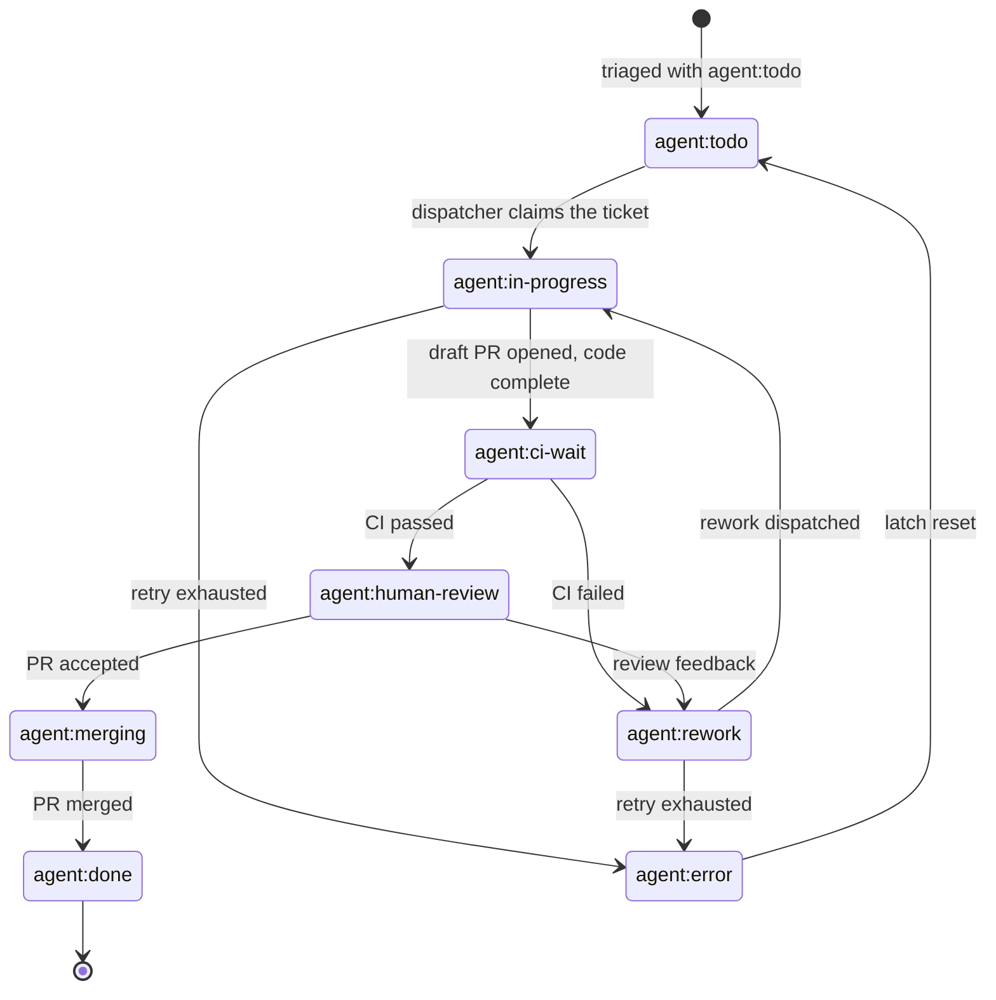

# How a ticket flows

A ticket moves from being filed, to a labelled queue, to an isolated agent run,
to a draft PR, through CI and review, and finally to a merge that closes the
issue. This page is the full end-to-end lifecycle: what the operator does at
each step, what the agent is given, and where tickets get stuck. The label
lifecycle drives everything.

## The label lifecycle

Aiur runs a label-based state machine on trackers that support labels. The
**state label** is the single dispatch signal, and everything else — the
markers, the provenance rules, the optimistic writes — exists to keep that one
signal trustworthy.

### State labels

There are exactly **ten** state suffixes (`src/lib/aiur/github/labels.ex:23-25`):

```text
todo  in-progress  ci-wait  human-review  rework  merging  done  error  cancelled  canceled
```
| Label | Meaning |
| --- | --- |
| `agent:todo` | Queued and dispatchable. |
| `agent:in-progress` | An agent run is active. |
| `agent:ci-wait` | Code complete; waiting for terminal CI. Active for polling but **never dispatchable**. |
| `agent:human-review` | CI passed; the PR is ready for human review. |
| `agent:rework` | CI or review requires another run. |
| `agent:merging` | An accepted PR entering merge. Active for polling but **never dispatchable**. |
| `agent:done` | Work complete. Terminal. |
| `agent:error` | The agent hit an execution failure. In neither the active nor the terminal set, so it is never auto-redispatched — an operator (or bounded auto-resume on transient causes) must clear it. |
| `agent:cancelled` / `agent:canceled` | Terminal cancellation. **Both spellings exist**; both are real labels. |

The terminal states are exactly `done | cancelled | canceled`
(`src/lib/aiur/github/state_policy.ex:23,31`). The two `@no_agent_work_states`
— `merging` and `ci-wait` — stay active for polling and fence purposes but are
never dispatchable (`src/lib/aiur/orchestrator/dispatch_policy.ex:35,1001`).

### Markers are not states

**`agent:paused` is not a state label.** Five suffixes are **markers**,
deliberately kept out of the state machine so the orchestrator never treats
them as dispatch states (`src/lib/aiur/github/labels.ex:31-35`):

```text
watch  paused  parked  queued  rate-limit-fallback
```
| Marker | Meaning |
| --- | --- |
| `agent:watch` | Opt-in PR-watch marker: Aiur watches a PR for comments. |
| `agent:paused` | Per-issue pause override: suppress Aiur work while preserving the current state. |
| `agent:parked` | Operator-held: no dispatch and no comment-driven rework. |
| `agent:queued` | Build queue membership; does not authorize or trigger dispatch. Before downgrading to a release without this marker, run `aiur queue clear --remove-markers --yes` and wait for success. It keeps `agent:todo`; budget-held writes resume on retry. Older releases can misread the marker as a conflicting state. |
| `agent:rate-limit-fallback` | Records automatic ownership of a usage-limit fallback. |

Markers **survive state swaps** (`GitHub.IssueState`): they overlay a state
rather than replacing it.

### Who writes each transition

Not every transition comes from the orchestrator — the agent moves itself
through the review half of the lifecycle. (`shared-agent-instructions.md` is
`src/prompts/shared-agent-instructions.md`.)

| Target | Written by | Where |
| --- | --- | --- |
| `ci-wait` | orchestrator | `src/lib/aiur/orchestrator/ci_lifecycle.ex:88-96`, callers `:1030,:1167` |
| `in-progress` | orchestrator on CI pass / ci-wait fallback re-wake; **also the agent itself** at turn start | `ci_lifecycle.ex:1068-1076`, `:1366-1375`; `shared-agent-instructions.md:44,49,120` |
| `rework` | orchestrator: CI failure, comment-driven wake, human-review rejection; a merged PR whose remaining open PR carries unresolved review findings | `ci_lifecycle.ex:1100-1109`; `comment_wake.ex:950`; `human_review.ex:144-147`; `merged_ticket_reconciler.ex:130-202` |
| `todo` | orchestrator: human-review revert with no open PR; error-latch reset | `human_review.ex:149-152`; `pause_resume.ex:166-169` |
| `human-review`, `merging` | **the agent itself**, via the `aiur_set_ticket_state` tool; the orchestrator on merge when a remaining open PR merely awaits review | `shared-agent-instructions.md:44,49,120`; `merged_ticket_reconciler.ex:130-202` |
| `done` | orchestrator on merge — only when the merged PR's body carries a closing keyword for the ticket *and* no blocking open PR remains | `merged_ticket_reconciler.ex:92-129`; `comment_wake.ex:46` |
| `error` | orchestrator: lifetime-thrash latch, retry exhaustion | `dispatcher.ex:2165,2208`; `retry_engine.ex:762` |

When the no-op turn bound or normal turn limit stops an agent, a newly opened or
moved PR goes to `ci-wait` while checks are pending or unavailable. Once CI
finishes, the ticket goes to `human-review`.

At the no-op bound, verified rework with no new PR head becomes `error`. Other
no-op-bound tickets keep their state and receive an alert. A normal turn limit
leaves the state unchanged when no PR head moved.

State writes are optimistic-concurrency guarded: they carry an `expected_state:`
that returns `{:error, {:stale_issue_state, ...}}` when the issue has moved
underneath the writer (`issue_state.ex:162-174`), and a state write can never
relabel or reopen a closed issue (`issue_state.ex:118,237,287`).

### The invariant: exactly one state label

Dispatch denies an issue carrying two or more state labels. Agents use
`aiur_set_ticket_state` to make the target the sole state label from a fresh
read (`GitHub.IssueState.swap_labels/4`); naming an old label to remove can race
with an orchestrator transition and leave contradictory labels behind.

For `human-review`, the writer also checks review threads and the exact PR head
against `tracker.base_branch`. Stale heads pass only with no conflicts or
changed-file overlap since the merge base, including both paths of renames.
Incomplete evidence, mismatched heads or bases, conflicts and overlap leave
labels unchanged.

Harmless base movement needs no merge or CI rerun. Workers check before handoff
and after CI. Up to three integrations per handoff
need no approval; each runs local tests and format, size and components gates,
then awaits new-head CI. After the third, emit a non-blocking Executor alert.
Base integration never opens a blocking decision.

A contradictory pair is healed by preferring a label added since the recorded
orchestrator claim. Without claim evidence, deterministic precedence applies
(`agent:todo` wins); a provenance win never promotes terminal `done`.

Zero-label tickets are repaired only with workflow evidence: restore the last
state, or `todo` if only a released claim survives. Parked or untriaged tickets
without it are alerted and left alone. An open workflow ticket with no live
agent or scheduled claim is re-queued and alerted.

Agents use `aiur_set_epic` for local general-epic overrides, up to 200 ids.
These preserve GitHub labels and record the acting ticket; `backfill: true`
marks an unconfirmed guess. See [epic commands](../reference/cli.md#build-history-epic-commands).

### Model labels

A `model:` label overrides complexity routing for one ticket, and aiur reads it in this order:

| Label | Means |
| --- | --- |
| `model:codex`, `model:claude` | That backend, with the model complexity routing names for it, else its default. |
| `model:remote` | Force Claude remote control; selects no model. |
| `model:low` … `model:max` | Reasoning effort; selects no model. |
| `model:claude-opus-4-8`, `model:codex-astra` | That backend, always. A family name resolves to its newest release; anything else is passed to the CLI as an exact pin. |
| `model:opus`, `model:astra` | Any model or family an installed CLI offers. aiur finds the backend itself. |

When a ticket has no `complexity:` or `model:` label, Aiur uses the configured
default backend. If that backend is usage-limited, the ticket waits for its
reset instead of starting an agent that cannot run.

The names come from the installed CLIs, not from aiur, so a model released after your aiur
build works as soon as your CLI lists it. aiur reads each CLI's model list about daily, and
again when a ticket names something it has not seen (at most once every 10 minutes).

For Claude the family alias goes straight to `claude --model`. For Codex a family becomes
the newest matching id the Codex CLI reports.

A bare name that cannot be placed does not block the ticket. It runs on its complexity
route and gets a `model_label_unresolved` attention saying which label, why — not offered
by any CLI, offered by more than one backend (use the prefixed form), or the model list
could not be read — and which model ran instead.

`aiur init` creates `model:<backend>`, the effort labels, `model:remote`, and a
`model:<family>` for each family your CLIs report. It creates no version-specific labels
and never deletes ones a repository already has; those keep working as exact pins.

## Build queue

**Stacked pull requests.** A dependent PR may target an open, unmerged direct `blocked_by` blocker's head branch. CI uses held edges and delivered PR facts (valid for 24 hours), independent of dispatch freshness. Missing facts or a merged/closed blocker restore `tracker.base_branch`. Retarget to integration before merge.

**Optimistic dependents.** An explicit Optimistic start prompt block tells a worker to integrate blocker pushes,
rebase rewritten history, and keep its PR draft until every blocker merges. When its own work is done,
it parks for blocker merge, then restacks onto the integration branch before CI handoff.

The build queue manages future work in named lists or adopted Build Orders. `agent:queued` marks membership; `agent:todo` remains the dispatch state. Promotion adds `todo` only when fresh evidence proves readiness and no other state is present. Membership and promotion grant no authorization.

Item states are projections, not tracker labels:

| Item state | Meaning |
| --- | --- |
| `waiting` | At least one prerequisite is still pending. |
| `ready` | Current evidence permits promotion. |
| `promoted` | Queue-owned `agent:todo`; waiting for a claim. |
| `promoted_unauthorized` | Dispatch declined the promotion for lack of authorization. |
| `claimed` | The orchestrator owns the ticket or it has advanced beyond `todo`. |
| `held` | An item, queue, parking marker or unresolved claim check stops promotion. |
| `overridden` | A competing writer promoted it manually; the queue yields. |
| `failed_prerequisite` | A prerequisite has a known failure. |
| `unknown` | Missing, stale or ambiguous evidence prevents a readiness decision. |
| `completed` | Tracker closure is confirmed as completed. |
| `cancelled` | Tracker closure is confirmed as not planned. |
| `removed` | The membership marker was removed. |

If a promoted item becomes unready, Aiur holds dispatch and checks claims. It withdraws only `agent:todo` from unclaimed items with fresh, known readiness evidence. Unknown evidence retains the hold; claimed work keeps its labels and raises `dependency_changed_after_start` when it becomes unready.

Manual `todo` sets an override. List adds record pre-existing `todo`; fresh unmet prerequisites
withdraw it only after dispatch is held and unclaimed status is confirmed. A later manual `todo`
overrides. Removing queue-owned `todo` creates a hold; `aiur queue release` clears holds
and overrides. Removing `agent:queued` dequeues; writes re-observe races.

Unauthorized detection needs a free dispatch slot; until dispatch can check, the item remains `promoted`. An allowed human must apply the marker or `todo`, or hold the ticket. An unavailable claim probe preserves a recorded decline.

[Queue attentions](/concepts/build-orders#queue-attentions) cover `prerequisite_failed`, `dependency_changed_after_start`, `promoted_unauthorized`,
`write_failed`, `merged_issue_open`, `inputs_unavailable` and `store_unavailable`.

See [Queueing a Build Order](/concepts/build-orders#queueing-a-build-order) and [Downgrading](/concepts/build-orders#downgrading).
Closed-unmerged prerequisite PR detection is [webhook-only](/concepts/build-orders#closed-prerequisite-pull-requests);
polling alone leaves the prerequisite pending.

## The state diagram


```mermaid
stateDiagram-v2
    [*] --> todo: triaged with agent:todo
    todo --> inprogress: dispatcher claims the ticket
    inprogress --> ciwait: draft PR opened, code complete
    ciwait --> humanreview: CI passed
    ciwait --> rework: CI failed
    humanreview --> rework: review feedback
    humanreview --> merging: PR accepted
    rework --> inprogress: rework dispatched
    merging --> done: PR merged
    done --> [*]

    inprogress --> error: retry exhausted
    rework --> error: retry exhausted
    error --> todo: latch reset

    todo: agent:todo
    inprogress: agent:in-progress
    ciwait: agent:ci-wait
    humanreview: agent:human-review
    rework: agent:rework
    merging: agent:merging
    done: agent:done
    error: agent:error
```

The happy path is `todo → in-progress → ci-wait → human-review → merging →
done`. `agent:rework` is the loop that carries both CI failures and review
feedback back into the pipeline, and `agent:error` is the terminal failure
trap that needs an operator (or auto-resume) to release. The diagram renders
in both the site's dark default and light theme.

## Steps 0–8 and stuck tickets

The step-by-step walkthrough, from taking the Executor role to merge, and where tickets get stuck, is on [How a ticket flows: steps 0–8](/concepts/ticket-lifecycle-steps).
